# AIMS Architecture Documentation
**Version:** 1.0  
**Date:** December 6, 2025  
**Document Type:** Technical Architecture Guide

## Table of Contents
1. [System Architecture Overview](#1-system-architecture-overview)
2. [Application Layers](#2-application-layers)
3. [Core Components](#3-core-components)
4. [Data Flow Architecture](#4-data-flow-architecture)
5. [Security Architecture](#5-security-architecture)
6. [Integration Architecture](#6-integration-architecture)
7. [Deployment Architecture](#7-deployment-architecture)

## 1. System Architecture Overview

### 1.1 Architecture Pattern
AIMS follows a **Layered Architecture** pattern with clear separation of concerns:

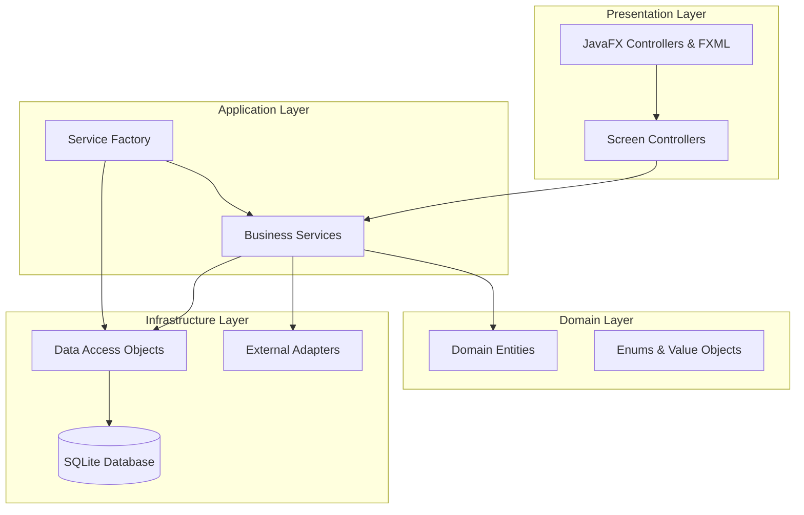

### 1.2 Key Architectural Principles
- **Dependency Inversion:** High-level modules don't depend on low-level modules
- **Single Responsibility:** Each class has one reason to change
- **Interface Segregation:** Clients depend only on interfaces they use
- **Separation of Concerns:** Clear boundaries between layers

## 2. Application Layers

### 2.1 Presentation Layer
**Location:** [`src/main/java/com/aims/core/presentation/`](src/main/java/com/aims/core/presentation/)

#### 2.1.1 Main Components
| Component | File | Responsibility |
|-----------|------|----------------|
| Application Entry | [`Main.java`](src/main/java/com/aims/Main.java) | JavaFX application launcher |
| Main App | [`AimsApp.java`](src/main/java/com/aims/AimsApp.java) | Application initialization & window setup |
| Scene Manager | [`FXMLSceneManager.java`](src/main/java/com/aims/core/presentation/utils/FXMLSceneManager.java) | Navigation & screen management |
| Main Layout | [`MainLayoutController.java`](src/main/java/com/aims/core/presentation/controllers/MainLayoutController.java) | Master page layout |

#### 2.1.2 Controller Architecture
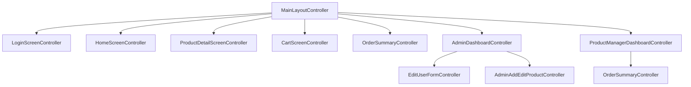

#### 2.1.3 Screen Flow Architecture
| User Role | Entry Point | Available Screens |
|-----------|-------------|-------------------|
| **Customer (Guest)** | [`home_screen.fxml`](src/main/resources/com/aims/presentation/views/home_screen.fxml) | Home → Product Detail → Cart → Order → Payment |
| **Product Manager** | [`login_screen.fxml`](src/main/resources/com/aims/presentation/views/login_screen.fxml) | Login → PM Dashboard → Order Management |
| **Administrator** | [`login_screen.fxml`](src/main/resources/com/aims/presentation/views/login_screen.fxml) | Login → Admin Dashboard → User/Product Management |

### 2.2 Application Layer
**Location:** [`src/main/java/com/aims/core/application/`](src/main/java/com/aims/core/application/)

#### 2.2.1 Service Architecture
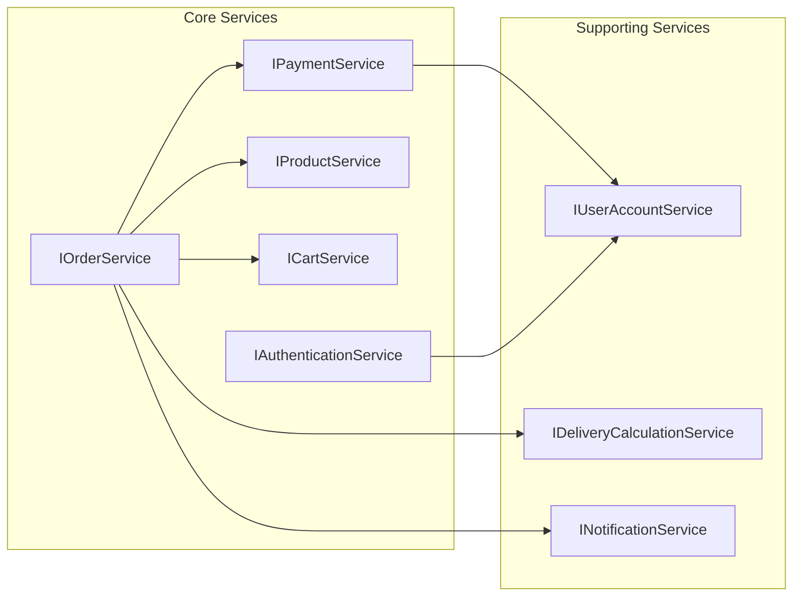

#### 2.2.2 Service Implementations
| Interface | Implementation | Key Responsibilities |
|-----------|----------------|---------------------|
| [`IProductService`](src/main/java/com/aims/core/application/services/IProductService.java) | [`ProductServiceImpl`](src/main/java/com/aims/core/application/impl/ProductServiceImpl.java) | Product CRUD, business rules, search |
| [`ICartService`](src/main/java/com/aims/core/application/services/ICartService.java) | [`CartServiceImpl`](src/main/java/com/aims/core/application/impl/CartServiceImpl.java) | Cart operations, inventory validation |
| [`IOrderService`](src/main/java/com/aims/core/application/services/IOrderService.java) | [`OrderServiceImpl`](src/main/java/com/aims/core/application/impl/OrderServiceImpl.java) | Order lifecycle, payment processing |
| [`IAuthenticationService`](src/main/java/com/aims/core/application/services/IAuthenticationService.java) | [`AuthenticationServiceImpl`](src/main/java/com/aims/core/application/impl/AuthenticationServiceImpl.java) | User authentication, session management |

### 2.3 Domain Layer
**Location:** [`src/main/java/com/aims/core/entities/`](src/main/java/com/aims/core/entities/)

#### 2.3.1 Entity Relationship Model
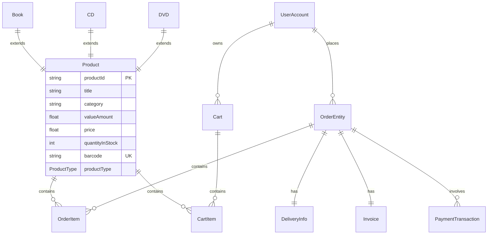

#### 2.3.2 Product Hierarchy
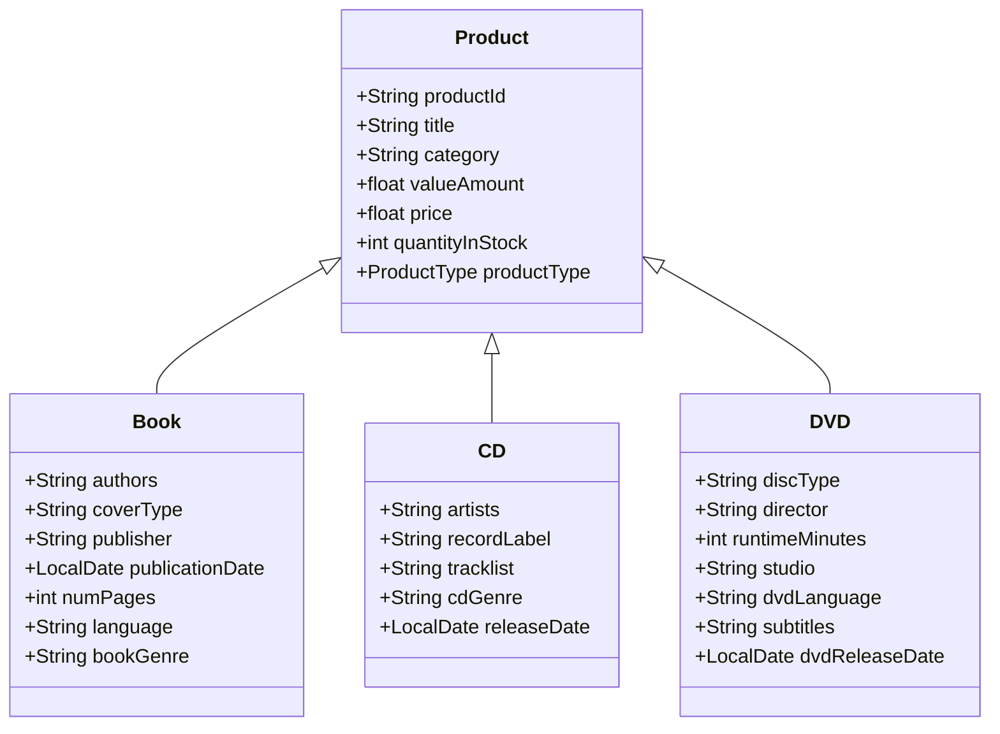

### 2.4 Infrastructure Layer
**Location:** [`src/main/java/com/aims/core/infrastructure/`](src/main/java/com/aims/core/infrastructure/)

#### 2.4.1 Data Access Architecture
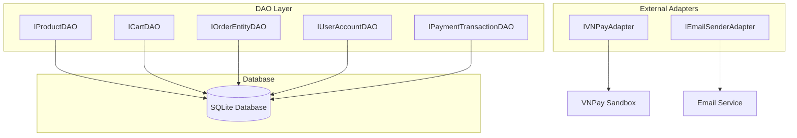

## 3. Core Components

### 3.1 Dependency Injection Container
**File:** [`ServiceFactory.java`](src/main/java/com/aims/core/shared/ServiceFactory.java)

#### 3.1.1 Initialization Sequence
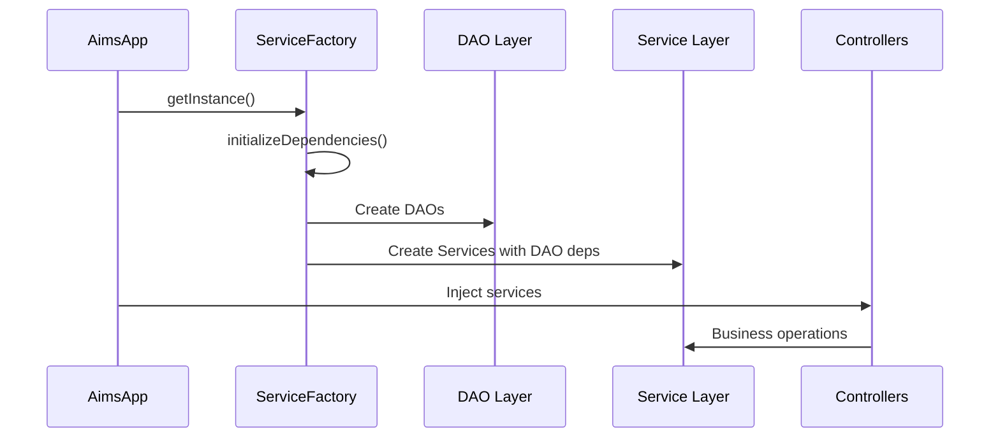

#### 3.1.2 Dependency Graph
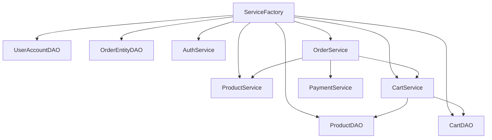

### 3.2 State Management
**Location:** [`src/main/java/com/aims/core/states/`](src/main/java/com/aims/core/states/)

#### 3.2.1 Order State Pattern
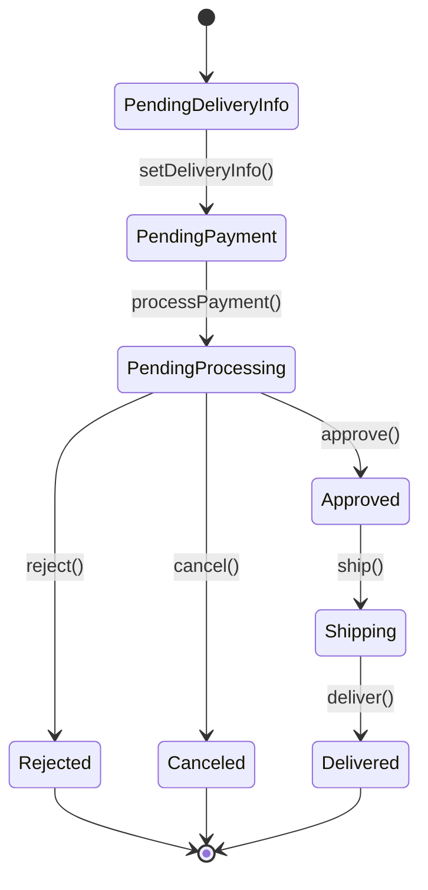

#### 3.2.2 State Implementation
| State | Implementation | Allowed Transitions |
|-------|---------------|-------------------|
| Pending Delivery Info | [`PendingOrderState.java`](src/main/java/com/aims/core/states/PendingOrderState.java) | → Pending Payment |
| Pending Processing | [`PendingOrderState.java`](src/main/java/com/aims/core/states/PendingOrderState.java) | → Approved, Rejected, Canceled |
| Approved | [`ApprovedOrderState.java`](src/main/java/com/aims/core/states/ApprovedOrderState.java) | → Shipping |
| Shipping | [`ShippingOrderState.java`](src/main/java/com/aims/core/states/ShippingOrderState.java) | → Delivered |
| Delivered | [`DeliveredOrderState.java`](src/main/java/com/aims/core/states/DeliveredOrderState.java) | [Final] |

## 4. Data Flow Architecture

### 4.1 Customer Purchase Flow
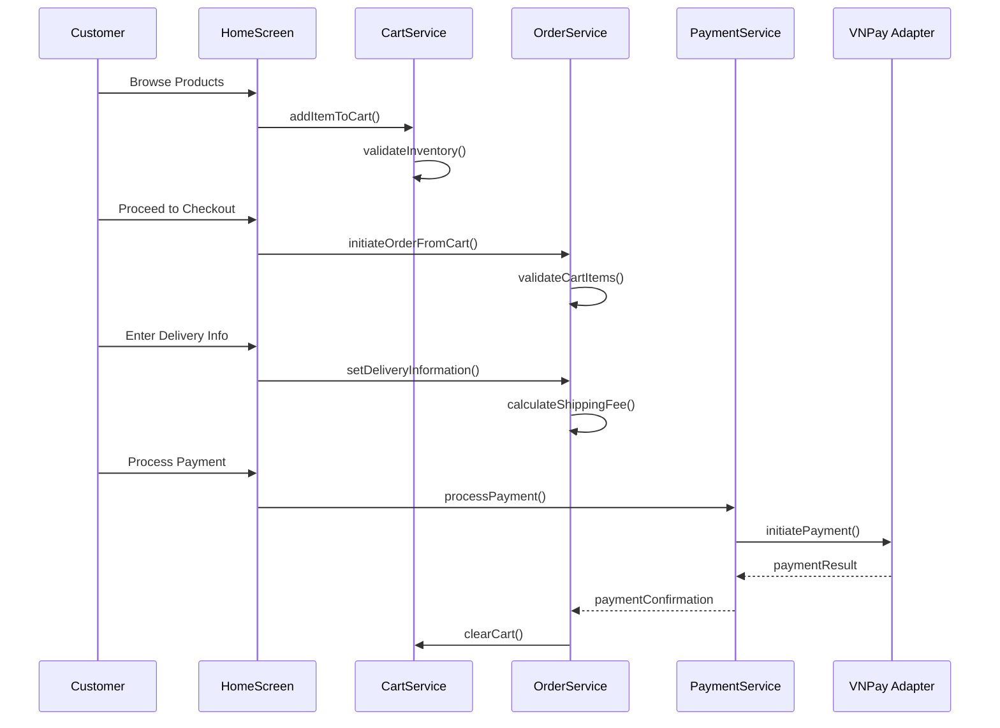

### 4.2 Product Management Flow
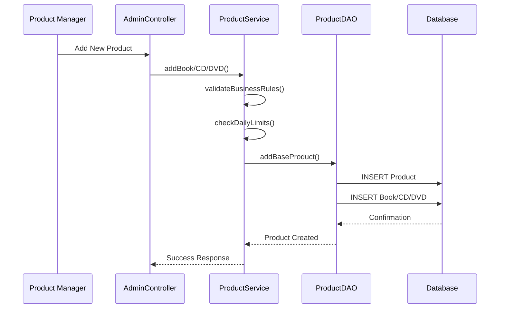

### 4.3 Order Processing Flow
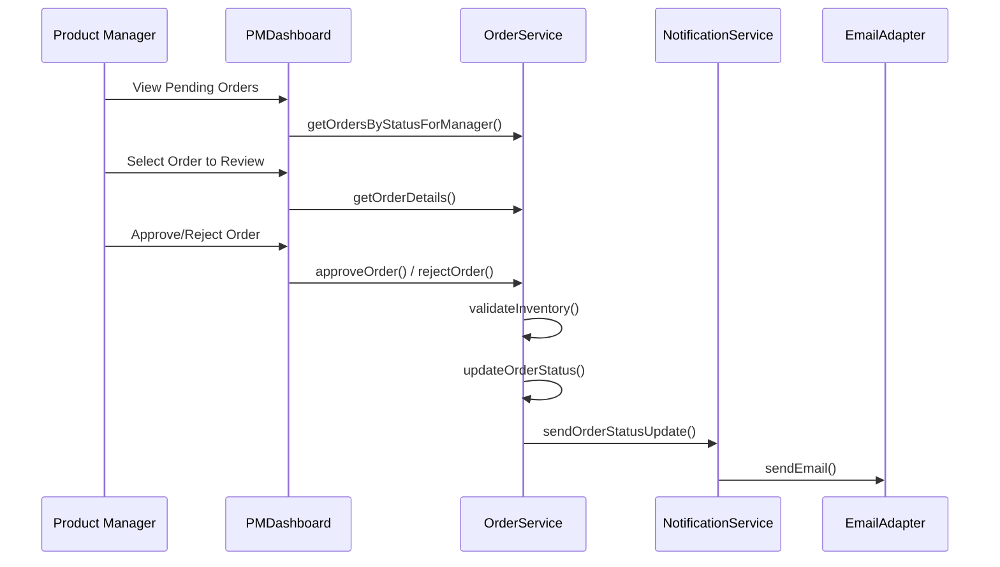

## 5. Security Architecture

### 5.1 Authentication Architecture
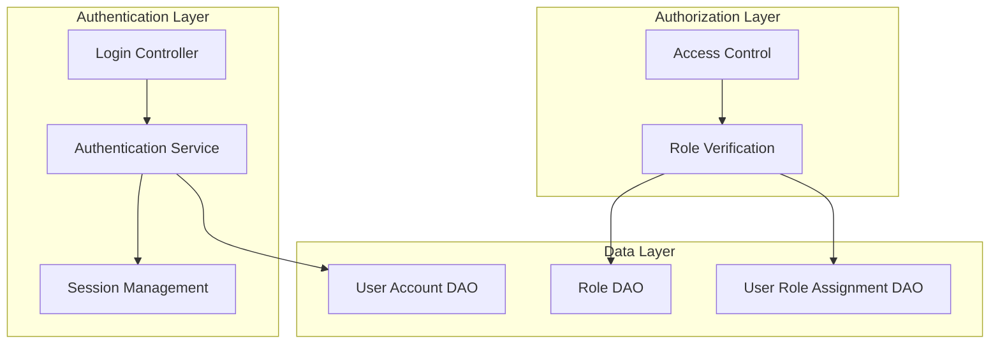

### 5.2 Role-Based Access Control
| User Role | Permissions | Implementation |
|-----------|-------------|----------------|
| **Administrator** | Full system access, user management | [`UserRole.ADMIN`](src/main/java/com/aims/core/enums/UserRole.java) |
| **Product Manager** | Product CRUD, order management | [`UserRole.PRODUCT_MANAGER`](src/main/java/com/aims/core/enums/UserRole.java) |
| **Customer/Guest** | Browse, cart, order (no login) | No authentication required |

### 5.3 Data Protection
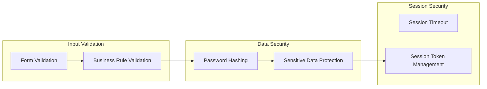

## 6. Integration Architecture

### 6.1 External Service Integration
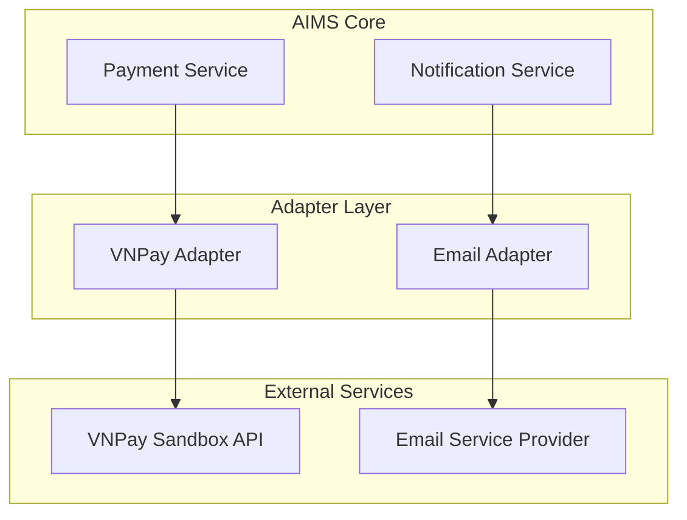

### 6.2 VNPay Integration Architecture
| Component | File | Responsibility |
|-----------|------|----------------|
| Payment Service | [`IPaymentService.java`](src/main/java/com/aims/core/application/services/IPaymentService.java) | Payment orchestration |
| VNPay Adapter | [`IVNPayAdapter.java`](src/main/java/com/aims/core/infrastructure/adapters/external/payment_gateway/IVNPayAdapter.java) | VNPay API integration |
| Payment Strategies | [`IPaymentStrategy.java`](src/main/java/com/aims/core/application/services/strategies/IPaymentStrategy.java) | Different payment methods |
| VNPay Controllers | [`VNPayReturnController.java`](src/main/java/com/aims/core/presentation/controllers/VNPayReturnController.java) | Handle VNPay callbacks |

### 6.3 Payment Flow Integration
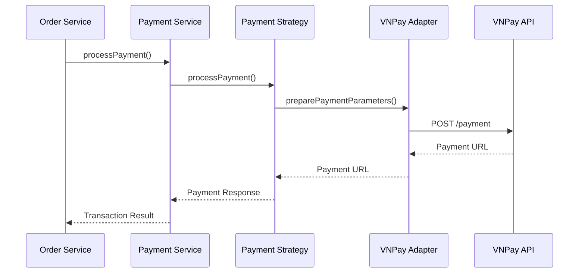

## 7. Deployment Architecture

### 7.1 Application Structure
```
AIMS_Project/
├── src/main/java/com/aims/
│   ├── Main.java                    # Application entry point
│   ├── AimsApp.java                 # JavaFX application
│   └── core/
│       ├── application/             # Business logic layer
│       ├── entities/                # Domain models
│       ├── infrastructure/          # Data access & external adapters
│       ├── presentation/            # UI controllers
│       ├── shared/                  # Common utilities
│       └── states/                  # State pattern implementations
├── src/main/resources/
│   ├── com/aims/presentation/views/ # FXML files
│   ├── images/                      # Product images
│   └── *.properties               # Configuration files
└── target/                         # Build artifacts
```

### 7.2 Configuration Management
| File | Purpose | Location |
|------|---------|----------|
| [`app.properties`](src/main/resources/app.properties) | Application configuration | Resources root |
| [`vnpay_config.properties`](src/main/resources/vnpay_config.properties) | VNPay integration settings | Resources root |
| [`logback.xml`](src/main/resources/logback.xml) | Logging configuration | Resources root |

### 7.3 Database Architecture
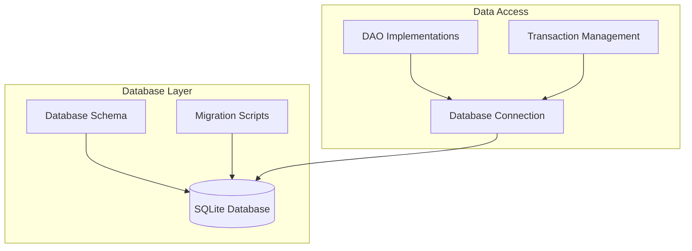

### 7.4 Build & Deployment
| Component | Technology | Configuration |
|-----------|------------|---------------|
| **Build Tool** | Maven | [`pom.xml`](pom.xml) |
| **Java Runtime** | Java 11+ | JavaFX dependencies |
| **Database** | SQLite | Embedded, file-based |
| **External Dependencies** | VNPay SDK, Email libraries | Maven dependencies |

---

**Architecture Principles Summary:**
- **Modularity:** Clear separation between layers
- **Testability:** Dependency injection enables unit testing
- **Maintainability:** Interface-based design allows easy modifications
- **Scalability:** Service-oriented architecture supports feature expansion
- **Security:** Role-based access control and input validation
- **Integration:** Adapter pattern for external service integration

**Document Control:**
- **Author:** AIMS Architecture Team
- **Review Status:** Technical Review Complete
- **Next Review:** Post-deployment validation
- **Distribution:** Development Team, Technical Stakeholders