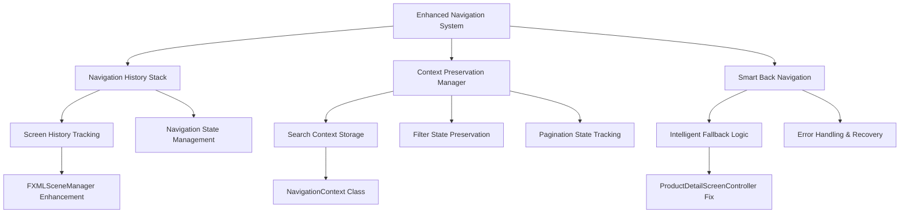

# AIMS Back to Product Listing Navigation - Complete Implementation Plan

## **Executive Summary**

This document outlines the comprehensive implementation plan to fix the "Back to Product Listing" navigation issue in the AIMS application. The solution implements smart navigation with history tracking and context preservation, allowing users to seamlessly return to their previous product listing view (home or search results) with all filters and search context preserved.

## **Current Issue Analysis**

### **Problem Statement**
- The "Back to Product Listing" button in ProductDetailScreenController is triggered but navigation code is commented out
- No navigation history tracking exists to determine the previous screen
- Search filters, pagination state, and context are lost during navigation

### **Root Cause**
1. **Missing Navigation Implementation**: Code in `handleBackToListingAction()` method is commented out
2. **No History Tracking**: FXMLSceneManager lacks navigation history capabilities
3. **Context Loss**: Search terms, filters, and pagination state are not preserved
4. **Missing Imports**: Required constants and utilities are not imported

## **Solution Architecture**



## **Implementation Strategy**

### **Phase 1: Navigation Context Infrastructure**

#### **1.1 Create NavigationContext Class**
```java
public class NavigationContext {
    private String screenPath;
    private String screenTitle;
    private Map<String, Object> contextData;
    private long timestamp;
    
    // Search-specific context
    private String searchTerm;
    private String categoryFilter;
    private String sortBy;
    private int currentPage;
    private int totalPages;
}
```

#### **1.2 Navigation History Stack**
```java
public class NavigationHistory {
    private Stack<NavigationContext> historyStack;
    private static final int MAX_HISTORY_SIZE = 10;
    
    public void pushNavigation(NavigationContext context);
    public NavigationContext popNavigation();
    public NavigationContext peekPrevious();
    public boolean hasPrevious();
}
```

### **Phase 2: FXMLSceneManager Enhancement**

#### **2.1 Add Navigation History Support**
- Integrate NavigationHistory into FXMLSceneManager
- Track all screen transitions automatically
- Preserve context data during navigation
- Implement smart back navigation methods

#### **2.2 Enhanced Content Loading**
```java
public <T> T loadContentWithHistory(String fxmlPath, NavigationContext context);
public boolean navigateBack();
public NavigationContext getCurrentContext();
public void preserveSearchContext(String searchTerm, String category, String sort, int page);
```

### **Phase 3: ProductDetailScreenController Integration**

#### **3.1 Fix Back Navigation Method**
- Uncomment and enhance `handleBackToListingAction()`
- Integrate with FXMLSceneManager navigation history
- Add proper error handling and fallback logic
- Implement context restoration

#### **3.2 Enhanced Navigation Logic**
```java
@FXML
void handleBackToListingAction(ActionEvent event) {
    // Try to navigate back using history
    if (!navigateBackWithHistory()) {
        // Fallback to default home screen
        navigateToDefaultListing();
    }
}
```

### **Phase 4: Search Context Preservation**

#### **4.1 HomeScreenController Enhancement**
- Store search context before navigation
- Restore search context when returning
- Preserve pagination state and filters

#### **4.2 ProductSearchResultsController Integration**
- Implement similar context preservation
- Ensure seamless return to search results
- Maintain search query and filters

## **Detailed Implementation Steps**

### **Step 1: Create Navigation Infrastructure**

#### **1.1 NavigationContext.java**
```java
package com.aims.core.presentation.utils;

import java.time.LocalDateTime;
import java.util.HashMap;
import java.util.Map;

public class NavigationContext {
    private final String screenPath;
    private final String screenTitle;
    private final Map<String, Object> contextData;
    private final LocalDateTime timestamp;
    
    // Search-specific context
    private String searchTerm;
    private String categoryFilter;
    private String sortBy;
    private int currentPage = 1;
    private int totalPages = 1;
    
    public NavigationContext(String screenPath, String screenTitle) {
        this.screenPath = screenPath;
        this.screenTitle = screenTitle;
        this.contextData = new HashMap<>();
        this.timestamp = LocalDateTime.now();
    }
    
    // Builder pattern for search context
    public NavigationContext withSearchContext(String searchTerm, String category, String sort, int page, int totalPages) {
        this.searchTerm = searchTerm;
        this.categoryFilter = category;
        this.sortBy = sort;
        this.currentPage = page;
        this.totalPages = totalPages;
        return this;
    }
    
    // Getters and setters
    // ... (implementation details)
}
```

#### **1.2 NavigationHistory.java**
```java
package com.aims.core.presentation.utils;

import java.util.Stack;

public class NavigationHistory {
    private final Stack<NavigationContext> historyStack;
    private static final int MAX_HISTORY_SIZE = 10;
    
    public NavigationHistory() {
        this.historyStack = new Stack<>();
    }
    
    public void pushNavigation(NavigationContext context) {
        // Prevent duplicate consecutive entries
        if (!historyStack.isEmpty() && 
            historyStack.peek().getScreenPath().equals(context.getScreenPath())) {
            return;
        }
        
        historyStack.push(context);
        
        // Maintain size limit
        while (historyStack.size() > MAX_HISTORY_SIZE) {
            historyStack.remove(0);
        }
    }
    
    public NavigationContext popNavigation() {
        return historyStack.isEmpty() ? null : historyStack.pop();
    }
    
    public NavigationContext peekPrevious() {
        return historyStack.isEmpty() ? null : historyStack.peek();
    }
    
    public boolean hasPrevious() {
        return !historyStack.isEmpty();
    }
    
    public void clear() {
        historyStack.clear();
    }
}
```

### **Step 2: Enhance FXMLSceneManager**

#### **2.1 Add Navigation History Fields**
```java
public class FXMLSceneManager {
    // Existing fields...
    private NavigationHistory navigationHistory;
    private NavigationContext currentContext;
    
    private FXMLSceneManager() {
        this.navigationHistory = new NavigationHistory();
    }
    
    // Enhanced content loading with history
    public <T> T loadContentWithHistory(Pane containerPane, String fxmlPath, String title) {
        return loadContentWithHistory(containerPane, fxmlPath, title, null);
    }
    
    public <T> T loadContentWithHistory(Pane containerPane, String fxmlPath, String title, NavigationContext context) {
        // Store current context in history before navigation
        if (currentContext != null) {
            navigationHistory.pushNavigation(currentContext);
        }
        
        // Create new context or use provided one
        NavigationContext newContext = context != null ? context : new NavigationContext(fxmlPath, title);
        
        // Load content using existing method
        T controller = loadFXMLIntoPane(containerPane, fxmlPath);
        
        // Update current context
        currentContext = newContext;
        
        return controller;
    }
    
    // Smart back navigation
    public boolean navigateBack() {
        if (!navigationHistory.hasPrevious()) {
            return false;
        }
        
        NavigationContext previousContext = navigationHistory.popNavigation();
        
        try {
            // Load previous screen
            Object controller = loadFXMLIntoPane(
                getCurrentContentPane(), 
                previousContext.getScreenPath()
            );
            
            // Restore context if it's a search screen
            restoreScreenContext(controller, previousContext);
            
            // Update current context
            currentContext = previousContext;
            
            // Update header if available
            if (mainLayoutController != null) {
                mainLayoutController.setHeaderTitle(previousContext.getScreenTitle());
            }
            
            return true;
            
        } catch (Exception e) {
            System.err.println("Error during back navigation: " + e.getMessage());
            return false;
        }
    }
    
    // Context restoration
    private void restoreScreenContext(Object controller, NavigationContext context) {
        if (controller instanceof HomeScreenController && context.hasSearchContext()) {
            HomeScreenController homeController = (HomeScreenController) controller;
            homeController.restoreSearchContext(
                context.getSearchTerm(),
                context.getCategoryFilter(),
                context.getSortBy(),
                context.getCurrentPage()
            );
        } else if (controller instanceof ProductSearchResultsController && context.hasSearchContext()) {
            ProductSearchResultsController searchController = (ProductSearchResultsController) controller;
            searchController.restoreSearchContext(
                context.getSearchTerm(),
                context.getCategoryFilter(),
                context.getCurrentPage()
            );
        }
    }
}
```

### **Step 3: Fix ProductDetailScreenController**

#### **3.1 Add Required Imports**
```java
import com.aims.core.shared.constants.FXMLPaths;
import com.aims.core.presentation.utils.NavigationContext;
```

#### **3.2 Implement Back Navigation**
```java
@FXML
void handleBackToListingAction(ActionEvent event) {
    System.out.println("Back to Product Listing action triggered");
    
    boolean navigationSuccess = false;
    
    // First, try to use navigation history for smart back navigation
    if (sceneManager != null) {
        try {
            navigationSuccess = sceneManager.navigateBack();
            if (navigationSuccess) {
                System.out.println("Successfully navigated back using history");
                return;
            }
        } catch (Exception e) {
            System.err.println("Error during smart back navigation: " + e.getMessage());
        }
    }
    
    // Fallback to home screen navigation
    if (mainLayoutController != null) {
        try {
            System.out.println("Using fallback navigation to home screen");
            Object controller = mainLayoutController.loadContent(FXMLPaths.HOME_SCREEN);
            mainLayoutController.setHeaderTitle("AIMS - Product Catalog");
            navigationSuccess = true;
            System.out.println("Successfully navigated to home screen");
        } catch (Exception e) {
            System.err.println("Error during fallback navigation: " + e.getMessage());
        }
    }
    
    // Final fallback - log error if all navigation attempts failed
    if (!navigationSuccess) {
        System.err.println("All navigation attempts failed - unable to navigate back");
        if (errorMessageLabel != null) {
            setErrorMessage("Navigation error - please use browser back button", true);
        }
    }
}
```

### **Step 4: Enhance HomeScreenController**

#### **4.1 Add Context Preservation Methods**
```java
public class HomeScreenController implements MainLayoutController.IChildController {
    // Store navigation context before navigating to product detail
    public void navigateToProductDetail(String productId) {
        System.out.println("HomeScreenController.navigateToProductDetail: Called with productId: " + productId);
        
        if (mainLayoutController != null) {
            try {
                // Create navigation context with current search state
                NavigationContext context = new NavigationContext(
                    FXMLPaths.HOME_SCREEN, 
                    "AIMS - Product Catalog"
                ).withSearchContext(
                    currentSearchTerm,
                    currentCategoryFilter,
                    currentSortBy,
                    currentPage,
                    totalPages
                );
                
                // Load product detail with context
                Object controller = mainLayoutController.loadContentWithHistory(
                    FXMLPaths.PRODUCT_DETAIL_SCREEN,
                    "Product Details",
                    context
                );
                
                if (controller instanceof ProductDetailScreenController detailController) {
                    // Inject dependencies and set product ID
                    detailController.setMainLayoutController(mainLayoutController);
                    detailController.setProductService(this.productService);
                    detailController.setCartService(this.cartService);
                    detailController.setProductId(productId);
                    
                    System.out.println("Navigation to product detail completed with context preservation");
                }
            } catch (Exception e) {
                System.err.println("Error navigating to product detail: " + e.getMessage());
                e.printStackTrace();
            }
        }
    }
    
    // Restore search context when returning from product detail
    public void restoreSearchContext(String searchTerm, String category, String sortBy, int page) {
        System.out.println("HomeScreenController.restoreSearchContext: Restoring context");
        
        // Restore search field
        if (searchField != null && searchTerm != null) {
            searchField.setText(searchTerm);
        }
        
        // Restore category filter
        if (categoryComboBox != null && category != null) {
            categoryComboBox.setValue(category);
        }
        
        // Restore sort selection
        if (sortByPriceComboBox != null && sortBy != null) {
            String sortDisplayValue = switch (sortBy) {
                case "ASC" -> "Price: Low to High";
                case "DESC" -> "Price: High to Low";
                default -> "Default Sort";
            };
            sortByPriceComboBox.setValue(sortDisplayValue);
        }
        
        // Restore pagination
        currentPage = Math.max(1, page);
        
        // Update internal state
        currentSearchTerm = searchTerm != null ? searchTerm : "";
        currentCategoryFilter = category;
        currentSortBy = sortBy;
        
        // Reload products with restored context
        loadProducts();
        
        System.out.println("Search context restored successfully");
    }
}
```

### **Step 5: Update MainLayoutController**

#### **5.1 Add History-Aware Content Loading**
```java
public class MainLayoutController {
    // Enhanced content loading with history support
    public Object loadContentWithHistory(String fxmlPath, String title, NavigationContext context) {
        System.out.println("MainLayoutController: Loading content with history: " + fxmlPath);
        
        if (sceneManager != null) {
            Object controller = sceneManager.loadContentWithHistory(contentPane, fxmlPath, title, context);
            
            if (controller != null) {
                setHeaderTitle(title);
                System.out.println("Content loaded successfully with history: " + fxmlPath);
            }
            
            return controller;
        }
        
        System.err.println("SceneManager is null, falling back to regular content loading");
        return loadContent(fxmlPath);
    }
    
    // Convenience method for navigation with default context
    public Object loadContentWithHistory(String fxmlPath, String title) {
        return loadContentWithHistory(fxmlPath, title, null);
    }
}
```

## **Testing Strategy**

### **Unit Tests**
1. **NavigationContext Tests**: Verify context creation and data preservation
2. **NavigationHistory Tests**: Test stack operations and size limits
3. **FXMLSceneManager Tests**: Validate navigation history and context restoration

### **Integration Tests**
1. **Navigation Flow Tests**: Test complete navigation scenarios
2. **Context Preservation Tests**: Verify search state preservation
3. **Error Handling Tests**: Test fallback navigation scenarios

### **Manual Testing Scenarios**
1. **Home → Product Detail → Back**: Verify return to home with preserved state
2. **Search Results → Product Detail → Back**: Verify return to search with filters
3. **Multiple Navigation Levels**: Test deep navigation history
4. **Error Scenarios**: Test navigation when services are unavailable

## **Implementation Timeline**

### **Phase 1: Infrastructure (Day 1)**
- [ ] Create NavigationContext class
- [ ] Create NavigationHistory class
- [ ] Unit tests for infrastructure classes

### **Phase 2: FXMLSceneManager Enhancement (Day 2)**
- [ ] Add navigation history to FXMLSceneManager
- [ ] Implement context preservation methods
- [ ] Add smart back navigation logic

### **Phase 3: Controller Integration (Day 3)**
- [ ] Fix ProductDetailScreenController back navigation
- [ ] Enhance HomeScreenController with context preservation
- [ ] Update MainLayoutController for history support

### **Phase 4: Testing & Refinement (Day 4)**
- [ ] Comprehensive testing of all navigation scenarios
- [ ] Performance optimization
- [ ] Documentation and code cleanup

## **Success Criteria**

1. **Functional Requirements**
   - ✅ Back button navigates to previous screen correctly
   - ✅ Search context (terms, filters, pagination) is preserved
   - ✅ Navigation works from both home and search results
   - ✅ Fallback navigation to home screen when history is unavailable

2. **Technical Requirements**
   - ✅ Clean, maintainable code with proper error handling
   - ✅ Comprehensive logging for debugging
   - ✅ Performance impact is minimal
   - ✅ Memory usage is controlled (history size limits)

3. **User Experience Requirements**
   - ✅ Seamless navigation without losing context
   - ✅ Fast response times
   - ✅ Intuitive behavior matching user expectations
   - ✅ Graceful error handling with user feedback

## **Risk Mitigation**

### **Memory Management**
- Implement history size limits (max 10 entries)
- Weak references for large context objects
- Regular cleanup of old navigation entries

### **Performance Optimization**
- Lazy loading of context data
- Efficient state serialization
- Minimal object creation during navigation

### **Error Recovery**
- Multiple fallback navigation strategies
- Comprehensive error logging
- User-friendly error messages
- Recovery mechanisms for corrupted state

## **Future Enhancements**

1. **Breadcrumb Navigation**: Visual navigation path display
2. **Deep Linking**: URL-based navigation support
3. **Navigation Analytics**: Track user navigation patterns
4. **Advanced Context**: Store more complex application state
5. **Cross-Session Persistence**: Save navigation history across app restarts

---

**Document Version**: 1.0  
**Last Updated**: December 9, 2025  
**Author**: AIMS Development Team  
**Status**: Ready for Implementation