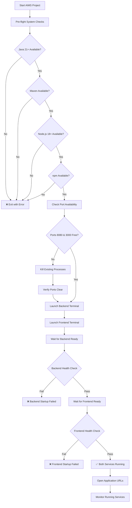

# AIMS Project Build and Run Execution Plan

## 📋 Project Analysis Summary

**Project Type**: Hybrid Java/JavaFX + React Web Application
- **Backend**: Spring Boot API (Java 21, Maven, Port 8080)
- **Frontend**: React + Vite + TailwindCSS v4 (Node.js, Port 3000)
- **Desktop**: JavaFX Application (Alternative GUI)
- **Database**: SQLite with JPA/Hibernate
- **Automation**: Comprehensive shell scripts with monitoring

## 🎯 Execution Strategy

Using the **automated master script approach** with the existing [`start-aims.sh`](start-aims.sh) which provides:
- ✅ Parallel backend/frontend startup
- ✅ Comprehensive pre-flight system checks
- ✅ Automatic port conflict resolution
- ✅ Real-time health monitoring
- ✅ Detailed logging and error handling

## 📊 Build and Run Flow



## 🔧 Detailed Execution Steps

### Phase 1: Environment Validation (2-3 minutes)
1. **System Requirements Check**
   - Java 21+ installation and PATH verification
   - Maven installation and version check
   - Node.js 18+ installation verification
   - npm package manager availability

2. **Port Conflict Resolution**
   - Check port 8080 (Spring Boot API)
   - Check port 3000 (React Dev Server)
   - Kill any conflicting processes if needed
   - Verify ports are available before proceeding

3. **Project Structure Validation**
   - Verify [`pom.xml`](pom.xml) exists and is valid
   - Verify [`web-ui/package.json`](web-ui/package.json) exists
   - Check for required scripts and dependencies

### Phase 2: Backend Build and Launch (3-5 minutes)
1. **Maven Build Process**
   ```bash
   mvn clean compile -q
   ```
   - Clean previous builds
   - Compile Java sources
   - Resolve all Maven dependencies

2. **Test Execution** (Optional with `--skip-tests`)
   ```bash
   mvn test -DskipTests=false -q
   ```
   - Run comprehensive test suite
   - Validate business logic and integrations

3. **Spring Boot Startup**
   ```bash
   mvn spring-boot:run
   ```
   - Launch Spring Boot application
   - Initialize SQLite database (auto-created)
   - Start REST API endpoints on port 8080

### Phase 3: Frontend Build and Launch (2-3 minutes)
1. **Node Dependencies**
   ```bash
   cd web-ui && npm install
   ```
   - Install/update React dependencies
   - Verify TailwindCSS v4 configuration
   - Check for package.json changes

2. **Vite Development Server**
   ```bash
   npm run dev
   ```
   - Start Vite development server
   - Enable Hot Module Replacement (HMR)
   - Serve React application on port 3000

### Phase 4: Health Monitoring and Validation (1-2 minutes)
1. **Backend Health Checks**
   - API endpoint availability: `http://localhost:8080`
   - Swagger documentation: `http://localhost:8080/swagger-ui/index.html`
   - Database connectivity verification

2. **Frontend Health Checks**
   - React application loading: `http://localhost:3000`
   - API integration verification
   - UI responsiveness validation

3. **Integration Testing**
   - Frontend ↔ Backend communication
   - Cross-Origin Resource Sharing (CORS) verification
   - Real-time data flow validation

## 🚀 Key Features and Benefits

### Automated Terminal Management
- **macOS**: Uses Terminal.app with custom titles
- **Linux**: Uses gnome-terminal with proper working directories  
- **Fallback**: Background execution with comprehensive logging

### Comprehensive Logging
- **Master log**: [`logs/startup.log`](logs/startup.log)
- **Backend log**: [`logs/backend.log`](logs/backend.log)
- **Frontend log**: [`logs/frontend.log`](logs/frontend.log)

### Error Recovery
- Automatic port conflict resolution
- Graceful failure handling with clear error messages
- Detailed troubleshooting information

### Success Indicators
```
✅ Backend is running at http://localhost:8080
✅ Frontend is running at http://localhost:3000
📋 API Documentation: http://localhost:8080/swagger-ui/index.html
```

## 🎯 Expected Outcomes

### Build Phase Success Criteria
- ✅ Zero compilation errors in Maven build
- ✅ All dependencies resolved successfully
- ✅ Database schema created/validated
- ✅ Spring Boot application context loaded

### Run Phase Success Criteria
- ✅ Backend API responding on port 8080
- ✅ Frontend application serving on port 3000
- ✅ Cross-service communication established
- ✅ Swagger documentation accessible

### Total Execution Time: **8-13 minutes**
- Environment validation: 2-3 minutes
- Backend build/start: 3-5 minutes  
- Frontend build/start: 2-3 minutes
- Health validation: 1-2 minutes

## 🛠️ Manual Fallback Options

1. **Manual Backend Only**: 
   ```bash
   ./scripts/start-backend.sh
   ```

2. **Manual Frontend Only**: 
   ```bash
   ./scripts/start-frontend.sh
   ```

3. **JavaFX Desktop App**: 
   ```bash
   mvn javafx:run
   ```

4. **Production Build**: 
   ```bash
   mvn clean package && java -jar target/aims-project-1.0-SNAPSHOT.jar
   ```

## 🔍 Troubleshooting Guide

### Common Issues and Solutions

#### Java Version Issues
```bash
# Check Java version
java -version

# Install Java 21+ if needed
# macOS: brew install openjdk@21
# Ubuntu: sudo apt install openjdk-21-jdk
```

#### Port Conflicts
```bash
# Kill processes on specific ports
lsof -ti :8080 | xargs kill -9
lsof -ti :3000 | xargs kill -9
```

#### Maven Build Failures
```bash
# Clean and rebuild
mvn clean install -DskipTests

# Check dependency issues
mvn dependency:tree
```

#### Frontend Dependency Issues
```bash
# Clear npm cache and reinstall
cd web-ui
rm -rf node_modules package-lock.json
npm install
```

## 📱 Available Endpoints After Startup

### Backend API (Port 8080)
- **Health Check**: `http://localhost:8080/actuator/health`
- **API Documentation**: `http://localhost:8080/swagger-ui/index.html`
- **Authentication**: `http://localhost:8080/api/auth`
- **Products**: `http://localhost:8080/api/products`
- **Cart**: `http://localhost:8080/api/cart`
- **Orders**: `http://localhost:8080/api/orders`
- **Users**: `http://localhost:8080/api/users`
- **Payments**: `http://localhost:8080/api/payments`
- **Admin Products**: `http://localhost:8080/api/admin/products`

### Frontend Application (Port 3000)
- **Main Application**: `http://localhost:3000`
- **Hot Module Replacement**: Enabled
- **Development Tools**: Available in browser console

## 🎉 Post-Startup Validation

After successful startup, verify the following:

1. **Backend Validation**
   ```bash
   curl http://localhost:8080/actuator/health
   # Expected: {"status":"UP"}
   ```

2. **Frontend Validation**
   ```bash
   curl http://localhost:3000
   # Expected: HTML response with React app
   ```

3. **API Integration**
   - Open `http://localhost:3000` in browser
   - Check browser console for API communication
   - Verify no CORS errors

4. **Database Verification**
   - Check for `aims_database.db` file in project root
   - Verify database tables are created
   - Test basic CRUD operations through API

## 📊 Monitoring Commands

### Real-time Log Monitoring
```bash
# Watch all logs simultaneously
tail -f logs/*.log

# Backend logs only
tail -f logs/backend.log

# Frontend logs only
tail -f logs/frontend.log
```

### System Resource Monitoring
```bash
# Check port usage
lsof -i :8080,3000

# Monitor Java processes
jps -v

# Check system resources
top -p $(pgrep -d, java)
```

---

## 🚀 Quick Start Command

To execute this entire plan:

```bash
# Make script executable (one time)
chmod +x start-aims.sh

# Start the entire AIMS system
./start-aims.sh
```

**That's it!** The automated script will handle everything from environment validation to full system startup with comprehensive monitoring and error handling.