# AIMS: Complete User Journey Flow Documentation

## Overview

This document provides a comprehensive mapping of all user journey flows within the AIMS (An Internet Media Store) application, documenting the complete navigation paths from homescreen to all application screens for different user roles.

## Architecture Summary

- **Entry Point**: [`HomeScreenController`](src/main/java/com/aims/core/presentation/controllers/HomeScreenController.java) - Guest mode access
- **Navigation Hub**: [`MainLayoutController`](src/main/java/com/aims/core/presentation/controllers/MainLayoutController.java) - Central navigation management
- **Scene Management**: [`FXMLSceneManager`](src/main/java/com/aims/core/presentation/utils/FXMLSceneManager.java) - History-aware navigation
- **Authentication**: [`LoginScreenController`](src/main/java/com/aims/core/presentation/controllers/LoginScreenController.java) - Role-based access control

## User Roles and Access Patterns

### **Guest Customers**
- **No Authentication Required**: Can browse and purchase without login
- **Full Shopping Experience**: Product discovery, cart management, checkout, payment
- **Limited Access**: Cannot access admin or product manager functions

### **Administrators** ([`UserRole.ADMIN`](src/main/java/com/aims/core/enums/UserRole.java))
- **User Management**: Create, edit, delete users and manage roles
- **Product Management**: Full product catalog management
- **System Administration**: User role assignments and system configuration

### **Product Managers** ([`UserRole.PRODUCT_MANAGER`](src/main/java/com/aims/core/enums/UserRole.java))
- **Product Management**: Add, edit, delete products with business rules
- **Order Processing**: Review and approve/reject pending orders
- **Inventory Management**: Stock updates and product lifecycle management

## Complete User Journey Flow

```mermaid
flowchart TD
    %% Application Entry Point
    START([Application Start]) --> HOME[Home Screen<br/>Guest Mode]
    
    %% Authentication Flow
    HOME --> |Login Button| LOGIN[Login Screen]
    LOGIN --> |Valid Credentials| AUTH_CHECK{Authentication<br/>Check}
    LOGIN --> |Invalid Credentials| LOGIN_ERROR[Error Dialog<br/>Invalid Login]
    LOGIN_ERROR --> LOGIN
    
    %% Role-based Dashboard Routing
    AUTH_CHECK --> |Admin Role| ADMIN_DASH[Admin Dashboard]
    AUTH_CHECK --> |Product Manager Role| PM_DASH[Product Manager Dashboard]
    AUTH_CHECK --> |Customer/Invalid Role| HOME
    
    %% Guest Customer Journey - Product Discovery
    HOME --> |Browse Products| PRODUCT_LIST[Product Cards<br/>20 per page]
    HOME --> |Search Products| SEARCH_RESULTS[Search Results Screen]
    HOME --> |View Cart| CART_CHECK{Cart Empty?}
    
    PRODUCT_LIST --> |Click Product Card| PRODUCT_DETAIL[Product Detail Screen]
    SEARCH_RESULTS --> |Click Product Card| PRODUCT_DETAIL
    PRODUCT_DETAIL --> |Add to Cart| ADD_TO_CART[Add Item to Cart<br/>Stock Validation]
    PRODUCT_DETAIL --> |Back to Listing| HOME
    
    %% Cart Management
    ADD_TO_CART --> |Stock Available| CART_UPDATED[Cart Updated<br/>Success Feedback]
    ADD_TO_CART --> |Stock Insufficient| STOCK_DIALOG[Stock Insufficient Dialog]
    STOCK_DIALOG --> |Update Quantity| ADD_TO_CART
    STOCK_DIALOG --> |Cancel| PRODUCT_DETAIL
    
    CART_UPDATED --> HOME
    CART_CHECK --> |Empty| EMPTY_CART[Empty Cart Display]
    CART_CHECK --> |Has Items| CART_SCREEN[Cart Screen<br/>Items List]
    
    %% Cart Operations
    CART_SCREEN --> |Update Quantity| UPDATE_CART[Update Cart Items]
    CART_SCREEN --> |Remove Item| REMOVE_ITEM[Remove from Cart]
    CART_SCREEN --> |Clear Cart| CLEAR_CONFIRM[Confirmation Dialog<br/>Clear Cart]
    CART_SCREEN --> |Proceed to Checkout| STOCK_VALIDATE{Final Stock<br/>Validation}
    
    UPDATE_CART --> CART_SCREEN
    REMOVE_ITEM --> CART_SCREEN
    CLEAR_CONFIRM --> |Confirm| EMPTY_CART
    CLEAR_CONFIRM --> |Cancel| CART_SCREEN
    EMPTY_CART --> HOME
    
    %% Checkout Flow
    STOCK_VALIDATE --> |Stock Available| DELIVERY_INFO[Delivery Info Screen]
    STOCK_VALIDATE --> |Stock Issues| STOCK_UPDATE[Stock Update Required<br/>Insufficient Dialog]
    STOCK_UPDATE --> CART_SCREEN
    
    %% Delivery Information
    DELIVERY_INFO --> |Enter Address| CALCULATE_FEE[Calculate Shipping Fee<br/>Address Validation]
    DELIVERY_INFO --> |Rush Order Option| RUSH_CHECK{Rush Order<br/>Eligibility}
    DELIVERY_INFO --> |Back to Cart| CART_SCREEN
    
    CALCULATE_FEE --> |Valid Address| FEE_DISPLAY[Display Shipping Fee<br/>Update Total]
    CALCULATE_FEE --> |Invalid Address| ADDRESS_ERROR[Address Error<br/>Validation Message]
    ADDRESS_ERROR --> DELIVERY_INFO
    
    RUSH_CHECK --> |Eligible Products & Address| RUSH_DIALOG[Rush Order Options Dialog<br/>Additional Info Required]
    RUSH_CHECK --> |Not Eligible| RUSH_ERROR[Rush Order Not Available<br/>Update Required]
    RUSH_DIALOG --> |Accept Rush| RUSH_FEE[Calculate Rush Fees<br/>Separate Delivery Groups]
    RUSH_DIALOG --> |Decline Rush| FEE_DISPLAY
    RUSH_ERROR --> DELIVERY_INFO
    RUSH_FEE --> FEE_DISPLAY
    
    FEE_DISPLAY --> |Proceed to Payment| ORDER_SUMMARY[Order Summary Screen<br/>Invoice Preview]
    
    %% Payment Flow
    ORDER_SUMMARY --> |Confirm Order| PAYMENT_METHOD[Payment Method Screen<br/>VNPay Integration]
    ORDER_SUMMARY --> |Back to Delivery| DELIVERY_INFO
    
    PAYMENT_METHOD --> |Select Payment| PAYMENT_PROCESS[Payment Processing Screen<br/>VNPay Gateway]
    PAYMENT_METHOD --> |Back to Summary| ORDER_SUMMARY
    
    PAYMENT_PROCESS --> |Payment Success| PAYMENT_SUCCESS[Payment Result Screen<br/>Success Display]
    PAYMENT_PROCESS --> |Payment Failed| PAYMENT_FAILED[Payment Result Screen<br/>Failure Display]
    PAYMENT_PROCESS --> |Cancel Payment| PAYMENT_CANCELLED[Payment Cancelled<br/>Return to Method]
    
    PAYMENT_SUCCESS --> |View Order| ORDER_DETAIL[Customer Order Detail<br/>Full Information]
    PAYMENT_SUCCESS --> |Continue Shopping| HOME
    PAYMENT_FAILED --> |Retry Payment| PAYMENT_METHOD
    PAYMENT_FAILED --> |Back to Cart| CART_SCREEN
    PAYMENT_CANCELLED --> PAYMENT_METHOD
    
    %% Order Management
    ORDER_DETAIL --> |Cancel Order| CANCEL_CONFIRM{Order Cancellable?<br/>Status Check}
    ORDER_DETAIL --> |Back to Home| HOME
    
    CANCEL_CONFIRM --> |Cancellable Status| CANCEL_ORDER[Process Cancellation<br/>Refund via VNPay]
    CANCEL_CONFIRM --> |Not Cancellable| CANCEL_ERROR[Cannot Cancel<br/>Status Info]
    CANCEL_ORDER --> REFUND_SUCCESS[Cancellation Success<br/>Refund Processed]
    CANCEL_ERROR --> ORDER_DETAIL
    REFUND_SUCCESS --> HOME
    
    %% Admin Dashboard Flow
    ADMIN_DASH --> |User Management| USER_MGMT[User Management Screen<br/>User List & Actions]
    ADMIN_DASH --> |Product Management| ADMIN_PRODUCTS[Admin Product List<br/>Product Management]
    ADMIN_DASH --> |Change Password| CHANGE_PASS[Change Password Screen]
    ADMIN_DASH --> |Logout| LOGOUT_CONFIRM[Logout Confirmation]
    
    %% User Management Operations
    USER_MGMT --> |Add User| ADD_USER_FORM[Add User Form<br/>Role Assignment]
    USER_MGMT --> |Edit User| EDIT_USER_FORM[Edit User Form<br/>Update Information]
    USER_MGMT --> |Delete User| DELETE_USER_CONFIRM[Delete Confirmation Dialog]
    USER_MGMT --> |Back to Dashboard| ADMIN_DASH
    
    ADD_USER_FORM --> |Save User| USER_VALIDATE{User Data<br/>Validation}
    EDIT_USER_FORM --> |Update User| USER_VALIDATE
    DELETE_USER_CONFIRM --> |Confirm Delete| USER_DELETED[User Deleted<br/>Success Message]
    DELETE_USER_CONFIRM --> |Cancel| USER_MGMT
    
    USER_VALIDATE --> |Valid Data| USER_SAVED[User Saved<br/>Success Notification]
    USER_VALIDATE --> |Invalid Data| USER_ERROR[Validation Error<br/>Form Correction]
    USER_SAVED --> USER_MGMT
    USER_ERROR --> ADD_USER_FORM
    USER_ERROR --> EDIT_USER_FORM
    USER_DELETED --> USER_MGMT
    
    %% Admin Product Management
    ADMIN_PRODUCTS --> |Add Product| ADD_PRODUCT_FORM[Add/Edit Product Screen<br/>Product Creation]
    ADMIN_PRODUCTS --> |Edit Product| EDIT_PRODUCT_FORM[Add/Edit Product Screen<br/>Product Modification]
    ADMIN_PRODUCTS --> |Delete Product| DELETE_PRODUCT_CONFIRM[Delete Product Confirmation]
    ADMIN_PRODUCTS --> |Back to Dashboard| ADMIN_DASH
    
    ADD_PRODUCT_FORM --> |Save Product| PRODUCT_VALIDATE{Product Data<br/>Validation}
    EDIT_PRODUCT_FORM --> |Update Product| PRODUCT_VALIDATE
    DELETE_PRODUCT_CONFIRM --> |Confirm Delete| PRODUCT_DELETED[Product Deleted<br/>Success Message]
    DELETE_PRODUCT_CONFIRM --> |Cancel| ADMIN_PRODUCTS
    
    PRODUCT_VALIDATE --> |Valid Data| PRODUCT_SAVED[Product Saved<br/>Success Notification]
    PRODUCT_VALIDATE --> |Invalid Data| PRODUCT_ERROR[Validation Error<br/>Form Correction]
    PRODUCT_SAVED --> ADMIN_PRODUCTS
    PRODUCT_ERROR --> ADD_PRODUCT_FORM
    PRODUCT_ERROR --> EDIT_PRODUCT_FORM
    PRODUCT_DELETED --> ADMIN_PRODUCTS
    
    %% Product Manager Dashboard Flow
    PM_DASH --> |Product Management| PM_PRODUCTS[Product List Screen<br/>PM Product Management]
    PM_DASH --> |Pending Orders| PENDING_ORDERS[Pending Orders List<br/>30 Orders per Page]
    PM_DASH --> |Change Password| CHANGE_PASS
    PM_DASH --> |Logout| LOGOUT_CONFIRM
    
    %% PM Product Management (Similar to Admin)
    PM_PRODUCTS --> |Add Product| ADD_PRODUCT_FORM
    PM_PRODUCTS --> |Edit Product| EDIT_PRODUCT_FORM
    PM_PRODUCTS --> |Delete Product| DELETE_PRODUCT_CONFIRM
    PM_PRODUCTS --> |Back to Dashboard| PM_DASH
    
    %% Order Review Process
    PENDING_ORDERS --> |Review Order| ORDER_REVIEW[Order Review Screen<br/>Approve/Reject Decision]
    PENDING_ORDERS --> |Back to Dashboard| PM_DASH
    
    ORDER_REVIEW --> |Approve Order| APPROVE_ORDER[Order Approved<br/>Status Update]
    ORDER_REVIEW --> |Reject Order| REJECT_ORDER[Order Rejected<br/>Refund Process]
    ORDER_REVIEW --> |Back to List| PENDING_ORDERS
    
    APPROVE_ORDER --> |Success| ORDER_APPROVED[Order Processing<br/>Stock Update]
    REJECT_ORDER --> |Success| ORDER_REJECTED[Order Rejected<br/>Refund Initiated]
    ORDER_APPROVED --> PENDING_ORDERS
    ORDER_REJECTED --> PENDING_ORDERS
    
    %% Shared Functions
    CHANGE_PASS --> |Save Password| PASS_VALIDATE{Password<br/>Validation}
    PASS_VALIDATE --> |Valid| PASS_UPDATED[Password Updated<br/>Success Message]
    PASS_VALIDATE --> |Invalid| PASS_ERROR[Password Error<br/>Validation Message]
    PASS_UPDATED --> ADMIN_DASH
    PASS_UPDATED --> PM_DASH
    PASS_ERROR --> CHANGE_PASS
    
    LOGOUT_CONFIRM --> |Confirm Logout| HOME
    LOGOUT_CONFIRM --> |Cancel| ADMIN_DASH
    LOGOUT_CONFIRM --> |Cancel| PM_DASH
    
    %% Error Dialogs (Global)
    HOME -.-> ERROR_DIALOG[Error Dialog<br/>System Errors]
    CART_SCREEN -.-> ERROR_DIALOG
    DELIVERY_INFO -.-> ERROR_DIALOG
    PAYMENT_PROCESS -.-> ERROR_DIALOG
    ERROR_DIALOG -.-> |Close| HOME
    
    %% Info Dialogs (Global)
    CART_UPDATED -.-> INFO_DIALOG[Info Dialog<br/>Success Messages]
    USER_SAVED -.-> INFO_DIALOG
    PRODUCT_SAVED -.-> INFO_DIALOG
    INFO_DIALOG -.-> |Close| HOME
    
    %% Styling
    classDef customerFlow fill:#e1f5fe,stroke:#0277bd,stroke-width:2px
    classDef adminFlow fill:#f3e5f5,stroke:#7b1fa2,stroke-width:2px
    classDef pmFlow fill:#e8f5e8,stroke:#2e7d32,stroke-width:2px
    classDef decisionPoint fill:#fff3e0,stroke:#ef6c00,stroke-width:2px
    classDef errorFlow fill:#ffebee,stroke:#c62828,stroke-width:2px
    classDef successFlow fill:#e8f5e8,stroke:#2e7d32,stroke-width:2px
    
    %% Apply styles
    class HOME,PRODUCT_LIST,SEARCH_RESULTS,PRODUCT_DETAIL,CART_SCREEN,DELIVERY_INFO,ORDER_SUMMARY,PAYMENT_METHOD,PAYMENT_PROCESS,ORDER_DETAIL customerFlow
    class ADMIN_DASH,USER_MGMT,ADD_USER_FORM,EDIT_USER_FORM,ADMIN_PRODUCTS,ADD_PRODUCT_FORM,EDIT_PRODUCT_FORM adminFlow
    class PM_DASH,PM_PRODUCTS,PENDING_ORDERS,ORDER_REVIEW pmFlow
    class AUTH_CHECK,CART_CHECK,STOCK_VALIDATE,RUSH_CHECK,CANCEL_CONFIRM,USER_VALIDATE,PRODUCT_VALIDATE,PASS_VALIDATE decisionPoint
    class LOGIN_ERROR,STOCK_DIALOG,ADDRESS_ERROR,RUSH_ERROR,PAYMENT_FAILED,CANCEL_ERROR,ERROR_DIALOG errorFlow
    class PAYMENT_SUCCESS,ORDER_APPROVED,ORDER_REJECTED,PASS_UPDATED,INFO_DIALOG successFlow
```

## Key User Interactions and Decision Points

### **Authentication & Authorization**
- **Entry Decision**: Guest browsing vs. Login requirement
- **Role Validation**: [`AuthenticationServiceImpl`](src/main/java/com/aims/core/application/impl/AuthenticationServiceImpl.java) validates user roles
- **Access Control**: Role-based menu visibility and function access

### **Shopping Flow Decision Points**
1. **Cart State Validation**: Empty cart handling vs. populated cart operations
2. **Stock Availability**: [`InventoryException`](src/main/java/com/aims/core/application/impl/OrderServiceImpl.java) handling during checkout
3. **Rush Order Eligibility**: Address and product validation for rush delivery
4. **Payment Gateway Integration**: [`VNPayAdapterImpl`](src/main/java/com/aims/core/infrastructure/adapters/external/payment_gateway/VNPayAdapterImpl.java) processing

### **Order Management States**
- **Order Status Transitions**: [`OrderStatus`](src/main/java/com/aims/core/enums/OrderStatus.java) enum defines valid state changes
- **Cancellation Rules**: Time-based and status-based cancellation eligibility
- **Refund Processing**: Automated refund through VNPay gateway

## Technical Implementation Cross-References

### **Controllers and FXML Mapping**
| Screen | Controller | FXML File |
|--------|------------|-----------|
| Home Screen | [`HomeScreenController`](src/main/java/com/aims/core/presentation/controllers/HomeScreenController.java) | [`home_screen.fxml`](src/main/resources/com/aims/presentation/views/home_screen.fxml) |
| Product Detail | [`ProductDetailScreenController`](src/main/java/com/aims/core/presentation/controllers/ProductDetailScreenController.java) | [`product_detail_screen.fxml`](src/main/resources/com/aims/presentation/views/product_detail_screen.fxml) |
| Shopping Cart | [`CartScreenController`](src/main/java/com/aims/core/presentation/controllers/CartScreenController.java) | [`cart_screen.fxml`](src/main/resources/com/aims/presentation/views/cart_screen.fxml) |
| Delivery Info | [`DeliveryInfoScreenController`](src/main/java/com/aims/core/presentation/controllers/DeliveryInfoScreenController.java) | [`delivery_info_screen.fxml`](src/main/resources/com/aims/presentation/views/delivery_info_screen.fxml) |
| Payment Method | [`PaymentMethodScreenController`](src/main/java/com/aims/core/presentation/controllers/PaymentMethodScreenController.java) | [`payment_method_screen.fxml`](src/main/resources/com/aims/presentation/views/payment_method_screen.fxml) |
| Payment Processing | [`PaymentProcessingScreenController`](src/main/java/com/aims/core/presentation/controllers/PaymentProcessingScreenController.java) | [`payment_processing_screen.fxml`](src/main/resources/com/aims/presentation/views/payment_processing_screen.fxml) |
| Payment Result | [`PaymentResultScreenController`](src/main/java/com/aims/core/presentation/controllers/PaymentResultScreenController.java) | [`payment_result_screen.fxml`](src/main/resources/com/aims/presentation/views/payment_result_screen.fxml) |
| Admin Dashboard | [`AdminDashboardController`](src/main/java/com/aims/core/presentation/controllers/AdminDashboardController.java) | [`admin_dashboard_screen.fxml`](src/main/resources/com/aims/presentation/views/admin_dashboard_screen.fxml) |
| Product Manager Dashboard | [`ProductManagerDashboardController`](src/main/java/com/aims/core/presentation/controllers/ProductManagerDashboardController.java) | [`pm_dashboard_screen.fxml`](src/main/resources/com/aims/presentation/views/pm_dashboard_screen.fxml) |

### **Navigation Framework**
- **Scene Manager**: [`FXMLSceneManager`](src/main/java/com/aims/core/presentation/utils/FXMLSceneManager.java) provides history-aware navigation
- **Navigation Context**: [`NavigationContext`](src/main/java/com/aims/core/presentation/utils/NavigationContext.java) preserves search and filter states
- **Navigation History**: [`NavigationHistory`](src/main/java/com/aims/core/presentation/utils/NavigationHistory.java) enables back navigation

### **Dialog System**
| Dialog Type | FXML File | Purpose |
|-------------|-----------|---------|
| Confirmation | [`confirmation_dialog.fxml`](src/main/resources/com/aims/presentation/views/dialogs/confirmation_dialog.fxml) | User confirmations |
| Error Display | [`error_dialog.fxml`](src/main/resources/com/aims/presentation/views/dialogs/error_dialog.fxml) | Error notifications |
| Information | [`info_dialog.fxml`](src/main/resources/com/aims/presentation/views/dialogs/info_dialog.fxml) | Success messages |
| Stock Issues | [`stock_insufficient_dialog.fxml`](src/main/resources/com/aims/presentation/views/dialogs/stock_insufficient_dialog.fxml) | Inventory warnings |
| Rush Orders | [`rush_order_options_dialog.fxml`](src/main/resources/com/aims/presentation/views/dialogs/rush_order_options_dialog.fxml) | Rush delivery options |

## Business Rules and Validation

### **Customer Shopping Rules**
- **Product Display**: 20 products per page with pagination
- **Cart Persistence**: Session-based cart management until payment completion
- **Stock Validation**: Real-time inventory checking during add-to-cart and checkout
- **Shipping Calculation**: Weight-based with location-specific rates
- **Rush Delivery**: Limited to Hanoi inner districts with eligible products

### **Payment Processing Rules**
- **VNPay Integration**: Sandbox environment for testing
- **VAT Calculation**: 10% VAT applied to all products
- **Free Shipping**: Orders over 100,000 VND (excluding rush items)
- **Rush Fees**: Additional 10,000 VND per rush item

### **Administrative Business Rules**
- **Product Management**: Unlimited additions, max 30 updates/deletions per day
- **Price Constraints**: 30% to 150% of product value
- **Order Review**: Product managers can approve/reject with 30 orders per page
- **User Management**: Admins can create/modify/delete users with role assignments

## Error Handling and Edge Cases

### **Stock Management**
- **Insufficient Inventory**: [`StockInsufficientDialogController`](src/main/java/com/aims/core/presentation/controllers/dialogs/StockInsufficientDialogController.java) handles stock shortages
- **Concurrent Access**: Stock validation at multiple points in checkout flow
- **Inventory Updates**: Real-time stock adjustments after successful payments

### **Payment Gateway Integration**
- **Network Failures**: Timeout handling and retry mechanisms
- **Payment Failures**: Graceful degradation with retry options
- **Refund Processing**: Automated refund for cancellations and rejections

### **Navigation Edge Cases**
- **Session Expiration**: Automatic logout with state preservation
- **Browser Back Button**: History management for proper navigation
- **Deep Linking**: Direct access to specific screens with proper context

## Performance Considerations

### **Scalability Requirements**
- **Concurrent Users**: Support for 1,000 simultaneous customers
- **Response Time**: Maximum 2 seconds normal, 5 seconds peak
- **Availability**: 300 hours continuous operation
- **Recovery Time**: Maximum 1 hour after incidents

### **Optimization Strategies**
- **Lazy Loading**: Product cards loaded on-demand
- **Caching**: Product information and user session data
- **Database Optimization**: Efficient queries for product search and order processing
- **Memory Management**: Proper cleanup of navigation history and temporary data

---

*This documentation is based on the current AIMS project implementation and reflects the actual codebase structure and navigation flows.*