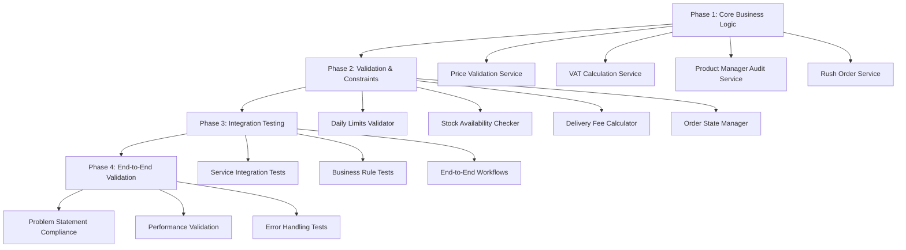

# AIMS Comprehensive Testing & Implementation Plan

## 📋 Executive Summary

This plan addresses comprehensive testing and core business logic implementation for the AIMS project, ensuring full compliance with the problem statement requirements through a structured 4-phase approach.

## 🎯 Analysis of Current State vs Requirements

### ✅ **What's Already Implemented:**
- Complete entity model ([`Product`](src/main/java/com/aims/core/entities/Product.java), [`Book`](src/main/java/com/aims/core/entities/Book.java), [`CD`](src/main/java/com/aims/core/entities/CD.java), [`DVD`](src/main/java/com/aims/core/entities/DVD.java), [`LP`](src/main/java/com/aims/core/entities/LP.java), [`Cart`](src/main/java/com/aims/core/entities/Cart.java), [`OrderEntity`](src/main/java/com/aims/core/entities/OrderEntity.java))
- Service layer infrastructure (Authentication, Cart, Order, Product, Payment services)
- DAO layer with database operations
- REST API controllers for web integration
- Comprehensive test infrastructure (JUnit 5, Mockito, TestFX)
- Payment gateway integration (VNPay)
- UI controllers and navigation

### ❌ **Missing Critical Business Logic:**
1. **Product Management Constraints** (Problem Statement Lines 16-19, 38-40)
   - Price validation (30%-150% of value)
   - Daily operation limits (max 30 updates/deletions, 2 price changes)
   - Product manager audit trail

2. **VAT & Pricing Logic** (Lines 22-23, 85-87)
   - 10% VAT calculations for display vs storage
   - Delivery fee calculations based on weight/location

3. **Inventory & Stock Management** (Lines 72-74, 146-148)
   - Stock validation during order placement
   - Rush order eligibility checks

4. **Order Management Workflow** (Lines 143-148)
   - Product manager order approval/rejection
   - Automatic stock validation

## 🏗️ Implementation Architecture



## 📚 Phase 1: Core Business Logic Implementation

### 1.1 Price Management Service
**Location:** `src/main/java/com/aims/core/application/services/IPriceManagementService.java`

**Responsibilities:**
- Validate price changes (30%-150% of value)
- Track daily price update count per product manager
- Enforce maximum 2 price updates per day per product

**Key Methods:**
```java
boolean validatePriceRange(float newPrice, float productValue)
boolean canUpdatePrice(String productId, String managerId)
void recordPriceUpdate(String productId, String managerId, float oldPrice, float newPrice)
List<PriceUpdateRecord> getDailyPriceUpdates(String managerId, LocalDate date)
```

**Implementation:** `src/main/java/com/aims/core/application/impl/PriceManagementServiceImpl.java`

### 1.2 VAT Calculation Service
**Location:** `src/main/java/com/aims/core/application/services/IVATCalculationService.java`

**Responsibilities:**
- Calculate VAT-inclusive prices for display (10% VAT)
- Ensure prices stored exclude VAT
- Handle delivery fee calculations (VAT exempt)

**Key Methods:**
```java
float calculateVATInclusivePrice(float basePrice)
float extractBasePrice(float vatInclusivePrice)
OrderPriceBreakdown calculateOrderPricing(List<OrderItem> items)
boolean isVATExempt(ItemType itemType) // For delivery fees
```

### 1.3 Product Manager Audit Service Enhancement
**Expand:** `src/main/java/com/aims/core/application/services/IProductManagerAuditService.java`

**New Features:**
- Daily operation limits tracking
- Bulk operation validation (max 10 deletions)
- Operation history with validation

**Additional Methods:**
```java
boolean canPerformOperation(String managerId, OperationType operation, int quantity)
void recordOperation(String managerId, OperationType operation, List<String> productIds)
DailyOperationSummary getDailyOperations(String managerId, LocalDate date)
boolean validateBulkDeletion(String managerId, List<String> productIds)
```

### 1.4 Rush Order Management Service
**Location:** `src/main/java/com/aims/core/application/services/IRushOrderService.java`

**Responsibilities:**
- Validate rush order eligibility (Hanoi inner districts only)
- Check product rush order compatibility
- Calculate separate delivery fees for rush vs regular items

**Key Methods:**
```java
boolean isRushOrderEligible(DeliveryAddress address)
boolean isProductRushOrderCompatible(String productId)
RushOrderValidationResult validateRushOrder(List<OrderItem> items, DeliveryAddress address)
DeliveryFeeBreakdown calculateRushOrderFees(List<OrderItem> rushItems, List<OrderItem> regularItems)
```

### 1.5 Operation Constraint Service
**Location:** `src/main/java/com/aims/core/application/services/IOperationConstraintService.java`

**Responsibilities:**
- Enforce daily operation limits
- Validate concurrent operations
- Track operation quotas

**Key Methods:**
```java
boolean canAddProduct(String managerId)
boolean canEditProduct(String managerId, String productId)
boolean canDeleteProducts(String managerId, List<String> productIds)
boolean canUpdatePrice(String managerId, String productId)
OperationQuotaStatus getQuotaStatus(String managerId, LocalDate date)
```

## 📋 Phase 2: Business Rule Validation & Constraints

### 2.1 Daily Operations Constraint Manager
**Location:** `src/main/java/com/aims/core/application/services/IOperationConstraintService.java`

**Rules Implementation:**
```java
// From Problem Statement Lines 16-19
- Max 1 product add/edit at a time
- Max 10 products deletion at once  
- Max 30 total updates/deletions per day
- Unlimited additions per day
- Max 2 price updates per product per day
```

**Constraint Validation:**
```java
public class OperationConstraints {
    public static final int MAX_CONCURRENT_EDITS = 1;
    public static final int MAX_BULK_DELETIONS = 10;
    public static final int MAX_DAILY_OPERATIONS = 30;
    public static final int MAX_DAILY_PRICE_UPDATES_PER_PRODUCT = 2;
    public static final int UNLIMITED_ADDITIONS = -1;
}
```

### 2.2 Delivery Fee Calculation Service Enhancement
**Location:** `src/main/java/com/aims/core/application/services/IDeliveryCalculationService.java`

**Enhanced Rules:**
```java
// From Problem Statement Lines 114-129
- Free shipping: orders > 100,000 VND (max 25,000 VND discount)
- Hanoi/HCMC: 22,000 VND for first 3kg
- Other regions: 30,000 VND for first 0.5kg  
- Additional: 2,500 VND per 0.5kg
- Rush order: +10,000 VND per item
- Weight-based calculation on heaviest item
```

**Enhanced Methods:**
```java
DeliveryFee calculateStandardDelivery(List<OrderItem> items, DeliveryAddress address)
DeliveryFee calculateRushDelivery(List<OrderItem> items, DeliveryAddress address)
boolean qualifiesForFreeShipping(float orderValue)
float getHeaviestItemWeight(List<OrderItem> items)
DeliveryRegion classifyDeliveryRegion(DeliveryAddress address)
```

### 2.3 Stock Validation Service
**Location:** `src/main/java/com/aims/core/application/services/IStockValidationService.java`

**Features:**
- Real-time inventory checking
- Stock reservation during order processing
- Insufficient stock notifications with available quantities

**Key Methods:**
```java
StockValidationResult validateOrderStock(List<OrderItem> items)
boolean reserveStock(List<OrderItem> items, String reservationId)
void releaseStockReservation(String reservationId)
List<StockDeficiency> getStockDeficiencies(List<OrderItem> items)
boolean isStockAvailable(String productId, int quantity)
```

### 2.4 Enhanced Product Service
**Extend:** `src/main/java/com/aims/core/application/services/IProductService.java`

**Business Rule Methods:**
```java
// Price validation with business rules
boolean validatePriceUpdate(String productId, float newPrice, String managerId)
PriceValidationResult updateProductPrice(String productId, float newPrice, String managerId)

// Product management with constraints
ProductOperationResult addProduct(ProductDTO product, String managerId)
ProductOperationResult updateProduct(String productId, ProductDTO updates, String managerId)
BulkOperationResult deleteProducts(List<String> productIds, String managerId)
```

## 🧪 Phase 3: Comprehensive Test Suite Implementation

### 3.1 Business Logic Unit Tests
**Location:** `src/test/java/com/aims/core/application/impl/`

**Test Classes:**

#### PriceManagementServiceImplTest.java
```java
@ExtendWith(MockitoExtension.class)
class PriceManagementServiceImplTest {
    
    @Test
    void validatePriceRange_ValidRange_ReturnsTrue()
    
    @Test
    void validatePriceRange_BelowMinimum_ReturnsFalse()
    
    @Test
    void validatePriceRange_AboveMaximum_ReturnsFalse()
    
    @Test
    void validatePriceRange_ExactBoundaries_ReturnsTrue()
    
    @Test
    void canUpdatePrice_WithinDailyLimit_ReturnsTrue()
    
    @Test
    void canUpdatePrice_ExceedsDailyLimit_ReturnsFalse()
    
    @Test
    void recordPriceUpdate_ValidUpdate_RecordsSuccessfully()
}
```

#### VATCalculationServiceImplTest.java
```java
@ExtendWith(MockitoExtension.class)
class VATCalculationServiceImplTest {
    
    @Test
    void calculateVATInclusivePrice_StandardRate_CalculatesCorrectly()
    
    @Test
    void extractBasePrice_FromVATInclusive_ExtractsCorrectly()
    
    @Test
    void calculateOrderPricing_MultipleItems_CalculatesCorrectTotals()
    
    @Test
    void isVATExempt_DeliveryFees_ReturnsTrue()
    
    @Test
    void calculateOrderPricing_WithDeliveryFee_ExcludesVATOnDelivery()
}
```

#### OperationConstraintServiceImplTest.java
```java
@ExtendWith(MockitoExtension.class)
class OperationConstraintServiceImplTest {
    
    @Test
    void canAddProduct_UnlimitedAdditions_AlwaysReturnsTrue()
    
    @Test
    void canDeleteProducts_WithinLimit_ReturnsTrue()
    
    @Test
    void canDeleteProducts_ExceedsLimit_ReturnsFalse()
    
    @Test
    void canDeleteProducts_ExceedsDailyOperations_ReturnsFalse()
    
    @Test
    void getQuotaStatus_TracksDailyOperations_ReturnsCorrectStatus()
}
```

#### RushOrderServiceImplTest.java
```java
@ExtendWith(MockitoExtension.class)
class RushOrderServiceImplTest {
    
    @Test
    void isRushOrderEligible_HanoiInnerDistrict_ReturnsTrue()
    
    @Test
    void isRushOrderEligible_OutsideHanoi_ReturnsFalse()
    
    @Test
    void validateRushOrder_EligibleProductsAndLocation_ReturnsValid()
    
    @Test
    void calculateRushOrderFees_SeparateCalculation_ReturnsCorrectFees()
    
    @Test
    void validateRushOrder_MixedEligibility_ReturnsSeparateGroups()
}
```

#### StockValidationServiceImplTest.java
```java
@ExtendWith(MockitoExtension.class)
class StockValidationServiceImplTest {
    
    @Test
    void validateOrderStock_SufficientStock_ReturnsValid()
    
    @Test
    void validateOrderStock_InsufficientStock_ReturnsDeficiencies()
    
    @Test
    void reserveStock_ValidReservation_ReturnsTrue()
    
    @Test
    void reserveStock_InsufficientStock_ReturnsFalse()
    
    @Test
    void releaseStockReservation_ValidReservation_ReleasesSuccessfully()
}
```

### 3.2 Integration Tests
**Location:** `src/test/java/com/aims/test/integration/`

**Test Suites:**

#### ProductManagementWorkflowIntegrationTest.java
```java
@SpringBootTest
@TestMethodOrder(OrderAnnotation.class)
class ProductManagementWorkflowIntegrationTest {
    
    @Test
    @Order(1)
    void productManager_AddProduct_WithValidData_Success()
    
    @Test
    @Order(2)
    void productManager_UpdatePrice_WithinConstraints_Success()
    
    @Test
    @Order(3)
    void productManager_UpdatePrice_ExceedsLimit_Rejected()
    
    @Test
    @Order(4)
    void productManager_BulkDelete_WithinLimit_Success()
    
    @Test
    @Order(5)
    void productManager_DailyOperations_ExceedsLimit_Rejected()
}
```

#### OrderProcessingIntegrationTest.java
```java
@SpringBootTest
@TestMethodOrder(OrderAnnotation.class)
class OrderProcessingIntegrationTest {
    
    @Test
    @Order(1)
    void customer_PlaceOrder_SufficientStock_Success()
    
    @Test
    @Order(2)
    void customer_PlaceOrder_InsufficientStock_ShowsDeficiencies()
    
    @Test
    @Order(3)
    void customer_PlaceRushOrder_EligibleLocation_Success()
    
    @Test
    @Order(4)
    void customer_PlaceRushOrder_IneligibleLocation_Rejected()
    
    @Test
    @Order(5)
    void productManager_ApproveOrder_ValidOrder_Success()
    
    @Test
    @Order(6)
    void productManager_RejectOrder_InsufficientStock_Success()
}
```

#### DeliveryCalculationIntegrationTest.java
```java
@SpringBootTest
class DeliveryCalculationIntegrationTest {
    
    @Test
    void calculateDeliveryFee_HanoiAddress_StandardRate()
    
    @Test
    void calculateDeliveryFee_ProvinceAddress_HigherRate()
    
    @Test
    void calculateDeliveryFee_QualifiesForFreeShipping_DiscountApplied()
    
    @Test
    void calculateDeliveryFee_RushOrder_AdditionalFeeApplied()
    
    @Test
    void calculateDeliveryFee_MixedOrder_SeparateCalculations()
}
```

#### PaymentFlowIntegrationTest.java
```java
@SpringBootTest
class PaymentFlowIntegrationTest {
    
    @Test
    void payment_VNPay_ValidTransaction_Success()
    
    @Test
    void payment_VNPay_InvalidTransaction_Failure()
    
    @Test
    void payment_Refund_ValidOrder_Success()
    
    @Test
    void payment_VAT_CorrectCalculation_InInvoice()
}
```

### 3.3 End-to-End Scenario Tests
**Location:** `src/test/java/com/aims/test/scenarios/`

**Scenarios:**

#### CustomerPurchaseJourneyTest.java
```java
@SpringBootTest
@TestMethodOrder(OrderAnnotation.class)
class CustomerPurchaseJourneyTest {
    
    @Test
    @Order(1)
    void customer_BrowseProducts_ViewsRandomProducts()
    
    @Test
    @Order(2)
    void customer_SearchProducts_FindsRelevantResults()
    
    @Test
    @Order(3)
    void customer_AddToCart_UpdatesCartCorrectly()
    
    @Test
    @Order(4)
    void customer_ViewCart_ShowsCorrectPricing()
    
    @Test
    @Order(5)
    void customer_EnterDeliveryInfo_CalculatesDeliveryFee()
    
    @Test
    @Order(6)
    void customer_SelectRushOrder_ValidatesEligibility()
    
    @Test
    @Order(7)
    void customer_ProcessPayment_CompletesSuccessfully()
    
    @Test
    @Order(8)
    void customer_ReceiveOrder_UpdatesStatus()
}
```

#### ProductManagerDailyOperationsTest.java
```java
@SpringBootTest
@TestMethodOrder(OrderAnnotation.class)
class ProductManagerDailyOperationsTest {
    
    @Test
    @Order(1)
    void productManager_StartOfDay_ZeroOperations()
    
    @Test
    @Order(2)
    void productManager_AddMultipleProducts_Success()
    
    @Test
    @Order(3)
    void productManager_UpdatePrices_WithinDailyLimit()
    
    @Test
    @Order(4)
    void productManager_BulkOperations_ApproachesLimit()
    
    @Test
    @Order(5)
    void productManager_ExceedLimit_OperationRejected()
    
    @Test
    @Order(6)
    void productManager_ViewPendingOrders_ProcessOrders()
}
```

#### AdminUserManagementTest.java
```java
@SpringBootTest
class AdminUserManagementTest {
    
    @Test
    void admin_CreateUser_WithValidData_Success()
    
    @Test
    void admin_AssignRoles_ToUser_Success()
    
    @Test
    void admin_BlockUser_PreventsLogin()
    
    @Test
    void admin_ResetPassword_SendsEmail()
    
    @Test
    void admin_ViewUserActivity_ShowsAuditTrail()
}
```

## ✅ Phase 4: Problem Statement Compliance Validation

### 4.1 Requirements Traceability Matrix
**Location:** `src/test/java/com/aims/test/compliance/`

**Test Classes:**

#### ProblemStatementComplianceTest.java
```java
@SpringBootTest
class ProblemStatementComplianceTest {
    
    // Lines 16-19: Product Manager Constraints
    @Test
    void requirement_ProductManagerOperations_EnforcesConstraints()
    
    // Lines 22-23: VAT Requirements
    @Test
    void requirement_VATCalculation_10PercentCorrect()
    
    // Lines 38-40: Price Constraints
    @Test
    void requirement_PriceRange_30To150Percent()
    
    // Lines 53-58: Product Display
    @Test
    void requirement_ProductDisplay_20ProductsPerPage()
    
    // Lines 66-75: Cart Management
    @Test
    void requirement_CartOperations_OneCartPerSession()
    
    // Lines 85-87: Invoice Requirements
    @Test
    void requirement_InvoiceGeneration_IncludesVATBreakdown()
    
    // Lines 93-129: Delivery Fee Calculation
    @Test
    void requirement_DeliveryFees_CalculatedPerSpecification()
    
    // Lines 143-148: Order Management
    @Test
    void requirement_OrderApproval_ProductManagerReview()
}
```

#### PerformanceRequirementsTest.java
```java
@SpringBootTest
class PerformanceRequirementsTest {
    
    // Lines 11-15: Performance Requirements
    @Test
    void performance_1000ConcurrentUsers_MaintainsPerformance()
    
    @Test
    void performance_ResponseTime_Under2Seconds()
    
    @Test
    void performance_PeakHours_Under5Seconds()
    
    @Test
    void performance_ContinuousOperation_300Hours()
    
    @Test
    void performance_Recovery_Under1Hour()
}
```

#### SecurityConstraintsTest.java
```java
@SpringBootTest
class SecurityConstraintsTest {
    
    @Test
    void security_UserAuthentication_RequiredForRoleOperations()
    
    @Test
    void security_ProductManagerAudit_TracksAllOperations()
    
    @Test
    void security_PaymentData_SecurelyHandled()
    
    @Test
    void security_SessionManagement_ProperIsolation()
}
```

### 4.2 Business Rule Edge Cases
**Test Coverage:**
- Price boundary validation (exactly 30% and 150%)
- Daily limit edge cases (exactly 30 operations)
- Stock depletion scenarios
- Rush order location validation
- VAT calculation precision
- Delivery fee weight calculations
- Free shipping threshold validation

## 📁 File Structure & Organization

```
src/test/java/com/aims/
├── core/
│   ├── application/
│   │   └── impl/           # Service implementation tests (35+ tests)
│   ├── entities/           # Entity validation tests (25+ tests)
│   └── infrastructure/     # DAO and database tests (30+ tests)
├── test/
│   ├── integration/        # Service integration tests (25+ tests)
│   ├── scenarios/          # End-to-end workflow tests (15+ tests)
│   ├── compliance/         # Problem statement validation (20+ tests)
│   ├── performance/        # Load and stress tests (10+ tests)
│   └── utils/             # Test utilities and factories
└── resources/
    ├── test_data/         # Test data SQL scripts
    └── test_configurations/ # Test-specific configurations
```

## 🎮 Test Execution Strategy

### 3.1 Unit Tests (160+ tests)
- **Entity Tests (25 tests):** Product, Book, CD, DVD, LP validation
- **Service Logic Tests (80 tests):** Price, VAT, Delivery calculations, Constraints
- **DAO Tests (30 tests):** Database operations, transaction integrity  
- **Controller Tests (25 tests):** Input validation, output formatting

### 3.2 Integration Tests (65+ tests)  
- **Multi-service Workflows (25 tests):** Cross-service interactions
- **Database Integration (15 tests):** Transaction integrity, data consistency
- **API Integration (15 tests):** REST endpoint testing
- **Payment Integration (10 tests):** VNPay gateway testing

### 3.3 End-to-End Tests (25+ tests)
- **Customer Journeys (15 tests):** Complete purchase workflows
- **Admin Workflows (5 tests):** User management, system administration
- **Error Scenarios (5 tests):** Error handling, recovery procedures

### 3.4 Compliance & Performance Tests (30+ tests)
- **Business Rule Compliance (20 tests):** Problem statement requirements
- **Performance Tests (10 tests):** Load testing, response time validation

**Total: 280+ Comprehensive Tests**

## 📊 Success Criteria & Validation

### Business Logic Compliance
- ✅ All price constraints enforced (30%-150% validation)
- ✅ Daily operation limits respected (max 30 operations, 2 price updates)
- ✅ VAT calculations accurate to 2 decimal places (10% rate)
- ✅ Delivery fees calculated per specification (weight-based, region-based)
- ✅ Rush order rules properly implemented (Hanoi districts only)
- ✅ Stock validation prevents overselling
- ✅ Product manager audit trail maintained

### Test Coverage Goals
- **Unit Tests:** >95% code coverage for business logic
- **Integration Tests:** All critical workflows covered
- **End-to-End:** Complete user journeys validated
- **Performance:** 1000 concurrent users, <2s response time (normal), <5s (peak)

### Problem Statement Alignment
- ✅ All requirements from lines 10-155 implemented and tested
- ✅ Business constraints properly enforced
- ✅ User roles and permissions validated
- ✅ Payment integration functional with VNPay sandbox
- ✅ Order management workflow complete with approval process

## 🚀 Implementation Timeline

### Phase 1: Core Business Logic (Week 1)
- **Days 1-2:** Price Management Service implementation and tests
- **Days 3-4:** VAT Calculation Service implementation and tests  
- **Days 5-7:** Operation Constraint Service and Rush Order Service

### Phase 2: Validation & Constraints (Week 2)
- **Days 1-3:** Enhanced delivery fee calculations and validation
- **Days 4-5:** Stock validation service implementation
- **Days 6-7:** Integration of all constraint validations

### Phase 3: Comprehensive Testing (Week 3)
- **Days 1-3:** Unit test suite completion (160+ tests)
- **Days 4-5:** Integration test implementation (65+ tests)
- **Days 6-7:** End-to-end scenario testing (25+ tests)

### Phase 4: Compliance & Validation (Week 4)
- **Days 1-3:** Problem statement compliance testing (30+ tests)
- **Days 4-5:** Performance and load testing
- **Days 6-7:** Final validation, documentation, and deployment preparation

## 🔧 Technical Requirements

### Development Environment
- **Java 21** with Spring Boot 3.2.1
- **JUnit 5** for unit testing
- **Mockito 5.12.0** for mocking
- **TestFX 4.0.18** for UI testing
- **Maven 3.11.0** for build management

### Database & Testing
- **SQLite** for development and testing
- **H2** for in-memory testing
- **Test containers** for integration testing
- **Spring Boot Test** for application context testing

### External Dependencies
- **VNPay Sandbox** for payment testing
- **Jakarta Mail** for email notifications
- **Jackson** for JSON processing
- **SLF4J/Logback** for logging

---

**Estimated Implementation Time:** 4 weeks
**Required Resources:** Senior Java/Spring Boot developer, Test automation specialist
**Success Metrics:** 280+ tests passing, >95% coverage, full problem statement compliance