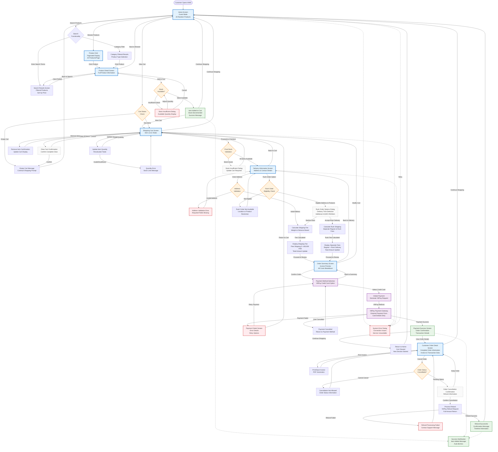

# AIMS: Customer Journey Flow - Guest Shopping Experience

## Overview

This document focuses specifically on the customer (guest) shopping journey within the AIMS application, detailing the complete flow from product discovery through payment and order management.

## Customer Journey Architecture

- **No Authentication Required**: Customers can shop as guests without creating accounts
- **Session-based Cart**: Cart persists throughout the session until payment completion
- **Real-time Validation**: Stock and pricing validation at multiple checkpoints
- **VNPay Integration**: Secure payment processing through VNPay gateway

## Customer Shopping Journey Flow

## Key Customer Interaction Points

### **Product Discovery & Browsing**
1. **Home Screen Entry**: 20 random products displayed per page
2. **Search Functionality**: Product attribute-based search with results pagination
3. **Product Detail View**: Complete product information with add-to-cart functionality
4. **Category Filtering**: Filter by product type (Books, CDs, DVDs, LP Records)

### **Shopping Cart Operations**
1. **Add to Cart**: Real-time stock validation with quantity constraints
2. **Cart Modification**: Update quantities, remove items, clear entire cart
3. **Cart Persistence**: Session-based cart storage until payment completion
4. **Stock Validation**: Multiple validation points throughout checkout process

### **Checkout Process**
1. **Delivery Information**: Required fields validation with address verification
2. **Rush Order Options**: Eligibility check for Hanoi inner districts only
3. **Shipping Calculation**: Weight-based fees with free shipping threshold (100,000 VND)
4. **Order Summary**: Complete cost breakdown including VAT and shipping

### **Payment Integration**
1. **VNPay Gateway**: Secure credit card processing through VNPay Sandbox
2. **Payment States**: Success, failure, and cancellation handling
3. **Transaction Tracking**: Complete transaction history and reference numbers
4. **Error Recovery**: Retry mechanisms for failed payments

### **Order Management**
1. **Order Viewing**: Complete order details with invoice information
2. **Cancellation Rules**: Status-based cancellation eligibility
3. **Refund Processing**: Automated refund through VNPay for cancelled orders
4. **Order Tracking**: Status updates throughout order lifecycle

## Business Rules for Customers

### **Shopping Constraints**
- **Product Display**: 20 products per page with pagination navigation
- **Search Results**: 20 related products per search page with sorting options
- **Cart Limitations**: One cart per software session
- **Guest Checkout**: No account creation required for purchases

### **Pricing and Fees**
- **VAT Application**: 10% VAT added to all product prices
- **Shipping Fees**: Based on heaviest item weight and delivery location
- **Free Shipping**: Orders over 100,000 VND (excluding rush delivery items)
- **Rush Delivery**: Additional 10,000 VND per eligible item

### **Delivery Options**
- **Standard Delivery**: Available nationwide with location-based pricing
- **Rush Delivery**: 2-hour delivery for Hanoi inner districts only
- **Eligibility**: Product-specific rush delivery availability
- **Address Validation**: Real-time address verification with fee calculation

### **Payment and Refunds**
- **Payment Methods**: Credit cards only through VNPay integration
- **Refund Policy**: Full refund for cancelled orders in eligible status
- **Transaction Security**: Secure payment processing with transaction tracking
- **Cancellation Window**: Orders can be cancelled before approval by product manager

## Error Handling and Validation

### **Stock Management**
- **Real-time Validation**: Stock checks at add-to-cart and checkout
- **Insufficient Stock**: Clear messaging with available quantities
- **Concurrent Access**: Handle multiple customers accessing same products
- **Stock Updates**: Immediate inventory updates after successful payment

### **Form Validation**
- **Required Fields**: All delivery information fields must be completed
- **Address Format**: Proper address format validation with province/city selection
- **Contact Information**: Email and phone number format validation
- **Data Persistence**: Form data preserved during validation errors

### **Payment Error Recovery**
- **Network Issues**: Timeout handling with retry options
- **Gateway Errors**: Clear error messaging with alternative actions
- **Transaction Failures**: Graceful degradation with cart preservation
- **Security Validation**: Secure token handling and validation

---

*This customer journey documentation reflects the complete guest shopping experience in the AIMS application, from initial product discovery through successful order completion and management.*