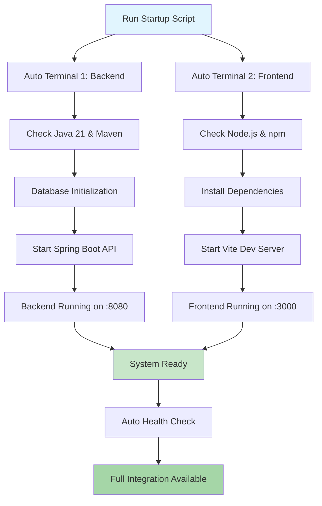

# AIMS Project Dual-Side Startup Plan with Automation

## 📋 Project Overview

The AIMS project is a comprehensive e-commerce platform with:
- **Backend**: Spring Boot REST API (Java 21) with SQLite database
- **Frontend**: React + TypeScript + Vite with TailwindCSS
- **Integration**: Full-stack communication via REST endpoints

## 🎯 Startup Strategy: Automated Parallel Execution



## 🚀 Automated Startup Scripts

### 1. Master Startup Script (`start-aims.sh`)

**Location**: Project root directory
**Purpose**: Orchestrates both backend and frontend startup

```bash
#!/bin/bash

# AIMS Project Master Startup Script
# =================================

set -e  # Exit on any error

PROJECT_ROOT="/Users/namu10x/workspace/hust/javafxml-AIMS"
LOG_DIR="$PROJECT_ROOT/logs"
BACKEND_LOG="$LOG_DIR/backend.log"
FRONTEND_LOG="$LOG_DIR/frontend.log"

# Colors for output
RED='\033[0;31m'
GREEN='\033[0;32m'
YELLOW='\033[1;33m'
BLUE='\033[0;34m'
NC='\033[0m' # No Color

# Create logs directory
mkdir -p "$LOG_DIR"

echo -e "${BLUE}🚀 AIMS Project Startup Automation${NC}"
echo -e "${BLUE}===================================${NC}"
echo ""

# Function to check if port is available
check_port() {
    local port=$1
    if lsof -Pi :$port -sTCP:LISTEN -t >/dev/null; then
        echo -e "${YELLOW}⚠️  Port $port is already in use${NC}"
        return 1
    fi
    return 0
}

# Function to wait for service to be ready
wait_for_service() {
    local url=$1
    local service_name=$2
    local max_attempts=30
    local attempt=1
    
    echo -e "${YELLOW}🔍 Waiting for $service_name to be ready...${NC}"
    
    while [ $attempt -le $max_attempts ]; do
        if curl -s "$url" > /dev/null 2>&1; then
            echo -e "${GREEN}✅ $service_name is ready!${NC}"
            return 0
        fi
        echo -n "."
        sleep 2
        ((attempt++))
    done
    
    echo -e "${RED}❌ $service_name failed to start within timeout${NC}"
    return 1
}

# Pre-flight checks
echo -e "${BLUE}🔍 Pre-flight System Checks${NC}"
echo "================================"

# Check Java
if command -v java &> /dev/null; then
    JAVA_VERSION=$(java -version 2>&1 | head -n 1 | cut -d'"' -f2)
    echo -e "${GREEN}✅ Java: $JAVA_VERSION${NC}"
else
    echo -e "${RED}❌ Java not found${NC}"
    exit 1
fi

# Check Maven
if command -v mvn &> /dev/null; then
    MVN_VERSION=$(mvn -version | head -n 1 | cut -d' ' -f3)
    echo -e "${GREEN}✅ Maven: $MVN_VERSION${NC}"
else
    echo -e "${RED}❌ Maven not found${NC}"
    exit 1
fi

# Check Node.js
if command -v node &> /dev/null; then
    NODE_VERSION=$(node --version)
    echo -e "${GREEN}✅ Node.js: $NODE_VERSION${NC}"
else
    echo -e "${RED}❌ Node.js not found${NC}"
    exit 1
fi

# Check npm
if command -v npm &> /dev/null; then
    NPM_VERSION=$(npm --version)
    echo -e "${GREEN}✅ npm: $NPM_VERSION${NC}"
else
    echo -e "${RED}❌ npm not found${NC}"
    exit 1
fi

# Check ports
echo ""
echo -e "${BLUE}🔌 Port Availability Check${NC}"
echo "=========================="

if check_port 8080; then
    echo -e "${GREEN}✅ Port 8080 (Backend) is available${NC}"
else
    echo -e "${RED}❌ Port 8080 is occupied. Please free it before starting.${NC}"
    exit 1
fi

if check_port 3000; then
    echo -e "${GREEN}✅ Port 3000 (Frontend) is available${NC}"
else
    echo -e "${YELLOW}⚠️  Port 3000 is occupied. Vite will auto-increment.${NC}"
fi

echo ""
echo -e "${BLUE}🎬 Starting Services${NC}"
echo "==================="

# Start Backend in new terminal
echo -e "${YELLOW}🔧 Starting Backend (Spring Boot)...${NC}"
osascript -e "
tell application \"Terminal\"
    do script \"cd '$PROJECT_ROOT' && ./scripts/start-backend.sh\"
end tell
"

# Wait a moment for backend to initialize
sleep 5

# Start Frontend in new terminal
echo -e "${YELLOW}🎨 Starting Frontend (React + Vite)...${NC}"
osascript -e "
tell application \"Terminal\"
    do script \"cd '$PROJECT_ROOT' && ./scripts/start-frontend.sh\"
end tell
"

# Wait for services to be ready
echo ""
echo -e "${BLUE}⏳ Service Health Checks${NC}"
echo "======================="

# Wait for backend
if wait_for_service "http://localhost:8080/actuator/health" "Backend API"; then
    echo -e "${GREEN}🎉 Backend is operational!${NC}"
else
    echo -e "${RED}❌ Backend startup failed${NC}"
    exit 1
fi

# Wait for frontend
if wait_for_service "http://localhost:3000" "Frontend App"; then
    echo -e "${GREEN}🎉 Frontend is operational!${NC}"
else
    echo -e "${RED}❌ Frontend startup failed${NC}"
    exit 1
fi

echo ""
echo -e "${GREEN}🎉 AIMS Project Successfully Started!${NC}"
echo -e "${GREEN}====================================${NC}"
echo ""
echo -e "${BLUE}📱 Access URLs:${NC}"
echo -e "   🌐 Frontend:     ${GREEN}http://localhost:3000${NC}"
echo -e "   🔧 Backend API:  ${GREEN}http://localhost:8080${NC}"
echo -e "   📚 API Docs:     ${GREEN}http://localhost:8080/swagger-ui.html${NC}"
echo -e "   ❤️  Health:      ${GREEN}http://localhost:8080/actuator/health${NC}"
echo ""
echo -e "${BLUE}📝 Logs:${NC}"
echo -e "   📄 Backend:      ${YELLOW}tail -f $BACKEND_LOG${NC}"
echo -e "   📄 Frontend:     ${YELLOW}tail -f $FRONTEND_LOG${NC}"
echo ""
echo -e "${YELLOW}💡 To stop services, close the respective terminal windows${NC}"
```

### 2. Backend Startup Script (`scripts/start-backend.sh`)

```bash
#!/bin/bash

# AIMS Backend Startup Script
# ===========================

set -e

PROJECT_ROOT="/Users/namu10x/workspace/hust/javafxml-AIMS"
LOG_DIR="$PROJECT_ROOT/logs"
BACKEND_LOG="$LOG_DIR/backend.log"

# Colors
RED='\033[0;31m'
GREEN='\033[0;32m'
YELLOW='\033[1;33m'
BLUE='\033[0;34m'
NC='\033[0m'

cd "$PROJECT_ROOT"

echo -e "${BLUE}🔧 AIMS Backend Startup${NC}"
echo -e "${BLUE}======================${NC}"
echo ""

# Create logs directory
mkdir -p "$LOG_DIR"

# Database check
if [ ! -f "src/main/resources/aims_database.db" ]; then
    echo -e "${YELLOW}🗄️  Database not found, will be created automatically${NC}"
fi

echo -e "${YELLOW}📦 Compiling project...${NC}"
mvn clean compile -q

echo -e "${YELLOW}🚀 Starting Spring Boot API...${NC}"
echo -e "${BLUE}📍 Backend will be available at: http://localhost:8080${NC}"
echo -e "${BLUE}📊 Health endpoint: http://localhost:8080/actuator/health${NC}"
echo -e "${BLUE}📚 API Documentation: http://localhost:8080/swagger-ui.html${NC}"
echo ""

# Start with logging
mvn spring-boot:run \
    -Dspring-boot.run.main-class=com.aims.core.AimsWebApiApplication \
    -q 2>&1 | tee "$BACKEND_LOG"
```

### 3. Frontend Startup Script (`scripts/start-frontend.sh`)

```bash
#!/bin/bash

# AIMS Frontend Startup Script
# ============================

set -e

PROJECT_ROOT="/Users/namu10x/workspace/hust/javafxml-AIMS"
FRONTEND_DIR="$PROJECT_ROOT/web-ui"
LOG_DIR="$PROJECT_ROOT/logs"
FRONTEND_LOG="$LOG_DIR/frontend.log"

# Colors
RED='\033[0;31m'
GREEN='\033[0;32m'
YELLOW='\033[1;33m'
BLUE='\033[0;34m'
NC='\033[0m'

cd "$FRONTEND_DIR"

echo -e "${BLUE}🎨 AIMS Frontend Startup${NC}"
echo -e "${BLUE}=======================${NC}"
echo ""

# Create logs directory
mkdir -p "$LOG_DIR"

# Check if node_modules exists
if [ ! -d "node_modules" ]; then
    echo -e "${YELLOW}📦 Installing dependencies...${NC}"
    npm install
else
    echo -e "${GREEN}✅ Dependencies already installed${NC}"
fi

# Check for package updates
echo -e "${YELLOW}🔍 Checking for dependency updates...${NC}"
if npm outdated --depth=0 2>/dev/null | grep -q .; then
    echo -e "${YELLOW}⚠️  Some dependencies have updates available${NC}"
    echo -e "${YELLOW}💡 Run 'npm update' to update dependencies${NC}"
else
    echo -e "${GREEN}✅ All dependencies are up to date${NC}"
fi

echo -e "${YELLOW}🚀 Starting Vite development server...${NC}"
echo -e "${BLUE}📍 Frontend will be available at: http://localhost:3000${NC}"
echo -e "${BLUE}🔥 Hot reload enabled for development${NC}"
echo ""

# Start with logging
npm run dev 2>&1 | tee "$FRONTEND_LOG"
```

### 4. Stop Services Script (`stop-aims.sh`)

```bash
#!/bin/bash

# AIMS Project Stop Script
# =======================

# Colors
RED='\033[0;31m'
GREEN='\033[0;32m'
YELLOW='\033[1;33m'
BLUE='\033[0;34m'
NC='\033[0m'

echo -e "${BLUE}🛑 Stopping AIMS Project Services${NC}"
echo -e "${BLUE}=================================${NC}"
echo ""

# Function to kill process on port
kill_port() {
    local port=$1
    local service_name=$2
    
    local pid=$(lsof -ti:$port)
    if [ ! -z "$pid" ]; then
        echo -e "${YELLOW}🔍 Found $service_name running on port $port (PID: $pid)${NC}"
        kill -TERM $pid
        sleep 2
        
        # Force kill if still running
        if kill -0 $pid 2>/dev/null; then
            echo -e "${YELLOW}💪 Force killing $service_name...${NC}"
            kill -KILL $pid
        fi
        
        echo -e "${GREEN}✅ $service_name stopped${NC}"
    else
        echo -e "${YELLOW}ℹ️  $service_name not running on port $port${NC}"
    fi
}

# Stop backend (port 8080)
kill_port 8080 "Backend API"

# Stop frontend (port 3000)
kill_port 3000 "Frontend Dev Server"

# Also check common alternative ports
kill_port 3001 "Frontend Dev Server (Alt)"

echo ""
echo -e "${GREEN}🎉 All AIMS services stopped successfully!${NC}"
```

### 5. Health Check Script (`health-check.sh`)

```bash
#!/bin/bash

# AIMS Project Health Check Script
# ===============================

# Colors
RED='\033[0;31m'
GREEN='\033[0;32m'
YELLOW='\033[1;33m'
BLUE='\033[0;34m'
NC='\033[0m'

echo -e "${BLUE}🏥 AIMS Project Health Check${NC}"
echo -e "${BLUE}============================${NC}"
echo ""

# Function to check service health
check_service() {
    local url=$1
    local service_name=$2
    
    if curl -s "$url" > /dev/null 2>&1; then
        echo -e "${GREEN}✅ $service_name: HEALTHY${NC}"
        return 0
    else
        echo -e "${RED}❌ $service_name: UNHEALTHY${NC}"
        return 1
    fi
}

# Check backend
echo -e "${BLUE}🔧 Backend Services${NC}"
echo "=================="
check_service "http://localhost:8080/actuator/health" "Spring Boot API"
check_service "http://localhost:8080/swagger-ui.html" "API Documentation"

echo ""

# Check frontend
echo -e "${BLUE}🎨 Frontend Services${NC}"
echo "==================="
check_service "http://localhost:3000" "React Development Server"

echo ""

# Check integration
echo -e "${BLUE}🔗 Integration Tests${NC}"
echo "==================="

# Test API endpoint
if curl -s "http://localhost:8080/api/products" > /dev/null 2>&1; then
    echo -e "${GREEN}✅ API Endpoints: ACCESSIBLE${NC}"
else
    echo -e "${RED}❌ API Endpoints: INACCESSIBLE${NC}"
fi

# Check CORS
if curl -s -H "Origin: http://localhost:3000" "http://localhost:8080/api/products" > /dev/null 2>&1; then
    echo -e "${GREEN}✅ CORS Configuration: WORKING${NC}"
else
    echo -e "${RED}❌ CORS Configuration: FAILED${NC}"
fi

echo ""
echo -e "${BLUE}📊 System Status Summary${NC}"
echo "========================"
echo -e "Frontend: ${GREEN}http://localhost:3000${NC}"
echo -e "Backend:  ${GREEN}http://localhost:8080${NC}"
echo -e "API Docs: ${GREEN}http://localhost:8080/swagger-ui.html${NC}"
```

## 📁 File Structure for Scripts

```
/Users/namu10x/workspace/hust/javafxml-AIMS/
├── start-aims.sh              # Master startup script
├── stop-aims.sh               # Stop all services
├── health-check.sh            # Health monitoring
├── scripts/
│   ├── start-backend.sh       # Backend-specific startup
│   └── start-frontend.sh      # Frontend-specific startup
└── logs/
    ├── backend.log            # Backend logs
    └── frontend.log           # Frontend logs
```

## 🚀 Usage Instructions

### Quick Start (Recommended)
```bash
# Make scripts executable (one time setup)
chmod +x start-aims.sh stop-aims.sh health-check.sh
chmod +x scripts/*.sh

# Start everything automatically
./start-aims.sh
```

### Individual Service Management
```bash
# Start backend only
./scripts/start-backend.sh

# Start frontend only  
./scripts/start-frontend.sh

# Stop all services
./stop-aims.sh

# Check system health
./health-check.sh
```

### Development Workflow
```bash
# Morning startup
./start-aims.sh

# Check if everything is working
./health-check.sh

# Evening shutdown
./stop-aims.sh
```

## 🎯 Expected Outcomes

**Automation Benefits:**
- ✅ One-command startup for entire project
- ✅ Automatic dependency checking
- ✅ Health monitoring and verification
- ✅ Centralized logging
- ✅ Graceful service shutdown
- ✅ Cross-platform terminal management

**Development Experience:**
- 🚀 **Setup Time**: < 2 minutes from cold start
- 🔄 **Hot Reload**: Automatic for both frontend and backend changes
- 📊 **Monitoring**: Real-time health checks and logging
- 🛑 **Cleanup**: One-command shutdown with proper cleanup

**Integration Features:**
- 🌐 Frontend-Backend communication pre-configured
- 🔐 CORS settings optimized for development
- 📱 Mobile-friendly development URLs
- 🐛 Comprehensive error logging and debugging

---

This enhanced plan provides complete automation for running both sides of the AIMS project with professional-grade scripting, monitoring, and error handling.