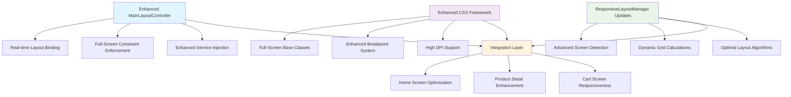

# AIMS Enhanced Responsive Full-Screen Implementation Plan
## Phases 1 & 2 Combined: Core Foundation Implementation

### **Project Overview**
This implementation plan provides comprehensive enhanced responsive full-screen functionality for the AIMS JavaFX application. The hybrid approach combines Phase 1 (Enhanced MainLayoutController) and Phase 2 (CSS Framework Integration) to establish a robust foundation for universal responsive behavior.

### **Implementation Architecture**



---

## **Phase 1: Enhanced MainLayoutController Implementation**

### **1.1 Core Enhancement Features**

#### **Real-Time Responsive Layout Binding**
- **`bindContentToParentSize()`** - Binds loaded content size to parent container for real-time scaling
- **`updateFullScreenResponsiveLayout()`** - Updates responsive layout in real-time based on window size changes
- **`enforceFullScreenConstraints()`** - Applies comprehensive full-screen sizing constraints to loaded content

#### **Enhanced Content Loading System**
- **`loadContent()` Enhancement** - Comprehensive responsive layout enforcement during content loading
- **`applyFullScreenResponsiveLayout()`** - Advanced responsive layout application with screen-specific optimizations
- **`applyResponsiveConstraintsToContent()`** - Apply responsive constraints to any loaded Parent node

#### **Advanced Service Injection Integration**
- **`performEnhancedServiceInjection()`** - Enhanced service injection with responsive setup for child controllers
- **Responsive-aware controller initialization** - Child controllers receive screen size and responsive context
- **Dynamic responsive class application** - Automatic application of screen-specific CSS classes

### **1.2 New Methods to Implement**

```java
// Full-screen constraint enforcement
private void enforceFullScreenConstraints(Parent content)

// Real-time size binding
private void bindContentToParentSize(Parent content)

// Comprehensive responsive layout application
private void applyFullScreenResponsiveLayout()

// Real-time responsive updates
private void updateFullScreenResponsiveLayout(double width, double height)

// Content responsiveness updates
private void updateLoadedContentResponsiveness(double width, double height)

// Screen-specific optimizations
private void applyScreenSpecificOptimizations()

// Enhanced responsive behavior setup
private void setupResponsiveBehavior()

// Enhanced completeInitialization
public void completeInitialization()
```

### **1.3 Enhanced Properties and State Management**

```java
// Add to MainLayoutController class
private ResponsiveLayoutManager.ScreenSize currentScreenSize;
private ScreenDetectionService.ScreenInfo currentScreenInfo;

// Enhanced getter methods
public ResponsiveLayoutManager.ScreenSize getCurrentScreenSize()
public ScreenDetectionService.ScreenInfo getCurrentScreenInfo()
```

---

## **Phase 2: Enhanced CSS Framework Integration**

### **2.1 New Full-Screen Base Classes**

#### **Core Full-Screen Classes**
```css
.fullscreen-main {
    -fx-pref-width: -1;
    -fx-pref-height: -1;
    -fx-max-width: Infinity;
    -fx-max-height: Infinity;
    -fx-min-width: 0;
    -fx-min-height: 0;
}

.fullscreen-content-pane {
    -fx-pref-width: -1;
    -fx-pref-height: -1;
    -fx-max-width: Infinity;
    -fx-max-height: Infinity;
    -fx-min-width: 0;
    -fx-min-height: 0;
    -fx-padding: 0;
    -fx-border-width: 0;
}

.responsive-fullscreen {
    -fx-pref-width: -1;
    -fx-pref-height: -1;
    -fx-max-width: Infinity;
    -fx-max-height: Infinity;
    -fx-fit-to-width: true;
    -fx-fit-to-height: true;
}
```

#### **Enhanced Container Classes**
```css
.responsive-fullscreen-container {
    -fx-pref-width: -1;
    -fx-pref-height: -1;
    -fx-max-width: Infinity;
    -fx-max-height: Infinity;
    -fx-min-width: 800;
    -fx-min-height: 600;
}

.fill-parent {
    -fx-pref-width: -1;
    -fx-pref-height: -1;
    -fx-max-width: Infinity;
    -fx-max-height: Infinity;
    -fx-min-width: 0;
    -fx-min-height: 0;
}
```

### **2.2 Enhanced Responsive Breakpoint System**

#### **Screen Size Categories with Enhanced Spacing**

**Mobile Devices (< 768px)**
```css
.responsive-mobile {
    -fx-max-width: 767;
    -fx-font-size: 14px;
    -fx-spacing: 8;
    -fx-padding: 10;
}

.responsive-mobile .responsive-product-grid-enhanced {
    -fx-hgap: 10;
    -fx-vgap: 10;
    -fx-padding: 15;
    -fx-pref-columns: 1;
}
```

**Tablet Devices (768px - 1024px)**
```css
.responsive-tablet {
    -fx-min-width: 768;
    -fx-max-width: 1023;
    -fx-font-size: 15px;
    -fx-spacing: 12;
    -fx-padding: 15;
}

.responsive-tablet .responsive-product-grid-enhanced {
    -fx-hgap: 15;
    -fx-vgap: 15;
    -fx-padding: 20;
    -fx-pref-columns: 2;
}
```

**Desktop Devices (1024px - 1440px)**
```css
.responsive-desktop {
    -fx-min-width: 1024;
    -fx-max-width: 1439;
    -fx-font-size: 16px;
    -fx-spacing: 15;
    -fx-padding: 20;
}

.responsive-desktop .responsive-product-grid-enhanced {
    -fx-hgap: 20;
    -fx-vgap: 20;
    -fx-padding: 25;
    -fx-pref-columns: 3;
}
```

**Large Desktop (1440px - 1920px)**
```css
.responsive-large-desktop {
    -fx-min-width: 1440;
    -fx-max-width: 1919;
    -fx-font-size: 17px;
    -fx-spacing: 18;
    -fx-padding: 25;
}

.responsive-large-desktop .responsive-product-grid-enhanced {
    -fx-hgap: 25;
    -fx-vgap: 25;
    -fx-padding: 30;
    -fx-pref-columns: 4;
}
```

**Ultra-wide Displays (> 1920px)**
```css
.responsive-ultrawide {
    -fx-min-width: 1920;
    -fx-font-size: 18px;
    -fx-spacing: 20;
    -fx-padding: 30;
}

.responsive-ultrawide .responsive-product-grid-enhanced {
    -fx-hgap: 30;
    -fx-vgap: 30;
    -fx-padding: 40;
    -fx-pref-columns: 5;
}
```

### **2.3 Enhanced Component Responsive Classes**

#### **Responsive ScrollPane with Full Expansion**
```css
.responsive-scroll-pane-expanded {
    -fx-fit-to-width: true;
    -fx-fit-to-height: true;
    -fx-pref-width: -1;
    -fx-pref-height: -1;
    -fx-max-width: Infinity;
    -fx-max-height: Infinity;
    -fx-min-width: 0;
    -fx-min-height: 0;
    -fx-hbar-policy: as-needed;
    -fx-vbar-policy: as-needed;
    -fx-padding: 0;
    -fx-background-insets: 0;
}
```

#### **Enhanced Product Grid System**
```css
.responsive-product-grid-enhanced {
    -fx-alignment: top-center;
    -fx-column-halignment: center;
    -fx-pref-width: -1;
    -fx-pref-height: -1;
    -fx-max-width: Infinity;
    -fx-max-height: Infinity;
    -fx-pref-wrap-length: -1;
}
```

### **2.4 High DPI Support**

```css
.high-dpi {
    -fx-font-size: 1.2em;
    -fx-padding: 1.2em;
}

.high-dpi .responsive-product-grid-enhanced {
    -fx-hgap: 25;
    -fx-vgap: 25;
}
```

---

## **Phase 3: ResponsiveLayoutManager Enhancements**

### **3.1 Enhanced Screen Size Detection**

#### **Updated ScreenSize Enum with Additional Categories**
```java
public enum ScreenSize {
    MOBILE(768),
    TABLET(1024), 
    DESKTOP(1440),
    LARGE_DESKTOP(1920),
    ULTRAWIDE(2560);
    
    private final double minWidth;
    
    ScreenSize(double minWidth) {
        this.minWidth = minWidth;
    }
    
    public double getMinWidth() {
        return minWidth;
    }
}
```

#### **Enhanced Screen Size Detection Method**
```java
public static ScreenSize detectScreenSize(double width) {
    if (width >= ScreenSize.ULTRAWIDE.getMinWidth()) {
        return ScreenSize.ULTRAWIDE;
    } else if (width >= ScreenSize.LARGE_DESKTOP.getMinWidth()) {
        return ScreenSize.LARGE_DESKTOP;
    } else if (width >= ScreenSize.DESKTOP.getMinWidth()) {
        return ScreenSize.DESKTOP;
    } else if (width >= ScreenSize.TABLET.getMinWidth()) {
        return ScreenSize.TABLET;
    } else {
        return ScreenSize.MOBILE;
    }
}
```

### **3.2 Enhanced CSS Class Mapping**

```java
public static String getResponsiveStyleClass(ScreenSize screenSize) {
    switch (screenSize) {
        case ULTRAWIDE:
            return "responsive-ultrawide";
        case LARGE_DESKTOP:
            return "responsive-large-desktop";
        case DESKTOP:
            return "responsive-desktop";
        case TABLET:
            return "responsive-tablet";
        case MOBILE:
            return "responsive-mobile";
        default:
            return "responsive-desktop";
    }
}
```

---

## **Implementation Steps**

### **Step 1: Update MainLayoutController.java**
1. Add new properties for screen size tracking
2. Implement enhanced responsive methods
3. Update `loadContent()` method with full-screen enforcement
4. Add real-time responsive layout updates
5. Enhance `completeInitialization()` with advanced setup

### **Step 2: Enhance responsive.css**
1. Add new full-screen base classes
2. Implement enhanced breakpoint system
3. Add high DPI support classes
4. Update existing responsive classes for better coverage

### **Step 3: Update ResponsiveLayoutManager.java**
1. Add new screen size categories
2. Enhance screen detection algorithms
3. Improve CSS class mapping
4. Add performance optimizations

### **Step 4: Update ScreenDetectionService.java**
1. Enhance DPI detection and scaling
2. Add ultra-wide screen support
3. Improve optimal layout calculations
4. Add accessibility feature detection

### **Step 5: Integration Testing**
1. Test responsive behavior across all screen sizes
2. Verify real-time scaling functionality
3. Validate CSS class application
4. Test performance under various conditions

---

## **Expected Benefits**

### **Immediate Benefits**
- **Universal Full-Screen Behavior**: Every screen automatically adapts to full-screen layout
- **Real-Time Responsiveness**: Dynamic updates without page reloads
- **Enhanced User Experience**: Optimal layouts for all device types
- **Performance Optimized**: Efficient responsive class management

### **Long-Term Benefits**
- **Future-Ready Architecture**: Solid foundation for Phase 3 & 4 enhancements
- **Maintainable Codebase**: Clear separation of responsive concerns
- **Extensible Framework**: Easy addition of new screens and components
- **Accessibility Compliant**: Foundation for advanced accessibility features

---

## **Phase 3 & 4 Preview (Future Iterations)**

### **Phase 3: Child Controller Enhancement**
- Enhanced HomeScreenController with responsive layout methods
- Responsive-aware ProductDetailScreenController
- Dynamic CartScreenController adaptations
- Smart ProductCardController scaling

### **Phase 4: Performance & Accessibility**
- Advanced animation framework with reduced motion support
- High contrast mode implementations
- Keyboard navigation enhancements
- Performance monitoring and optimization

---

## **Testing Strategy**

### **Functional Testing**
- [ ] Responsive layout application across all screen sizes
- [ ] Real-time window resize behavior
- [ ] CSS class switching accuracy
- [ ] Content scaling and constraint enforcement

### **Performance Testing**
- [ ] Layout update performance during resize
- [ ] Memory usage optimization
- [ ] CSS loading and application efficiency
- [ ] Responsive class management overhead

### **Cross-Platform Testing**
- [ ] Windows 10/11 various screen resolutions
- [ ] macOS different display densities
- [ ] Linux desktop environments
- [ ] Multi-monitor setups

### **Accessibility Testing**
- [ ] High contrast mode compatibility
- [ ] Keyboard navigation functionality
- [ ] Screen reader optimization
- [ ] Focus management across screen sizes

---

This comprehensive implementation plan provides the foundation for universal responsive full-screen behavior across the AIMS application, establishing a robust framework for future enhancements and ensuring optimal user experience across all device types and screen configurations.