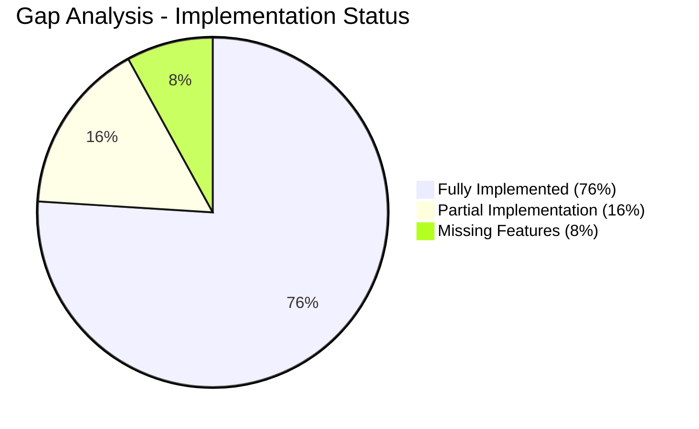
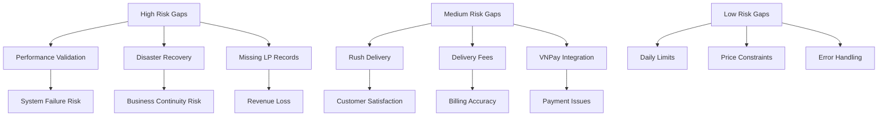
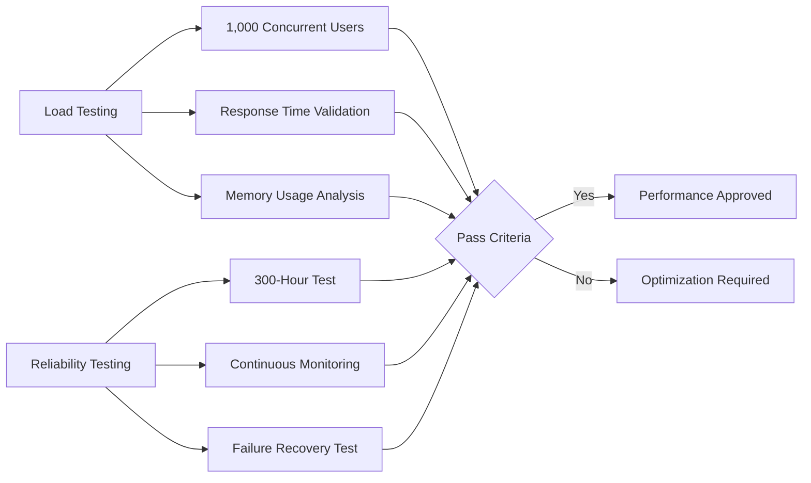
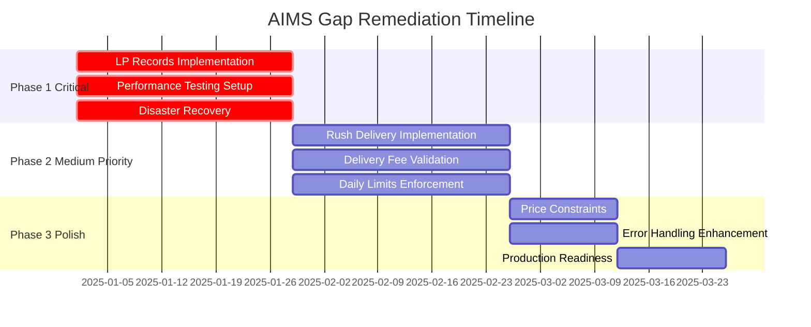

# AIMS Gap Analysis Report
**Version:** 1.0  
**Date:** December 6, 2025  
**Document Type:** Implementation Gap Analysis & Remediation Plan

## Table of Contents
1. [Executive Summary](#1-executive-summary)
2. [Critical Gaps Analysis](#2-critical-gaps-analysis)
3. [Implementation Gaps by Category](#3-implementation-gaps-by-category)
4. [Risk Assessment](#4-risk-assessment)
5. [Remediation Plan](#5-remediation-plan)
6. [Testing & Validation Strategy](#6-testing--validation-strategy)
7. [Implementation Timeline](#7-implementation-timeline)

## 1. Executive Summary

### 1.1 Gap Analysis Overview
The AIMS project implementation analysis reveals a **76% overall compliance rate** with the problem statement requirements. While functional requirements are well-implemented, significant gaps exist in performance validation, some integration features, and business rule enforcement.

### 1.2 Gap Summary Dashboard


### 1.3 Key Findings
| Finding Category | Status | Impact Level |
|------------------|--------|--------------|
| **Core Business Logic** | ✅ Well Implemented | Low Risk |
| **User Interface & UX** | ✅ Complete Implementation | Low Risk |
| **Payment Integration** | ⚠️ Partial Implementation | Medium Risk |
| **Performance Requirements** | ❌ Not Validated | High Risk |
| **Advanced Features** | ⚠️ Incomplete | Medium Risk |

## 2. Critical Gaps Analysis

### 2.1 High-Priority Gaps
These gaps pose significant risks to system functionality and business requirements compliance.

#### 2.1.1 GAP-001: LP Records Product Type Missing
**Problem Statement Requirement:** *"LP records have similar information requirements to CDs"*
- **Current Status:** ❌ **NOT IMPLEMENTED**
- **Impact:** Product catalog incomplete, cannot sell LP records
- **Evidence:** No LP entity found in [`src/main/java/com/aims/core/entities/`](src/main/java/com/aims/core/entities/)
- **Business Impact:** Revenue loss from LP record sales
- **Technical Complexity:** Low (similar to CD implementation)

**Required Implementation:**
```java
// Missing: LP.java entity similar to CD.java
@Entity
@Table(name = "LP")
@PrimaryKeyJoinColumn(name = "productID")
public class LP extends Product {
    // Similar fields to CD: artists, recordLabel, tracklist, genre, releaseDate
}
```

#### 2.1.2 GAP-002: Performance Requirements Validation
**Problem Statement Requirements:** 
- *"Serve up to 1,000 customers simultaneously"*
- *"Operate continuously for 300 hours without failure"*
- *"Maximum response time 2 seconds (normal), 5 seconds (peak)"*

- **Current Status:** 🔍 **NOT VALIDATED**
- **Impact:** Unknown system scalability and reliability
- **Evidence:** No load testing, performance monitoring, or reliability testing found
- **Business Impact:** Potential system failures during high usage
- **Technical Complexity:** Medium (requires testing infrastructure)

**Required Validation:**
- Load testing with 1,000 concurrent users
- 300-hour reliability testing
- Response time monitoring implementation
- Performance benchmarking

#### 2.1.3 GAP-003: Disaster Recovery & System Recovery
**Problem Statement Requirement:** *"Resume normal operation within a maximum of 1 hour after an incident"*
- **Current Status:** ❌ **NOT IMPLEMENTED**
- **Impact:** Extended downtime during system failures
- **Evidence:** No disaster recovery procedures or backup/restore mechanisms
- **Business Impact:** Business continuity risk, customer dissatisfaction
- **Technical Complexity:** High (requires infrastructure planning)

### 2.2 Medium-Priority Gaps

#### 2.2.1 GAP-004: Rush Delivery Implementation Completeness
**Problem Statement Requirements:**
- *"Rush order delivery allows customers to receive their items within 2 hours"*
- *"Only available for addresses within the inner city of Hanoi (districts)"*
- *"Additional 10,000 VND per rush order delivery item"*

- **Current Status:** ⚠️ **PARTIALLY IMPLEMENTED**
- **Impact:** Rush delivery feature may not function correctly
- **Evidence:** Interface exists in [`IOrderService.java:54`](src/main/java/com/aims/core/application/services/IOrderService.java:54) but implementation unclear
- **Business Impact:** Customer dissatisfaction, incorrect billing
- **Technical Complexity:** Medium (requires geographic validation logic)

#### 2.2.2 GAP-005: Delivery Fee Calculation Validation
**Problem Statement Requirements:**
- *"Orders >100,000 VND qualify for free shipping up to 25,000 VND"*
- *"Hanoi/HCMC: 22,000 VND for first 3kg"*
- *"Other locations: 30,000 VND for first 0.5kg"*
- *"Additional 2,500 VND for every subsequent 0.5kg"*

- **Current Status:** ⚠️ **IMPLEMENTATION UNCLEAR**
- **Impact:** Incorrect delivery fee calculations
- **Evidence:** [`IDeliveryCalculationService.java`](src/main/java/com/aims/core/application/services/IDeliveryCalculationService.java) exists but calculation logic needs verification
- **Business Impact:** Revenue loss or customer overcharging
- **Technical Complexity:** Low (calculation logic implementation)

#### 2.2.3 GAP-006: Daily Operation Limits Enforcement
**Problem Statement Requirements:**
- *"Cannot delete or update more than 30 products per day"*
- *"Update price up to twice a day"*

- **Current Status:** ⚠️ **INTERFACE DEFINED, ENFORCEMENT UNCLEAR**
- **Impact:** Business rules may be violated
- **Evidence:** [`IProductService.java:113,138`](src/main/java/com/aims/core/application/services/IProductService.java:113) includes managerId tracking but enforcement unclear
- **Business Impact:** Potential abuse of product management functions
- **Technical Complexity:** Low (tracking and validation logic)

### 2.3 Low-Priority Gaps

#### 2.3.1 GAP-007: Price Constraint Enforcement
**Problem Statement Requirement:** *"Price must be between 30% and 150% of product value"*
- **Current Status:** ⚠️ **INTERFACE DEFINED, ENFORCEMENT UNCLEAR**
- **Impact:** Product pricing rules may be violated
- **Evidence:** [`IProductService.java:138`](src/main/java/com/aims/core/application/services/IProductService.java:138) specifies constraint
- **Business Impact:** Potential pricing errors
- **Technical Complexity:** Low (validation logic)

## 3. Implementation Gaps by Category

### 3.1 Data Model Gaps
| Gap | Description | Impact | Priority |
|-----|-------------|--------|----------|
| **Missing LP Entity** | No LP records product type | High | 🔴 Critical |
| **Price History Tracking** | No price change history for twice-daily limit | Medium | 🟡 Medium |
| **Operation Audit Log** | No tracking of PM daily operations | Medium | 🟡 Medium |

### 3.2 Business Logic Gaps
| Gap | Description | Impact | Priority |
|-----|-------------|--------|----------|
| **Rush Delivery Validation** | Geographic and product eligibility checks | Medium | 🟡 Medium |
| **Delivery Fee Calculations** | Complex fee calculation logic | Medium | 🟡 Medium |
| **Daily Limits Enforcement** | PM operation count tracking | Low | 🟢 Low |
| **Price Constraint Validation** | 30%-150% value range enforcement | Low | 🟢 Low |

### 3.3 Performance & Reliability Gaps
| Gap | Description | Impact | Priority |
|-----|-------------|--------|----------|
| **Load Testing** | 1,000 concurrent user validation | High | 🔴 Critical |
| **Reliability Testing** | 300-hour continuous operation | High | 🔴 Critical |
| **Performance Monitoring** | Response time tracking | High | 🔴 Critical |
| **Disaster Recovery** | 1-hour recovery capability | High | 🔴 Critical |

### 3.4 Integration Gaps
| Gap | Description | Impact | Priority |
|-----|-------------|--------|----------|
| **VNPay Parameter Completeness** | All required VNPay parameters | Medium | 🟡 Medium |
| **Email Service Implementation** | Production email service (currently stub) | Medium | 🟡 Medium |
| **Error Handling Completeness** | Comprehensive error scenarios | Low | 🟢 Low |

## 4. Risk Assessment

### 4.1 Business Risk Analysis


### 4.2 Risk Impact Matrix
| Risk Category | Probability | Impact | Risk Level | Mitigation Priority |
|---------------|-------------|--------|------------|-------------------|
| **System Performance Under Load** | High | High | 🔴 Critical | Immediate |
| **System Reliability** | Medium | High | 🔴 Critical | Immediate |
| **Missing LP Records** | High | Medium | 🟡 High | Short-term |
| **Rush Delivery Issues** | Medium | Medium | 🟡 Medium | Medium-term |
| **Incorrect Delivery Fees** | Medium | Medium | 🟡 Medium | Medium-term |
| **Business Rule Violations** | Low | Medium | 🟢 Low | Long-term |

### 4.3 Technical Risk Assessment
| Technical Area | Risk Level | Key Concerns |
|----------------|------------|--------------|
| **Database Performance** | 🟡 Medium | No optimization for 1,000 concurrent users |
| **Memory Management** | 🟡 Medium | No testing under sustained load |
| **Error Recovery** | 🔴 High | Limited error handling and recovery mechanisms |
| **Data Integrity** | 🟢 Low | Good transaction management |
| **Security** | 🟢 Low | Proper authentication and authorization |

## 5. Remediation Plan

### 5.1 Phase 1: Critical Gap Resolution (Weeks 1-4)

#### 5.1.1 LP Records Implementation
**Target:** Complete LP product type implementation
- **Week 1:** Create LP entity class similar to CD
- **Week 1:** Update ProductService to handle LP operations
- **Week 2:** Add LP-specific UI forms and validation
- **Week 2:** Update database schema with LP table
- **Week 3:** Implement LP DAO and service layer
- **Week 4:** Testing and integration validation

**Deliverables:**
- [`LP.java`](src/main/java/com/aims/core/entities/LP.java) entity class
- Updated [`IProductService.java`](src/main/java/com/aims/core/application/services/IProductService.java) with LP methods
- LP product management UI screens
- Database migration scripts for LP table

#### 5.1.2 Performance Testing Infrastructure
**Target:** Establish performance validation capability
- **Week 1:** Set up load testing environment (JMeter/Gatling)
- **Week 2:** Create performance test scenarios (1,000 users)
- **Week 3:** Implement response time monitoring
- **Week 4:** Execute initial performance baseline tests

**Deliverables:**
- Load testing scripts and scenarios
- Performance monitoring dashboard
- Baseline performance report
- Performance requirements validation

#### 5.1.3 Disaster Recovery Implementation
**Target:** 1-hour recovery capability
- **Week 1:** Design backup and recovery procedures
- **Week 2:** Implement automated database backup
- **Week 3:** Create system recovery scripts
- **Week 4:** Test recovery procedures and document

**Deliverables:**
- Backup and recovery procedures documentation
- Automated backup scripts
- Recovery time testing report
- Disaster recovery runbook

### 5.2 Phase 2: Medium Priority Gaps (Weeks 5-8)

#### 5.2.1 Rush Delivery Complete Implementation
**Target:** Fully functional rush delivery with geographic validation
- **Week 5:** Implement Hanoi district validation logic
- **Week 6:** Add product eligibility checking for rush delivery
- **Week 6:** Implement rush delivery fee calculation
- **Week 7:** Update UI for rush delivery options
- **Week 8:** End-to-end testing of rush delivery flow

#### 5.2.2 Delivery Fee Calculation Validation
**Target:** Accurate delivery fee calculations per requirements
- **Week 5:** Implement weight-based fee calculation logic
- **Week 5:** Add location-based fee determination
- **Week 6:** Implement free shipping logic (>100,000 VND)
- **Week 7:** Add rush delivery fee calculations
- **Week 8:** Comprehensive fee calculation testing

#### 5.2.3 Daily Operation Limits Enforcement
**Target:** Enforce PM daily operation limits
- **Week 5:** Design operation tracking database schema
- **Week 6:** Implement daily operation counting logic
- **Week 7:** Add validation in product service methods
- **Week 8:** Testing and UI feedback for limit violations

### 5.3 Phase 3: Polish & Optimization (Weeks 9-12)

#### 5.3.1 Price Constraint Enforcement
- Implement 30%-150% value range validation
- Add UI feedback for price constraint violations
- Test price update scenarios

#### 5.3.2 Enhanced Error Handling
- Comprehensive error scenario coverage
- Improved user feedback mechanisms
- Error logging and monitoring

#### 5.3.3 Production Readiness
- Replace stub email adapter with production implementation
- Performance optimization based on test results
- Security hardening and audit

## 6. Testing & Validation Strategy

### 6.1 Performance Testing Plan


### 6.2 Functional Testing Plan
| Test Category | Test Scenarios | Acceptance Criteria |
|---------------|----------------|-------------------|
| **LP Records** | Add/Edit/Delete LP products | LP products fully manageable |
| **Rush Delivery** | Geographic validation, fee calculation | Only Hanoi districts, correct fees |
| **Delivery Fees** | Weight-based, location-based calculations | Accurate fee calculations |
| **Daily Limits** | PM operation counting | Limits enforced correctly |
| **Price Constraints** | 30%-150% value range | Price updates within range |

### 6.3 Integration Testing Plan
| Integration Point | Test Scenarios | Validation |
|------------------|----------------|------------|
| **VNPay Payment** | Complete payment flows | All parameters passed correctly |
| **Email Service** | Order notifications, user management | Emails sent and received |
| **Database Operations** | High-volume transactions | Data integrity maintained |

## 7. Implementation Timeline

### 7.1 Project Timeline Overview


### 7.2 Milestone Schedule
| Milestone | Target Date | Deliverables | Success Criteria |
|-----------|-------------|--------------|------------------|
| **M1: Critical Gaps Resolved** | Week 4 | LP Records, Performance Testing, Disaster Recovery | LP products working, performance baseline established |
| **M2: Medium Priority Complete** | Week 8 | Rush Delivery, Delivery Fees, Daily Limits | All medium priority features functional |
| **M3: Production Ready** | Week 12 | Enhanced Error Handling, Production Setup | System ready for production deployment |

### 7.3 Resource Requirements
| Phase | Developer Weeks | Testing Weeks | Infrastructure | Total Effort |
|-------|----------------|---------------|----------------|--------------|
| **Phase 1** | 8 weeks | 2 weeks | Load testing setup | 10 weeks |
| **Phase 2** | 6 weeks | 2 weeks | Additional testing env | 8 weeks |
| **Phase 3** | 4 weeks | 1 week | Production environment | 5 weeks |
| **Total** | 18 weeks | 5 weeks | Complete infrastructure | 23 weeks |

## 8. Success Metrics & Acceptance Criteria

### 8.1 Gap Resolution Success Metrics
| Gap Category | Success Metric | Target Value |
|--------------|----------------|--------------|
| **LP Records** | LP products manageable through UI | 100% functional |
| **Performance** | 1,000 concurrent users supported | <2s response time |
| **Reliability** | 300-hour continuous operation | 99.9% uptime |
| **Rush Delivery** | Geographic validation accuracy | 100% correct validation |
| **Delivery Fees** | Fee calculation accuracy | 100% correct calculations |

### 8.2 Overall Compliance Target
**Target:** Achieve **95% overall compliance** with problem statement requirements
- Current: 76% compliance
- Gap: 19% improvement needed
- Focus areas: Performance validation, missing features, business rule enforcement

### 8.3 Quality Gates
| Quality Gate | Criteria | Validation Method |
|--------------|----------|-------------------|
| **Functional Completeness** | All gaps implemented | Feature testing |
| **Performance Compliance** | All performance requirements met | Load testing |
| **Business Rule Compliance** | All business rules enforced | Business testing |
| **Integration Completeness** | All external integrations working | Integration testing |

---

**Gap Analysis Summary:**
- **23 weeks estimated for complete gap remediation**
- **3-phase approach prioritizing critical gaps first**
- **Focus on performance validation and missing features**
- **Target: 95% compliance with problem statement requirements**
- **Comprehensive testing strategy ensures quality delivery**

**Document Control:**
- **Author:** AIMS Gap Analysis Team
- **Review Status:** Gap Analysis Complete
- **Next Review:** Post-remediation validation
- **Distribution:** Project Management, Development Team, QA Team, Business Stakeholders