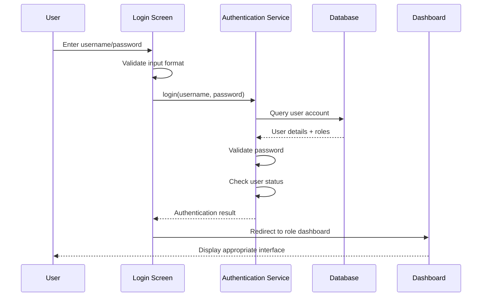
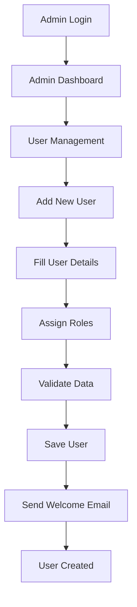
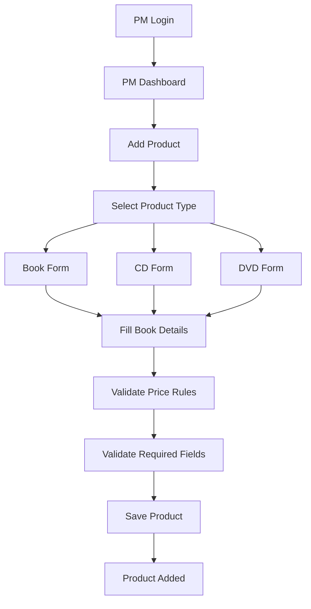
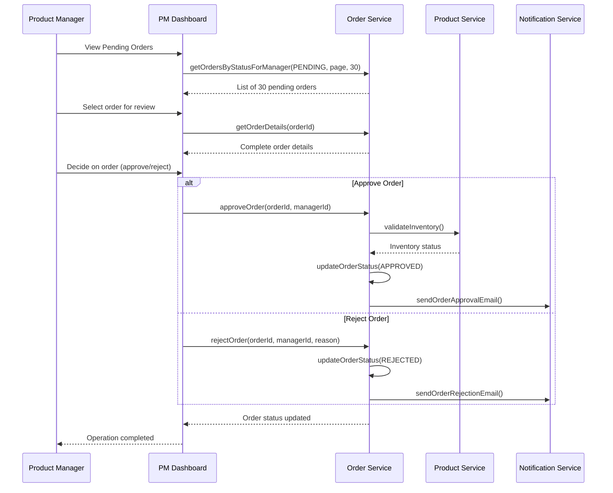
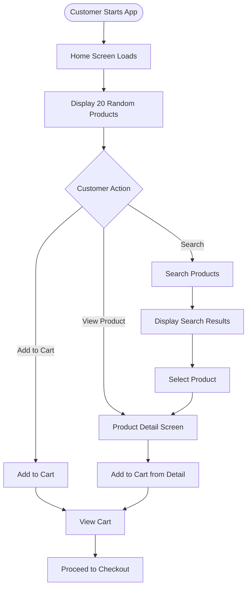
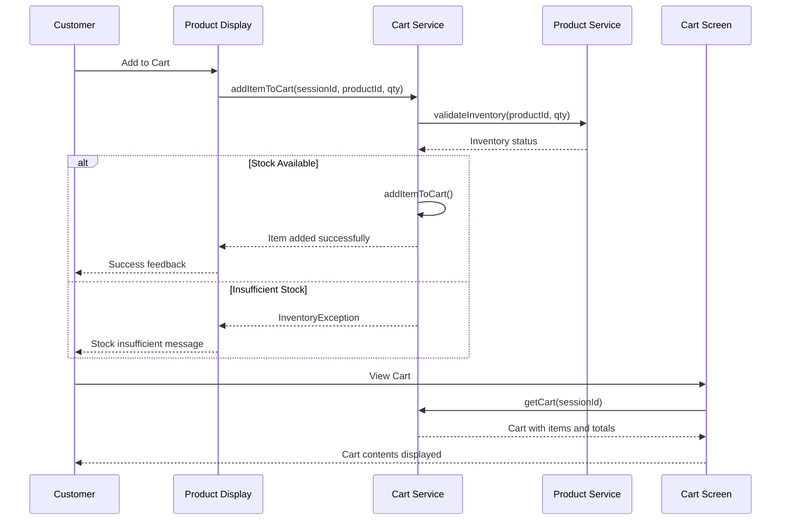
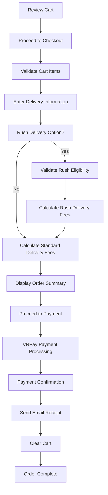

# AIMS Operational Procedures Guide
**Version:** 1.0  
**Date:** December 6, 2025  
**Document Type:** Step-by-Step Execution Guide

## Table of Contents
1. [System Startup Procedures](#1-system-startup-procedures)
2. [User Operation Procedures](#2-user-operation-procedures)
3. [Administrator Procedures](#3-administrator-procedures)
4. [Product Manager Procedures](#4-product-manager-procedures)
5. [Customer Operation Procedures](#5-customer-operation-procedures)
6. [System Maintenance Procedures](#6-system-maintenance-procedures)
7. [Troubleshooting Procedures](#7-troubleshooting-procedures)

## 1. System Startup Procedures

### 1.1 Application Startup Sequence
**Objective:** Launch AIMS application correctly with all dependencies initialized

#### Step-by-Step Startup Process
```mermaid
flowchart TD
    Start([Application Start]) --> Main[Main.main()]
    Main --> Launch[Application.launch()]
    Launch --> Init[AimsApp.init()]
    Init --> Factory[ServiceFactory.getInstance()]
    Factory --> InitDeps[initializeDependencies()]
    InitDeps --> StartMethod[AimsApp.start()]
    StartMethod --> LoadFXML[Load MainLayout FXML]
    LoadFXML --> InjectDeps[Inject Dependencies]
    InjectDeps --> ShowWindow[primaryStage.show()]
    ShowWindow --> Complete[CompleteInitialization]
    Complete --> Ready([System Ready])
```

#### Execution Steps
| Step | Action | File/Method | Expected Result |
|------|--------|-------------|-----------------|
| **1** | Launch application | [`Main.java:17`](src/main/java/com/aims/Main.java:17) | JavaFX runtime starts |
| **2** | Initialize ServiceFactory | [`AimsApp.java:35`](src/main/java/com/aims/AimsApp.java:35) | All services created |
| **3** | Load main layout | [`AimsApp.java:47`](src/main/java/com/aims/AimsApp.java:47) | FXML loaded successfully |
| **4** | Configure window | [`AimsApp.java:88`](src/main/java/com/aims/AimsApp.java:88) | Window sized and positioned |
| **5** | Inject dependencies | [`AimsApp.java:114`](src/main/java/com/aims/AimsApp.java:114) | Services injected into controllers |
| **6** | Show window | [`AimsApp.java:119`](src/main/java/com/aims/AimsApp.java:119) | Application window visible |
| **7** | Complete initialization | [`AimsApp.java:122`](src/main/java/com/aims/AimsApp.java:122) | Home screen loaded |

#### Verification Checklist
- [ ] Window displays with proper size and positioning
- [ ] Home screen shows 20 random products
- [ ] No error messages in console
- [ ] CSS styles applied correctly
- [ ] Navigation menu responsive

### 1.2 Database Initialization
**Objective:** Ensure database schema and initial data are properly set up

#### Database Setup Process
| Step | Action | Location | Command/Method |
|------|--------|----------|----------------|
| **1** | Check database exists | Project root | Verify SQLite file presence |
| **2** | Run schema migration | [`V1__create_tables.sql`](src/main/java/com/aims/core/infrastructure/database/scripts/V1__create_tables.sql) | Execute DDL scripts |
| **3** | Seed initial data | [`V2__seed_initial_data.sql`](src/main/java/com/aims/core/infrastructure/database/scripts/V2__seed_initial_data.sql) | Insert master data |
| **4** | Verify connectivity | [`DatabaseConfig.java`](src/main/java/com/aims/core/infrastructure/config/DatabaseConfig.java) | Test connection |

#### Database Verification Commands
```sql
-- Verify tables exist
SELECT name FROM sqlite_master WHERE type='table';

-- Check product data
SELECT COUNT(*) FROM PRODUCT;
SELECT COUNT(*) FROM BOOK;
SELECT COUNT(*) FROM CD;
SELECT COUNT(*) FROM DVD;

-- Verify user accounts
SELECT userId, username, userRole FROM USER_ACCOUNT;
```

## 2. User Operation Procedures

### 2.1 Authentication Procedures
**Objective:** Secure login process for administrators and product managers

#### Login Process Flow


#### Login Steps
| Step | Action | UI Element | Validation |
|------|--------|------------|------------|
| **1** | Open login screen | [`login_screen.fxml`](src/main/resources/com/aims/presentation/views/login_screen.fxml) | Screen loads properly |
| **2** | Enter username | Username text field | Non-empty, valid format |
| **3** | Enter password | Password field | Non-empty, minimum length |
| **4** | Click Login | Login button | Form validation passes |
| **5** | System validates | [`LoginScreenController.java`](src/main/java/com/aims/core/presentation/controllers/LoginScreenController.java) | Credentials verified |
| **6** | Redirect to dashboard | Based on user role | Appropriate dashboard loads |

#### Error Handling
| Error Condition | Error Message | Resolution Steps |
|----------------|---------------|------------------|
| **Invalid username** | "Username not found" | Check username spelling, contact admin |
| **Wrong password** | "Invalid password" | Re-enter password, use reset if needed |
| **Account blocked** | "Account is blocked" | Contact administrator |
| **No role assigned** | "Insufficient privileges" | Contact administrator for role assignment |

### 2.2 Password Management
**Objective:** Secure password change and reset procedures

#### Password Change Process
| Step | Action | Implementation | Notes |
|------|--------|----------------|-------|
| **1** | Access change password | [`change_password_screen.fxml`](src/main/resources/com/aims/presentation/views/change_password_screen.fxml) | Requires current login |
| **2** | Enter current password | [`ChangePasswordController.java`](src/main/java/com/aims/core/presentation/controllers/ChangePasswordController.java) | Verification required |
| **3** | Enter new password | Password field with validation | Min 8 chars, complexity rules |
| **4** | Confirm new password | Confirmation field | Must match new password |
| **5** | Submit change | Password update service | Database updated securely |

## 3. Administrator Procedures

### 3.1 User Account Management
**Objective:** Complete user lifecycle management for administrators

#### Create New User Process


#### User Creation Steps
| Step | Action | Screen/Controller | Required Fields |
|------|--------|-------------------|-----------------|
| **1** | Navigate to user management | [`admin_dashboard_screen.fxml`](src/main/resources/com/aims/presentation/views/admin_dashboard_screen.fxml) | Admin authentication |
| **2** | Click "Add User" | [`admin_user_management_screen.fxml`](src/main/resources/com/aims/presentation/views/admin_user_management_screen.fxml) | Button available |
| **3** | Fill user form | [`admin_add_user_form.fxml`](src/main/resources/com/aims/presentation/views/admin_add_user_form.fxml) | Username, email, full name |
| **4** | Set initial password | Password generation | Secure temporary password |
| **5** | Assign user roles | Role selection | At least one role required |
| **6** | Set user status | Status dropdown | Active/Inactive |
| **7** | Save user | [`EditUserFormController.java`](src/main/java/com/aims/core/presentation/controllers/EditUserFormController.java) | Validation and persistence |
| **8** | Send notification | [`INotificationService.java`](src/main/java/com/aims/core/application/services/INotificationService.java) | Welcome email sent |

#### User Role Assignment
| Role | Permissions | Assignment Method |
|------|-------------|-------------------|
| **Administrator** | Full system access | [`UserRole.ADMIN`](src/main/java/com/aims/core/enums/UserRole.java) |
| **Product Manager** | Product and order management | [`UserRole.PRODUCT_MANAGER`](src/main/java/com/aims/core/enums/UserRole.java) |
| **Multiple Roles** | Combined permissions | Multiple selection allowed |

#### User Account Operations
| Operation | Steps | Validation | Result |
|-----------|-------|------------|--------|
| **View Users** | Admin Dashboard → User Management | Admin role required | User list displayed |
| **Edit User** | Select user → Edit form | User exists | Updated user details |
| **Block User** | Select user → Block action | Confirmation required | User status = BLOCKED |
| **Reset Password** | Select user → Reset action | Email verification | New password sent |
| **Delete User** | Select user → Delete action | Confirmation + dependency check | User removed |

### 3.2 System Configuration
**Objective:** Configure system-wide settings and parameters

#### Configuration Areas
| Area | Configuration File | Purpose | Access Method |
|------|-------------------|---------|---------------|
| **Application** | [`app.properties`](src/main/resources/app.properties) | General app settings | Direct file edit |
| **Database** | [`DatabaseConfig.java`](src/main/java/com/aims/core/infrastructure/config/DatabaseConfig.java) | DB connection params | Code configuration |
| **VNPay** | [`vnpay_config.properties`](src/main/resources/vnpay_config.properties) | Payment gateway settings | Property file |
| **Logging** | [`logback.xml`](src/main/resources/logback.xml) | Log levels and output | XML configuration |

## 4. Product Manager Procedures

### 4.1 Product Management Operations
**Objective:** Complete product lifecycle management following business rules

#### Add Product Process


#### Product Addition Steps
| Step | Action | Controller/Screen | Validation Rules |
|------|--------|-------------------|------------------|
| **1** | Login as PM | [`login_screen.fxml`](src/main/resources/com/aims/presentation/views/login_screen.fxml) | Product Manager role |
| **2** | Access PM Dashboard | [`pm_dashboard_screen.fxml`](src/main/resources/com/aims/presentation/views/pm_dashboard_screen.fxml) | Authentication verified |
| **3** | Navigate to Add Product | [`admin_add_edit_product_screen.fxml`](src/main/resources/com/aims/presentation/views/admin_add_edit_product_screen.fxml) | Form loads |
| **4** | Select product type | Product type dropdown | Book/CD/DVD selection |
| **5** | Fill common fields | [`AdminAddEditProductController.java`](src/main/java/com/aims/core/presentation/controllers/AdminAddEditProductController.java) | Title, category, value, price |
| **6** | Fill type-specific fields | Dynamic form sections | Based on product type |
| **7** | Validate business rules | [`IProductService.java`](src/main/java/com/aims/core/application/services/IProductService.java) | Price constraints, required fields |
| **8** | Save product | Service layer | Database persistence |

#### Business Rule Enforcement
| Rule | Implementation | Validation Method |
|------|----------------|-------------------|
| **Price 30%-150% of value** | [`IProductService.java:138`](src/main/java/com/aims/core/application/services/IProductService.java:138) | `updateProductPrice()` validation |
| **One product at a time** | UI behavior | Form prevents multiple operations |
| **Required fields by type** | Form validation | Type-specific field requirements |
| **Unique barcode** | Database constraint | Uniqueness validation |

#### Product Type-Specific Fields
**Book Requirements:**
- Authors (required)
- Cover type (required)
- Publisher (required)  
- Publication date (required)
- Number of pages (optional)
- Language (optional)
- Genre (optional)

**CD Requirements:**
- Artists (required)
- Record label (required)
- Tracklist (required)
- Genre (required)
- Release date (optional)

**DVD Requirements:**
- Disc type (required)
- Director (required)
- Runtime (required)
- Studio (required)
- Language (required)
- Subtitles (required)
- Release date (optional)
- Genre (optional)

### 4.2 Order Review Process
**Objective:** Review and process customer orders efficiently

#### Order Review Workflow


#### Order Review Steps
| Step | Action | Screen/Function | Business Rules |
|------|--------|-----------------|----------------|
| **1** | Access pending orders | [`pm_pending_orders_list_screen.fxml`](src/main/resources/com/aims/presentation/views/pm_pending_orders_list_screen.fxml) | 30 orders per page |
| **2** | Select order | Order list click | Order details load |
| **3** | Review order details | [`pm_order_review_screen.fxml`](src/main/resources/com/aims/presentation/views/pm_order_review_screen.fxml) | Complete order information |
| **4** | Check inventory | [`IOrderService.java:147`](src/main/java/com/aims/core/application/services/IOrderService.java:147) | Stock availability validation |
| **5** | Make decision | Approve/Reject buttons | Business justification |
| **6** | Confirm action | Confirmation dialog | Action cannot be undone |
| **7** | System updates | Order status change | Customer notification sent |

#### Order Decision Criteria
| Decision | Criteria | Actions Required |
|----------|----------|------------------|
| **Approve** | ✅ Stock available<br>✅ Payment confirmed<br>✅ Address valid | Update status to APPROVED<br>Reserve inventory<br>Send approval email |
| **Reject** | ❌ Stock unavailable<br>❌ Address invalid<br>❌ Suspicious order | Update status to REJECTED<br>Process refund<br>Send rejection email |

### 4.3 Inventory Management
**Objective:** Maintain accurate product inventory levels

#### Inventory Update Process
| Step | Action | Implementation | Validation |
|------|--------|----------------|------------|
| **1** | Access product list | Product management screen | View current stock levels |
| **2** | Select product | Product selection | Product exists |
| **3** | Update stock quantity | [`IProductService.java:150`](src/main/java/com/aims/core/application/services/IProductService.java:150) | `updateProductStock()` |
| **4** | Validate quantity | Business rules | Non-negative stock |
| **5** | Save changes | Database update | Transaction committed |

## 5. Customer Operation Procedures

### 5.1 Product Browsing and Search
**Objective:** Enable customers to find and view products effectively

#### Browse Products Process


#### Product Browsing Steps
| Step | Action | Screen/Controller | Expected Result |
|------|--------|-------------------|-----------------|
| **1** | Launch application | [`home_screen.fxml`](src/main/resources/com/aims/presentation/views/home_screen.fxml) | 20 random products display |
| **2** | Browse product grid | [`HomeScreenController.java`](src/main/java/com/aims/core/presentation/controllers/HomeScreenController.java) | Product cards with images/prices |
| **3** | Click product for details | [`product_detail_screen.fxml`](src/main/resources/com/aims/presentation/views/product_detail_screen.fxml) | Detailed product information |
| **4** | Search products | [`ProductSearchResultsController.java`](src/main/java/com/aims/core/presentation/controllers/ProductSearchResultsController.java) | Filtered results displayed |
| **5** | Sort by price | Sort controls | Ascending/descending price order |

#### Search Functionality
| Search Type | Implementation | Parameters |
|-------------|----------------|------------|
| **Basic Search** | [`IProductService.java:178`](src/main/java/com/aims/core/application/services/IProductService.java:178) | Search term, category |
| **Advanced Search** | [`IProductService.java:204`](src/main/java/com/aims/core/application/services/IProductService.java:204) | Keyword, category, sort options |
| **Price Sorting** | Service layer | ASC/DESC price ordering |
| **Category Filter** | Category dropdown | Product type filtering |

### 5.2 Shopping Cart Management
**Objective:** Manage shopping cart contents with inventory validation

#### Cart Operations


#### Cart Management Steps
| Step | Action | Implementation | Validation |
|------|--------|----------------|------------|
| **1** | Add item to cart | [`ICartService.java:46`](src/main/java/com/aims/core/application/services/ICartService.java:46) | Stock availability check |
| **2** | View cart contents | [`cart_screen.fxml`](src/main/resources/com/aims/presentation/views/cart_screen.fxml) | Cart items and totals |
| **3** | Update quantities | [`ICartService.java:73`](src/main/java/com/aims/core/application/services/ICartService.java:73) | Inventory revalidation |
| **4** | Remove items | [`ICartService.java:57`](src/main/java/com/aims/core/application/services/ICartService.java:57) | Item removal |
| **5** | View totals | Cart display | Prices excluding VAT |

#### Cart Business Rules
| Rule | Implementation | Validation |
|------|----------------|------------|
| **One cart per session** | Session-based cart storage | Session ID tracking |
| **Inventory validation** | Real-time stock checking | `InventoryException` handling |
| **VAT excluded totals** | Price calculation | 10% VAT added at display |
| **Stock warnings** | Insufficient inventory alerts | Clear user feedback |

### 5.3 Order Placement Process
**Objective:** Complete order processing from cart to payment confirmation

#### Order Flow Process


#### Order Placement Steps
| Step | Action | Screen/Controller | Business Logic |
|------|--------|-------------------|----------------|
| **1** | Review cart | [`cart_screen.fxml`](src/main/resources/com/aims/presentation/views/cart_screen.fxml) | Validate cart not empty |
| **2** | Initiate checkout | [`IOrderService.java:39`](src/main/java/com/aims/core/application/services/IOrderService.java:39) | `initiateOrderFromCart()` |
| **3** | Enter delivery info | [`delivery_info_screen.fxml`](src/main/resources/com/aims/presentation/views/delivery_info_screen.fxml) | Required fields validation |
| **4** | Calculate fees | [`IOrderService.java:68`](src/main/java/com/aims/core/application/services/IOrderService.java:68) | Weight and location-based |
| **5** | Review order summary | [`order_summary_screen.fxml`](src/main/resources/com/aims/presentation/views/order_summary_screen.fxml) | Final order details |
| **6** | Process payment | [`IPaymentService.java:34`](src/main/java/com/aims/core/application/services/IPaymentService.java:34) | VNPay integration |
| **7** | Confirm order | [`payment_result_screen.fxml`](src/main/resources/com/aims/presentation/views/payment_result_screen.fxml) | Success confirmation |

#### Delivery Information Requirements
| Field | Validation | Required |
|-------|------------|----------|
| **Recipient Name** | Non-empty string | ✅ Yes |
| **Email Address** | Valid email format | ✅ Yes |
| **Phone Number** | Valid phone format | ✅ Yes |
| **Province/City** | Selection from list | ✅ Yes |
| **Delivery Address** | Complete address | ✅ Yes |
| **Delivery Instructions** | Optional text | ❌ No |

#### Delivery Fee Calculation
| Location | Base Fee | Weight Calculation |
|----------|----------|-------------------|
| **Hanoi/HCMC Inner City** | 22,000 VND (first 3kg) | +2,500 VND per additional 0.5kg |
| **Other Locations** | 30,000 VND (first 0.5kg) | +2,500 VND per additional 0.5kg |
| **Rush Delivery** | +10,000 VND per item | Only Hanoi inner districts |
| **Free Shipping** | Orders >100,000 VND | Max 25,000 VND discount |

## 6. System Maintenance Procedures

### 6.1 Database Maintenance
**Objective:** Ensure database performance and data integrity

#### Regular Maintenance Tasks
| Task | Frequency | Command/Action | Purpose |
|------|-----------|----------------|---------|
| **Database Backup** | Daily | Copy SQLite file | Data protection |
| **Vacuum Database** | Weekly | `VACUUM;` | Reclaim space |
| **Analyze Statistics** | Weekly | `ANALYZE;` | Query optimization |
| **Check Integrity** | Monthly | `PRAGMA integrity_check;` | Data validation |

### 6.2 Log Management
**Objective:** Maintain application logs for monitoring and debugging

#### Log File Management
| Log Type | Location | Retention | Purpose |
|----------|----------|-----------|---------|
| **Application Logs** | `logs/application.log` | 30 days | General app events |
| **Error Logs** | `logs/error.log` | 90 days | Error tracking |
| **Performance Logs** | `logs/performance.log` | 7 days | Performance monitoring |
| **Security Logs** | `logs/security.log` | 365 days | Security events |

## 7. Troubleshooting Procedures

### 7.1 Common Issues and Resolutions

#### Application Startup Issues
| Issue | Symptoms | Resolution Steps |
|-------|----------|------------------|
| **Database Connection Failed** | Error on startup | 1. Check database file exists<br>2. Verify file permissions<br>3. Run database setup scripts |
| **FXML Loading Error** | UI doesn't load | 1. Check FXML file paths<br>2. Verify controller classes<br>3. Validate FXML syntax |
| **Service Injection Failure** | NullPointerException | 1. Check ServiceFactory initialization<br>2. Verify dependency order<br>3. Review constructor parameters |

#### Authentication Issues
| Issue | Symptoms | Resolution Steps |
|-------|----------|------------------|
| **Login Fails** | Invalid credentials error | 1. Verify username/password<br>2. Check user account status<br>3. Validate user roles |
| **Session Expired** | Unexpected logout | 1. Check session timeout settings<br>2. Verify session management<br>3. Review authentication service |

#### Payment Processing Issues
| Issue | Symptoms | Resolution Steps |
|-------|----------|------------------|
| **VNPay Connection Error** | Payment fails | 1. Check VNPay configuration<br>2. Verify network connectivity<br>3. Validate API credentials |
| **Payment Timeout** | Long processing time | 1. Check payment service logs<br>2. Verify VNPay service status<br>3. Review timeout settings |

#### Performance Issues
| Issue | Symptoms | Resolution Steps |
|-------|----------|------------------|
| **Slow Product Loading** | Long page load times | 1. Check database queries<br>2. Review image loading<br>3. Optimize product service |
| **Memory Issues** | OutOfMemoryError | 1. Increase JVM heap size<br>2. Review object lifecycle<br>3. Check for memory leaks |

### 7.2 Emergency Procedures

#### System Recovery
| Emergency | Action Steps | Contact Information |
|-----------|-------------|-------------------|
| **Database Corruption** | 1. Stop application<br>2. Restore from backup<br>3. Verify data integrity<br>4. Restart application | Database Administrator |
| **Security Breach** | 1. Disable affected accounts<br>2. Review security logs<br>3. Change system passwords<br>4. Notify stakeholders | Security Team |
| **Payment System Down** | 1. Display maintenance message<br>2. Queue pending transactions<br>3. Contact VNPay support<br>4. Monitor system status | Payment Team |

---

**Operational Summary:**
- **Complete procedures for all user roles and system operations**
- **Step-by-step guidance with specific file references**
- **Business rule enforcement at each operation level**
- **Comprehensive troubleshooting and maintenance procedures**
- **Emergency response protocols for critical issues**

**Document Control:**
- **Author:** AIMS Operations Team
- **Review Status:** Operational Procedures Complete
- **Next Review:** Post-deployment feedback integration
- **Distribution:** Operations Team, Support Staff, End Users