# AIMS Project Debug & Run Assistance Plan

## Project Analysis Summary

**Project Type**: Dual-architecture AIMS e-commerce system
- **Java Backend**: Spring Boot REST API (port 8080) + JavaFX Desktop Application
- **React Frontend**: Vite-based web UI (port 3000) with TailwindCSS v4
- **Database**: SQLite with JPA/Hibernate
- **Payment Integration**: VNPay gateway implementation

## Identified Issues & Priority Matrix

### 🚨 **Critical Issues (Must Fix)**
1. **TailwindCSS v4 Configuration**: PostCSS import syntax in [`web-ui/src/index.css:10`] uses `@import "tailwindcss"` which conflicts with existing directives
2. **Java Version Mismatch**: Project requires Java 21, but startup script checks for Java 17
3. **Dual Main Classes**: Both JavaFX ([`src/main/java/com/aims/Main.java`]) and Spring Boot ([`src/main/java/com/aims/core/AimsWebApiApplication.java`]) entry points
4. **Database Dependencies**: Missing database initialization checks

### ⚠️ **Medium Priority Issues**
1. **Package Conflicts**: Both `@tailwindcss/postcss` and `tailwindcss` packages present
2. **CSS Import Structure**: Complex CSS import chain that needs validation
3. **Component Dependencies**: React components reference backend API endpoints that need verification

### ✅ **Good Configuration Found**
1. **PostCSS Configuration**: Already updated to use correct TailwindCSS v4 syntax
2. **Custom CSS Classes**: All missing utility classes properly defined in `index.css`
3. **Build Pipeline**: Comprehensive Vite configuration with proper chunking
4. **Maven Dependencies**: Complete dependency set for both JavaFX and Spring Boot

## 4-Phase Implementation Plan

```mermaid
graph TD
    A[AIMS Project Debug & Run] --> B[Phase 1: Environment Validation]
    A --> C[Phase 2: Backend Preparation]
    A --> D[Phase 3: Frontend Preparation] 
    A --> E[Phase 4: Integration Testing]
    
    B --> B1[Java Environment Check]
    B --> B2[Node.js Environment Check]
    B --> B3[System Dependencies]
    B --> B4[Port Availability]
    
    C --> C1[Database Setup & Migration]
    C --> C2[Spring Boot Configuration]
    C --> C3[JavaFX Application Check]
    C --> C4[VNPay Configuration]
    
    D --> D1[TailwindCSS v4 Fixes]
    D --> D2[Package Dependencies Cleanup]
    D --> D3[CSS Import Resolution]
    D --> D4[React Component Validation]
    
    E --> E1[Backend API Testing]
    E --> E2[Frontend Integration]
    E --> E3[Cross-Component Communication]
    E --> E4[End-to-End Validation]
    
    B1 --> F[✅ Fully Functional System]
    B2 --> F
    B3 --> F
    B4 --> F
    C1 --> F
    C2 --> F
    C3 --> F
    C4 --> F
    D1 --> F
    D2 --> F
    D3 --> F
    D4 --> F
    E1 --> F
    E2 --> F
    E3 --> F
    E4 --> F
```



## Phase 1: Environment Validation (30 minutes)

### 1.1 System Requirements Check
**Objective**: Verify all required software is properly installed

**Tasks**:
- **Java**: Verify Java 21 installation and JAVA_HOME configuration
- **Node.js**: Verify Node.js 18+ and npm/yarn installation  
- **Maven**: Confirm Maven 3.8+ installation
- **Database**: Check SQLite availability and permissions

**Validation Commands**:
```bash
java -version                # Should show Java 21
echo $JAVA_HOME             # Should point to Java 21 installation
node --version              # Should show Node.js 18+
npm --version               # Should show npm 8+
mvn --version               # Should show Maven 3.8+
```

### 1.2 Dependency Verification
**Tasks**:
- **Maven Dependencies**: Validate all Java dependencies resolve
- **npm Dependencies**: Check for package conflicts and missing modules
- **Build Tools**: Ensure Maven and Vite work correctly

**Commands**:
```bash
mvn dependency:resolve      # Verify Java dependencies
cd web-ui && npm audit      # Check npm package security
mvn clean compile          # Test Java compilation
cd web-ui && npm run build  # Test frontend build
```

### 1.3 Port Availability Check
**Tasks**:
- **Port 8080**: Backend API server
- **Port 3000**: Frontend development server
- **Database Port**: SQLite file access permissions

**Commands**:
```bash
lsof -i :8080              # Check if port 8080 is free
lsof -i :3000              # Check if port 3000 is free
touch aims_database.db && rm aims_database.db  # Test SQLite permissions
```

### 1.4 File System Permissions
**Tasks**:
- Verify write permissions for database files
- Check FXML resource accessibility
- Validate CSS and asset file permissions

## Phase 2: Backend Preparation (45 minutes)

### 2.1 Database Setup & Migration
**Objective**: Initialize SQLite database with proper schema and sample data

**Critical Files**:
- [`src/main/java/com/aims/core/infrastructure/database/scripts/V1__create_tables.sql`]
- [`src/main/java/com/aims/core/infrastructure/database/scripts/V2__seed_initial_data.sql`]
- [`add_sample_data.sql`]

**Tasks**:
1. **Schema Creation**: Run database migration scripts
2. **Sample Data Loading**: Load initial product and user data
3. **Connection Testing**: Verify SQLite connectivity
4. **Foreign Key Validation**: Check referential integrity

**Implementation Steps**:
```bash
# Create database and run migrations
mvn flyway:migrate

# Verify database schema
sqlite3 aims_database.db ".schema"

# Load sample data
sqlite3 aims_database.db < add_sample_data.sql

# Test connection
mvn test -Dtest=DatabaseConnectionTest
```

### 2.2 Spring Boot Configuration
**Objective**: Ensure Spring Boot API server starts correctly

**Critical Files**:
- [`src/main/java/com/aims/core/AimsWebApiApplication.java`]
- [`src/main/java/com/aims/core/config/SecurityConfig.java`]
- [`src/main/java/com/aims/core/config/CorsConfig.java`]

**Tasks**:
1. **Application Properties**: Verify database URL and connection settings
2. **Security Configuration**: Check CORS settings for frontend integration
3. **Component Scanning**: Validate all beans are properly discovered
4. **API Endpoints**: Verify REST controller mappings

**Key Validations**:
- All `@ComponentScan` packages are accessible
- Database connection string points to correct SQLite file
- CORS configuration allows frontend origin (localhost:3000)
- Swagger documentation generates correctly

### 2.3 JavaFX Application Setup
**Objective**: Verify JavaFX desktop application can start

**Critical Files**:
- [`src/main/java/com/aims/Main.java`]
- [`src/main/java/com/aims/AimsApp.java`]
- [`src/main/resources/com/aims/presentation/views/*.fxml`]

**Tasks**:
1. **FXML Resources**: Verify all FXML files are accessible
2. **JavaFX Runtime**: Ensure JavaFX modules are properly configured  
3. **Screen Controllers**: Check controller dependency injection
4. **Scene Navigation**: Test FXML scene transitions

**Key Areas**:
- JavaFX module path configuration in [`pom.xml`]
- FXML file loading in controllers
- Scene graph initialization
- Event handling setup

### 2.4 Payment Gateway Configuration
**Objective**: Configure VNPay integration for payment processing

**Critical Files**:
- [`src/main/java/com/aims/core/infrastructure/adapters/external/payment_gateway/VNPayConfig.java`]
- [`src/main/java/com/aims/core/infrastructure/adapters/external/payment_gateway/VNPayAdapterImpl.java`]

**Tasks**:
1. **VNPay Configuration**: Verify sandbox credentials and endpoints
2. **Payment Flow**: Test payment processing workflow
3. **Error Handling**: Validate payment error scenarios
4. **Callback Handling**: Test payment response processing

## Phase 3: Frontend Preparation (60 minutes)

### 3.1 TailwindCSS v4 Critical Fix
**Objective**: Resolve TailwindCSS import conflicts

**Problem Location**: [`web-ui/src/index.css:10`]

**Current Issue**:
```css
/* Lines 9-13 - Conflicting imports */
/* Tailwind directives */
@import "tailwindcss";      /* ❌ PROBLEMATIC - conflicts with directives below */
@tailwind base;
@tailwind components;
@tailwind utilities;
```

**Required Fix**:
```css
/* Remove the @import "tailwindcss" line */
@tailwind base;
@tailwind components;
@tailwind utilities;
```

**Testing Strategy**:
1. Remove conflicting import
2. Test utility class compilation (focus on `px-4` error from docs)
3. Verify custom component classes still work
4. Check responsive breakpoints

### 3.2 Package Dependencies Cleanup
**Objective**: Resolve npm package conflicts and security issues

**Critical Files**:
- [`web-ui/package.json`]
- [`web-ui/package-lock.json`]

**Identified Conflicts**:
- Both `@tailwindcss/postcss@4.1.10` and `tailwindcss@4.1.10` present
- React 19.1.0 compatibility with other packages
- TailwindCSS v4 plugin compatibility

**Tasks**:
1. **Dependency Audit**: Run security and compatibility checks
2. **Package Cleanup**: Remove conflicting dependencies
3. **Version Alignment**: Ensure React 19 compatibility
4. **Lock File Update**: Regenerate package-lock.json

**Commands**:
```bash
cd web-ui
npm audit --audit-level=high
npm list --depth=0
npm dedupe
rm package-lock.json node_modules -rf
npm install
```

### 3.3 CSS Architecture Validation
**Objective**: Verify complete CSS import chain works correctly

**CSS Import Chain**:
1. [`web-ui/src/index.css`] → Base CSS file
2. [`web-ui/src/styles/responsive.css`] → Responsive utilities
3. [`web-ui/src/styles/accessibility.css`] → Accessibility features
4. [`web-ui/src/styles/print.css`] → Print styles

**Tasks**:
1. **Import Chain**: Verify all CSS imports resolve correctly
2. **Custom Classes**: Test all custom utility classes render
3. **Responsive Design**: Validate breakpoint functionality
4. **Accessibility**: Check WCAG compliance features

**Testing Approach**:
- Create test HTML with all custom classes
- Verify CSS compilation doesn't show warnings
- Test responsive breakpoints in browser
- Validate accessibility features work

### 3.4 React Component Integration
**Objective**: Ensure React application structure works correctly

**Critical Components**:
- [`web-ui/src/contexts/CartContext.tsx`] → State management
- [`web-ui/src/services/*`] → API integration services
- [`web-ui/src/pages/*`] → Main application pages

**Tasks**:
1. **API Integration**: Verify backend API endpoint connectivity
2. **State Management**: Test Zustand store configurations
3. **Route Configuration**: Validate React Router setup
4. **Component Dependencies**: Check all imports resolve

**Key Validations**:
- All TypeScript types compile without errors
- API service endpoints match backend routes
- Context providers wrap components correctly
- Route guards work for protected pages

## Phase 4: Integration Testing (45 minutes)

### 4.1 Backend API Testing
**Objective**: Verify Spring Boot API functions correctly

**Test Endpoints**:
```bash
# Health check
curl http://localhost:8080/actuator/health

# API documentation
curl http://localhost:8080/v3/api-docs

# Authentication endpoints
POST http://localhost:8080/api/auth/login
POST http://localhost:8080/api/auth/register

# Product endpoints
GET http://localhost:8080/api/products
GET http://localhost:8080/api/products/{id}

# Cart operations
GET http://localhost:8080/api/cart
POST http://localhost:8080/api/cart/items
```

**Tasks**:
1. **Health Check**: Verify `/actuator/health` endpoint responds
2. **Authentication**: Test login/logout functionality
3. **CRUD Operations**: Validate product and order management
4. **Payment Processing**: Test VNPay integration endpoints

### 4.2 Frontend Integration Testing
**Objective**: Verify React application connects to backend

**Test Scenarios**:
1. **Development Server**: `npm run dev` starts without errors
2. **API Communication**: Frontend can reach backend endpoints
3. **Authentication Flow**: Login state management works
4. **UI Rendering**: All components render with proper styling

**Key Tests**:
- TailwindCSS classes apply correctly (especially `px-4`)
- API calls from frontend reach backend successfully
- React Router navigation works
- Form submissions and validation function

### 4.3 Cross-Component Communication
**Objective**: Test data flow between components

**Integration Points**:
1. **Authentication**: Frontend login → Backend JWT verification
2. **Product Display**: Backend product data → Frontend components
3. **Shopping Cart**: Frontend cart state → Backend persistence
4. **Payment Flow**: Frontend form → Backend VNPay integration

**Tasks**:
1. **Data Synchronization**: Test real-time updates
2. **Error Handling**: Verify error boundary functionality
3. **Performance**: Check load times and responsiveness
4. **Session Management**: Test user session persistence

### 4.4 End-to-End Validation
**Objective**: Complete user journey testing

**User Workflows**:
1. **Customer Journey**: Browse → Add to Cart → Checkout → Payment
2. **Admin Functions**: Product management, order processing
3. **Error Scenarios**: Network failures, invalid data, payment errors

**Success Criteria**:
- Complete customer purchase workflow
- Admin dashboard functionality
- Error handling and recovery
- Performance within acceptable limits

## Execution Commands Reference

### Backend Startup
```bash
# Option 1: Use provided script
./start-dev-server.sh

# Option 2: Manual Spring Boot startup
mvn clean compile
mvn spring-boot:run

# Option 3: JavaFX application
mvn javafx:run
```

### Frontend Startup
```bash
cd web-ui
npm install
npm run dev
```

### Testing Commands
```bash
# Backend tests
mvn test

# Frontend tests
cd web-ui
npm run test
npm run test:e2e

# Build verification
mvn clean package
cd web-ui && npm run build
```

## Success Criteria Checklist

### ✅ Environment Validation Success
- [ ] Java 21 properly installed and configured
- [ ] Node.js 18+ and npm working correctly
- [ ] Maven builds complete without errors
- [ ] Ports 8080 and 3000 available
- [ ] File system permissions correct

### ✅ Backend Success Indicators
- [ ] Spring Boot starts without errors on port 8080
- [ ] Swagger UI accessible at `http://localhost:8080/swagger-ui/index.html`
- [ ] Database connection established and tables created
- [ ] All REST endpoints respond correctly
- [ ] VNPay integration configured for sandbox
- [ ] JavaFX application can launch (optional)

### ✅ Frontend Success Indicators
- [ ] Vite dev server starts without CSS errors on port 3000
- [ ] All TailwindCSS utility classes render correctly (especially `px-4`)
- [ ] React components load and function properly
- [ ] All custom CSS classes apply correctly
- [ ] Responsive design works across breakpoints
- [ ] API integration connects to backend

### ✅ Integration Success Indicators
- [ ] Frontend can authenticate with backend
- [ ] Product data loads correctly in web UI
- [ ] Shopping cart functionality works end-to-end
- [ ] Payment processing completes successfully
- [ ] Error handling works gracefully
- [ ] Performance meets requirements (< 3s load time)

## Risk Assessment & Mitigation

### 🔴 High Risk Areas
1. **TailwindCSS v4 Migration**: Complex CSS import structure
   - **Mitigation**: Test each CSS change incrementally
   - **Fallback**: Revert to TailwindCSS v3 if issues persist

2. **Java Version Compatibility**: Multiple Java version references
   - **Mitigation**: Standardize on Java 21 throughout
   - **Fallback**: Use Java 17 if environment constraints exist

3. **Database Initialization**: SQLite schema and data setup
   - **Mitigation**: Validate schema before data loading
   - **Fallback**: Use embedded H2 database for testing

### 🟡 Medium Risk Areas
1. **Payment Gateway**: VNPay sandbox configuration
   - **Mitigation**: Use mock payment adapter for testing
   - **Fallback**: Implement stub payment service

2. **Cross-Origin Requests**: CORS configuration between frontend/backend
   - **Mitigation**: Configure permissive CORS for development
   - **Fallback**: Use proxy configuration in Vite

3. **Package Dependencies**: React 19 and TailwindCSS v4 compatibility
   - **Mitigation**: Lock specific working versions
   - **Fallback**: Downgrade to LTS versions if needed

### 🟢 Low Risk Areas
1. **Build Configuration**: Well-structured Maven and Vite setups
2. **Code Quality**: Comprehensive TypeScript types and Java interfaces
3. **Documentation**: Extensive planning and implementation docs

## Timeline Estimation

- **Phase 1** (Environment): 30 minutes
- **Phase 2** (Backend): 45 minutes  
- **Phase 3** (Frontend): 60 minutes
- **Phase 4** (Integration): 45 minutes

**Total Estimated Time**: 3 hours

## Post-Implementation Steps

1. **Documentation Updates**: Update setup instructions based on findings
2. **Performance Optimization**: Identify and address bottlenecks
3. **Security Review**: Validate authentication and authorization
4. **Monitoring Setup**: Configure logging and error tracking
5. **Deployment Preparation**: Create production-ready configurations

---

*This comprehensive plan systematically addresses all identified issues and provides a clear path to a fully functional AIMS system.*