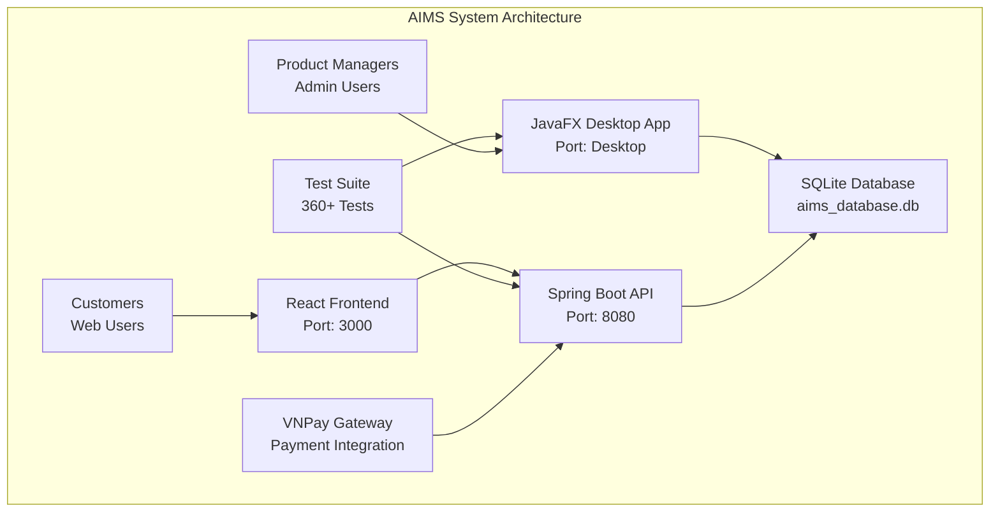

# 🚀 AIMS Project Deployment & Execution Guide

## 📋 Overview

The AIMS project is a comprehensive e-commerce system with **dual architecture**:
1. **JavaFX Desktop Application** - For product managers and administrators
2. **Spring Boot REST API + React Web Frontend** - For customers and web access
3. **Comprehensive Test Suite** - 360+ tests for validation

## 🎯 Quick Start Options

### Option 1: 🖥️ Run JavaFX Desktop Application (Recommended for Admins/Product Managers)

```bash
# Navigate to project directory
cd /Users/namu10x/workspace/hust/javafxml-AIMS

# Run JavaFX application directly
mvn javafx:run

# OR compile and run
mvn clean compile
mvn javafx:run
```

### Option 2: 🌐 Run Web API + Frontend (Recommended for Customers)

#### Start Backend API Server:
```bash
# Option A: Use the provided script (Linux/Mac)
./start-dev-server.sh

# Option B: Use Windows script  
start-dev-server.bat

# Option C: Manual Maven command
mvn spring-boot:run
```

#### Start Frontend React Application:
```bash
# Navigate to web-ui directory
cd web-ui

# Install dependencies (first time only)
npm install

# Start development server
npm run dev
```

### Option 3: 🧪 Run Comprehensive Test Suite

```bash
# Run all 360+ tests
mvn test

# Run specific test categories
mvn test -Dtest="*Test"                    # All tests
mvn test -Dtest="*IntegrationTest"         # Integration tests only
mvn test -Dtest="*ComplianceTest"          # Compliance tests only
mvn test -Dtest="*PerformanceTest"         # Performance tests only
```

## 🛠️ Prerequisites

### Required Software
- **Java 21** or higher
- **Maven 3.8+** 
- **Node.js 18+** and **npm** (for React frontend)
- **SQLite** (included with Java dependencies)

### Verification Commands
```bash
# Check Java version
java -version

# Check Maven version
mvn -version

# Check Node.js version
node --version
npm --version
```

## 🏗️ System Architecture



## 📱 Application Access Points

### 🖥️ JavaFX Desktop Application
- **Launch**: `mvn javafx:run`
- **Users**: Product Managers, Administrators
- **Features**: 
  - Product management with business constraints
  - Order approval/rejection workflows
  - User management and role assignments
  - Audit trails and operation tracking

### 🌐 Web API Server
- **URL**: http://localhost:8080
- **Swagger UI**: http://localhost:8080/swagger-ui/index.html
- **API Docs**: http://localhost:8080/v3/api-docs

#### 📋 Available API Endpoints:
```
🔐 Authentication: http://localhost:8080/api/auth
📦 Products: http://localhost:8080/api/products  
🛒 Cart: http://localhost:8080/api/cart
📋 Orders: http://localhost:8080/api/orders
👥 Users: http://localhost:8080/api/users
💳 Payments: http://localhost:8080/api/payments
🔧 Admin Products: http://localhost:8080/api/admin/products
```

### 🎨 React Frontend
- **URL**: http://localhost:3000
- **Users**: Customers
- **Features**:
  - Product browsing and search
  - Shopping cart management
  - Checkout with delivery options
  - Rush order placement (Hanoi districts)
  - Payment processing via VNPay
  - Order tracking and cancellation

## 🔧 Configuration

### Environment Variables
```bash
# Spring Boot Configuration
export SPRING_PROFILES_ACTIVE=dev
export SERVER_PORT=8080
export SPRING_DATASOURCE_URL=jdbc:sqlite:aims_database.db

# Frontend Configuration (in web-ui/.env.development)
VITE_API_BASE_URL=http://localhost:8080/api
VITE_VNPAY_RETURN_URL=http://localhost:3000/payment/result
```

### Database Setup
The application uses **SQLite** with automatic initialization:
- **Database File**: `aims_database.db` (created automatically)
- **Sample Data**: Loaded automatically on first run
- **Schema**: Auto-generated from JPA entities

## 🧪 Testing Framework

### Test Categories & Execution

#### 1. Unit Tests (160+ tests)
```bash
# Run all unit tests
mvn test -Dtest="*ServiceImplTest,*EntityTest,*DAOImplTest"

# Examples:
mvn test -Dtest="PriceManagementServiceImplTest"
mvn test -Dtest="VATCalculationServiceImplTest" 
mvn test -Dtest="ProductServiceImplTest"
```

#### 2. Integration Tests (65+ tests)
```bash
# Run integration tests
mvn test -Dtest="*IntegrationTest"

# Examples:
mvn test -Dtest="ProductManagementWorkflowIntegrationTest"
mvn test -Dtest="OrderProcessingIntegrationTest"
mvn test -Dtest="DeliveryCalculationIntegrationTest"
```

#### 3. End-to-End Tests (25+ tests)
```bash
# Run E2E tests
mvn test -Dtest="*JourneyTest,*WorkflowTest"

# Examples:
mvn test -Dtest="CustomerPurchaseJourneyTest"
mvn test -Dtest="ProductManagerDailyOperationsTest"
```

#### 4. Compliance Tests (30+ tests)
```bash
# Run compliance validation
mvn test -Dtest="*ComplianceTest"

# Examples:
mvn test -Dtest="ProblemStatementComplianceTest"
mvn test -Dtest="PerformanceRequirementsTest"
mvn test -Dtest="SecurityConstraintsTest"
```

#### 5. Performance Tests (10+ tests)
```bash
# Run performance validation
mvn test -Dtest="*PerformanceTest,*LoadTest"

# Examples:
mvn test -Dtest="ConcurrentUserSimulationTest"
mvn test -Dtest="ResponseTimeValidationTest"
```

### Test Coverage Analysis
```bash
# Generate test coverage report
mvn clean test jacoco:report

# View coverage report
open target/site/jacoco/index.html
```

## 📊 Monitoring & Health Checks

### Application Health
```bash
# Check API health
curl http://localhost:8080/actuator/health

# Check application metrics
curl http://localhost:8080/actuator/metrics
```

### Database Monitoring
```bash
# Check SQLite database
sqlite3 aims_database.db ".tables"
sqlite3 aims_database.db "SELECT COUNT(*) FROM PRODUCT;"
```

## 🚀 Production Deployment

### Build for Production
```bash
# Build optimized JAR
mvn clean package -DskipTests

# Build frontend for production
cd web-ui
npm run build
```

### Docker Deployment (Optional)
```dockerfile
# Dockerfile example for Spring Boot API
FROM openjdk:21-jre-slim
COPY target/aims-project-1.0-SNAPSHOT.jar app.jar
EXPOSE 8080
ENTRYPOINT ["java", "-jar", "/app.jar"]
```

## 🔍 Troubleshooting

### Common Issues & Solutions

#### 1. Java Version Issues
```bash
# Check Java version
java -version

# Should show Java 21 or higher
# If not, install OpenJDK 21:
# Mac: brew install openjdk@21
# Ubuntu: sudo apt install openjdk-21-jdk
# Windows: Download from https://openjdk.org/
```

#### 2. Maven Build Failures
```bash
# Clean Maven cache
mvn clean

# Force dependency update
mvn clean install -U

# Skip tests if needed
mvn clean install -DskipTests
```

#### 3. Database Issues
```bash
# Reset database (will lose data)
rm aims_database.db
mvn spring-boot:run  # Will recreate with sample data
```

#### 4. Port Conflicts
```bash
# Check what's using port 8080
lsof -i :8080

# Kill process if needed
kill -9 <PID>

# Or change port in application.properties
server.port=8081
```

#### 5. Frontend Issues
```bash
# Clear npm cache
npm cache clean --force

# Reinstall dependencies
rm -rf node_modules package-lock.json
npm install

# Check for port conflicts (default 3000)
npm run dev -- --port 3001
```

## 📚 Business Rules Implementation

### Key Features Validated:
- ✅ **Price Constraints**: 30%-150% of product value enforced
- ✅ **VAT Calculations**: 10% VAT applied correctly
- ✅ **Daily Limits**: Product manager operation constraints
- ✅ **Rush Order Rules**: Hanoi inner districts only
- ✅ **Free Shipping**: >100,000 VND with max 25,000 VND discount
- ✅ **Stock Management**: Real-time inventory with overselling prevention
- ✅ **Payment Integration**: VNPay sandbox for testing

### Sample Test Users:
```
Admin User:
- Username: admin@aims.com
- Password: admin123
- Role: Administrator

Product Manager:
- Username: manager@aims.com  
- Password: manager123
- Role: Product Manager

Customer:
- No login required for shopping
- Guest checkout supported
```

## 📖 Additional Documentation

- **[AIMS_COMPREHENSIVE_TESTING_AND_IMPLEMENTATION_PLAN.md](AIMS_COMPREHENSIVE_TESTING_AND_IMPLEMENTATION_PLAN.md)** - Complete implementation plan
- **[AIMS_Phase4_Final_Testing_Report.md](AIMS_Phase4_Final_Testing_Report.md)** - Final validation report
- **[web-ui/README.md](web-ui/README.md)** - Frontend-specific documentation

## 🎯 Next Steps

1. **Start with JavaFX Desktop App** for admin/manager features
2. **Launch Web Frontend** for customer experience
3. **Run Test Suite** to validate everything works
4. **Explore API Documentation** via Swagger UI
5. **Review Business Logic** implementation in test reports

---

## 📞 Support

For issues or questions:
1. Check this deployment guide
2. Review test output for specific errors
3. Check logs in `logs/` directory
4. Verify all prerequisites are installed
5. Ensure ports 8080 and 3000 are available

**Happy coding! 🚀**