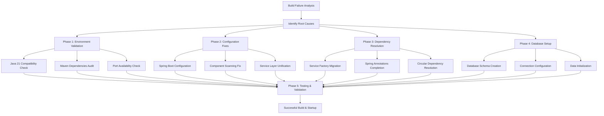

# AIMS Spring Boot Build Failure - Comprehensive Resolution Plan

## Executive Summary

This document provides a systematic approach to diagnosing and resolving the Spring Boot Maven build failure in the AIMS project. The failure appears to be related to Spring Boot configuration, dependency injection conflicts, and database initialization issues.

## Root Cause Analysis

### Primary Issues Identified:

1. **Spring Boot Component Scanning Issues**: The `@ComponentScan` configuration may not be properly scanning all required service implementations that lack `@Service` annotations.

2. **Dependency Injection Configuration Problems**: The hybrid approach of using `ServiceFactory` alongside Spring's dependency injection is creating conflicts.

3. **Missing Database Schema Initialization**: SQLite database and schema creation may be failing during startup.

4. **Potential Circular Dependencies**: Complex service dependencies in `ServiceFactory.initializeDependencies()` could be causing initialization issues.

## Resolution Strategy



## Phase 1: Environment Validation & Dependency Check (Priority: CRITICAL)

### Objectives:
- Verify Java 21 and Maven compatibility
- Audit Maven dependencies for conflicts
- Validate Spring Boot version compatibility

### Key Actions:

1. **Java Version Verification**
   ```bash
   java --version
   mvn --version
   ```

2. **Dependency Tree Analysis**
   ```bash
   mvn dependency:tree -Dverbose
   mvn dependency:analyze
   ```

3. **Port Conflict Resolution**
   ```bash
   lsof -i :8080
   netstat -tulpn | grep :8080
   ```

### Files to Modify:
- `pom.xml` - Verify dependency versions
- `mise.toml` - Check Java version specification

## Phase 2: Spring Boot Configuration Fixes (Priority: HIGH)

### Root Issue: 
Incomplete Spring component configuration and scanning

### Key Fixes:

1. **Update Main Application Class**
   - File: `src/main/java/com/aims/core/AimsWebApiApplication.java`
   - Add `@EnableJpaRepositories` configuration
   - Add `@EntityScan` for JPA entities
   - Expand component scanning

2. **Complete Service Layer Annotations**
   - Add `@Service` annotations to all service implementations
   - Add `@Repository` annotations to DAO implementations
   - Add `@Component` annotations where needed

3. **Update Component Scanning**
   - Expand `@ComponentScan` to include all package hierarchies
   - Add specific package scanning for entities and repositories

### Files to Modify:
- `src/main/java/com/aims/core/AimsWebApiApplication.java`
- All service implementation files in `src/main/java/com/aims/core/application/impl/`
- All DAO implementation files in `src/main/java/com/aims/core/infrastructure/database/dao/`

## Phase 3: Service Factory Migration Strategy (Priority: HIGH)

### Root Issue: 
Conflicting dependency injection approaches

### Migration Strategy:

1. **Hybrid to Pure Spring Migration**
   - Replace manual `ServiceFactory` initialization with Spring `@Autowired`
   - Create Spring configuration classes for complex bean initialization
   - Maintain backward compatibility during transition

2. **Circular Dependency Resolution**
   - Identify circular dependencies in service layer
   - Implement `@Lazy` injection where appropriate
   - Refactor service constructors to break circular references

### Files to Modify:
- `src/main/java/com/aims/core/shared/ServiceFactory.java`
- Create new Spring configuration classes
- Update service constructors

## Phase 4: Database Configuration & Schema Setup (Priority: HIGH)

### Root Issue: 
SQLite database initialization failures

### Key Actions:

1. **Database Configuration Enhancement**
   - File: `src/main/resources/application.properties`
   ```properties
   # Enhanced SQLite configuration
   spring.datasource.url=jdbc:sqlite:aims_database.db
   spring.datasource.driver-class-name=org.xerial.sqlite.JDBC
   spring.jpa.database-platform=org.hibernate.community.dialect.SQLiteDialect
   spring.jpa.hibernate.ddl-auto=create-drop
   spring.sql.init.mode=always
   ```

2. **Schema Initialization Scripts**
   - Create `src/main/resources/data.sql` for initial data
   - Create `src/main/resources/schema.sql` for table creation
   - Add database migration scripts

3. **Connection Pool Configuration**
   - Configure HikariCP for SQLite
   - Add connection validation queries
   - Set appropriate timeout values

### Files to Create/Modify:
- `src/main/resources/application.properties`
- `src/main/resources/data.sql`
- `src/main/resources/schema.sql`

## Phase 5: Build Process Optimization (Priority: MEDIUM)

### Startup Script Enhancement:

1. **Enhanced Error Handling**
   - File: `scripts/start-backend.sh`
   - Add detailed error reporting
   - Implement build validation steps
   - Add database connectivity checks

2. **Build Performance Optimization**
   - Skip tests for development builds: `-Dmaven.test.skip=true`
   - Add parallel build configuration
   - Cache Maven dependencies

### Files to Modify:
- `scripts/start-backend.sh`

## Phase 6: Testing & Validation (Priority: MEDIUM)

### Validation Steps:

1. **Build Verification**
   ```bash
   mvn clean compile -X
   mvn spring-boot:run -Dspring-boot.run.profiles=dev
   ```

2. **API Endpoint Testing**
   ```bash
   curl http://localhost:8080/actuator/health
   curl http://localhost:8080/swagger-ui/index.html
   ```

3. **Database Connectivity Test**
   - Verify SQLite file creation
   - Test entity persistence
   - Validate schema creation

## Expected Outcomes

### Success Criteria:
- ✅ Clean Maven compilation without errors
- ✅ Spring Boot application starts successfully on port 8080
- ✅ All API endpoints accessible via Swagger UI
- ✅ Database schema created and populated
- ✅ CORS configuration working for frontend integration

### Risk Assessment:
- **Low Risk**: Configuration file changes (reversible)
- **Medium Risk**: Service layer refactoring (isolated changes)
- **High Risk**: Database schema changes (backup required)

### Timeline Estimate:
- **Phase 1-2**: 30-45 minutes (Critical fixes)
- **Phase 3-4**: 45-60 minutes (Service layer & database)
- **Phase 5-6**: 15-30 minutes (Testing & validation)
- **Total**: 90-135 minutes

## Implementation Order

1. Start with Phase 1 (Environment Validation) to establish baseline
2. Proceed with Phase 2 (Configuration Fixes) for immediate impact
3. Continue with Phase 4 (Database Setup) to resolve initialization issues
4. Address Phase 3 (Service Factory Migration) for long-term stability
5. Complete with Phase 5-6 (Optimization & Testing)

## Rollback Strategy

1. **Git Backup**: Create branch before starting changes
2. **Configuration Backup**: Save original configuration files
3. **Database Backup**: Backup existing SQLite database if present
4. **Incremental Changes**: Implement changes in small, testable increments

## Next Steps

1. **User Approval**: Review and approve this plan
2. **Environment Setup**: Ensure development environment is ready
3. **Implementation**: Execute phases in order
4. **Testing**: Validate each phase before proceeding
5. **Documentation**: Update project documentation with changes

This systematic approach ensures minimal disruption while addressing the root causes of the build failure comprehensively.