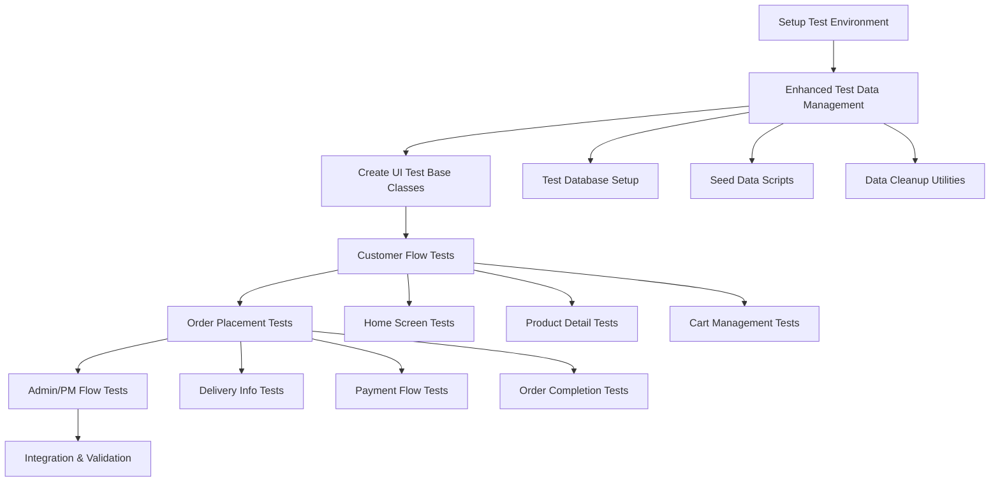
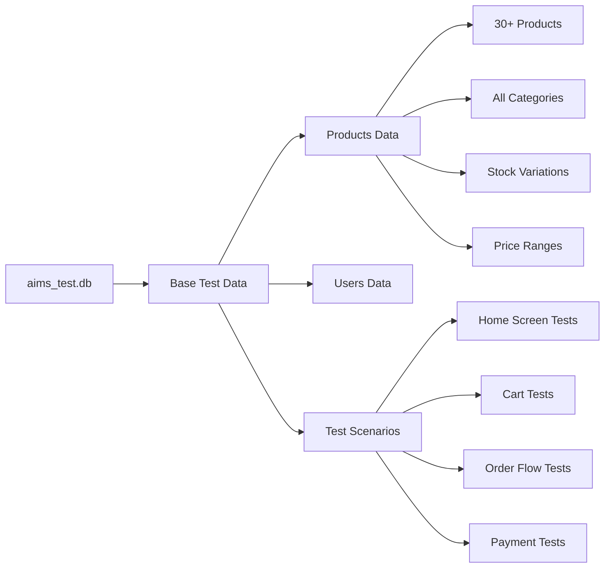
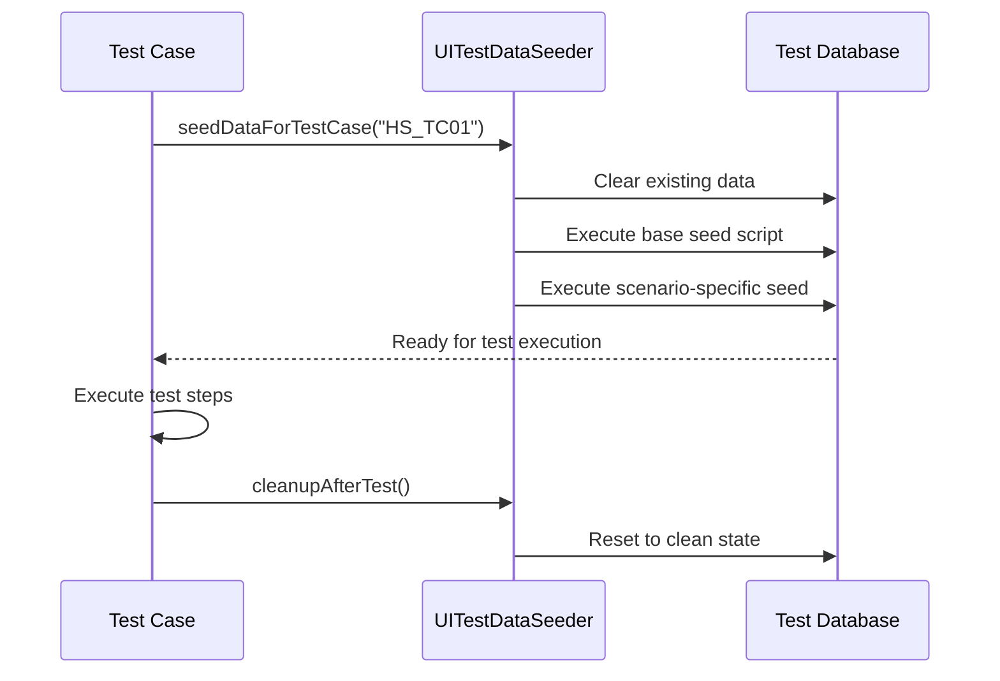

# AIMS UI Testing Implementation Plan

## Table of Contents
1. [Project Assessment](#i-current-project-assessment)
2. [Implementation Strategy](#ii-high-level-implementation-strategy)
3. [Detailed Implementation Plan](#iii-detailed-implementation-plan)
4. [Test Data Strategy](#iv-test-data-strategy)
5. [Key Files to Create](#v-key-test-files-to-create)
6. [Success Criteria](#vi-success-criteria)
7. [Implementation Timeline](#vii-implementation-timeline)
8. [Detailed Test Cases](#viii-detailed-test-cases)

## I. Current Project Assessment

Based on the analysis of the AIMS project, the current status is:

✅ **Complete FXML screens** for all required UI flows  
✅ **All controllers implemented** with proper structure  
✅ **Services fully implemented** (but potentially buggy)  
✅ **Database schema and DAOs ready**  
✅ **Basic test infrastructure** in place  

**Key Gap**: Comprehensive UI testing framework with proper test data management and automated test scenarios.

### Current Project Structure
- **Controllers**: 25+ controllers covering all UI flows
- **FXML Files**: All screens implemented including admin, customer, and payment flows
- **Services**: Complete service layer with interfaces and implementations
- **Database**: SQLite with comprehensive schema (V1__create_tables.sql)
- **Existing Tests**: Basic test infrastructure but no comprehensive UI tests

## II. High-Level Implementation Strategy



### Testing Approach
- **Manual UI Testing**: Primary focus on manual testing scenarios
- **Automated Service Testing**: Validate service layer integration
- **Test Data Management**: Robust seed data and cleanup mechanisms
- **Scenario-Based Testing**: Each test case with specific data setup

## III. Detailed Implementation Plan

### Phase 1: Test Environment & Infrastructure (Priority: Critical)

#### 1.1 Enhanced Test Database Management

**Files to Create:**
- [`src/test/java/com/aims/test/utils/TestDatabaseManager.java`](src/test/java/com/aims/test/utils/TestDatabaseManager.java)
- [`src/test/resources/test_data/V3__seed_ui_test_data.sql`](src/test/resources/test_data/V3__seed_ui_test_data.sql)
- [`src/test/java/com/aims/test/utils/UITestDataSeeder.java`](src/test/java/com/aims/test/utils/UITestDataSeeder.java)

**Key Features:**
- Separate test database (`aims_test.db`)
- Scenario-specific data seeding
- Automatic cleanup between tests
- Test data isolation

**Test Database Setup:**
```sql
-- Create test-specific data with diverse scenarios
-- 30+ products across all categories (Books, CDs, DVDs)
-- Various stock levels (in-stock, low-stock, out-of-stock)
-- Different price ranges for testing shipping thresholds
-- Test users with different roles
-- Sample carts and orders for different scenarios
```

#### 1.2 Test Configuration Enhancement

**Files to Update/Create:**
- Enhance [`src/test/java/com/aims/test/config/TestDatabaseConfig.java`](src/test/java/com/aims/test/config/TestDatabaseConfig.java)
- Create [`src/test/java/com/aims/test/config/UITestConfig.java`](src/test/java/com/aims/test/config/UITestConfig.java)

**Configuration Features:**
- Test database connection management
- UI test environment settings
- Mock service configurations
- Test data paths and resources

#### 1.3 Base Test Classes

**Files to Create/Enhance:**
- Enhance [`src/test/java/com/aims/test/base/BaseUITest.java`](src/test/java/com/aims/test/base/BaseUITest.java)
- Create [`src/test/java/com/aims/test/base/ManualUITestBase.java`](src/test/java/com/aims/test/base/ManualUITestBase.java)
- Create [`src/test/java/com/aims/test/utils/ScreenTestHelper.java`](src/test/java/com/aims/test/utils/ScreenTestHelper.java)

**Base Class Features:**
- Test data setup and cleanup
- Application startup/shutdown
- Screen navigation helpers
- Assertion utilities for manual testing

### Phase 2: Customer Flow UI Tests (Priority: High)

#### 2.1 Home Screen Tests
**File:** [`src/test/java/com/aims/test/ui/customer/HomeScreenUITest.java`](src/test/java/com/aims/test/ui/customer/HomeScreenUITest.java)

**Test Cases:**
- **HS_TC01**: Initial product display validation
  - Verify 20 products displayed on first page
  - Check product information completeness
  - Validate pagination controls
  - Verify filter/sort default states

- **HS_TC02**: Search functionality with results
  - Test partial name search
  - Verify search results accuracy
  - Check search result display format

- **HS_TC03**: Search with no results
  - Test non-existent product search
  - Verify "no results" message display

- **HS_TC04**: Category filtering
  - Test each category filter
  - Verify filtered results accuracy
  - Check pagination updates

- **HS_TC05**: Price sorting
  - Test low-to-high sorting
  - Test high-to-low sorting
  - Verify sort accuracy

- **HS_TC06**: Pagination functionality
  - Test next/previous buttons
  - Verify page number display
  - Test first/last page navigation

- **HS_TC07**: Product card interaction
  - Test click to view product details
  - Verify navigation to product detail screen

- **HS_TC08**: Add to cart from product card
  - Test add to cart for in-stock products
  - Verify success feedback
  - Check cart update

- **HS_TC09**: Out of stock product handling
  - Verify disabled add-to-cart button
  - Check out-of-stock display

#### 2.2 Product Detail Screen Tests
**File:** [`src/test/java/com/aims/test/ui/customer/ProductDetailUITest.java`](src/test/java/com/aims/test/ui/customer/ProductDetailUITest.java)

**Test Cases:**
- **PD_TC01**: Product information display
  - Verify all product details shown correctly
  - Check product-specific attributes (Book/CD/DVD)
  - Validate image display

- **PD_TC02**: Out of stock product display
  - Verify out-of-stock messaging
  - Check disabled controls

- **PD_TC03**: Add to cart - valid quantity
  - Test quantity selection
  - Verify add to cart success
  - Check stock update

- **PD_TC04**: Add to cart - invalid quantity
  - Test quantity exceeding stock
  - Verify error handling

- **PD_TC05**: Navigation controls
  - Test "Back to Products" button
  - Verify proper navigation

#### 2.3 Cart Management Tests
**File:** [`src/test/java/com/aims/test/ui/customer/CartScreenUITest.java`](src/test/java/com/aims/test/ui/customer/CartScreenUITest.java)

**Test Cases:**
- **CS_TC01**: Empty cart display
- **CS_TC02**: Cart with products display
- **CS_TC03**: Stock warning display
- **CS_TC04**: Quantity update - valid
- **CS_TC05**: Quantity update - invalid (exceeds stock)
- **CS_TC06**: Quantity set to zero (item removal)
- **CS_TC07**: Remove item functionality
- **CS_TC08**: Clear cart functionality
- **CS_TC09**: Proceed to checkout - success
- **CS_TC10**: Proceed to checkout - stock issues

### Phase 3: Order Placement Flow Tests (Priority: High)

#### 3.1 Delivery Info Screen Tests
**File:** [`src/test/java/com/aims/test/ui/order/DeliveryInfoUITest.java`](src/test/java/com/aims/test/ui/order/DeliveryInfoUITest.java)

**Test Cases:**
- **DI_TC01**: Valid delivery info - standard delivery
- **DI_TC02**: Missing required fields validation
- **DI_TC03**: Invalid format validation (email, phone)
- **DI_TC04**: Rush delivery - eligible address and products
- **DI_TC05**: Rush delivery - ineligible address
- **DI_TC06**: Rush delivery - no eligible products
- **DI_TC07**: Address change - shipping fee recalculation
- **DI_TC08**: Free shipping threshold validation
- **DI_TC09**: Free shipping exclusion for rush delivery
- **DI_TC10**: Back to cart navigation
- **DI_TC11**: Proceed to payment - success

#### 3.2 Order Summary Tests
**File:** [`src/test/java/com/aims/test/ui/order/OrderSummaryUITest.java`](src/test/java/com/aims/test/ui/order/OrderSummaryUITest.java)

**Test Cases:**
- **OS_TC01**: Complete order information display
- **OS_TC02**: Back to delivery info navigation
- **OS_TC03**: Proceed to payment method selection

#### 3.3 Payment Flow Tests
**File:** [`src/test/java/com/aims/test/ui/payment/PaymentFlowUITest.java`](src/test/java/com/aims/test/ui/payment/PaymentFlowUITest.java)

**Test Cases:**
- **PM_TC01**: Payment method default selection
- **PM_TC02**: Payment method switching
- **PM_TC03**: Back to order summary navigation
- **PM_TC04**: Proceed with VNPay

- **PP_TC01**: Payment processing - browser redirect display
- **PP_TC02**: Payment processing - WebView display
- **PP_TC03**: Manual payment status check - success
- **PP_TC04**: Manual payment status check - failure
- **PP_TC05**: Cancel payment attempt

- **PR_TC01**: Payment success result display
- **PR_TC02**: Payment failure result display
- **PR_TC03**: View order details navigation
- **PR_TC04**: Continue shopping navigation

### Phase 4: Service Integration Testing (Priority: Medium)

#### 4.1 Service Validation Tests
**File:** [`src/test/java/com/aims/test/integration/ServiceIntegrationTest.java`](src/test/java/com/aims/test/integration/ServiceIntegrationTest.java)

**Service Testing:**
- [`IProductService`](src/main/java/com/aims/core/application/services/IProductService.java) - Search, filtering, pagination
- [`ICartService`](src/main/java/com/aims/core/application/services/ICartService.java) - Add/remove/update items
- [`IOrderService`](src/main/java/com/aims/core/application/services/IOrderService.java) - Order creation and management
- [`IPaymentService`](src/main/java/com/aims/core/application/services/IPaymentService.java) - Payment processing
- [`IDeliveryCalculationService`](src/main/java/com/aims/core/application/services/IDeliveryCalculationService.java) - Shipping calculations

#### 4.2 End-to-End Flow Tests
**Files:**
- [`src/test/java/com/aims/test/e2e/E2ECustomerFlowTest.java`](src/test/java/com/aims/test/e2e/E2ECustomerFlowTest.java)
- [`src/test/java/com/aims/test/e2e/E2EOrderPlacementTest.java`](src/test/java/com/aims/test/e2e/E2EOrderPlacementTest.java)

### Phase 5: Admin/PM Flow Tests (Priority: Low)

#### 5.1 Admin Interface Tests
**Files:**
- [`src/test/java/com/aims/test/ui/admin/AdminDashboardUITest.java`](src/test/java/com/aims/test/ui/admin/AdminDashboardUITest.java)
- [`src/test/java/com/aims/test/ui/admin/AdminProductManagementUITest.java`](src/test/java/com/aims/test/ui/admin/AdminProductManagementUITest.java)
- [`src/test/java/com/aims/test/ui/admin/AdminUserManagementUITest.java`](src/test/java/com/aims/test/ui/admin/AdminUserManagementUITest.java)

## IV. Test Data Strategy

### 4.1 Test Database Structure



### 4.2 Scenario-Based Data Seeds

**Base Test Data (`V3__seed_ui_test_data.sql`):**
```sql
-- Products for different test scenarios
-- Books: 12 products (fiction, non-fiction, technical)
-- CDs: 10 products (various genres, artists)
-- DVDs: 10 products (movies, documentaries)
-- Stock levels: 5 out-of-stock, 10 low-stock, 15+ high-stock
-- Price ranges: Under 100k, 100k-500k, 500k+
-- Rush delivery eligibility: Mix of eligible/ineligible products
```

**Specific Test Scenario Seeds:**
- **Empty Cart Scenario**: No cart data
- **Populated Cart Scenario**: Pre-filled cart with various items
- **Stock Issue Scenario**: Cart with items exceeding available stock
- **Rush Delivery Scenario**: Products eligible for rush delivery
- **Free Shipping Scenario**: Order value above/below threshold

### 4.3 Test Data Management Workflow



## V. Key Test Files to Create

### Core Infrastructure (Phase 1)
1. **[`TestDatabaseManager.java`](src/test/java/com/aims/test/utils/TestDatabaseManager.java)** - Database setup and management
2. **[`UITestDataSeeder.java`](src/test/java/com/aims/test/utils/UITestDataSeeder.java)** - Test data seeding utilities
3. **[`ManualUITestBase.java`](src/test/java/com/aims/test/base/ManualUITestBase.java)** - Base class for manual UI tests
4. **[`ScreenTestHelper.java`](src/test/java/com/aims/test/utils/ScreenTestHelper.java)** - UI testing utilities
5. **[`UITestConfig.java`](src/test/java/com/aims/test/config/UITestConfig.java)** - Test configuration

### Customer Flow Tests (Phase 2)
6. **[`HomeScreenUITest.java`](src/test/java/com/aims/test/ui/customer/HomeScreenUITest.java)** - Home screen test cases
7. **[`ProductDetailUITest.java`](src/test/java/com/aims/test/ui/customer/ProductDetailUITest.java)** - Product detail tests
8. **[`CartScreenUITest.java`](src/test/java/com/aims/test/ui/customer/CartScreenUITest.java)** - Cart management tests

### Order Flow Tests (Phase 3)
9. **[`DeliveryInfoUITest.java`](src/test/java/com/aims/test/ui/order/DeliveryInfoUITest.java)** - Delivery info screen tests
10. **[`OrderSummaryUITest.java`](src/test/java/com/aims/test/ui/order/OrderSummaryUITest.java)** - Order summary tests
11. **[`PaymentFlowUITest.java`](src/test/java/com/aims/test/ui/payment/PaymentFlowUITest.java)** - Payment flow tests

### Service & Integration Tests (Phase 4)
12. **[`ServiceIntegrationTest.java`](src/test/java/com/aims/test/integration/ServiceIntegrationTest.java)** - Service layer validation
13. **[`E2ECustomerFlowTest.java`](src/test/java/com/aims/test/e2e/E2ECustomerFlowTest.java)** - End-to-end customer flow
14. **[`E2EOrderPlacementTest.java`](src/test/java/com/aims/test/e2e/E2EOrderPlacementTest.java)** - End-to-end order placement

### Data & Configuration (Supporting)
15. **[`V3__seed_ui_test_data.sql`](src/test/resources/test_data/V3__seed_ui_test_data.sql)** - Comprehensive test data
16. **[`scenario_seeds/`](src/test/resources/test_data/scenario_seeds/)** - Scenario-specific data scripts

### Admin/PM Tests (Phase 5)
17. **[`AdminDashboardUITest.java`](src/test/java/com/aims/test/ui/admin/AdminDashboardUITest.java)** - Admin dashboard tests
18. **[`AdminProductManagementUITest.java`](src/test/java/com/aims/test/ui/admin/AdminProductManagementUITest.java)** - Product management tests
19. **[`AdminUserManagementUITest.java`](src/test/java/com/aims/test/ui/admin/AdminUserManagementUITest.java)** - User management tests

## VI. Success Criteria

### Testing Coverage
✅ **All 50+ test cases** from the Vietnamese specification implemented  
✅ **Complete customer flow coverage** (Browse → View → Cart → Order → Payment)  
✅ **Order placement flow coverage** (Delivery → Summary → Payment → Result)  
✅ **Service integration validation** and bug identification/fixes  
✅ **Test data management** working reliably across all scenarios  

### Quality Metrics
✅ **Manual test execution** with clear step-by-step instructions  
✅ **Reproducible test scenarios** with consistent data setup  
✅ **Bug identification and tracking** for service layer issues  
✅ **Documentation** of all test procedures and expected results  

### Deliverables
✅ **Complete test suite** covering all UI screens and flows  
✅ **Test data management framework** with scenario-based seeding  
✅ **Service validation tests** identifying integration issues  
✅ **Test execution documentation** with manual testing procedures  

## VII. Implementation Timeline

### Phase 1: Infrastructure Setup (3-4 days)
- **Day 1**: Test database setup and configuration
- **Day 2**: Base test classes and data seeding framework
- **Day 3**: Test data creation and scenario setup
- **Day 4**: Infrastructure testing and validation

### Phase 2: Customer Flow Tests (4-5 days)
- **Day 1**: Home screen test implementation
- **Day 2**: Product detail screen tests
- **Day 3**: Cart management tests
- **Day 4**: Customer flow integration testing
- **Day 5**: Bug fixes and refinements

### Phase 3: Order Placement Tests (4-5 days)
- **Day 1**: Delivery info screen tests
- **Day 2**: Order summary and payment method tests
- **Day 3**: Payment processing and result tests
- **Day 4**: Order flow integration testing
- **Day 5**: End-to-end order placement validation

### Phase 4: Service Integration (2-3 days)
- **Day 1**: Service layer testing and bug identification
- **Day 2**: Service fixes and re-testing
- **Day 3**: Integration validation and documentation

### Phase 5: Admin/PM Flows (2-3 days)
- **Day 1**: Admin dashboard and product management tests
- **Day 2**: User management and PM workflow tests
- **Day 3**: Admin flow integration and final validation

**Total Estimated Time**: 15-20 days

## VIII. Detailed Test Cases

### A. Customer Flow Test Cases

#### Home Screen Test Cases (HS_TC01 - HS_TC09)

**HS_TC01: Initial Product Display**
```
Objective: Verify home screen displays products correctly on startup
Preconditions: 
- Test database seeded with 30+ products
- Application started fresh

Test Steps:
1. Launch AIMS application
2. Observe home screen display
3. Count visible products
4. Check pagination controls
5. Verify filter/sort default states

Expected Results:
- Exactly 20 products displayed on first page
- Product cards show: image, title, price (with VAT), stock status
- "Add to Cart" enabled for in-stock products, disabled for out-of-stock
- Pagination shows "Page 1/X" where X >= 2
- Category filter shows "All Categories"
- Sort shows "Default Sort"
- Previous button disabled, Next button enabled (if more pages)
```

**HS_TC02: Search Functionality - With Results**
```
Objective: Test product search with matching results
Preconditions: 
- Products with "Guide" in title exist in database

Test Steps:
1. Enter "Guide" in search field
2. Click Search button or press Enter
3. Observe results

Expected Results:
- Only products containing "Guide" in title displayed
- Search results header shows "Search Results for: 'Guide'"
- Pagination updated to reflect search result count
- Filter and sort options remain available
```

**HS_TC08: Add to Cart from Product Card**
```
Objective: Test adding product to cart from home screen
Preconditions:
- Product with sufficient stock available
- Empty cart

Test Steps:
1. Locate in-stock product on home screen
2. Click "Add to Cart" button on product card
3. Observe feedback

Expected Results:
- Success message displayed (e.g., "Added to cart!")
- Product stock count decreases by 1 on display
- Cart icon shows item count increase (if visible)
- If product stock reaches 0, button changes to "Out of Stock"
```

#### Product Detail Test Cases (PD_TC01 - PD_TC05)

**PD_TC01: Product Information Display**
```
Objective: Verify complete product information display
Preconditions:
- Navigate to product detail from home screen

Test Steps:
1. Click on a product card from home screen
2. Observe product detail screen

Expected Results:
- All basic info displayed: title, image, price (with VAT), category
- Description shown completely
- Stock availability clearly indicated
- Product-specific details shown:
  - Book: Authors, publisher, pages, language, genre
  - CD: Artists, record label, tracklist, genre, release date
  - DVD: Director, runtime, studio, language, subtitles, genre
- Quantity spinner shows default value 1
- "Add to Cart" button enabled (if in stock)
```

**PD_TC03: Add to Cart - Valid Quantity**
```
Objective: Test adding product with specified quantity
Preconditions:
- On product detail screen
- Product has stock >= 3

Test Steps:
1. Set quantity spinner to 2
2. Click "Add to Cart"
3. Observe results

Expected Results:
- Success message displayed
- Stock count decreases by 2
- Total item price calculation shown correctly
- If remaining stock becomes low, appropriate warning may show
```

#### Cart Screen Test Cases (CS_TC01 - CS_TC10)

**CS_TC01: Empty Cart Display**
```
Objective: Verify empty cart screen display
Preconditions:
- Cart is empty (no items)

Test Steps:
1. Navigate to cart screen
2. Observe display

Expected Results:
- "Your shopping cart is currently empty" message shown
- Total amount shows 0.00
- "Proceed to Checkout" button disabled
- "Clear Cart" button not shown or disabled
```

**CS_TC03: Stock Warning Display**
```
Objective: Verify stock warning for items exceeding available stock
Preconditions:
- Cart contains item with quantity > current stock

Test Steps:
1. Navigate to cart screen
2. Observe item with stock issue

Expected Results:
- Warning message displayed near affected item
- Example: "Product X only has Y items in stock. Please update quantity."
- "Proceed to Checkout" button may be disabled
- Item quantity highlighted or marked as problematic
```

### B. Order Placement Test Cases

#### Delivery Info Test Cases (DI_TC01 - DI_TC11)

**DI_TC01: Valid Delivery Info - Standard Delivery**
```
Objective: Test complete delivery info form with standard delivery
Preconditions:
- Cart has items
- Proceeded from cart to delivery info screen

Test Steps:
1. Fill recipient name: "Nguyen Van A"
2. Fill email: "test@example.com"
3. Fill phone: "0123456789"
4. Fill address: "123 Test Street"
5. Select province: "Ho Chi Minh City"
6. Ensure "Request Rush Order Delivery" is unchecked
7. Click "Proceed to Payment"

Expected Results:
- Order summary shows all products correctly
- Shipping fee calculated and displayed
- Total amount = Product total (with VAT) + Shipping fee
- Successfully navigates to order summary screen
- No error messages displayed
```

**DI_TC04: Rush Delivery - Eligible Address and Products**
```
Objective: Test rush delivery with valid conditions
Preconditions:
- Cart contains rush-eligible products
- Located in eligible area

Test Steps:
1. Fill valid delivery information
2. Set province to "Hanoi"
3. Set address to inner district (e.g., "Hoàn Kiếm")
4. Check "Request Rush Order Delivery"
5. Select desired rush delivery time (if available)
6. Observe fee calculation

Expected Results:
- Rush delivery options become visible
- Additional rush delivery fee applied to eligible items
- Total shipping fee includes rush charges
- No error messages about eligibility
- Rush delivery details section expanded
```

**DI_TC08: Free Shipping Threshold Validation**
```
Objective: Test free shipping logic for standard delivery
Preconditions:
- Cart total value > 100,000 VND (excluding VAT)
- No rush delivery selected

Test Steps:
1. Verify cart total exceeds free shipping threshold
2. Fill delivery information for standard delivery
3. Observe shipping fee calculation

Expected Results:
- Shipping fee reduced (up to 25,000 VND discount)
- Free shipping discount clearly indicated
- Total amount reflects the shipping discount
- Discount only applies to standard delivery portion
```

#### Payment Flow Test Cases (PM_TC01 - PR_TC04)

**PM_TC01: Payment Method Default Selection**
```
Objective: Verify default payment method selection
Preconditions:
- Completed order summary screen

Test Steps:
1. Navigate to payment method screen
2. Observe default selection

Expected Results:
- "Credit Card / Debit Card (via VNPay)" pre-selected
- Corresponding description displayed
- "Proceed with VNPay" button enabled and visible
- Other payment options available for selection (if any)
```

**PP_TC03: Manual Payment Status Check - Success**
```
Objective: Test successful payment verification
Preconditions:
- Payment initiated and completed successfully on VNPay sandbox
- Returned to payment processing screen

Test Steps:
1. Complete payment on VNPay sandbox using test card
2. Return to AIMS application
3. Click "Check Payment Status Manually"
4. Wait for status verification

Expected Results:
- System calls payment service to verify status
- Payment confirmed as successful
- Automatic navigation to payment result screen
- Success message and transaction details displayed
```

**PR_TC01: Payment Success Result Display**
```
Objective: Verify successful payment result screen
Preconditions:
- Payment completed successfully

Test Steps:
1. Observe payment result screen after successful payment
2. Check all displayed information

Expected Results:
- "Payment Successful!" title displayed
- Success icon/indication shown
- Order details displayed: Order ID, Customer info, Total amount
- Transaction details: AIMS Transaction ID, Gateway Transaction ID, Time
- "View Order Details" button enabled and visible
- "Continue Shopping" button available
```

## IX. Manual Testing Procedures

### General Testing Guidelines

1. **Environment Setup**
   - Ensure test database is properly seeded before each test session
   - Clear browser cache/application state between major test runs
   - Document any environmental issues or deviations

2. **Test Execution**
   - Follow test steps exactly as documented
   - Record actual results vs expected results
   - Take screenshots for visual verification
   - Note any UI inconsistencies or bugs

3. **Bug Reporting**
   - Document steps to reproduce any issues
   - Include screenshots and error messages
   - Classify severity: Critical, High, Medium, Low
   - Link to specific test case ID

4. **Test Data Management**
   - Reset test data between test suites
   - Verify data consistency before testing
   - Document any data setup variations needed

### Test Execution Schedule

**Week 1: Infrastructure & Customer Flow**
- Days 1-2: Setup test environment and data
- Days 3-5: Execute customer flow tests (HS, PD, CS test cases)

**Week 2: Order Flow & Integration**
- Days 1-3: Execute order placement tests (DI, OS, PM, PP, PR test cases)
- Days 4-5: Service integration testing and bug fixes

**Week 3: Admin Flow & Final Validation**
- Days 1-2: Admin and PM interface testing
- Days 3-5: End-to-end validation and documentation

This comprehensive plan provides the framework for thorough UI testing of the AIMS system, ensuring all user flows are validated and any service layer issues are identified and resolved.