# AIMS Use Case Implementation Guide
**Version:** 1.0  
**Date:** December 6, 2025  
**Document Type:** Use Case to Code Mapping

## Table of Contents
1. [Use Case Overview](#1-use-case-overview)
2. [Customer Use Cases](#2-customer-use-cases)
3. [Product Manager Use Cases](#3-product-manager-use-cases)
4. [Administrator Use Cases](#4-administrator-use-cases)
5. [System Use Cases](#5-system-use-cases)
6. [Cross-Cutting Concerns](#6-cross-cutting-concerns)

## 1. Use Case Overview

### 1.1 Use Case Categories
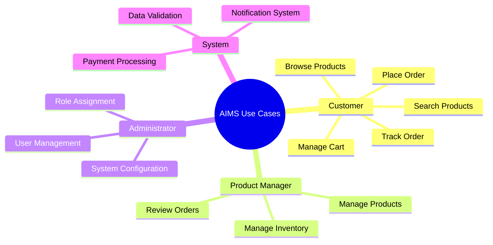

### 1.2 Actor Mapping
| Actor | Authentication Required | Primary Entry Point | Role Enum |
|-------|------------------------|---------------------|-----------|
| **Customer/Guest** | ❌ No | [`home_screen.fxml`](src/main/resources/com/aims/presentation/views/home_screen.fxml) | N/A |
| **Product Manager** | ✅ Yes | [`login_screen.fxml`](src/main/resources/com/aims/presentation/views/login_screen.fxml) | [`UserRole.PRODUCT_MANAGER`](src/main/java/com/aims/core/enums/UserRole.java) |
| **Administrator** | ✅ Yes | [`login_screen.fxml`](src/main/resources/com/aims/presentation/views/login_screen.fxml) | [`UserRole.ADMIN`](src/main/java/com/aims/core/enums/UserRole.java) |

## 2. Customer Use Cases

### 2.1 UC-001: Browse Products
**Problem Statement Reference:** *"When starting the software, a list of 20 random products will be displayed on each page"*

#### Implementation Mapping
| Component | File | Method/Function |
|-----------|------|-----------------|
| **Entry Point** | [`home_screen.fxml`](src/main/resources/com/aims/presentation/views/home_screen.fxml) | UI Definition |
| **Controller** | [`HomeScreenController.java`](src/main/java/com/aims/core/presentation/controllers/HomeScreenController.java) | `initialize()`, `loadRandomProducts()` |
| **Service Interface** | [`IProductService.java:164`](src/main/java/com/aims/core/application/services/IProductService.java:164) | `getProductsForDisplay(pageNumber, pageSize)` |
| **Service Implementation** | [`ProductServiceImpl.java`](src/main/java/com/aims/core/application/impl/ProductServiceImpl.java) | `getProductsForDisplay()` |
| **Data Access** | [`IProductDAO.java`](src/main/java/com/aims/core/infrastructure/database/dao/IProductDAO.java) | `getRandomProducts()` |

#### Execution Flow
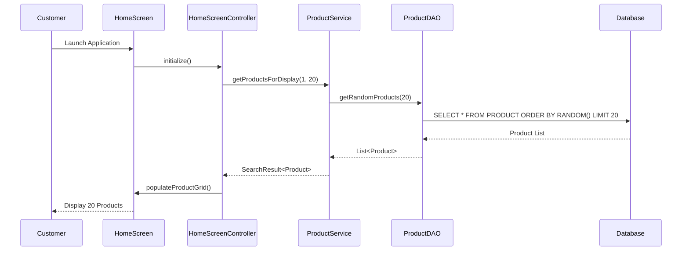

#### Business Rules Implementation
- **20 products per page:** Enforced in [`IProductService.java:164`](src/main/java/com/aims/core/application/services/IProductService.java:164)
- **VAT inclusion for display:** Price calculation in service layer adds 10% VAT
- **Random selection:** Database query uses `ORDER BY RANDOM()`

### 2.2 UC-002: Search Products
**Problem Statement Reference:** *"To search for products, customers use product attributes to search. The software will display 20 related products on each search page"*

#### Implementation Mapping
| Component | File | Method/Function |
|-----------|------|-----------------|
| **Search UI** | [`product_search_results_screen.fxml`](src/main/resources/com/aims/presentation/views/product_search_results_screen.fxml) | Search form and results |
| **Controller** | [`ProductSearchResultsController.java`](src/main/java/com/aims/core/presentation/controllers/ProductSearchResultsController.java) | `performSearch()`, `displayResults()` |
| **Service Interface** | [`IProductService.java:178`](src/main/java/com/aims/core/application/services/IProductService.java:178) | `searchProducts()`, `advancedSearchProducts()` |
| **Service Implementation** | [`ProductServiceImpl.java`](src/main/java/com/aims/core/application/impl/ProductServiceImpl.java) | Search algorithm implementation |

#### Search Criteria Support
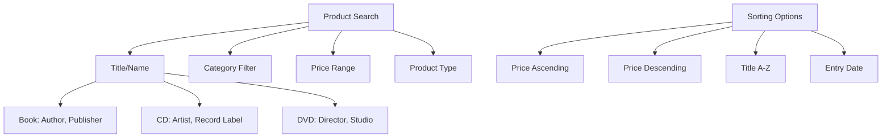

### 2.3 UC-003: Manage Shopping Cart
**Problem Statement Reference:** *"Customer can add products with corresponding quantities to the current cart... there is only one cart per software session"*

#### Implementation Mapping
| Component | File | Method/Function |
|-----------|------|-----------------|
| **Cart UI** | [`cart_screen.fxml`](src/main/resources/com/aims/presentation/views/cart_screen.fxml) | Cart display interface |
| **Cart Controller** | [`CartScreenController.java`](src/main/java/com/aims/core/presentation/controllers/CartScreenController.java) | `viewCart()`, `updateQuantity()`, `removeItem()` |
| **Service Interface** | [`ICartService.java`](src/main/java/com/aims/core/application/services/ICartService.java) | Complete cart management interface |
| **Service Implementation** | [`CartServiceImpl.java`](src/main/java/com/aims/core/application/impl/CartServiceImpl.java) | Business logic implementation |
| **Entity** | [`Cart.java`](src/main/java/com/aims/core/entities/Cart.java), [`CartItem.java`](src/main/java/com/aims/core/entities/CartItem.java) | Domain models |

#### Cart Operations Flow
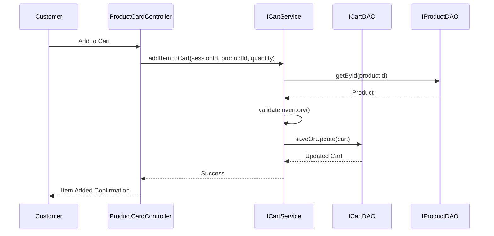

#### Business Rules Implementation
- **Single cart per session:** [`ICartService.java:31`](src/main/java/com/aims/core/application/services/ICartService.java:31) - `getCart(cartSessionId)`
- **Inventory validation:** [`ICartService.java:44`](src/main/java/com/aims/core/application/services/ICartService.java:44) - Throws `InventoryException`
- **VAT excluded total:** [`ICartService.java:25`](src/main/java/com/aims/core/application/services/ICartService.java:25) - "total price excluding VAT"

### 2.4 UC-004: Place Order
**Problem Statement Reference:** *"To place a successful order, customers need to proceed with ordering and payment"*

#### Implementation Mapping
| Component | File | Method/Function |
|-----------|------|-----------------|
| **Order Summary** | [`order_summary_screen.fxml`](src/main/resources/com/aims/presentation/views/order_summary_screen.fxml) | Order review interface |
| **Delivery Info** | [`delivery_info_screen.fxml`](src/main/resources/com/aims/presentation/views/delivery_info_screen.fxml) | Address and delivery options |
| **Payment Screen** | [`payment_processing_screen.fxml`](src/main/resources/com/aims/presentation/views/payment_processing_screen.fxml) | Payment method selection |
| **Order Service** | [`IOrderService.java`](src/main/java/com/aims/core/application/services/IOrderService.java) | Complete order lifecycle |
| **Order Entity** | [`OrderEntity.java`](src/main/java/com/aims/core/entities/OrderEntity.java) | Order domain model |

#### Order Processing Flow
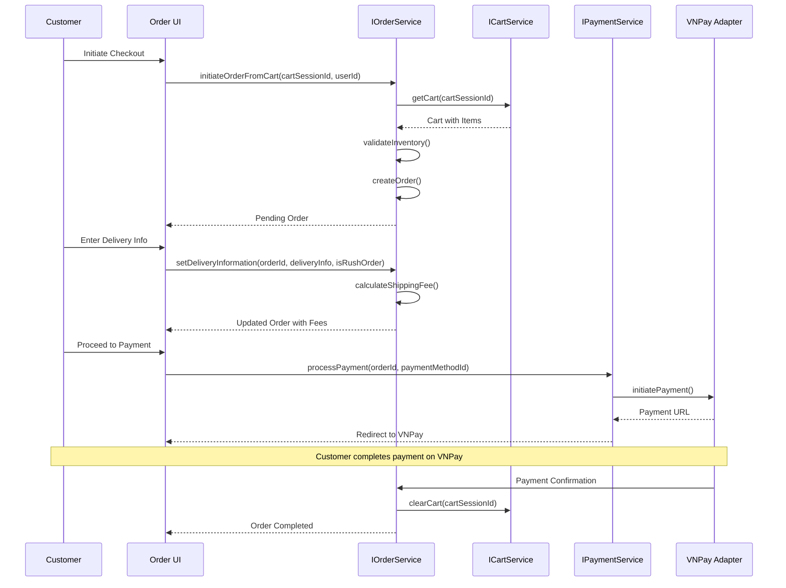

#### Order States Implementation
| State | Implementation | Description |
|-------|----------------|-------------|
| **Pending Delivery Info** | [`OrderStatus.PENDING_DELIVERY_INFO`](src/main/java/com/aims/core/enums/OrderStatus.java) | Initial order state |
| **Pending Payment** | [`OrderStatus.PENDING_PAYMENT`](src/main/java/com/aims/core/enums/OrderStatus.java) | Delivery info set, awaiting payment |
| **Pending Processing** | [`OrderStatus.PENDING_PROCESSING`](src/main/java/com/aims/core/enums/OrderStatus.java) | Payment complete, awaiting PM review |
| **Approved/Rejected** | [`OrderStatus.APPROVED`](src/main/java/com/aims/core/enums/OrderStatus.java) | Product manager decision |

### 2.5 UC-005: Track Order
**Problem Statement Reference:** *"Customers can view order information or cancel orders using the links sent in the email"*

#### Implementation Mapping
| Component | File | Method/Function |
|-----------|------|-----------------|
| **Order Detail UI** | [`customer_order_detail_screen.fxml`](src/main/resources/com/aims/presentation/views/customer_order_detail_screen.fxml) | Order tracking interface |
| **Controller** | [`CustomerOrderDetailController.java`](src/main/java/com/aims/core/presentation/controllers/CustomerOrderDetailController.java) | Order display and cancellation |
| **Service Method** | [`IOrderService.java:97`](src/main/java/com/aims/core/application/services/IOrderService.java:97) | `getOrderDetails(orderId)` |
| **Cancellation** | [`IOrderService.java:120`](src/main/java/com/aims/core/application/services/IOrderService.java:120) | `cancelOrder(orderId, customerId)` |

## 3. Product Manager Use Cases

### 3.1 UC-006: Manage Products
**Problem Statement Reference:** *"Product managers can add, view, edit, or delete any product"*

#### Implementation Mapping
| Component | File | Method/Function |
|-----------|------|-----------------|
| **PM Dashboard** | [`pm_dashboard_screen.fxml`](src/main/resources/com/aims/presentation/views/pm_dashboard_screen.fxml) | Main PM interface |
| **Product Form** | [`admin_add_edit_product_screen.fxml`](src/main/resources/com/aims/presentation/views/admin_add_edit_product_screen.fxml) | Product CRUD form |
| **Controller** | [`AdminAddEditProductController.java`](src/main/java/com/aims/core/presentation/controllers/AdminAddEditProductController.java) | Product operations |
| **Service Interface** | [`IProductService.java`](src/main/java/com/aims/core/application/services/IProductService.java) | Complete product management |

#### Product CRUD Operations
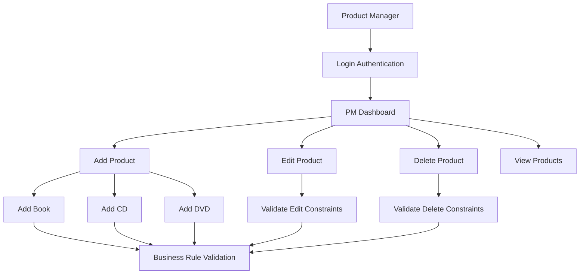

#### Business Constraints Implementation
| Constraint | Implementation Location | Validation Method |
|------------|------------------------|------------------|
| **One product at a time** | [`AdminAddEditProductController.java`](src/main/java/com/aims/core/presentation/controllers/AdminAddEditProductController.java) | UI prevents multiple operations |
| **Max 10 deletions at once** | [`IProductService.java:124`](src/main/java/com/aims/core/application/services/IProductService.java:124) | `deleteProducts(List<String>, managerId)` |
| **Max 30 operations per day** | [`IProductService.java:113`](src/main/java/com/aims/core/application/services/IProductService.java:113) | Manager ID tracking |
| **Price 30%-150% of value** | [`IProductService.java:138`](src/main/java/com/aims/core/application/services/IProductService.java:138) | `updateProductPrice()` validation |

### 3.2 UC-007: Review Orders
**Problem Statement Reference:** *"Product manager can see 30 pending orders on each page. From there, they can select a specific order to view the details and approve or reject the order"*

#### Implementation Mapping
| Component | File | Method/Function |
|-----------|------|-----------------|
| **Order List UI** | [`pm_pending_orders_list_screen.fxml`](src/main/resources/com/aims/presentation/views/pm_pending_orders_list_screen.fxml) | Pending orders display |
| **Order Review UI** | [`pm_order_review_screen.fxml`](src/main/resources/com/aims/presentation/views/pm_order_review_screen.fxml) | Order detail and actions |
| **List Controller** | [`ProductManagerDashboardController.java`](src/main/java/com/aims/core/presentation/controllers/ProductManagerDashboardController.java) | Order list management |
| **Review Controller** | Order review controller | Order approval/rejection |
| **Service Methods** | [`IOrderService.java:133`](src/main/java/com/aims/core/application/services/IOrderService.java:133) | `getOrdersByStatusForManager()` |

#### Order Review Flow
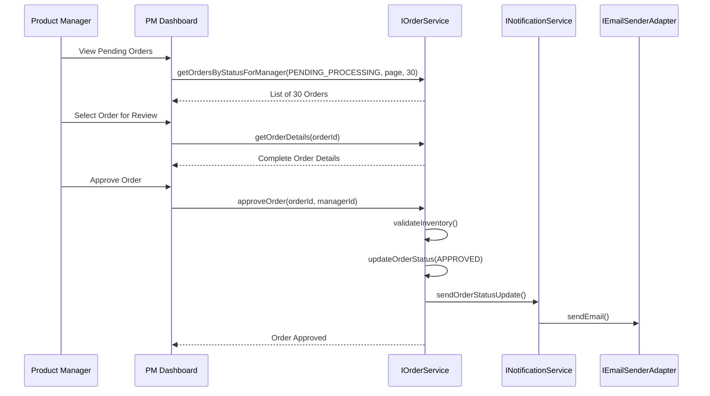

### 3.3 UC-008: Manage Inventory
**Problem Statement Reference:** *"Software will reject accepting the order if there are not enough products in stock"*

#### Implementation Mapping
| Component | File | Method/Function |
|-----------|------|-----------------|
| **Stock Updates** | [`IProductService.java:150`](src/main/java/com/aims/core/application/services/IProductService.java:150) | `updateProductStock(productId, quantityChange)` |
| **Inventory Validation** | [`ICartService.java:44`](src/main/java/com/aims/core/application/services/ICartService.java:44) | `InventoryException` handling |
| **Order Validation** | [`IOrderService.java:39`](src/main/java/com/aims/core/application/services/IOrderService.java:39) | `initiateOrderFromCart()` validation |

## 4. Administrator Use Cases

### 4.1 UC-009: User Management
**Problem Statement Reference:** *"Administrators can create new users, view user information, update user information, delete users, and reset passwords of users"*

#### Implementation Mapping
| Component | File | Method/Function |
|-----------|------|-----------------|
| **Admin Dashboard** | [`admin_dashboard_screen.fxml`](src/main/resources/com/aims/presentation/views/admin_dashboard_screen.fxml) | Main admin interface |
| **User Management** | [`admin_user_management_screen.fxml`](src/main/resources/com/aims/presentation/views/admin_user_management_screen.fxml) | User list and operations |
| **Add User Form** | [`admin_add_user_form.fxml`](src/main/resources/com/aims/presentation/views/admin_add_user_form.fxml) | New user creation |
| **Edit User Form** | [`admin_edit_user_form.fxml`](src/main/resources/com/aims/presentation/views/admin_edit_user_form.fxml) | User modification |
| **Controller** | [`AdminDashboardController.java`](src/main/java/com/aims/core/presentation/controllers/AdminDashboardController.java) | Admin operations |
| **Service Interface** | [`IUserAccountService.java`](src/main/java/com/aims/core/application/services/IUserAccountService.java) | User management service |

#### User Management Operations
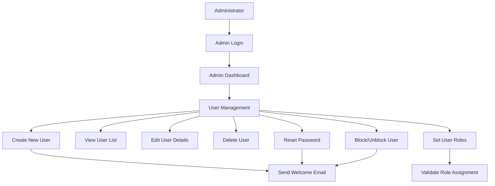

#### User Role Management
| Role Assignment | Implementation | Permissions |
|----------------|----------------|-------------|
| **Administrator** | [`UserRole.ADMIN`](src/main/java/com/aims/core/enums/UserRole.java) | Full system access |
| **Product Manager** | [`UserRole.PRODUCT_MANAGER`](src/main/java/com/aims/core/enums/UserRole.java) | Product and order management |
| **Multiple Roles** | [`UserRoleAssignment.java`](src/main/java/com/aims/core/entities/UserRoleAssignment.java) | User can have multiple roles |

## 5. System Use Cases

### 5.1 UC-010: Payment Processing
**Problem Statement Reference:** *"AIMS software connects to VNPay for further payment process by credit cards"*

#### Implementation Mapping
| Component | File | Method/Function |
|-----------|------|-----------------|
| **Payment Service** | [`IPaymentService.java`](src/main/java/com/aims/core/application/services/IPaymentService.java) | Payment orchestration |
| **VNPay Adapter** | [`IVNPayAdapter.java`](src/main/java/com/aims/core/infrastructure/adapters/external/payment_gateway/IVNPayAdapter.java) | VNPay integration |
| **Payment Strategies** | [`IPaymentStrategy.java`](src/main/java/com/aims/core/application/services/strategies/IPaymentStrategy.java) | Different payment methods |
| **Return Handler** | [`VNPayReturnController.java`](src/main/java/com/aims/core/presentation/controllers/VNPayReturnController.java) | Payment result processing |
| **Payment Result UI** | [`payment_result_screen.fxml`](src/main/resources/com/aims/presentation/views/payment_result_screen.fxml) | Payment confirmation |

#### Payment Processing Flow
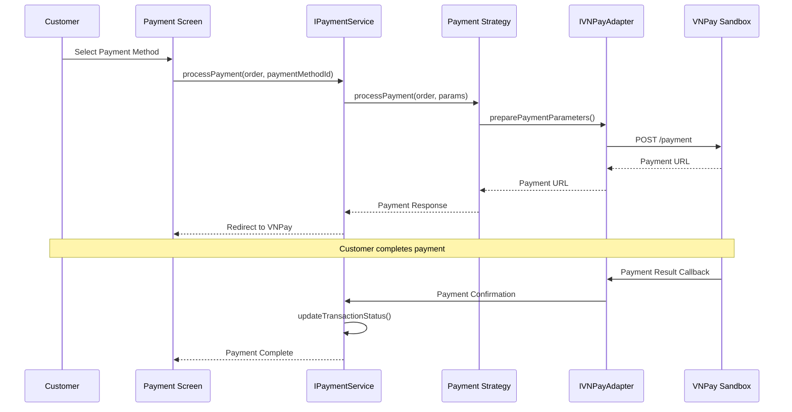

### 5.2 UC-011: Notification System
**Problem Statement Reference:** *"The software will automatically send email notifications to users for administrative actions"*

#### Implementation Mapping
| Component | File | Method/Function |
|-----------|------|-----------------|
| **Notification Service** | [`INotificationService.java`](src/main/java/com/aims/core/application/services/INotificationService.java) | Email orchestration |
| **Service Implementation** | [`NotificationServiceImpl.java`](src/main/java/com/aims/core/application/impl/NotificationServiceImpl.java) | Email content generation |
| **Email Adapter** | [`IEmailSenderAdapter.java`](src/main/java/com/aims/core/infrastructure/adapters/external/email/IEmailSenderAdapter.java) | Email delivery |
| **Stub Implementation** | [`StubEmailSenderAdapter.java`](src/main/java/com/aims/core/infrastructure/adapters/external/email/StubEmailSenderAdapter.java) | Testing implementation |

#### Notification Triggers
| Event | Trigger Location | Email Type |
|-------|-----------------|------------|
| **User Created** | User Account Service | Welcome email |
| **Password Reset** | User Account Service | Password reset instructions |
| **Order Placed** | Order Service | Order confirmation |
| **Order Status Change** | Order Service | Status update notification |
| **Payment Confirmation** | Payment Service | Payment receipt |

## 6. Cross-Cutting Concerns

### 6.1 Data Validation
#### Input Validation Flow
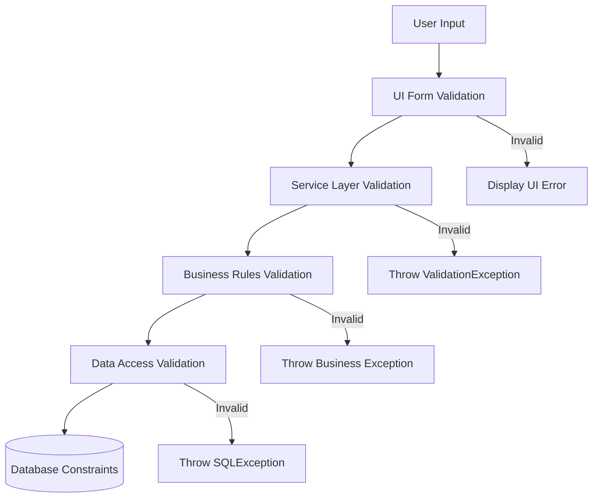

### 6.2 Error Handling
#### Exception Hierarchy
| Exception Type | Usage | Example Location |
|----------------|-------|------------------|
| **ValidationException** | Business rule violations | [`ValidationException.java`](src/main/java/com/aims/core/shared/exceptions/ValidationException.java) |
| **ResourceNotFoundException** | Entity not found | [`ResourceNotFoundException.java`](src/main/java/com/aims/core/shared/exceptions/ResourceNotFoundException.java) |
| **InventoryException** | Stock-related issues | [`InventoryException.java`](src/main/java/com/aims/core/shared/exceptions/InventoryException.java) |
| **PaymentException** | Payment processing errors | [`PaymentException.java`](src/main/java/com/aims/core/shared/exceptions/PaymentException.java) |
| **AuthenticationException** | Authentication failures | [`AuthenticationException.java`](src/main/java/com/aims/core/shared/exceptions/AuthenticationException.java) |

### 6.3 Security Implementation
#### Authentication Flow
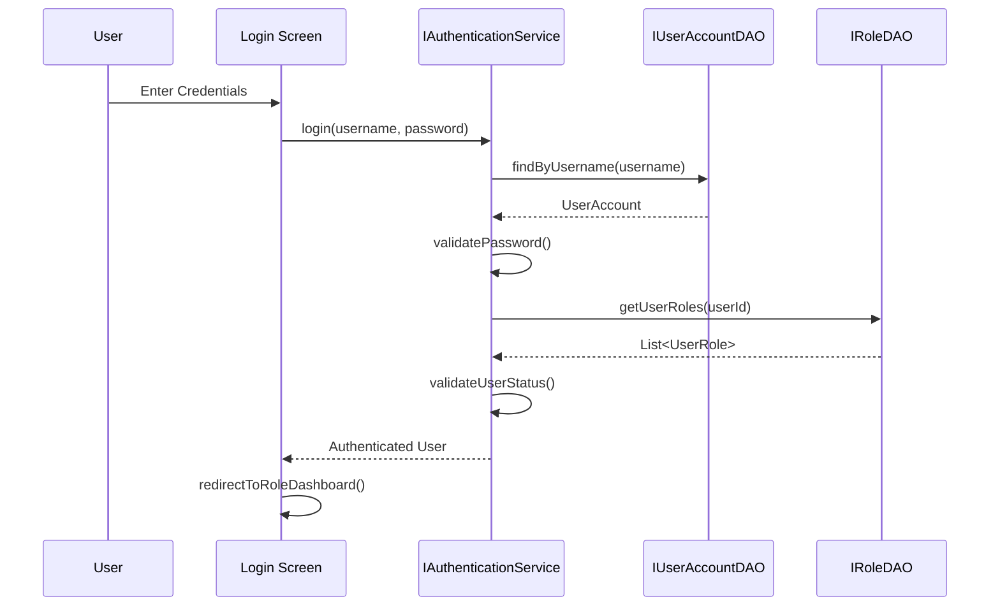

### 6.4 Session Management
#### Session Tracking
| Session Type | Implementation | Storage |
|--------------|----------------|---------|
| **User Session** | Authentication Service | In-memory session store |
| **Cart Session** | Cart Service | Database with session ID |
| **Guest Session** | Cart Service | Generated session ID |

---

**Implementation Summary:**
- **Total Use Cases Mapped:** 11 core use cases
- **Code Coverage:** All major functional requirements traced to implementation
- **Pattern Consistency:** MVC pattern maintained across all use cases
- **Service Integration:** Clear service boundaries and interactions
- **Data Flow:** Complete request-response cycles documented

**Document Control:**
- **Author:** AIMS Architecture Team
- **Review Status:** Use Case Mapping Complete
- **Next Review:** Post-testing validation
- **Distribution:** Development Team, QA Team, Business Analysts