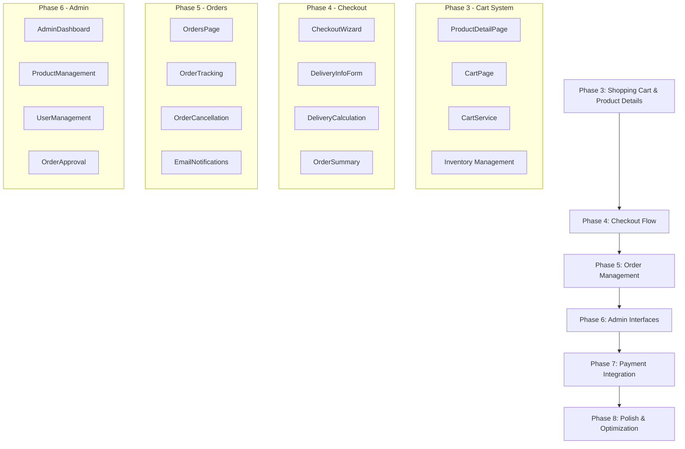
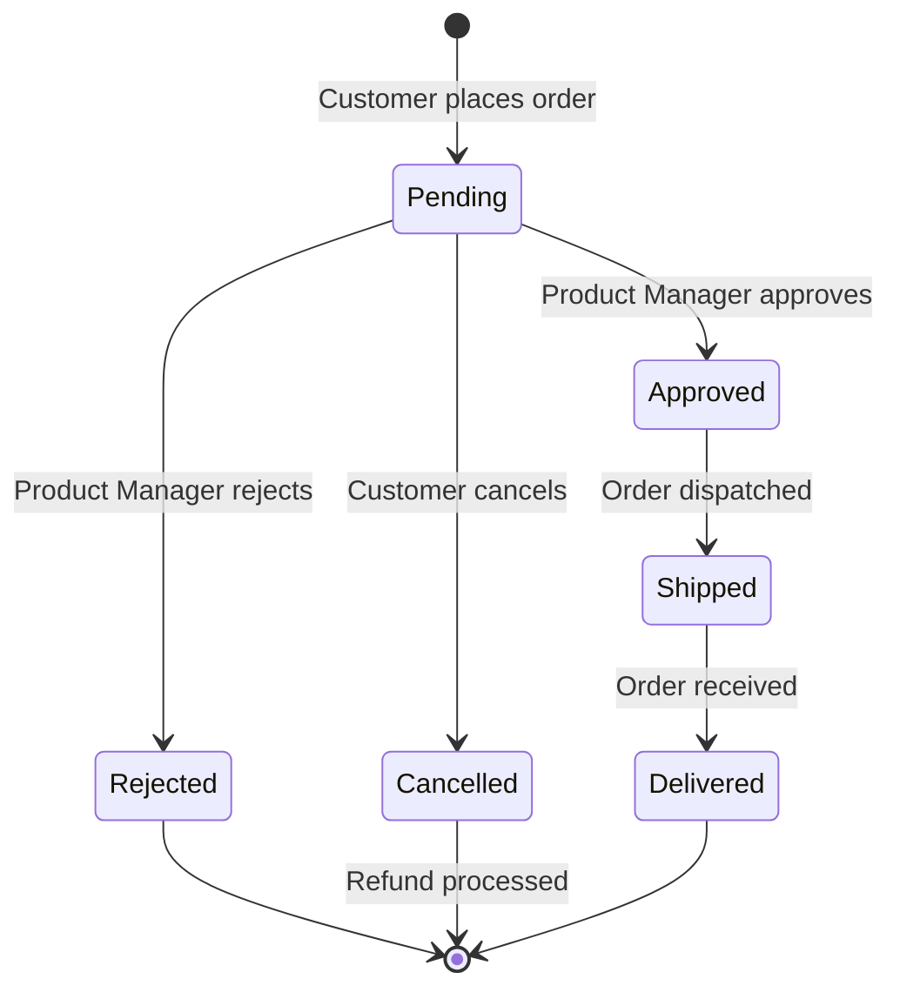
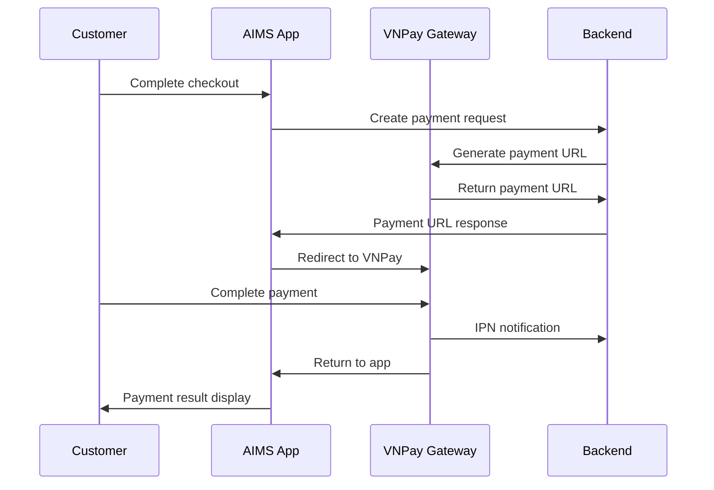

# AIMS Web Application - Complete Implementation Plan

## Executive Summary

This document outlines the comprehensive 6-phase implementation plan to transform the existing AIMS React web application into a complete, store-quality e-commerce platform. The plan builds upon the solid foundation already established (authentication, product browsing) to deliver a fully functional Internet Media Store.

## Project Status Analysis

### ✅ Foundation Complete (Phases 1-2)
- **Phase 1:** React 18 + TypeScript + Vite setup with Tailwind CSS
- **Phase 2.1:** JWT authentication with role-based access control
- **Phase 2.2:** Advanced product search and filtering system

### 🚧 Implementation Required (Phases 3-8)
- Shopping cart functionality
- Complete checkout process
- Order management system
- Admin/Product Manager interfaces
- VNPay payment integration
- Production optimization

## Requirements Analysis from AIMS-ProblemStatement-v2.0.pdf

### Core Business Rules
1. **Product Management:**
   - Support for Books, CDs, LP records, and DVDs
   - Each product type has specific required fields
   - Price constraints: 30%-150% of product value
   - Product managers can update prices max 2x per day
   - Maximum 30 operations per day for security

2. **Shopping Cart & Orders:**
   - Single cart per session, cleared after successful payment
   - 10% VAT calculation on all products
   - Inventory validation before order placement
   - Email notifications for order confirmations

3. **Delivery System:**
   - Standard delivery vs Rush delivery (2-hour, Hanoi inner city only)
   - Delivery fee calculation based on weight and location
   - Free shipping for orders >100,000 VND (max 25,000 VND discount)
   - Rush delivery: +10,000 VND per item

4. **Payment & Refunds:**
   - VNPay integration (sandbox for development)
   - Credit card payments only
   - Order cancellation with automatic refunds
   - Transaction logging and reconciliation

5. **User Roles:**
   - **Customers:** Browse, purchase, track orders (no login required for purchase)
   - **Product Managers:** CRUD operations on products, order approval
   - **Administrators:** User management, system oversight

## 6-Phase Implementation Plan



---

## Phase 3: Shopping Cart & Product Details
**Duration:** 5-7 days | **Priority:** High

### Components to Build

#### 3.1 ProductDetailPage
- **Location:** `web-ui/src/pages/ProductDetailPage.tsx`
- **Features:**
  - Product image gallery with zoom functionality
  - Detailed specifications by product type (Book/CD/LP/DVD)
  - Stock availability display
  - Add to cart with quantity selection
  - Related products recommendations

#### 3.2 CartPage
- **Location:** `web-ui/src/pages/CartPage.tsx`
- **Features:**
  - Cart items list with thumbnails
  - Quantity adjustment controls
  - Remove item functionality
  - Real-time price calculations (subtotal, VAT, total)
  - Stock validation warnings
  - Proceed to checkout button

#### 3.3 Cart Context & Service
- **Location:** `web-ui/src/contexts/CartContext.tsx`
- **Features:**
  - Global cart state management
  - Persistent cart across sessions (localStorage)
  - Add/remove/update quantity operations
  - Real-time inventory checking
  - Cart abandonment handling

#### 3.4 Cart Components
- **CartItem:** Individual cart item with controls
- **CartSummary:** Price breakdown component
- **AddToCartButton:** Smart button with loading states
- **QuantitySelector:** Inventory-aware quantity picker

### Technical Implementation

#### Cart State Structure
```typescript
interface CartState {
  items: CartItem[];
  subtotal: number;
  vatAmount: number;
  total: number;
  lastUpdated: Date;
  sessionId: string;
}

interface CartItem {
  productId: string;
  product: Product;
  quantity: number;
  unitPrice: number;
  totalPrice: number;
  addedAt: Date;
}
```

#### Key Business Logic
1. **Inventory Validation:** Real-time stock checking before add/update
2. **Price Calculation:** Automatic VAT (10%) and total computation
3. **Session Management:** Cart persistence across browser sessions
4. **Stock Warnings:** Proactive low stock notifications

### Acceptance Criteria
- [ ] Product detail pages display all required information by type
- [ ] Users can add products to cart with quantity validation
- [ ] Cart persists across browser sessions
- [ ] Real-time price calculations include VAT
- [ ] Stock validation prevents overselling
- [ ] Cart page shows accurate totals and item details
- [ ] Users can modify quantities and remove items
- [ ] Mobile-responsive design

---

## Phase 4: Complete Checkout Flow
**Duration:** 7-10 days | **Priority:** High

### Components to Build

#### 4.1 CheckoutWizard
- **Location:** `web-ui/src/components/CheckoutWizard.tsx`
- **Features:**
  - Multi-step form with progress indicator
  - Step validation and navigation
  - Form state persistence
  - Error handling and recovery

#### 4.2 DeliveryInfoForm
- **Location:** `web-ui/src/components/forms/DeliveryInfoForm.tsx`
- **Features:**
  - Customer contact information
  - Delivery address with validation
  - Province/city selection for delivery calculation
  - Rush delivery eligibility checking

#### 4.3 DeliveryOptionsSelector
- **Location:** `web-ui/src/components/DeliveryOptionsSelector.tsx`
- **Features:**
  - Standard vs Rush delivery selection
  - Delivery time picker for rush orders
  - Delivery fee calculation and display
  - Rush delivery product eligibility validation

#### 4.4 OrderSummary
- **Location:** `web-ui/src/components/OrderSummary.tsx`
- **Features:**
  - Complete order review
  - Final price breakdown
  - Delivery information confirmation
  - Terms and conditions acceptance

### Delivery Fee Calculation Logic
```typescript
interface DeliveryFeeCalculation {
  standardFee: number;
  rushFee: number;
  freeShippingApplied: boolean;
  heaviestItemWeight: number;
  deliveryZone: 'HANOI_INNER' | 'HCMC_INNER' | 'OTHER';
}

// Business Rules:
// - Hanoi/HCMC inner city: 22,000 VND for first 3kg
// - Other locations: 30,000 VND for first 0.5kg
// - Additional 2,500 VND per 0.5kg
// - Rush delivery: +10,000 VND per item
// - Free shipping: orders >100,000 VND (max 25,000 VND discount)
```

### Acceptance Criteria
- [ ] Multi-step checkout wizard with progress tracking
- [ ] Customer information validation
- [ ] Delivery address input with province selection
- [ ] Rush delivery availability checking for Hanoi inner city
- [ ] Accurate delivery fee calculation based on weight/location
- [ ] Free shipping application for qualifying orders
- [ ] Order summary with complete price breakdown
- [ ] Form validation and error handling
- [ ] Mobile-optimized checkout flow

---

## Phase 5: Order Management System
**Duration:** 6-8 days | **Priority:** High

### Components to Build

#### 5.1 OrdersPage
- **Location:** `web-ui/src/pages/OrdersPage.tsx`
- **Features:**
  - Order history list with pagination
  - Order status filtering
  - Search by order ID or date
  - Quick order actions (view, cancel)

#### 5.2 OrderDetailPage
- **Location:** `web-ui/src/pages/OrderDetailPage.tsx`
- **Features:**
  - Complete order information display
  - Order status timeline
  - Delivery tracking information
  - Order cancellation option (when applicable)
  - Print/download invoice

#### 5.3 Order Status Management
- **Order States:** Pending → Approved → Shipped → Delivered
- **Cancellation:** Available until "Approved" status
- **Email Notifications:** Order confirmation, status updates, cancellation

#### 5.4 Order Services
- **OrderService:** CRUD operations for orders
- **OrderTrackingService:** Status updates and timeline
- **EmailNotificationService:** Automated email sending

### Order State Flow


### Acceptance Criteria
- [ ] Customers can view order history with status
- [ ] Detailed order view with complete information
- [ ] Order cancellation with automatic refund
- [ ] Email notifications for order updates
- [ ] Order status tracking and timeline
- [ ] Product Manager order approval workflow
- [ ] Invoice generation and download
- [ ] Order search and filtering

---

## Phase 6: Admin & Product Manager Interfaces
**Duration:** 8-10 days | **Priority:** Medium

### Components to Build

#### 6.1 AdminDashboard
- **Location:** `web-ui/src/pages/admin/AdminDashboard.tsx`
- **Features:**
  - System overview metrics
  - User management overview
  - Recent activity log
  - Quick action buttons

#### 6.2 ProductManagement
- **Location:** `web-ui/src/pages/admin/ProductManagement.tsx`
- **Features:**
  - Product CRUD operations
  - Bulk product operations (max 10 deletes)
  - Product operation history
  - Image upload and management
  - Price update tracking (max 2 per day)

#### 6.3 UserManagement
- **Location:** `web-ui/src/pages/admin/UserManagement.tsx`
- **Features:**
  - User account CRUD
  - Role assignment
  - User blocking/unblocking
  - Password reset functionality
  - Email notification sending

#### 6.4 OrderApproval
- **Location:** `web-ui/src/pages/pm/OrderApproval.tsx`
- **Features:**
  - Pending orders queue (30 per page)
  - Order review interface
  - Approve/reject actions
  - Stock validation before approval
  - Rejection reason logging

### Security & Validation Rules
- **Product Operations:** Max 30 per day, max 10 bulk deletes
- **Price Updates:** Maximum 2 per day per product
- **User Management:** Admin-only access
- **Order Approval:** Product Manager or Admin roles
- **Audit Logging:** All operations tracked

### Acceptance Criteria
- [ ] Admin dashboard with system metrics
- [ ] Product CRUD with business rule enforcement
- [ ] User management with role assignment
- [ ] Order approval workflow for Product Managers
- [ ] Operation audit logging
- [ ] Business rule validation (daily limits)
- [ ] Bulk operations with safety limits
- [ ] Email notifications for admin actions

---

## Phase 7: VNPay Payment Integration
**Duration:** 5-7 days | **Priority:** High

### Components to Build

#### 7.1 VNPayProcessor
- **Location:** `web-ui/src/components/VNPayProcessor.tsx`
- **Features:**
  - VNPay payment URL generation
  - Payment redirect handling
  - Return URL processing
  - IPN (Instant Payment Notification) handling

#### 7.2 PaymentResult
- **Location:** `web-ui/src/pages/PaymentResult.tsx`
- **Features:**
  - Payment success/failure display
  - Transaction details
  - Order confirmation
  - Email notification trigger

#### 7.3 RefundProcessor
- **Location:** `web-ui/src/services/RefundService.tsx`
- **Features:**
  - Automatic refund for cancelled orders
  - Refund status tracking
  - VNPay refund API integration

### VNPay Integration Points
- **Payment Gateway:** VNPay Sandbox environment
- **API Endpoints:** Payment creation, query, refund
- **Security:** HMAC signature validation
- **Testing:** VNPay demo environment

### Payment Flow


### Acceptance Criteria
- [ ] VNPay sandbox integration working
- [ ] Payment URL generation and redirect
- [ ] Payment result processing
- [ ] IPN handling for payment confirmation
- [ ] Automatic refund for cancelled orders
- [ ] Transaction logging and reconciliation
- [ ] Error handling for payment failures
- [ ] Security validation (HMAC signatures)

---

## Phase 8: Polish & Production Optimization
**Duration:** 4-6 days | **Priority:** Medium

### Optimization Areas

#### 8.1 Performance Optimization
- **Code Splitting:** Route-based lazy loading
- **Bundle Optimization:** Tree shaking and minification
- **Image Optimization:** WebP format, lazy loading
- **API Optimization:** Request deduplication, caching

#### 8.2 Responsive Design Enhancement
- **Mobile First:** Touch-optimized interactions
- **Tablet Optimization:** Layout adjustments
- **Desktop Enhancement:** Multi-column layouts
- **Print Styles:** Invoice and order printing

#### 8.3 Error Handling & UX
- **Error Boundaries:** Graceful error recovery
- **Loading States:** Skeleton screens and spinners
- **Offline Support:** Service worker for basic functionality
- **Accessibility:** WCAG 2.1 compliance

#### 8.4 Testing & Documentation
- **Unit Tests:** Critical business logic
- **Integration Tests:** End-to-end user flows
- **User Documentation:** Customer and admin guides
- **API Documentation:** Service layer documentation

### Production Readiness Checklist
- [ ] Code splitting implemented
- [ ] Images optimized and lazy loaded
- [ ] Error boundaries in place
- [ ] Loading states for all async operations
- [ ] Mobile-responsive design verified
- [ ] Accessibility testing completed
- [ ] Performance metrics within targets
- [ ] User acceptance testing passed

---

## Technical Architecture

### Frontend Stack
- **Framework:** React 18 with TypeScript
- **Styling:** Tailwind CSS with custom design system
- **State Management:** React Context + Zustand for complex state
- **Routing:** React Router v6 with protected routes
- **API Layer:** React Query for server state
- **Forms:** React Hook Form with Zod validation
- **Animations:** Framer Motion
- **Build Tool:** Vite with TypeScript

### Backend Integration
- **API Protocol:** REST APIs (existing Java backend)
- **Authentication:** JWT tokens with refresh mechanism
- **File Upload:** Multipart form data for product images
- **Email Service:** Java backend email service
- **Payment Gateway:** VNPay REST APIs
- **Database:** SQLite (existing backend)

### Development Standards
- **Code Quality:** ESLint + Prettier, TypeScript strict mode
- **Component Design:** Atomic design principles
- **Testing:** Jest + React Testing Library
- **Documentation:** JSDoc comments, README files
- **Version Control:** Git with conventional commits

---

## Success Metrics

### Technical Metrics
- **Performance:** Core Web Vitals scores >90
- **Bundle Size:** <500KB initial load
- **Test Coverage:** >80% for critical paths
- **Accessibility:** WCAG 2.1 AA compliance

### Business Metrics
- **Conversion Rate:** Cart to order completion >70%
- **User Experience:** <3 clicks to complete purchase
- **Error Rate:** <1% payment failures
- **Mobile Usage:** Fully functional on mobile devices

### Quality Standards
- **Professional Design:** E-commerce industry standards
- **Responsive Layout:** All device sizes supported
- **Error Handling:** Graceful degradation
- **Documentation:** Complete user and developer guides

---

## Risk Mitigation

### Technical Risks
- **VNPay Integration:** Use sandbox extensively for testing
- **Performance:** Implement progressive loading and optimization
- **Cross-browser:** Test on all major browsers
- **Mobile Compatibility:** Mobile-first development approach

### Business Risks
- **User Experience:** Continuous usability testing
- **Data Loss:** Implement proper error boundaries and recovery
- **Security:** Follow OWASP guidelines for web security
- **Scalability:** Design for future growth and feature expansion

---

## Delivery Timeline

| Phase | Duration | Start | End | Deliverables |
|-------|----------|-------|-----|-------------|
| Phase 3 | 5-7 days | Day 1 | Day 7 | Shopping Cart & Product Details |
| Phase 4 | 7-10 days | Day 8 | Day 17 | Complete Checkout Flow |
| Phase 5 | 6-8 days | Day 18 | Day 25 | Order Management System |
| Phase 6 | 8-10 days | Day 26 | Day 35 | Admin & PM Interfaces |
| Phase 7 | 5-7 days | Day 36 | Day 42 | VNPay Payment Integration |
| Phase 8 | 4-6 days | Day 43 | Day 48 | Polish & Optimization |

**Total Duration:** 35-48 days
**Target Completion:** 6-7 weeks

---

## Conclusion

This comprehensive plan transforms the existing AIMS React application into a complete, professional e-commerce platform. By building upon the solid foundation already established, we can deliver a store-quality web application that meets all business requirements while maintaining high technical standards.

The phased approach ensures steady progress with regular deliverables, allowing for feedback and adjustments throughout the development process. Each phase builds upon the previous one, creating a cohesive and fully functional Internet Media Store.

**Next Steps:**
1. Review and approve this implementation plan
2. Begin Phase 3: Shopping Cart & Product Details implementation
3. Set up development workflow and testing procedures
4. Establish regular progress reviews and quality checkpoints