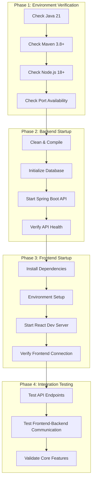

# 🚀 AIMS Web Application Startup Plan

## 📋 Project Overview

The AIMS project is a sophisticated e-commerce system with dual architecture:

- **Backend**: Spring Boot 3.2.1 + Java 21 + SQLite database
- **Frontend**: React 19 + TypeScript + Vite + TailwindCSS v4
- **Architecture**: RESTful API with comprehensive business logic
- **Features**: Product browsing, cart management, checkout, payment (VNPay), order tracking

## 🎯 Startup Plan



## 📝 Detailed Implementation Steps

### **Phase 1: Environment Verification (5 minutes)**

1. **System Requirements Check**
   ```bash
   # Verify Java 21
   java -version
   
   # Verify Maven
   mvn -version
   
   # Verify Node.js & npm
   node --version
   npm --version
   ```

2. **Port Availability Check**
   ```bash
   # Check if port 8080 is free (Backend API)
   lsof -i :8080
   
   # Check if port 3000 is free (Frontend)
   lsof -i :3000
   ```

### **Phase 2: Backend API Startup (3-5 minutes)**

1. **Database & Dependencies Setup**
   ```bash
   cd /Users/namu10x/workspace/hust/javafxml-AIMS
   
   # Clean and compile
   mvn clean compile
   
   # Database will auto-initialize on first run
   ```

2. **Start Spring Boot API Server**
   ```bash
   # Option A: Direct Maven command
   mvn spring-boot:run
   
   # Option B: Use deployment script (if available)
   ./start-dev-server.sh
   ```

3. **API Health Verification**
   ```bash
   # Check basic health
   curl http://localhost:8080/actuator/health
   
   # Verify API documentation
   # Open: http://localhost:8080/swagger-ui/index.html
   ```

### **Phase 3: Frontend Startup (2-3 minutes)**

1. **Frontend Dependencies**
   ```bash
   cd web-ui
   
   # Install dependencies (first time only)
   npm install
   ```

2. **Environment Configuration**
   - Verify `web-ui/.env.development` contains:
     ```env
     VITE_API_BASE_URL=http://localhost:8080/api
     VITE_APP_TITLE=AIMS - Internet Media Store
     ```

3. **Start React Development Server**
   ```bash
   # Start frontend
   npm run dev
   ```

### **Phase 4: Integration Testing (2-3 minutes)**

1. **Backend API Testing**
   ```bash
   # Test products endpoint
   curl http://localhost:8080/api/products
   
   # Test authentication endpoint
   curl http://localhost:8080/api/auth/login
   ```

2. **Frontend Verification**
   - Access: http://localhost:3000
   - Verify product loading
   - Test cart functionality
   - Check checkout flow

## 🔧 Configuration Details

### **Backend Configuration**
- **Main Class**: `com.aims.core.AimsWebApiApplication`
- **Port**: 8080
- **Database**: SQLite (auto-created as `aims_database.db`)
- **API Documentation**: http://localhost:8080/swagger-ui/index.html

### **Frontend Configuration**
- **Framework**: React 19 + TypeScript + Vite
- **Port**: 3000
- **API Integration**: Configured for http://localhost:8080/api
- **Build Tool**: Vite with optimized chunking

## 🚨 Common Issues & Solutions

### **Backend Issues**
1. **Port 8080 conflicts**: Change port in `src/main/resources/app.properties`
2. **Java version**: Ensure Java 21+ is installed
3. **Maven dependencies**: Run `mvn clean install -U`

### **Frontend Issues**
1. **Port 3000 conflicts**: Use `npm run dev -- --port 3001`
2. **TailwindCSS v4**: Modern version included in `package.json`
3. **API connection**: Verify backend is running first

### **Database Issues**
1. **Auto-initialization**: Database creates automatically on first run
2. **Sample data**: Included in initial setup
3. **Reset database**: Delete `aims_database.db` and restart

## ✅ Success Indicators

### **Backend Success**
- ✅ API responds at http://localhost:8080/actuator/health
- ✅ Swagger UI loads at http://localhost:8080/swagger-ui/index.html
- ✅ Database file `aims_database.db` created
- ✅ No errors in console logs

### **Frontend Success**
- ✅ React app loads at http://localhost:3000
- ✅ Products display correctly
- ✅ Navigation works smoothly
- ✅ No console errors in browser

### **Integration Success**
- ✅ Frontend can fetch data from backend
- ✅ Cart operations work
- ✅ API calls complete successfully

## 🎯 Expected Outcomes

After successful startup, you'll have:

1. **Customer Shopping Experience**:
   - Product browsing and search
   - Shopping cart management
   - Checkout with delivery options
   - Payment integration (VNPay sandbox)
   - Order tracking

2. **Technical Infrastructure**:
   - REST API with full business logic
   - SQLite database with sample data
   - Modern React frontend with TypeScript
   - Comprehensive error handling

3. **Business Features**:
   - VAT calculations (10%)
   - Rush delivery (Hanoi districts)
   - Free shipping rules (>100,000 VND)
   - Stock management
   - Price constraints enforcement

## 🔄 Development Workflow

Once running, your development workflow will be:

1. **Backend changes**: Auto-reload with Spring Boot DevTools
2. **Frontend changes**: Hot Module Replacement (HMR) with Vite
3. **Database changes**: SQLite browser or `sqlite3` commands
4. **API testing**: Swagger UI or curl commands

## 📚 Key URLs

- **Frontend**: http://localhost:3000
- **Backend API**: http://localhost:8080
- **API Documentation**: http://localhost:8080/swagger-ui/index.html
- **API Health**: http://localhost:8080/actuator/health

## 🎉 Next Steps

After successful startup:
1. Test the customer shopping experience
2. Explore the API documentation
3. Review business rules implementation
4. Run the comprehensive test suite if needed

---

**🚀 Ready to launch your AIMS web application!**