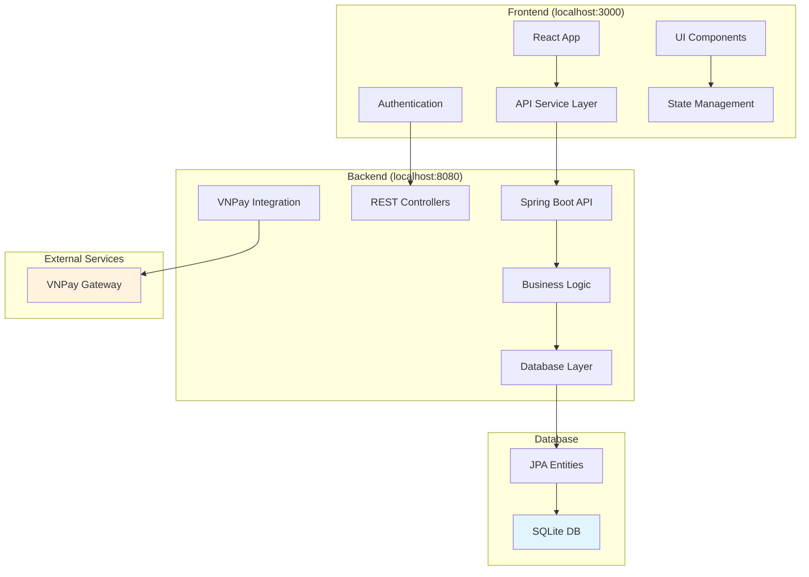

# AIMS Web UI Integration & Testing Plan

## Overview
Complete integration testing plan for AIMS e-commerce system with Spring Boot backend (port 8080) and React frontend (port 3000). Focus on enabling database functionality and ensuring seamless web UI communication.

## Current System Status

### ✅ Backend (Spring Boot)
- **Port:** 8080
- **API Endpoints:** 7 main controllers (Products, Orders, Payments, Users, Admin, Cart, Auth)
- **Security:** Configured with permissive settings for development
- **VNPay Integration:** Ready
- **Swagger Documentation:** Enabled at `/swagger-ui/`
- **CORS:** Configured for `http://localhost:3000`

### ✅ Frontend (React + TypeScript)
- **Port:** 3000 (Vite dev server)
- **API Client:** Configured for `http://localhost:8080/api`
- **Services Layer:** Complete (9 service classes)
- **Authentication:** JWT token handling implemented
- **Error Handling:** Comprehensive with retry logic

### ⚠️ Issues Identified
1. **Database Disabled:** SQLite configuration commented out
2. **TailwindCSS v4:** Configuration issues preventing proper styling
3. **Integration Testing:** Not yet validated end-to-end

## Implementation Plan

### Phase 1: Database Activation (30 minutes)

#### 1.1 Enable SQLite Database
**File:** `src/main/resources/application.properties`

**Changes Required:**
```properties
# Uncomment and configure database
spring.datasource.url=jdbc:sqlite:aims_database.db
spring.datasource.driver-class-name=org.xerial.sqlite.JDBC
spring.datasource.username=
spring.datasource.password=

# Uncomment JPA configuration
spring.jpa.database-platform=org.hibernate.dialect.SQLiteDialect
spring.jpa.hibernate.ddl-auto=create-drop
spring.jpa.show-sql=true
spring.jpa.properties.hibernate.format_sql=true
spring.sql.init.mode=always

# Remove auto-configuration exclusion
# spring.autoconfigure.exclude=...
```

#### 1.2 Verify Database Schema
- Check entity classes for proper JPA annotations
- Ensure database initialization scripts exist
- Validate foreign key relationships

#### 1.3 Test Database Connection
- Restart Spring Boot application
- Verify database file creation (`aims_database.db`)
- Check application logs for successful initialization

### Phase 2: Backend API Validation (45 minutes)

#### 2.1 Core API Endpoint Testing
**Using curl commands:**

```bash
# Health Check
curl http://localhost:8080/actuator/health

# Product APIs
curl http://localhost:8080/api/products
curl http://localhost:8080/api/products/categories

# User APIs  
curl http://localhost:8080/api/users/all

# Cart APIs
curl http://localhost:8080/api/cart/create

# Payment APIs
curl http://localhost:8080/api/payments/methods
```

#### 2.2 Swagger Documentation Verification
- Access: `http://localhost:8080/swagger-ui/`
- Test endpoints directly from Swagger UI
- Validate request/response schemas

#### 2.3 CORS Configuration Testing
```bash
# Test CORS headers
curl -H "Origin: http://localhost:3000" \
     -H "Access-Control-Request-Method: POST" \
     -H "Access-Control-Request-Headers: X-Requested-With" \
     -X OPTIONS \
     http://localhost:8080/api/products
```

### Phase 3: TailwindCSS Configuration Fix (60 minutes)

#### 3.1 PostCSS Configuration
**File:** `web-ui/postcss.config.js`

**Current Issue:** TailwindCSS v4 compatibility
**Fix Required:**
```javascript
export default {
  plugins: [
    '@tailwindcss/postcss',
    'autoprefixer',
  ],
}
```

#### 3.2 TailwindCSS Configuration Update
**File:** `web-ui/tailwind.config.js`

**Update for v4 compatibility:**
```javascript
import { type Config } from 'tailwindcss'

export default {
  content: [
    "./index.html",
    "./src/**/*.{js,ts,jsx,tsx}",
  ],
  theme: {
    extend: {},
  },
  plugins: [],
} satisfies Config
```

#### 3.3 Package Dependencies Verification
**Check:** `web-ui/package.json`
- Verify TailwindCSS v4.1.10 compatibility
- Ensure PostCSS plugins are correctly configured
- Test build process

#### 3.4 CSS Pipeline Testing
```bash
cd web-ui
npm run dev  # Test development build
npm run build  # Test production build
```

### Phase 4: Frontend Development Server & API Integration (45 minutes)

#### 4.1 Environment Configuration
**File:** `web-ui/.env.local` (create if needed)
```env
VITE_API_BASE_URL=http://localhost:8080/api
```

#### 4.2 Start Development Servers
```bash
# Terminal 1: Backend
mvn spring-boot:run -Dmaven.test.skip=true

# Terminal 2: Frontend
cd web-ui
npm run dev
```

#### 4.3 API Connection Validation
- Check browser network tab for API calls
- Verify CORS headers in responses
- Test authentication flow

### Phase 5: End-to-End Integration Testing (90 minutes)

#### 5.1 Authentication Flow Testing
**Test Sequence:**
1. User registration/login via frontend
2. JWT token storage verification
3. Protected route access
4. Token refresh mechanism
5. Logout functionality

**Files to Monitor:**
- `web-ui/src/services/authService.ts`
- Browser localStorage for tokens
- Network requests for Authorization headers

#### 5.2 Product Management Testing
**Test Cases:**
1. **Product Listing:**
   - Load products from API
   - Search functionality
   - Pagination
   - Category filtering

2. **Product Details:**
   - Individual product view
   - Image loading
   - Add to cart functionality

3. **Admin Operations:**
   - Create new products
   - Update existing products
   - Delete products
   - Bulk operations

#### 5.3 Shopping Cart Integration
**Test Workflow:**
1. Add products to cart (guest user)
2. Cart persistence across page reloads
3. User login and cart association
4. Quantity updates
5. Item removal
6. Cart clearing

#### 5.4 Order Processing Flow
**Complete Workflow:**
1. Cart → Checkout initiation
2. Delivery information entry
3. Shipping fee calculation
4. Order creation
5. Payment processing (VNPay)
6. Order confirmation
7. Status tracking

#### 5.5 Payment Integration Testing
**VNPay Integration:**
1. Payment method selection
2. VNPay redirect flow
3. Payment callback handling
4. Transaction status updates
5. Refund processing (if applicable)

**Test with:**
- Mock payment data (sandbox mode)
- Error scenarios (failed payments)
- Callback validation

### Phase 6: Performance & Development Optimization (30 minutes)

#### 6.1 Bundle Size Analysis
```bash
cd web-ui
npm run build:analyze
npm run perf:bundle-size
```

#### 6.2 Performance Monitoring
- Lighthouse audit: `npm run perf:lighthouse`
- Check bundle splits in `vite.config.ts`
- Verify lazy loading implementation

#### 6.3 Development Tools Setup
- React DevTools validation
- Network request debugging
- Error boundary testing
- Hot reload verification

## Integration Architecture



## Critical Success Criteria

### ✅ Backend Readiness
- [ ] Database successfully initialized
- [ ] All API endpoints responding correctly
- [ ] CORS configured properly
- [ ] Swagger documentation accessible

### ✅ Frontend Integration
- [ ] TailwindCSS styling working
- [ ] API client connecting successfully
- [ ] Authentication flow functional
- [ ] Error handling operational

### ✅ Core Workflows
- [ ] User registration/login
- [ ] Product browsing and search
- [ ] Cart management
- [ ] Order creation
- [ ] Payment processing

### ✅ Development Environment
- [ ] Hot reload working
- [ ] Build process successful
- [ ] Performance benchmarks met
- [ ] Development tools functional

## Risk Mitigation

### High Priority Risks
1. **Database Schema Issues**
   - *Mitigation:* Validate entity relationships before enabling
   - *Fallback:* Use H2 in-memory database initially

2. **TailwindCSS v4 Compatibility**
   - *Mitigation:* Follow official v4 migration guide
   - *Fallback:* Downgrade to v3 if necessary

3. **VNPay Integration**
   - *Mitigation:* Use sandbox environment for testing
   - *Fallback:* Mock payment service implementation

### Medium Priority Risks
1. **CORS Configuration**
   - *Mitigation:* Test with multiple browser environments
   
2. **Performance Issues**
   - *Mitigation:* Monitor bundle sizes and optimize

## Timeline Estimate

| Phase | Duration | Priority |
|-------|----------|----------|
| Database Activation | 30 min | High |
| Backend API Validation | 45 min | High |
| TailwindCSS Fix | 60 min | High |
| Frontend Setup | 45 min | Medium |
| E2E Integration Testing | 90 min | High |
| Performance Optimization | 30 min | Low |
| **Total** | **5 hours** | |

## Success Metrics

### Performance Targets
- **API Response Time:** < 200ms for standard requests
- **Frontend Bundle Size:** < 200KB main bundle
- **Page Load Time:** < 2 seconds initial load
- **Lighthouse Score:** > 90 for performance

### Functional Targets
- **API Coverage:** All 7 controllers functional
- **User Workflows:** Complete e-commerce flow working
- **Error Handling:** Graceful failure scenarios
- **Responsive Design:** Mobile and desktop compatibility

## Next Steps After Completion

1. **Production Deployment Preparation**
   - Environment variable configuration
   - Security hardening
   - Performance optimization

2. **Automated Testing Setup**
   - Unit test coverage
   - Integration test suite
   - E2E test automation

3. **Monitoring & Analytics**
   - Application monitoring setup
   - User analytics integration
   - Performance tracking

---

## Execution Notes

This plan prioritizes database activation first to ensure full system functionality, followed by systematic testing of each integration point. The modular approach allows for iterative testing and issue resolution.

**Ready to execute!** 🚀