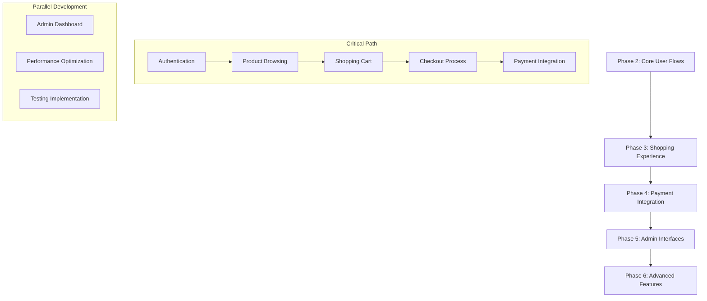

# AIMS Web UI - Next Phases Implementation Plan

## Executive Summary

With Phase 1 (Foundation & Setup) successfully completed, this document outlines the detailed implementation plan for Phases 2-5 of the AIMS Web UI project. Each phase will be broken down into executable subtasks with clear deliverables and dependencies.

## Current Status
- ✅ **Phase 1**: Foundation & Setup (COMPLETED)
  - React 18 + TypeScript + Vite environment
  - REST API layer with 8 controllers
  - 6 frontend services mapped to backend
  - Design system with Tailwind CSS
  - Development server running successfully

## Phase 2: Core User Flows (Priority: HIGH)
**Timeline**: 3 weeks | **Complexity**: High

### 2.1 Authentication System Implementation
**Duration**: 1 week | **Priority**: Critical

#### Components to Build:
- `LoginForm` - Secure login with validation
- `AuthProvider` - React context for auth state
- `ProtectedRoute` - Route protection wrapper
- `UserMenu` - Authenticated user navigation
- `LogoutConfirmation` - Secure logout flow

#### API Integration:
- JWT token management
- Session persistence
- Role-based access control
- Automatic token refresh

#### Acceptance Criteria:
- [ ] Users can log in with valid credentials
- [ ] Invalid login attempts show appropriate errors
- [ ] JWT tokens are stored securely
- [ ] Protected routes redirect to login
- [ ] Role-based UI rendering works
- [ ] Logout clears all session data

### 2.2 Product Browsing & Discovery
**Duration**: 1.5 weeks | **Priority**: High

#### Components to Build:
- `ProductGrid` - Responsive masonry layout
- `ProductCard` - Interactive product display
- `SearchBar` - Real-time search with filters
- `CategoryFilter` - Dynamic category filtering
- `PriceRangeFilter` - Price-based filtering
- `SortingControls` - Sort by price, name, popularity
- `Pagination` - Efficient product loading

#### Features:
- Infinite scroll with lazy loading
- Image optimization and lazy loading
- Search result highlighting
- Filter combination logic
- Responsive grid adaptation
- Product quick actions

#### Acceptance Criteria:
- [ ] Product grid displays correctly on all screen sizes
- [ ] Search returns relevant results in <500ms
- [ ] Filters work individually and in combination
- [ ] Pagination loads smoothly without flicker
- [ ] Images load progressively
- [ ] Mobile touch interactions work properly

### 2.3 Product Detail & Information
**Duration**: 0.5 weeks | **Priority**: Medium

#### Components to Build:
- `ProductDetailView` - Comprehensive product display
- `ImageGallery` - Product image carousel
- `ProductSpecs` - Dynamic specifications display
- `StockIndicator` - Real-time availability
- `QuantitySelector` - Smart quantity controls
- `AddToCartButton` - Cart integration

#### Features:
- High-resolution image zoom
- Mobile-friendly image swiping
- Related products suggestions
- Social sharing buttons
- Print-friendly view

#### Acceptance Criteria:
- [ ] Product details load in <1s
- [ ] Image gallery works on mobile and desktop
- [ ] Stock levels update in real-time
- [ ] Quantity validation prevents overselling
- [ ] Add to cart provides immediate feedback

## Phase 3: Shopping Experience (Priority: HIGH)
**Timeline**: 2 weeks | **Complexity**: High

### 3.1 Shopping Cart Management
**Duration**: 1 week | **Priority**: Critical

#### Components to Build:
- `CartDrawer` - Slide-out cart interface
- `CartItem` - Individual cart item management
- `CartSummary` - Price calculation display
- `CartIcon` - Header cart indicator
- `EmptyCartState` - Encouraging empty state
- `ClearCartConfirmation` - Bulk removal safety

#### Features:
- Real-time price updates
- Quantity adjustment with debouncing
- Item removal with undo option
- Cart persistence across sessions
- Stock validation before checkout
- Shipping estimate calculator

#### Acceptance Criteria:
- [ ] Cart updates reflect immediately in UI
- [ ] Quantity changes update prices correctly
- [ ] Cart persists between browser sessions
- [ ] Stock warnings appear for unavailable items
- [ ] Cart icon shows accurate item count
- [ ] Mobile cart drawer is touch-friendly

### 3.2 Checkout Process
**Duration**: 1 week | **Priority**: Critical

#### Components to Build:
- `CheckoutWizard` - Multi-step checkout flow
- `CustomerInfoForm` - User details collection
- `DeliveryAddressForm` - Shipping information
- `DeliveryOptionsSelector` - Standard/Rush delivery
- `OrderSummary` - Final order review
- `CheckoutProgress` - Step indicator

#### Features:
- Form validation with real-time feedback
- Address autocomplete/validation
- Delivery cost calculation
- Order total breakdown
- Save address for future use
- Mobile-optimized form layouts

#### Acceptance Criteria:
- [ ] Checkout process is intuitive and fast
- [ ] Form validation prevents invalid submissions
- [ ] Delivery costs calculate accurately
- [ ] Users can save delivery addresses
- [ ] Progress indicator shows current step
- [ ] Back/forward navigation works correctly

## Phase 4: Payment Integration (Priority: HIGH)
**Timeline**: 2 weeks | **Complexity**: Very High

### 4.1 Payment Method Selection
**Duration**: 0.5 weeks | **Priority**: High

#### Components to Build:
- `PaymentMethodSelector` - Payment option interface
- `PaymentMethodCard` - Individual payment display
- `PaymentSecurity` - Security information display

#### Features:
- VNPay integration preparation
- Payment method validation
- Security badge display
- Terms and conditions

#### Acceptance Criteria:
- [ ] Payment methods display correctly
- [ ] Selection state is clearly indicated
- [ ] Security information builds user confidence
- [ ] Terms are easily accessible

### 4.2 VNPay Integration
**Duration**: 1 week | **Priority**: Critical

#### Components to Build:
- `VNPayProcessor` - Payment processing interface
- `PaymentLoading` - Processing state display
- `PaymentSuccess` - Success confirmation
- `PaymentFailure` - Error handling and retry
- `TransactionDetails` - Payment information display

#### Features:
- Secure payment redirection
- Transaction status polling
- Error handling and retry logic
- Receipt generation
- Order confirmation email

#### Acceptance Criteria:
- [ ] VNPay integration works end-to-end
- [ ] Payment failures are handled gracefully
- [ ] Success states provide clear confirmation
- [ ] Transaction details are accurate
- [ ] Users receive proper receipts

### 4.3 Order Completion
**Duration**: 0.5 weeks | **Priority**: Medium

#### Components to Build:
- `OrderConfirmation` - Order success display
- `TrackingInformation` - Order tracking details
- `DownloadReceipt` - Invoice download
- `ContinueShopping` - Return to store

#### Acceptance Criteria:
- [ ] Order confirmation displays all details
- [ ] Tracking information is accessible
- [ ] Receipt download works correctly
- [ ] Users can easily continue shopping

## Phase 5: Administrative Interfaces (Priority: MEDIUM)
**Timeline**: 2 weeks | **Complexity**: Medium

### 5.1 Admin Dashboard
**Duration**: 1 week | **Priority**: Medium

#### Components to Build:
- `AdminLayout` - Administrative interface layout
- `AdminSidebar` - Navigation for admin functions
- `DashboardOverview` - Key metrics display
- `QuickActions` - Common administrative tasks

#### Features:
- Role-based access control
- Responsive admin interface
- Quick action buttons
- System health indicators

#### Acceptance Criteria:
- [ ] Admin interface is intuitive and efficient
- [ ] Only authorized users can access admin features
- [ ] Dashboard shows relevant system metrics
- [ ] Quick actions work correctly

### 5.2 Product Management
**Duration**: 0.5 weeks | **Priority**: Medium

#### Components to Build:
- `ProductList` - Administrative product display
- `ProductForm` - Product creation/editing
- `ProductBulkActions` - Batch operations
- `ImageUpload` - Product image management

#### Features:
- CRUD operations for products
- Bulk product operations
- Image upload and optimization
- Inventory management
- Category management

#### Acceptance Criteria:
- [ ] Products can be created, edited, and deleted
- [ ] Bulk operations work efficiently
- [ ] Image uploads are processed correctly
- [ ] Inventory levels are manageable

### 5.3 User Management
**Duration**: 0.5 weeks | **Priority**: Low

#### Components to Build:
- `UserList` - User administration interface
- `UserForm` - User creation/editing
- `RoleAssignment` - Role management
- `UserActions` - User account actions

#### Features:
- User account management
- Role assignment interface
- User activity monitoring
- Account status management

#### Acceptance Criteria:
- [ ] User accounts can be managed effectively
- [ ] Roles are assigned correctly
- [ ] User activity is trackable
- [ ] Account statuses update properly

## Phase 6: Advanced Features & Polish (Priority: LOW)
**Timeline**: 1 week | **Complexity**: Medium

### 6.1 Performance Optimization
**Duration**: 0.5 weeks | **Priority**: Medium

#### Optimizations:
- Code splitting and lazy loading
- Image optimization and WebP support
- Bundle size optimization
- Cache optimization
- Performance monitoring

#### Acceptance Criteria:
- [ ] Initial page load is <2s
- [ ] Bundle size is <300KB gzipped
- [ ] Images load progressively
- [ ] Performance scores >90 on Lighthouse

### 6.2 Testing & Quality Assurance
**Duration**: 0.5 weeks | **Priority**: High

#### Testing Implementation:
- Unit tests for components
- Integration tests for API calls
- End-to-end testing
- Accessibility testing
- Cross-browser testing

#### Acceptance Criteria:
- [ ] Test coverage is >80%
- [ ] All critical user flows are tested
- [ ] Accessibility standards are met
- [ ] Cross-browser compatibility confirmed

## Implementation Priority Matrix

## Risk Assessment & Mitigation

### High-Risk Areas
1. **VNPay Integration**
   - Risk: Payment gateway API changes
   - Mitigation: Thorough testing, fallback options

2. **Performance on Mobile**
   - Risk: Slow loading on mobile devices
   - Mitigation: Progressive loading, image optimization

3. **Cross-Browser Compatibility**
   - Risk: Features breaking in different browsers
   - Mitigation: Comprehensive testing matrix

### Medium-Risk Areas
1. **Complex State Management**
   - Risk: Cart and checkout state inconsistencies
   - Mitigation: Comprehensive state testing

2. **Security Vulnerabilities**
   - Risk: Authentication/authorization issues
   - Mitigation: Security audits, best practices

## Success Metrics

### User Experience
- Page load time: <2s
- Cart abandonment rate: <30%
- Checkout completion rate: >85%
- Mobile usability score: >90

### Technical Performance
- Lighthouse performance: >90
- Bundle size: <300KB gzipped
- API response time: <200ms
- Test coverage: >80%

### Business Impact
- Conversion rate improvement: >20%
- User engagement increase: >30%
- Support ticket reduction: >40%

## Next Steps

1. **Immediate**: Start Phase 2.1 (Authentication System)
2. **Week 2**: Begin Phase 2.2 (Product Browsing)
3. **Week 3**: Phase 2.3 (Product Details)
4. **Week 4**: Phase 3.1 (Shopping Cart)
5. **Week 5**: Phase 3.2 (Checkout Process)

Each phase will be tracked with specific deliverables and success criteria to ensure project momentum and quality.

---

*Document Version: 1.0*  
*Created: December 22, 2024*  
*Next Review: Weekly during implementation*