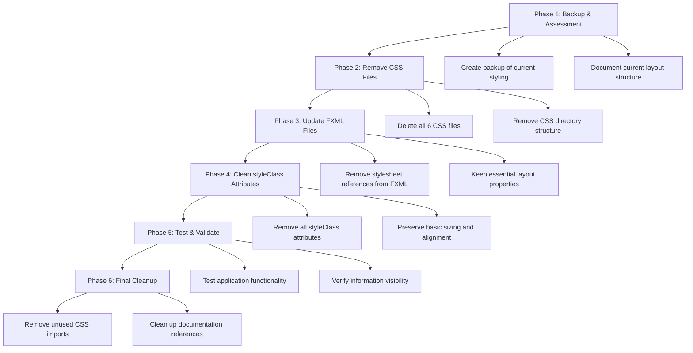

# CSS Deletion Plan for AIMS Project

## Overview
This plan outlines the complete removal of all custom CSS styling from the AIMS JavaFX application, allowing it to rely entirely on JavaFX's default styling while maintaining functional layout and information display.

## Current CSS Analysis

Based on my investigation, the project contains:

### CSS Files to Delete:
1. **`src/main/resources/styles/global.css`** (693 lines) - Main styling
2. **`src/main/resources/styles/responsive.css`** (1,068 lines) - Responsive design
3. **`src/main/resources/styles/theme.css`** (596 lines) - Color themes and visual effects
4. **`src/main/resources/styles/product-detail-responsive.css`** (478 lines) - Product detail styling
5. **`src/main/resources/com/aims/presentation/styles/fullscreen-layout.css`** (814 lines) - Fullscreen layout
6. **`src/main/resources/com/aims/presentation/styles/layout-fix.css`** (381 lines) - Layout fixes

### FXML Files Requiring Updates:
- **26 FXML files** with stylesheet references need modification
- **Multiple styleClass attributes** need removal from FXML elements

## Implementation Strategy



## Detailed Implementation Plan

### Phase 1: Assessment and Backup
**Objective:** Document current state and create recovery point

**Actions:**
1. **Inventory CSS usage patterns**
   - Map all stylesheet references in FXML files
   - Identify critical layout properties that need preservation
   - Document current visual hierarchy

2. **Create backup strategy**
   - Archive all CSS files before deletion
   - Document current layout behavior
   - Create rollback plan if needed

**Expected Duration:** 1 hour

### Phase 2: CSS File Removal
**Objective:** Delete all custom CSS files

**Actions:**
1. **Delete CSS files in order:**
   ```
   src/main/resources/styles/global.css
   src/main/resources/styles/responsive.css  
   src/main/resources/styles/theme.css
   src/main/resources/styles/product-detail-responsive.css
   src/main/resources/com/aims/presentation/styles/fullscreen-layout.css
   src/main/resources/com/aims/presentation/styles/layout-fix.css
   ```

2. **Remove empty directories:**
   ```
   src/main/resources/styles/
   src/main/resources/com/aims/presentation/styles/
   ```

**Expected Duration:** 30 minutes

### Phase 3: FXML Stylesheet Reference Removal
**Objective:** Remove all CSS references from FXML files

**Target Files (26 total):**
- All files with `stylesheets="/styles/..."` attributes
- Special handling for `product_detail_screen.fxml` (multiple stylesheets)

**Example Transformation:**
```xml
<!-- BEFORE -->
<BorderPane fx:id="homeScreenPane"
            styleClass="responsive-border-pane, fill-parent"
            stylesheets="/styles/global.css, /styles/responsive.css">

<!-- AFTER -->
<BorderPane fx:id="homeScreenPane">
```

**Specific Files to Update:**
1. `src/main/resources/com/aims/core/presentation/views/VNPayReturnScreen.fxml`
2. `src/main/resources/com/aims/presentation/views/change_password_screen.fxml`
3. `src/main/resources/com/aims/presentation/views/login_screen.fxml`
4. `src/main/resources/com/aims/presentation/views/pm_dashboard_screen.fxml`
5. `src/main/resources/com/aims/presentation/views/admin_edit_user_form.fxml`
6. `src/main/resources/com/aims/presentation/views/payment_result_screen.fxml`
7. `src/main/resources/com/aims/presentation/views/pm_pending_orders_list_screen.fxml`
8. `src/main/resources/com/aims/presentation/views/admin_add_edit_product_screen.fxml`
9. `src/main/resources/com/aims/presentation/views/pm_order_review_screen.fxml`
10. `src/main/resources/com/aims/presentation/views/admin_add_user_form.fxml`
11. `src/main/resources/com/aims/presentation/views/payment_processing_screen.fxml`
12. `src/main/resources/com/aims/presentation/views/customer_order_detail_screen.fxml`
13. `src/main/resources/com/aims/presentation/views/delivery_info_screen.fxml`
14. `src/main/resources/com/aims/presentation/views/product_search_results_screen.fxml`
15. `src/main/resources/com/aims/presentation/views/order_summary_screen.fxml`
16. `src/main/resources/com/aims/presentation/views/product_detail_screen.fxml` (Multiple stylesheets)
17. `src/main/resources/com/aims/presentation/views/admin_user_management_screen.fxml`
18. `src/main/resources/com/aims/presentation/views/dialogs/error_dialog.fxml`
19. `src/main/resources/com/aims/presentation/views/partials/order_item_row.fxml`
20. `src/main/resources/com/aims/presentation/views/partials/cart_item_row.fxml`
21. `src/main/resources/com/aims/presentation/views/dialogs/stock_insufficient_dialog.fxml`
22. `src/main/resources/com/aims/presentation/views/admin_product_list_screen.fxml`
23. `src/main/resources/com/aims/presentation/views/dialogs/confirmation_dialog.fxml`
24. `src/main/resources/com/aims/presentation/views/payment_method_screen.fxml`
25. `src/main/resources/com/aims/presentation/views/admin_dashboard_screen.fxml`
26. `src/main/resources/com/aims/presentation/views/dialogs/info_dialog.fxml`

**Expected Duration:** 2 hours

### Phase 4: StyleClass Attribute Cleanup
**Objective:** Remove all custom styleClass references

**Actions:**
1. **Remove styleClass attributes from all elements**
   - Keep only essential JavaFX layout properties
   - Preserve functional attributes (fx:id, onAction, etc.)
   - Maintain basic sizing constraints where critical

2. **Key areas to clean:**
   - Product cards and grids (`responsive-product-card`, `product-flow-pane`)
   - Navigation and search containers (`responsive-search-container`, `nav-menu`)
   - Buttons and form controls (`primary-button`, `responsive-button`)
   - Layout containers (`responsive-border-pane`, `responsive-vbox`)

**Critical styleClass patterns to remove:**
- `responsive-*` (all responsive classes)
- `main-layout`, `content-area`
- `product-*` (product-related styling)
- `search-*` (search-related styling)
- `pagination-*` (pagination styling)
- `cart-*` (cart-related styling)
- `admin-*` (admin interface styling)
- `dialog-*` (dialog styling)
- `header-*`, `footer-*` (header/footer styling)
- `button-*` (button styling variations)

**Expected Duration:** 3 hours

### Phase 5: Layout Preservation
**Objective:** Ensure information remains visible and functional

**Critical Properties to Maintain:**
```xml
<!-- Essential sizing -->
maxHeight="Infinity"
maxWidth="Infinity" 
prefHeight="-1"
prefWidth="-1"
minHeight="400.0"
minWidth="600.0"

<!-- Critical spacing -->
spacing="10.0"
spacing="15.0"
spacing="20.0"
alignment="CENTER"
alignment="CENTER_LEFT"
alignment="TOP_CENTER"

<!-- Important layout behavior -->
fitToWidth="true"
fitToHeight="false"
hbarPolicy="AS_NEEDED"
vbarPolicy="AS_NEEDED"
VBox.vgrow="ALWAYS"
HBox.hgrow="ALWAYS"

<!-- Essential padding -->
<padding>
    <Insets bottom="10.0" left="10.0" right="10.0" top="10.0" />
</padding>
```

**Layout Elements to Preserve:**
1. **BorderPane layout structure**
2. **ScrollPane fit-to-width behavior**
3. **FlowPane product grid arrangement**
4. **VBox/HBox spacing and alignment**
5. **Basic button and form sizing**
6. **Menu and navigation structure**

**Expected Duration:** 2 hours

### Phase 6: Testing and Validation
**Objective:** Verify functionality with default styling

**Test Scenarios:**
1. **Application startup and navigation**
   - Main layout loads correctly
   - Menu navigation works
   - Content areas display properly

2. **Product browsing and search functionality**
   - Product grid displays in organized manner
   - Search controls are accessible
   - Pagination works correctly

3. **Cart operations and checkout flow**
   - Cart items display clearly
   - Checkout process remains functional
   - Forms are usable with default styling

4. **Admin panel functionality**
   - Admin interfaces remain navigable
   - Forms and tables display correctly
   - User management features work

5. **Window resizing behavior**
   - Layout adapts reasonably to different sizes
   - Information remains visible
   - Scroll behavior works properly

**Acceptance Criteria:**
- ✅ All information remains visible and readable
- ✅ All functionality works as expected
- ✅ Layout remains functional across different screen sizes
- ✅ No CSS-related errors in console
- ✅ JavaFX default styling provides adequate usability

**Expected Duration:** 1.5 hours

## Risk Assessment & Mitigation

### High Risk Areas:
1. **Product Grid Layout**
   - **Risk:** Products may not display in organized grid
   - **Mitigation:** Preserve FlowPane properties (hgap, vgap, alignment)
   - **Fallback:** Adjust spacing values if grid becomes too tight

2. **Form Layouts**
   - **Risk:** Forms may become unusable without spacing
   - **Mitigation:** Keep essential alignment and spacing properties
   - **Fallback:** Add minimal padding through FXML attributes

3. **Navigation Elements**
   - **Risk:** Menu and navigation may be unclear
   - **Mitigation:** Rely on JavaFX default button and menu styling
   - **Fallback:** Use text labels to clarify navigation options

### Medium Risk Areas:
1. **Responsive Behavior**
   - **Risk:** Layout may not adapt to different screen sizes
   - **Mitigation:** Keep essential sizing properties in FXML
   - **Fallback:** Set minimum window sizes in application code

2. **Visual Hierarchy**
   - **Risk:** Information importance may be unclear
   - **Mitigation:** Rely on JavaFX default font sizing and layout
   - **Fallback:** Use label text formatting to indicate importance

3. **Dialog and Modal Windows**
   - **Risk:** Dialogs may be too small or poorly formatted
   - **Mitigation:** Preserve essential sizing in FXML
   - **Fallback:** Adjust prefWidth/prefHeight values

### Low Risk Areas:
1. **Color and Theming**
   - **Impact:** Application will use system default colors
   - **Mitigation:** No action needed - JavaFX defaults are adequate

2. **Hover Effects and Animations**
   - **Impact:** No visual feedback on hover
   - **Mitigation:** JavaFX provides basic hover effects by default

## Expected Results

### Before CSS Removal:
- Rich visual styling with colors, shadows, and hover effects
- Comprehensive responsive design system
- Professional visual hierarchy with custom fonts
- Custom branded appearance with consistent theming
- Advanced layout behaviors and transitions

### After CSS Removal:
- Clean, minimal JavaFX default appearance
- Functional layout with basic spacing and alignment
- Clear information display without visual clutter
- Standard JavaFX look and feel (system-dependent)
- Reduced resource usage and faster loading times
- Simplified maintenance with no custom CSS to manage

## File Structure Changes

### Files to be Deleted:
```
src/main/resources/styles/
├── global.css (DELETE)
├── responsive.css (DELETE)
├── theme.css (DELETE)
└── product-detail-responsive.css (DELETE)

src/main/resources/com/aims/presentation/styles/
├── fullscreen-layout.css (DELETE)
└── layout-fix.css (DELETE)
```

### Directories to be Removed:
```
src/main/resources/styles/ (REMOVE - will be empty)
src/main/resources/com/aims/presentation/styles/ (REMOVE - will be empty)
```

## Timeline Summary
- **Phase 1 (Assessment):** 1 hour
- **Phase 2 (CSS Deletion):** 30 minutes  
- **Phase 3 (FXML Stylesheet Removal):** 2 hours
- **Phase 4 (StyleClass Cleanup):** 3 hours
- **Phase 5 (Layout Preservation):** 2 hours
- **Phase 6 (Testing):** 1.5 hours
- **Total Estimated Duration:** 10 hours
- **Risk Buffer:** 2 hours for unexpected issues
- **Final Timeline:** 12 hours total

## Success Metrics
1. **Zero CSS files remaining in project**
2. **All FXML files clean of custom styleClass references**
3. **All stylesheet attributes removed from FXML elements**
4. **Application fully functional with JavaFX defaults**
5. **Information visibility maintained across all screens**
6. **No CSS-related runtime errors or warnings**
7. **Layout remains usable across different screen sizes**

## Post-Implementation Benefits
1. **Simplified Maintenance:** No CSS files to maintain or debug
2. **Faster Loading:** Reduced resource loading time
3. **System Integration:** Application uses native look and feel
4. **Reduced Complexity:** Easier to understand and modify layouts
5. **Better Accessibility:** JavaFX defaults often have better accessibility support
6. **Cross-Platform Consistency:** Relies on JavaFX's cross-platform rendering

## Rollback Plan
If issues arise during implementation:
1. **Restore CSS files from backup**
2. **Revert FXML changes using version control**
3. **Test functionality with original styling**
4. **Analyze specific issues and create targeted fixes**
5. **Implement changes incrementally rather than all at once**

This plan provides a comprehensive approach to removing all custom CSS while maintaining application functionality and information visibility through JavaFX's default styling capabilities.