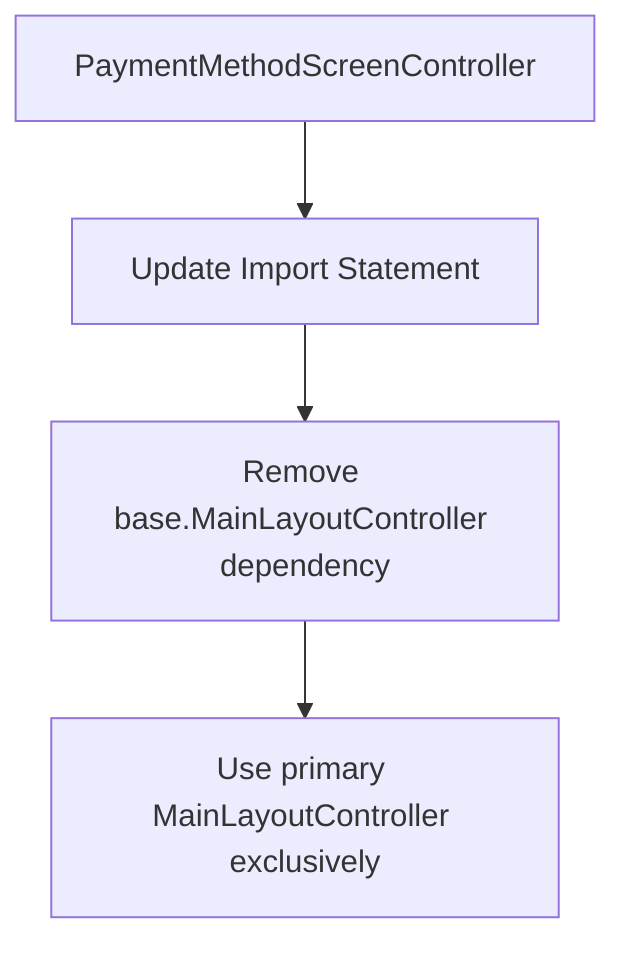

# **Java Compilation Error Analysis & Resolution Plan**

## **📋 Problem Analysis**

### **Root Cause**
The compilation error occurs due to **incompatible MainLayoutController types** in your codebase. You have two distinct classes:

1. **Primary Controller**: `com.aims.core.presentation.controllers.MainLayoutController` - Full-featured main layout controller
2. **Base Controller**: `com.aims.core.presentation.controllers.base.MainLayoutController` - Simple base layout controller

### **Specific Error Location**
**File**: `NavigationService.java:146`

```java
// ERROR: PaymentMethodScreenController expects the primary MainLayoutController
// but NavigationService is casting to base.MainLayoutController
paymentController.setMainLayoutController((com.aims.core.presentation.controllers.base.MainLayoutController) mainLayout);
```

**Problem**: `PaymentMethodScreenController` expects the **primary** MainLayoutController but receives the **base** version.

## **🔍 Impact Assessment**

### **Affected Components**
1. **NavigationService.java** - Lines 146, 206 (Type casting errors)
2. **PaymentMethodScreenController** - Cannot receive proper MainLayoutController
3. **OrderSummaryScreenController** - Legacy controller with base.MainLayoutController dependency
4. **Payment flow navigation** - Broken due to type incompatibility

### **Secondary Issues**
- **Deprecated Usage**: `OrderSummaryScreenController` is deprecated but still referenced
- **Inconsistent Architecture**: Mixed usage of primary vs base controllers

## **🎯 Comprehensive Solution Plan**

### **Phase 1: Controller Type Standardization**

#### **1.1 Update PaymentMethodScreenController**
**Goal**: Standardize to use primary MainLayoutController



**Changes Required**:
- Update import from `base.MainLayoutController` to primary `MainLayoutController`
- Ensure `setMainLayoutController` method signature matches primary controller

#### **1.2 Resolve OrderSummaryScreenController Deprecated Usage**
**Goal**: Phase out deprecated controller or fix compatibility

**Option A** (Recommended): **Remove deprecated controller references**
**Option B**: **Fix compatibility and maintain legacy support**

### **Phase 2: NavigationService Type Safety Enhancement**

#### **2.1 Fix Type Casting Logic**
**Current Problem**:
```java
// Line 146 - WRONG CAST
if (mainLayout instanceof com.aims.core.presentation.controllers.base.MainLayoutController) {
    paymentController.setMainLayoutController((com.aims.core.presentation.controllers.base.MainLayoutController) mainLayout);
}
```

**Solution**:
```java
// CORRECT CAST
if (mainLayout instanceof com.aims.core.presentation.controllers.MainLayoutController) {
    paymentController.setMainLayoutController((com.aims.core.presentation.controllers.MainLayoutController) mainLayout);
}
```

#### **2.2 Implement Smart Type Detection**
**Enhanced Logic**:
```java
// Smart detection with fallback
if (mainLayout instanceof com.aims.core.presentation.controllers.MainLayoutController) {
    // Primary controller - full functionality
    paymentController.setMainLayoutController((com.aims.core.presentation.controllers.MainLayoutController) mainLayout);
} else if (mainLayout instanceof com.aims.core.presentation.controllers.base.MainLayoutController) {
    // Base controller - limited functionality with adapter pattern
    MainLayoutControllerAdapter adapter = new MainLayoutControllerAdapter((com.aims.core.presentation.controllers.base.MainLayoutController) mainLayout);
    paymentController.setMainLayoutController(adapter);
} else {
    // Error handling
    System.err.println("NavigationService: Unsupported MainLayoutController type");
}
```

### **Phase 3: Architecture Cleanup**

#### **3.1 Controller Interface Standardization**
**Create Common Interface**:
```java
public interface IMainLayoutController {
    void setContent(Node content);
    void setTitle(String title);
    void showLoading(boolean show);
}
```

**Benefits**:
- **Type Safety**: Compile-time error prevention
- **Polymorphism**: Unified interface for all controller types
- **Future-Proof**: Easy to add new controller types

#### **3.2 Remove Deprecated Dependencies**
**Steps**:
1. **Audit**: Find all `OrderSummaryScreenController` references
2. **Replace**: Migrate to `OrderSummaryController`
3. **Cleanup**: Remove deprecated controller file

### **Phase 4: Testing & Validation**

#### **4.1 Compilation Testing**
- **Unit Tests**: Verify all controller type castings
- **Integration Tests**: Test navigation flows
- **Error Handling**: Validate graceful fallbacks

#### **4.2 Runtime Validation**
- **Payment Flow**: End-to-end payment navigation
- **Order Summary**: Navigation between screens
- **Error Scenarios**: Invalid controller types

## **📝 Implementation Priority**

### **🚨 Critical (Immediate)**
1. **Fix NavigationService type casting** (Lines 146, 206)
2. **Update PaymentMethodScreenController imports**
3. **Test payment flow compilation**

### **⚡ High Priority**
1. **Remove deprecated OrderSummaryScreenController references**
2. **Implement smart type detection in NavigationService**
3. **Add error handling for unsupported controller types**

### **📈 Enhancement (Future)**
1. **Create common controller interface**
2. **Implement adapter pattern for base controllers**
3. **Add comprehensive integration tests**

## **🔧 Specific File Changes Required**

### **1. NavigationService.java**
```java
// Lines 146-147: FIX PAYMENT CONTROLLER CASTING
if (mainLayout instanceof com.aims.core.presentation.controllers.MainLayoutController) {
    paymentController.setMainLayoutController((com.aims.core.presentation.controllers.MainLayoutController) mainLayout);
}

// Lines 205-207: FIX ORDER SUMMARY CONTROLLER CASTING  
if (mainLayout instanceof com.aims.core.presentation.controllers.base.MainLayoutController) {
    legacyController.setMainLayoutController((com.aims.core.presentation.controllers.base.MainLayoutController) mainLayout);
}
```

### **2. PaymentMethodScreenController.java**
```java
// Line 12: UPDATE IMPORT
import com.aims.core.presentation.controllers.MainLayoutController;

// Line 35: ENSURE CORRECT TYPE
private MainLayoutController mainLayoutController;

// Line 46: VERIFY METHOD SIGNATURE
public void setMainLayoutController(MainLayoutController mainLayoutController) {
    this.mainLayoutController = mainLayoutController;
}
```

## **📊 Architecture Decision Matrix**

| **Approach** | **Complexity** | **Maintainability** | **Type Safety** | **Backward Compatibility** | **Recommended** |
|--------------|---------------|-------------------|-----------------|---------------------------|-----------------|
| **Quick Fix Only** | Low | Low | Medium | High | ❌ |
| **Controller Standardization** | Medium | High | High | Medium | ✅ |
| **Interface-Based Solution** | High | Very High | Very High | Medium | ✅ (Future) |
| **Adapter Pattern** | High | Medium | High | Very High | 🔄 (Optional) |

## **🔄 Migration Strategy**

### **Phase 1: Immediate Fix (1-2 hours)**
1. Fix NavigationService type casting errors
2. Update PaymentMethodScreenController imports
3. Compile and basic test

### **Phase 2: Architecture Cleanup (4-6 hours)**
1. Remove deprecated controller references
2. Implement smart type detection
3. Add comprehensive error handling

### **Phase 3: Future Enhancement (8-12 hours)**
1. Create common controller interface
2. Implement adapter pattern
3. Add integration tests

## **✅ Success Criteria**

1. **✅ Compilation Success**: All Java files compile without type errors
2. **✅ Navigation Functional**: Payment flow works end-to-end
3. **✅ Type Safety**: No ClassCastException at runtime
4. **✅ Deprecated Cleanup**: No references to deprecated controllers
5. **✅ Error Handling**: Graceful handling of invalid controller types

## **🛡️ Risk Mitigation**

### **Identified Risks**
1. **Breaking Changes**: Modifying controller interfaces
2. **Runtime Errors**: Type casting failures
3. **Integration Issues**: Navigation flow disruption

### **Mitigation Strategies**
1. **Incremental Changes**: Phase implementation
2. **Backward Compatibility**: Maintain fallback logic
3. **Comprehensive Testing**: Unit + Integration tests
4. **Rollback Plan**: Git branches for each phase

## **📈 Expected Outcomes**

### **Immediate Benefits**
- ✅ **Compilation Success**: Code compiles without errors
- ✅ **Payment Flow**: Functional payment navigation
- ✅ **Type Safety**: Reduced runtime errors

### **Long-term Benefits**
- 🚀 **Maintainability**: Clean, consistent architecture
- 🔒 **Type Safety**: Compile-time error prevention
- 📈 **Scalability**: Easy to add new controller types
- 🧪 **Testability**: Better test coverage and reliability

This comprehensive plan addresses the immediate compilation error while establishing a robust, maintainable architecture for future development.