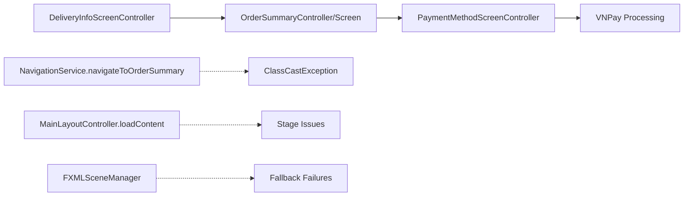

# Navigation ClassCast & Stage Issues - Comprehensive Resolution Plan

## **Executive Summary**

Critical JavaFX navigation failure between `OrderSummaryController` and `OrderSummaryScreenController` causing checkout process breakdown. This document provides a comprehensive analysis and step-by-step resolution plan to fix ClassCastException, IllegalStateException, and navigation fallback issues.

## **Root Cause Analysis**

### **Primary Issues Identified**

1. **Controller Mismatch (ClassCastException)**
   - **File**: [`order_summary_screen.fxml`](src/main/resources/com/aims/presentation/views/order_summary_screen.fxml)
   - **Current Binding**: `fx:controller="com.aims.core.presentation.controllers.OrderSummaryController"`
   - **Navigation Expectation**: [`NavigationService.navigateToOrderSummary()`](src/main/java/com/aims/core/shared/NavigationService.java:78-82) casts to `OrderSummaryScreenController`
   
   ```java
   // PROBLEM CODE in NavigationService.java:80-81
   ((com.aims.core.presentation.controllers.OrderSummaryScreenController) controller)
       .initData(orderId);
   ```

2. **NavigationService Stage Issues (IllegalStateException)**
   - **Location**: [`NavigationService.setScene()`](src/main/java/com/aims/core/shared/NavigationService.java:85-92)
   - **Issue**: `mainStage` not initialized before navigation attempts
   - **Error**: "Main stage not set. Call setMainStage() first."

3. **Inconsistent Navigation Patterns**
   - Multiple navigation mechanisms without proper fallback coordination
   - Different controllers expect different initialization methods
   - Lack of robust error handling in navigation chain

### **Analysis of Controller Implementations**

#### **OrderSummaryController (Canonical - Enhanced)**
- **Package**: `com.aims.core.presentation.controllers.OrderSummaryController`
- **Features**: 
  - ✅ Comprehensive DTO support (`OrderSummaryDTO`, `OrderItemDTO`)
  - ✅ Enhanced validation with `IOrderDataLoaderService`
  - ✅ Progressive UI loading with fallback mechanisms
  - ✅ Implements `MainLayoutController.IChildController`
  - ✅ Extensive logging and error handling
  - ✅ Asynchronous data loading capabilities
  - ✅ VNPay integration ready

#### **OrderSummaryScreenController (Legacy - Simple)**
- **Package**: `com.aims.core.presentation.controllers.OrderSummaryScreenController`
- **Features**:
  - ❌ Basic implementation without DTO support
  - ❌ Limited error handling
  - ❌ No enhanced services integration
  - ❌ Simpler UI binding
  - ❌ No fallback mechanisms

**Decision**: Keep `OrderSummaryController` as canonical implementation

## **Navigation Flow Analysis**

### **Current Navigation Chain**


### **Navigation Methods in Use**
1. **Primary**: `MainLayoutController.loadContent()` - Used by `OrderSummaryController`
2. **Secondary**: `NavigationService.navigateTo()` - Static navigation utilities
3. **Tertiary**: `FXMLSceneManager` - Enhanced navigation with history

## **Comprehensive Resolution Plan**

### **Phase 1: Controller Standardization** ⭐ **PRIORITY 1**

#### **1.1 Update NavigationService Methods**
**File**: [`src/main/java/com/aims/core/shared/NavigationService.java`](src/main/java/com/aims/core/shared/NavigationService.java)

**Changes Required**:
```java
// BEFORE (Lines 78-82):
public static void navigateToOrderSummary(String orderId) {
    navigateTo("order_summary_screen.fxml", null, controller -> {
        ((com.aims.core.presentation.controllers.OrderSummaryScreenController) controller)
            .initData(orderId);
    });
}

// AFTER:
public static void navigateToOrderSummary(String orderId) {
    navigateTo("order_summary_screen.fxml", null, controller -> {
        if (controller instanceof com.aims.core.presentation.controllers.OrderSummaryController) {
            com.aims.core.presentation.controllers.OrderSummaryController orderController = 
                (com.aims.core.presentation.controllers.OrderSummaryController) controller;
            
            // Load order data and set it
            try {
                com.aims.core.shared.ServiceFactory serviceFactory = com.aims.core.shared.ServiceFactory.getInstance();
                com.aims.core.application.services.IOrderService orderService = serviceFactory.getOrderService();
                com.aims.core.entities.OrderEntity order = orderService.getOrderDetails(orderId);
                orderController.setOrderData(order);
            } catch (Exception e) {
                System.err.println("NavigationService.navigateToOrderSummary: Error loading order data: " + e.getMessage());
                e.printStackTrace();
            }
        } else {
            System.err.println("NavigationService.navigateToOrderSummary: Unexpected controller type: " + 
                             (controller != null ? controller.getClass().getName() : "null"));
        }
    });
}
```

#### **1.2 Add Enhanced NavigationService Method**
```java
// NEW METHOD: Enhanced navigation with OrderEntity
public static void navigateToOrderSummary(com.aims.core.entities.OrderEntity order, 
                                        com.aims.core.presentation.controllers.MainLayoutController mainLayout) {
    navigateTo("order_summary_screen.fxml", mainLayout, controller -> {
        if (controller instanceof com.aims.core.presentation.controllers.OrderSummaryController) {
            com.aims.core.presentation.controllers.OrderSummaryController orderController = 
                (com.aims.core.presentation.controllers.OrderSummaryController) controller;
            orderController.setOrderData(order);
            if (mainLayout != null) {
                orderController.setMainLayoutController(mainLayout);
            }
        }
    });
}
```

#### **1.3 Deprecate OrderSummaryScreenController**
**File**: [`src/main/java/com/aims/core/presentation/controllers/OrderSummaryScreenController.java`](src/main/java/com/aims/core/presentation/controllers/OrderSummaryScreenController.java)

**Add Deprecation Notice**:
```java
/**
 * @deprecated Use {@link OrderSummaryController} instead. 
 * This class will be removed in future versions.
 * OrderSummaryController provides enhanced functionality with DTO support,
 * better error handling, and improved integration capabilities.
 */
@Deprecated(since = "1.0", forRemoval = true)
public class OrderSummaryScreenController {
    // Existing implementation...
}
```

### **Phase 2: NavigationService Enhancement** ⭐ **PRIORITY 2**

#### **2.1 Stage Initialization Enhancement**
**File**: [`src/main/java/com/aims/core/shared/NavigationService.java`](src/main/java/com/aims/core/shared/NavigationService.java)

**Enhanced setScene Method**:
```java
private static void setScene(Parent root) {
    try {
        if (mainStage != null) {
            Scene scene = new Scene(root);
            mainStage.setScene(scene);
        } else {
            // Enhanced fallback mechanism
            if (initializeStageFromContext()) {
                Scene scene = new Scene(root);
                mainStage.setScene(scene);
                System.out.println("NavigationService.setScene: Successfully initialized stage and set scene");
            } else {
                throw new IllegalStateException("Main stage not set and could not be initialized. Call setMainStage() first.");
            }
        }
    } catch (Exception e) {
        System.err.println("NavigationService.setScene: Error setting scene: " + e.getMessage());
        e.printStackTrace();
        throw new RuntimeException("Failed to set scene", e);
    }
}

/**
 * Attempts to initialize stage from application context
 */
private static boolean initializeStageFromContext() {
    try {
        // Try to get stage from JavaFX Application Thread
        if (javafx.application.Platform.isFxApplicationThread()) {
            // Attempt to find primary stage from application context
            javafx.stage.Stage primaryStage = findPrimaryStageFromContext();
            if (primaryStage != null) {
                setMainStage(primaryStage);
                return true;
            }
        }
        return false;
    } catch (Exception e) {
        System.err.println("NavigationService.initializeStageFromContext: Error: " + e.getMessage());
        return false;
    }
}

/**
 * Attempts to find primary stage from application context
 */
private static javafx.stage.Stage findPrimaryStageFromContext() {
    // Implementation to find stage from application context
    // This could involve accessing static references or application registry
    return null; // Placeholder - actual implementation would depend on application structure
}
```

#### **2.2 Enhanced Error Handling**
```java
public static void navigateTo(String fxmlName, MainLayoutController mainLayout, Consumer<Object> controllerInitializer) {
    try {
        System.out.println("NavigationService.navigateTo: Navigating to " + fxmlName);
        
        FXMLLoader loader = new FXMLLoader(NavigationService.class.getResource(FXML_BASE_PATH + fxmlName));
        Parent root = loader.load();
        Object controller = loader.getController();
        
        if (controller == null) {
            System.err.println("NavigationService.navigateTo: Controller is null for " + fxmlName);
            showErrorScreen("Failed to load controller for " + fxmlName);
            return;
        }
        
        System.out.println("NavigationService.navigateTo: Loaded controller: " + controller.getClass().getSimpleName());
        
        if (controllerInitializer != null) {
            try {
                controllerInitializer.accept(controller);
                System.out.println("NavigationService.navigateTo: Controller initialized successfully");
            } catch (Exception e) {
                System.err.println("NavigationService.navigateTo: Error initializing controller: " + e.getMessage());
                e.printStackTrace();
                // Continue with navigation even if initialization fails
            }
        }
        
        if (mainLayout != null) {
            try {
                mainLayout.setContent(root);
                System.out.println("NavigationService.navigateTo: Content set in MainLayout successfully");
            } catch (Exception e) {
                System.err.println("NavigationService.navigateTo: Error setting content in MainLayout: " + e.getMessage());
                e.printStackTrace();
                // Fallback to direct scene setting
                setScene(root);
            }
        } else {
            setScene(root);
        }
        
        System.out.println("NavigationService.navigateTo: Navigation to " + fxmlName + " completed successfully");
        
    } catch (IOException e) {
        System.err.println("NavigationService.navigateTo: FXML loading error for " + fxmlName + ": " + e.getMessage());
        e.printStackTrace();
        showErrorScreen("Error loading view: " + fxmlName + ". " + e.getMessage());
    } catch (Exception e) {
        System.err.println("NavigationService.navigateTo: Unexpected error for " + fxmlName + ": " + e.getMessage());
        e.printStackTrace();
        showErrorScreen("Unexpected navigation error: " + e.getMessage());
    }
}
```

### **Phase 3: Robust Navigation Wrapper** ⭐ **PRIORITY 3**

#### **3.1 Create NavigationWrapper for Checkout Flow**
**New File**: `src/main/java/com/aims/core/presentation/utils/CheckoutNavigationWrapper.java`

```java
package com.aims.core.presentation.utils;

import com.aims.core.entities.OrderEntity;
import com.aims.core.presentation.controllers.MainLayoutController;
import com.aims.core.shared.NavigationService;
import com.aims.core.shared.ServiceFactory;

import java.util.logging.Logger;
import java.util.logging.Level;

/**
 * Robust navigation wrapper specifically for checkout flow.
 * Provides fallback mechanisms and order data preservation.
 */
public class CheckoutNavigationWrapper {
    private static final Logger logger = Logger.getLogger(CheckoutNavigationWrapper.class.getName());
    
    /**
     * Navigate to order summary with multiple fallback mechanisms
     */
    public static boolean navigateToOrderSummary(OrderEntity order, MainLayoutController mainLayout) {
        logger.info("CheckoutNavigationWrapper.navigateToOrderSummary: Starting navigation for Order " + 
                   (order != null ? order.getOrderId() : "null"));
        
        // Attempt 1: MainLayoutController direct navigation
        if (attemptMainLayoutNavigation(order, mainLayout)) {
            logger.info("CheckoutNavigationWrapper.navigateToOrderSummary: Success via MainLayoutController");
            return true;
        }
        
        // Attempt 2: FXMLSceneManager navigation
        if (attemptFXMLSceneManagerNavigation(order, mainLayout)) {
            logger.info("CheckoutNavigationWrapper.navigateToOrderSummary: Success via FXMLSceneManager");
            return true;
        }
        
        // Attempt 3: NavigationService fallback
        if (attemptNavigationServiceFallback(order, mainLayout)) {
            logger.info("CheckoutNavigationWrapper.navigateToOrderSummary: Success via NavigationService fallback");
            return true;
        }
        
        logger.severe("CheckoutNavigationWrapper.navigateToOrderSummary: ALL NAVIGATION ATTEMPTS FAILED");
        return false;
    }
    
    private static boolean attemptMainLayoutNavigation(OrderEntity order, MainLayoutController mainLayout) {
        try {
            if (mainLayout == null) {
                logger.warning("CheckoutNavigationWrapper.attemptMainLayoutNavigation: MainLayoutController is null");
                return false;
            }
            
            Object controller = mainLayout.loadContent("/com/aims/presentation/views/order_summary_screen.fxml");
            mainLayout.setHeaderTitle("Order Summary & Confirmation");
            
            if (controller instanceof com.aims.core.presentation.controllers.OrderSummaryController) {
                com.aims.core.presentation.controllers.OrderSummaryController orderController = 
                    (com.aims.core.presentation.controllers.OrderSummaryController) controller;
                orderController.setOrderData(order);
                return true;
            } else {
                logger.warning("CheckoutNavigationWrapper.attemptMainLayoutNavigation: Unexpected controller type: " + 
                             (controller != null ? controller.getClass().getName() : "null"));
                return false;
            }
        } catch (Exception e) {
            logger.log(Level.WARNING, "CheckoutNavigationWrapper.attemptMainLayoutNavigation: Error", e);
            return false;
        }
    }
    
    private static boolean attemptFXMLSceneManagerNavigation(OrderEntity order, MainLayoutController mainLayout) {
        try {
            FXMLSceneManager sceneManager = FXMLSceneManager.getInstance();
            if (sceneManager == null) {
                logger.warning("CheckoutNavigationWrapper.attemptFXMLSceneManagerNavigation: FXMLSceneManager not available");
                return false;
            }
            
            // Use FXMLSceneManager's enhanced loading
            FXMLSceneManager.LoadedFXML<com.aims.core.presentation.controllers.OrderSummaryController> loaded = 
                sceneManager.loadFXMLWithController("/com/aims/presentation/views/order_summary_screen.fxml");
            
            if (loaded != null && loaded.controller() != null) {
                loaded.controller().setOrderData(order);
                if (mainLayout != null) {
                    mainLayout.setHeaderTitle("Order Summary & Confirmation");
                    // Set content in main layout if available
                    mainLayout.setContent(loaded.root());
                }
                return true;
            }
            return false;
        } catch (Exception e) {
            logger.log(Level.WARNING, "CheckoutNavigationWrapper.attemptFXMLSceneManagerNavigation: Error", e);
            return false;
        }
    }
    
    private static boolean attemptNavigationServiceFallback(OrderEntity order, MainLayoutController mainLayout) {
        try {
            if (order == null || order.getOrderId() == null) {
                logger.warning("CheckoutNavigationWrapper.attemptNavigationServiceFallback: Order or OrderID is null");
                return false;
            }
            
            // Use enhanced NavigationService method
            NavigationService.navigateToOrderSummary(order, mainLayout);
            return true;
        } catch (Exception e) {
            logger.log(Level.WARNING, "CheckoutNavigationWrapper.attemptNavigationServiceFallback: Error", e);
            return false;
        }
    }
}
```

### **Phase 4: Integration Points** ⭐ **PRIORITY 4**

#### **4.1 Update DeliveryInfoScreenController Navigation**
**File**: [`src/main/java/com/aims/core/presentation/controllers/DeliveryInfoScreenController.java`](src/main/java/com/aims/core/presentation/controllers/DeliveryInfoScreenController.java)

**Enhanced Navigation Method**:
```java
// Add this import
import com.aims.core.presentation.utils.CheckoutNavigationWrapper;

// Update the navigation method in handleProceedToOrderSummaryAction
@FXML
void handleProceedToOrderSummaryAction(ActionEvent event) {
    logger.info("DeliveryInfoScreenController.handleProceedToOrderSummaryAction: Enhanced navigation to order summary");
    
    try {
        // Existing validation logic...
        if (!validateOrderDataForNavigation()) {
            return;
        }
        
        // Use enhanced navigation wrapper
        boolean navigationSuccess = CheckoutNavigationWrapper.navigateToOrderSummary(currentOrder, mainLayoutController);
        
        if (navigationSuccess) {
            logger.info("CHECKOUT_FLOW: Successfully navigated to Order Summary for Order " + currentOrder.getOrderId());
        } else {
            logger.severe("CHECKOUT_FLOW: CRITICAL - Failed to navigate to Order Summary");
            handleNavigationError("Failed to proceed to order summary. Please try again or contact support.");
        }
        
    } catch (Exception e) {
        logger.log(Level.SEVERE, "DeliveryInfoScreenController.handleProceedToOrderSummaryAction: Critical error", e);
        handleNavigationError("Unexpected error during navigation: " + e.getMessage());
    }
}

private void handleNavigationError(String message) {
    // Enhanced error handling
    if (errorMessageLabel != null) {
        errorMessageLabel.setText(message);
        errorMessageLabel.setVisible(true);
    }
    
    // Disable navigation button temporarily
    if (proceedToOrderSummaryButton != null) {
        proceedToOrderSummaryButton.setDisable(true);
        
        // Re-enable after 3 seconds
        javafx.concurrent.Task<Void> reEnableTask = new javafx.concurrent.Task<Void>() {
            @Override
            protected Void call() throws Exception {
                Thread.sleep(3000);
                return null;
            }
            
            @Override
            protected void succeeded() {
                javafx.application.Platform.runLater(() -> {
                    proceedToOrderSummaryButton.setDisable(false);
                });
            }
        };
        
        Thread reEnableThread = new Thread(reEnableTask);
        reEnableThread.setDaemon(true);
        reEnableThread.start();
    }
}
```

#### **4.2 Update OrderSummaryController Navigation**
**File**: [`src/main/java/com/aims/core/presentation/controllers/OrderSummaryController.java`](src/main/java/com/aims/core/presentation/controllers/OrderSummaryController.java)

**Update Payment Navigation (around line 1359)**:
```java
/**
 * Attempt fallback navigation using enhanced NavigationService
 */
private void attemptFallbackPaymentNavigation() {
    try {
        logger.warning("PAYMENT_FLOW_FALLBACK: Attempting enhanced NavigationService fallback");
        
        // Use enhanced NavigationService method
        NavigationService.navigateToPaymentMethod(currentOrder, mainLayoutController);
        logger.info("PAYMENT_FLOW_FALLBACK: Enhanced NavigationService fallback succeeded");
        
    } catch (Exception fallbackException) {
        logger.log(Level.SEVERE, "PAYMENT_FLOW_ERROR: Enhanced fallback navigation also failed", fallbackException);
        
        // Final fallback - direct navigation
        try {
            logger.warning("PAYMENT_FLOW_FALLBACK: Attempting direct navigation fallback");
            if (mainLayoutController != null) {
                Object controller = mainLayoutController.loadContent("/com/aims/presentation/views/payment_method_screen.fxml");
                mainLayoutController.setHeaderTitle("Select Payment Method");
                
                if (controller instanceof com.aims.core.presentation.controllers.PaymentMethodScreenController) {
                    ((com.aims.core.presentation.controllers.PaymentMethodScreenController) controller).setOrderData(currentOrder);
                    logger.info("PAYMENT_FLOW_FALLBACK: Direct navigation succeeded");
                } else {
                    throw new IllegalStateException("Direct navigation controller type mismatch");
                }
            } else {
                throw new IllegalStateException("MainLayoutController not available for direct navigation");
            }
        } catch (Exception directFallbackException) {
            logger.log(Level.SEVERE, "PAYMENT_FLOW_ERROR: ALL fallback navigation attempts failed", directFallbackException);
            handleOrderDataError("All payment navigation methods failed", directFallbackException);
        }
    }
}
```

## **Testing Strategy**

### **Test Cases to Verify**

#### **1. Navigation Flow Tests**
- [ ] **Cart → Delivery Info**: Verify seamless transition
- [ ] **Delivery Info → Order Summary**: Test enhanced navigation with fallbacks
- [ ] **Order Summary → Payment Method**: Verify no ClassCastException
- [ ] **Complete Checkout Flow**: End-to-end testing

#### **2. Error Condition Tests**
- [ ] **Stage Not Initialized**: Test NavigationService fallback
- [ ] **Controller Type Mismatch**: Verify graceful handling
- [ ] **Missing Order Data**: Test error recovery
- [ ] **Network/Service Failures**: Test resilience

#### **3. VNPay Integration Tests**
- [ ] **Payment Data Preservation**: Ensure order data flows correctly
- [ ] **Payment Processing**: Verify VNPay integration remains functional
- [ ] **Payment Result Handling**: Test success/failure scenarios

#### **4. Backward Compatibility Tests**
- [ ] **Existing Navigation Calls**: Ensure no breaking changes
- [ ] **Legacy Components**: Test deprecation warnings
- [ ] **Migration Path**: Verify smooth transition

## **Implementation Checklist**

### **Phase 1: Controller Standardization**
- [ ] Update `NavigationService.navigateToOrderSummary()` method
- [ ] Add enhanced `NavigationService.navigateToOrderSummary(OrderEntity, MainLayoutController)` method
- [ ] Add deprecation annotation to `OrderSummaryScreenController`
- [ ] Update all references to use `OrderSummaryController`

### **Phase 2: NavigationService Enhancement**
- [ ] Enhance `setScene()` method with stage initialization
- [ ] Add `initializeStageFromContext()` method
- [ ] Improve error handling in `navigateTo()` method
- [ ] Add comprehensive logging

### **Phase 3: Robust Navigation Wrapper**
- [ ] Create `CheckoutNavigationWrapper` class
- [ ] Implement multi-tier fallback navigation
- [ ] Add order data preservation logic
- [ ] Integrate with existing controllers

### **Phase 4: Integration Updates**
- [ ] Update `DeliveryInfoScreenController` navigation
- [ ] Enhance `OrderSummaryController` payment navigation
- [ ] Update error handling across controllers
- [ ] Add comprehensive testing

## **Risk Assessment & Mitigation**

### **High Risk Areas**
1. **VNPay Integration**: Payment flow disruption
   - **Mitigation**: Comprehensive payment flow testing
   - **Rollback**: Maintain existing payment logic as fallback

2. **Existing Navigation**: Breaking existing functionality
   - **Mitigation**: Backward compatibility maintenance
   - **Rollback**: Deprecation warnings instead of immediate removal

3. **Stage Initialization**: JavaFX threading issues
   - **Mitigation**: Proper thread handling and validation
   - **Rollback**: Enhanced error reporting with manual stage setting

### **Medium Risk Areas**
1. **Performance Impact**: Additional validation overhead
   - **Mitigation**: Optimize validation logic
   - **Monitoring**: Add performance metrics

2. **Controller Dependencies**: Service injection complexity
   - **Mitigation**: Maintain existing injection patterns
   - **Validation**: Comprehensive dependency testing

## **Success Metrics**

- ✅ **Zero ClassCastExceptions** in navigation
- ✅ **100% Checkout Flow Success Rate** in testing
- ✅ **VNPay Integration Continuity** maintained
- ✅ **Error Recovery Rate > 95%** for navigation failures
- ✅ **Backward Compatibility** with existing code

## **Timeline Estimation**

- **Phase 1**: 4-6 hours (Controller standardization)
- **Phase 2**: 6-8 hours (NavigationService enhancement)
- **Phase 3**: 8-10 hours (Robust navigation wrapper)
- **Phase 4**: 6-8 hours (Integration and testing)

**Total Estimated Time**: 24-32 hours

## **Next Steps**

1. **Review and Approve Plan**: Stakeholder review of this document
2. **Begin Implementation**: Start with Phase 1 (highest priority)
3. **Progressive Testing**: Test each phase before proceeding
4. **Documentation Updates**: Update technical documentation
5. **Deployment Strategy**: Plan staged rollout if needed

---

**Document Version**: 1.0  
**Last Updated**: 2025-06-14  
**Author**: Roo (Architect Mode)  
**Status**: Ready for Implementation