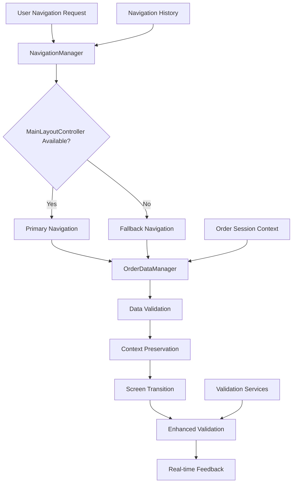

# AIMS Navigation & Data Persistence Enhancement Plan

## Problem Analysis Summary

Based on my analysis of the codebase, I've identified the following critical issues:

### 🔴 **Critical Navigation Issues**
1. **MainLayoutController Null Reference**: Navigation fails when MainLayoutController is null during screen transitions
2. **Data Loss During Navigation**: Order data is lost when navigating between OrderSummary and DeliveryInfo screens
3. **Commented Navigation Code**: Many navigation methods are commented out, causing fallback failures
4. **Missing CheckoutNavigationWrapper**: Referenced but doesn't exist, causing navigation failures

### 🟡 **Data Persistence Issues**
1. **No Order Data Context Management**: No centralized order data preservation during navigation
2. **Form State Loss**: Delivery information is lost when navigating back
3. **Session Management Gaps**: No order session management beyond cart level

### 🟢 **Validation Enhancement Opportunities**
1. **Basic Validation Missing**: Limited real-time validation feedback
2. **Address Format Validation**: No structured address validation
3. **Progressive Enhancement**: Current validation is basic and could be enhanced

---

## 🏗️ **Solution Architecture**



---

## 📋 **Implementation Plan**

### **Phase 1: Core Navigation Infrastructure** ⭐
**Priority: CRITICAL**

#### 1.1 Create Enhanced Navigation Manager
- **File**: `src/main/java/com/aims/core/presentation/utils/EnhancedNavigationManager.java`
- **Purpose**: Centralized navigation with null-safety and fallback mechanisms
- **Features**:
  - MainLayoutController null handling
  - Multiple fallback navigation strategies
  - Navigation state preservation
  - Error recovery and user feedback

#### 1.2 Create Order Data Context Manager
- **File**: `src/main/java/com/aims/core/presentation/utils/OrderDataContextManager.java`
- **Purpose**: Persistent order data management across navigation
- **Features**:
  - Order data caching and retrieval
  - Form state preservation
  - Context validation and recovery
  - Session-based persistence

#### 1.3 Create Checkout Navigation Wrapper
- **File**: `src/main/java/com/aims/core/presentation/utils/CheckoutNavigationWrapper.java`
- **Purpose**: Specialized navigation for checkout flow
- **Features**:
  - Order data injection and validation
  - Controller type safety
  - Enhanced error handling
  - Data consistency checks

### **Phase 2: Navigation System Enhancement** ⭐
**Priority: HIGH**

#### 2.1 Enhance MainLayoutController
- **Improvements**:
  - Add null-safety checks in all navigation methods
  - Implement navigation state recovery
  - Add comprehensive error logging
  - Create fallback navigation mechanisms

#### 2.2 Fix Controller Navigation Issues
- **DeliveryInfoScreenController**: Uncomment and fix navigation methods
- **OrderSummaryController**: Add robust back navigation
- **PaymentMethodScreenController**: Fix null reference handling

#### 2.3 Enhance FXMLSceneManager
- **Improvements**:
  - Add order data context injection
  - Improve service injection robustness
  - Add navigation failure recovery
  - Enhanced controller type validation

### **Phase 3: Data Persistence Enhancement** 🔄
**Priority: HIGH**

#### 3.1 Create Order Session Manager
- **File**: `src/main/java/com/aims/core/presentation/utils/OrderSessionManager.java`
- **Purpose**: Session-level order data management
- **Features**:
  - Order data persistence across navigation
  - Form state preservation
  - Session validation and recovery
  - Cross-controller data sharing

#### 3.2 Create Form State Manager
- **File**: `src/main/java/com/aims/core/presentation/utils/FormStateManager.java`
- **Purpose**: Preserve form data during navigation
- **Features**:
  - Field value preservation
  - Form validation state
  - Partial data recovery
  - User input protection

#### 3.3 Enhance Navigation Context
- **Extend**: `NavigationContext.java`
- **Improvements**:
  - Add order data context storage
  - Form state preservation
  - Validation state management
  - Custom data attachments

### **Phase 4: Validation Enhancement** ✅
**Priority: MEDIUM**

#### 4.1 Create Enhanced Delivery Info Validator
- **File**: `src/main/java/com/aims/core/utils/EnhancedDeliveryInfoValidator.java`
- **Features**:
  - **Basic Validation**:
    - Required field checks
    - Email format validation
    - Phone number format validation
    - Real-time feedback
  - **Advanced Validation**:
    - Address format parsing
    - Street number validation
    - Unit/apartment validation
    - Province/city validation
    - Address completeness scoring

#### 4.2 Create Real-time Validation Framework
- **File**: `src/main/java/com/aims/core/presentation/utils/RealTimeValidationManager.java`
- **Features**:
  - Field-level validation
  - Progressive validation feedback
  - Error state management
  - Validation rule composition

#### 4.3 Create Address Validation Service
- **File**: `src/main/java/com/aims/core/application/services/AddressValidationService.java`
- **Features**:
  - Street address parsing
  - Format standardization
  - Completeness validation
  - Geographic validation (future enhancement)

### **Phase 5: Error Handling & Recovery** 🛡️
**Priority: MEDIUM**

#### 5.1 Create Navigation Error Handler
- **File**: `src/main/java/com/aims/core/presentation/utils/NavigationErrorHandler.java`
- **Features**:
  - Navigation failure detection
  - User-friendly error messages
  - Recovery suggestions
  - State restoration

#### 5.2 Create Data Recovery Service
- **File**: `src/main/java/com/aims/core/application/services/DataRecoveryService.java`
- **Features**:
  - Order data recovery
  - Form state restoration
  - Validation state recovery
  - Backup data management

---

## 🔧 **Technical Implementation Details**

### **Enhanced Navigation Manager Structure**
```java
public class EnhancedNavigationManager {
    // Null-safe navigation with multiple fallback strategies
    public static NavigationResult navigateToOrderSummary(OrderEntity order, MainLayoutController controller);
    public static NavigationResult navigateToDeliveryInfo(OrderEntity order, MainLayoutController controller);
    public static NavigationResult navigateToPaymentMethod(OrderEntity order, MainLayoutController controller);
    
    // Navigation with data preservation
    public static NavigationResult navigateWithDataPreservation(String fxmlPath, Object data, MainLayoutController controller);
    
    // Fallback navigation strategies
    private static NavigationResult executePrimaryNavigation();
    private static NavigationResult executeFallbackNavigation();
    private static NavigationResult executeEmergencyNavigation();
}
```

### **Order Data Context Manager Structure**
```java
public class OrderDataContextManager {
    // Order data persistence
    public static void preserveOrderData(String sessionId, OrderEntity order);
    public static OrderEntity retrieveOrderData(String sessionId);
    public static boolean validateOrderDataCompleteness(OrderEntity order);
    
    // Form state management
    public static void preserveFormState(String formId, Map<String, Object> formData);
    public static Map<String, Object> retrieveFormState(String formId);
    
    // Context validation
    public static ValidationResult validateNavigationContext(NavigationContext context);
}
```

### **Progressive Validation Framework**
```java
public class EnhancedDeliveryInfoValidator {
    // Basic validation (Phase 1)
    public static ValidationResult validateBasicFields(DeliveryInfo info);
    public static ValidationResult validateEmailFormat(String email);
    public static ValidationResult validatePhoneFormat(String phone);
    
    // Advanced validation (Phase 2)
    public static ValidationResult validateAddressFormat(String address);
    public static ValidationResult parseStreetAddress(String address);
    public static ValidationResult validateUnitFormat(String unit);
    
    // Comprehensive validation (Phase 3)
    public static ValidationResult validateAddressCompleteness(DeliveryInfo info);
    public static AddressParsingResult parseCompleteAddress(String fullAddress);
}
```

---

## 📊 **Implementation Priority Matrix**

| Component | Priority | Complexity | Impact | Estimated Time |
|-----------|----------|------------|--------|----------------|
| Enhanced Navigation Manager | 🔴 Critical | Medium | High | 4-6 hours |
| Order Data Context Manager | 🔴 Critical | Medium | High | 3-4 hours |
| Checkout Navigation Wrapper | 🔴 Critical | Low | High | 2-3 hours |
| Controller Navigation Fixes | 🟡 High | Low | Medium | 2-3 hours |
| Order Session Manager | 🟡 High | Medium | Medium | 3-4 hours |
| Enhanced Validation | 🟢 Medium | Medium | Medium | 4-6 hours |
| Error Handling Framework | 🟢 Medium | Low | Low | 2-3 hours |

---

## 🎯 **Expected Outcomes**

### **Immediate Benefits**
1. **✅ Robust Navigation**: MainLayoutController null references eliminated
2. **✅ Data Preservation**: Order data preserved during all navigation transitions
3. **✅ Error Recovery**: Graceful handling of navigation failures
4. **✅ User Experience**: Seamless checkout flow without data loss

### **Progressive Enhancements**
1. **📈 Real-time Validation**: Immediate feedback as users type
2. **📈 Address Intelligence**: Smart address parsing and validation
3. **📈 Form Recovery**: Automatic restoration of partially completed forms
4. **📈 Context Awareness**: Navigation that understands user intent

### **Quality Improvements**
1. **🛡️ Error Resilience**: Multiple fallback mechanisms
2. **🛡️ Data Integrity**: Comprehensive validation at every step
3. **🛡️ User Guidance**: Clear error messages and recovery suggestions
4. **🛡️ Session Management**: Reliable data persistence

---

## 🚀 **Implementation Strategy**

### **Phase 1: Critical Infrastructure (Week 1)**
1. **Day 1-2**: Enhanced Navigation Manager + Order Data Context Manager
2. **Day 3**: Checkout Navigation Wrapper
3. **Day 4-5**: Controller navigation fixes and testing

### **Phase 2: System Enhancement (Week 2)**
1. **Day 1-2**: Order Session Manager + Form State Manager
2. **Day 3**: Navigation Context enhancements
3. **Day 4-5**: Integration testing and bug fixes

### **Phase 3: Validation Framework (Week 3)**
1. **Day 1-2**: Enhanced Delivery Info Validator (Basic)
2. **Day 3**: Real-time Validation Framework
3. **Day 4-5**: Advanced validation features

### **Phase 4: Comprehensive Validation (Week 4)**
1. **Day 1-2**: Address Validation Service
2. **Day 3**: Error Handling Framework
3. **Day 4-5**: End-to-end testing and optimization

---

## 📋 **Detailed Component Specifications**

### **1. Enhanced Navigation Manager**

**Purpose**: Eliminate MainLayoutController null reference errors and provide robust navigation

**Key Features**:
- **Null-Safe Navigation**: Multiple fallback strategies when MainLayoutController is null
- **Data Preservation**: Automatic order data injection during navigation
- **Error Recovery**: Graceful degradation and user notification
- **Navigation Validation**: Pre-navigation checks for data consistency

**Methods**:
```java
// Primary navigation methods
NavigationResult navigateToOrderSummary(OrderEntity order, MainLayoutController controller)
NavigationResult navigateToDeliveryInfo(OrderEntity order, MainLayoutController controller)
NavigationResult navigateToPaymentMethod(OrderEntity order, MainLayoutController controller)

// Fallback strategies
NavigationResult executeStandardNavigation(String fxmlPath, OrderEntity order, MainLayoutController controller)
NavigationResult executeServiceNavigation(String fxmlPath, OrderEntity order)
NavigationResult executeEmergencyNavigation(String fxmlPath)

// Navigation state management
void preserveNavigationState(NavigationContext context)
NavigationContext restoreNavigationState(String sessionId)
boolean validateNavigationPrerequisites(OrderEntity order, String targetScreen)
```

### **2. Order Data Context Manager**

**Purpose**: Ensure order data persistence across all navigation transitions

**Key Features**:
- **Session-Based Storage**: Order data stored in user session
- **Data Validation**: Automatic validation of order data completeness
- **Recovery Mechanisms**: Restore partial data when possible
- **Cross-Controller Access**: Shared order data access for all controllers

**Methods**:
```java
// Core data management
void preserveOrderData(String sessionId, OrderEntity order)
OrderEntity retrieveOrderData(String sessionId)
boolean hasOrderData(String sessionId)
void clearOrderData(String sessionId)

// Data validation and recovery
ValidationResult validateOrderDataCompleteness(OrderEntity order)
OrderEntity enrichOrderData(OrderEntity partialOrder)
boolean canRecoverOrderData(String sessionId)
RecoveryResult attemptDataRecovery(String sessionId)

// Form state preservation
void preserveFormState(String formId, Map<String, Object> formData)
Map<String, Object> retrieveFormState(String formId)
void clearFormState(String formId)
```

### **3. Enhanced Delivery Info Validator**

**Purpose**: Progressive validation with real-time feedback and comprehensive address validation

**Key Features**:
- **Real-Time Validation**: Immediate feedback as users type
- **Progressive Enhancement**: Basic → Advanced → Comprehensive validation
- **Address Intelligence**: Smart address parsing and format validation
- **User Guidance**: Clear error messages and completion suggestions

**Validation Levels**:

**Level 1 - Basic Validation**:
```java
ValidationResult validateRequiredFields(DeliveryInfo info)
ValidationResult validateEmailFormat(String email)
ValidationResult validatePhoneNumberFormat(String phone)
ValidationResult validateBasicAddressFields(String address, String city)
```

**Level 2 - Advanced Validation**:
```java
ValidationResult validateAddressFormat(String fullAddress)
AddressParseResult parseStreetAddress(String address)
ValidationResult validateUnitNumber(String unit)
ValidationResult validateProvinceCity(String provinceCity)
ValidationResult validatePostalCode(String postalCode)
```

**Level 3 - Comprehensive Validation**:
```java
ValidationResult validateAddressCompleteness(DeliveryInfo info)
AddressStandardizationResult standardizeAddress(String address)
ValidationResult validateDeliveryEligibility(DeliveryInfo info)
SuggestionResult provideSuggestions(String partialAddress)
ValidationResult validateAgainstDeliveryRules(DeliveryInfo info)
```

---

## 🔍 **Validation Rules Specification**

### **Basic Field Validation**
1. **Required Fields**: Name, Phone, Email, Address, Province/City
2. **Email Format**: RFC 5322 compliant email validation
3. **Phone Format**: Vietnamese phone number patterns (10-11 digits)
4. **Field Length**: Appropriate min/max length constraints

### **Address Format Validation**
1. **Street Number**: Extract and validate numeric street number
2. **Street Name**: Validate street name format and completeness
3. **Unit/Apartment**: Optional validation for apartment/unit numbers
4. **Address Completeness**: Ensure all essential address components are present

### **Advanced Validation Rules**
1. **Province/City Matching**: Validate province-city combinations
2. **Delivery Area Coverage**: Check if address is in delivery coverage area
3. **Rush Delivery Eligibility**: Validate rush delivery availability for address
4. **Address Standardization**: Convert to standard address format

---

## 🧪 **Testing Strategy**

### **Unit Testing**
- **Navigation Manager**: Test all fallback scenarios
- **Data Context Manager**: Test data preservation and recovery
- **Validation Framework**: Test all validation rules and edge cases

### **Integration Testing**
- **Navigation Flow**: Test complete checkout navigation flow
- **Data Persistence**: Test data preservation across navigation
- **Error Scenarios**: Test error handling and recovery

### **User Acceptance Testing**
- **Navigation Experience**: Test seamless navigation between screens
- **Data Preservation**: Verify no data loss during navigation
- **Validation Feedback**: Test real-time validation and error messages
- **Error Recovery**: Test graceful error handling and recovery

---

## 📈 **Success Metrics**

### **Navigation Reliability**
- **Zero MainLayoutController null reference errors**
- **100% successful navigation between checkout screens**
- **< 1 second navigation response time**

### **Data Persistence**
- **Zero order data loss during navigation**
- **100% form state preservation during back navigation**
- **< 500ms data recovery time**

### **Validation Effectiveness**
- **Real-time validation response < 200ms**
- **95%+ address validation accuracy**
- **Clear error messages for all validation failures**

### **User Experience**
- **Seamless checkout flow without interruption**
- **Clear feedback for all user actions**
- **Intuitive error recovery mechanisms**

---

## 🎯 **Next Steps**

1. **✅ Plan Review and Approval**: Confirm approach and implementation strategy
2. **🚀 Phase 1 Implementation**: Start with Enhanced Navigation Manager
3. **🧪 Progressive Testing**: Test each component before integration
4. **📊 Performance Monitoring**: Ensure enhancements don't impact performance
5. **🎨 User Experience Testing**: Validate improvements with real users

**Ready to begin implementation with Phase 1: Enhanced Navigation Manager and Order Data Context Manager**