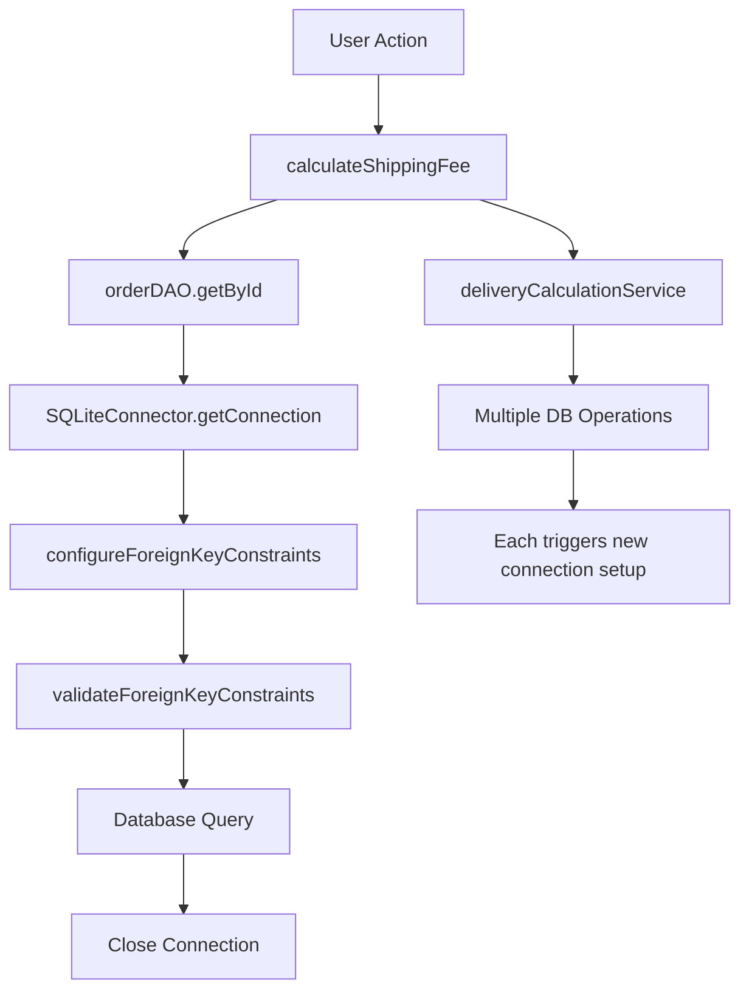

# PAYMENT FLOW ISSUE RESOLUTION PLAN

## Problem Analysis Summary

Based on the terminal analysis and code investigation, I've identified the root causes of the payment flow issues where payment cannot proceed after filling delivery information.

### **Primary Issues Identified:**

1. **🔴 Null Order Reference in Shipping Calculations**
   - The terminal shows "Order null" repeatedly during shipping calculations
   - This occurs because order data is being lost during the screen transition chain
   - The [`DeliveryCalculationServiceImpl.calculateShippingFee()`](src/main/java/com/aims/core/application/impl/DeliveryCalculationServiceImpl.java:37) receives null orders

2. **🔴 Excessive Database Connection Configuration**
   - [`SQLiteConnector.configureForeignKeyConstraints()`](src/main/java/com/aims/core/infrastructure/database/SQLiteConnector.java:164) is called multiple times per operation
   - Each DAO operation triggers new connection setup with foreign key configuration
   - This creates performance overhead and connection instability

3. **🔴 State Management Issue in Navigation Chain**
   - Order data is lost during: [`DeliveryInfoScreenController`](src/main/java/com/aims/core/presentation/controllers/DeliveryInfoScreenController.java) → [`OrderSummaryScreenController`](src/main/java/com/aims/core/presentation/controllers/OrderSummaryScreenController.java) → [`PaymentMethodScreenController`](src/main/java/com/aims/core/presentation/controllers/PaymentMethodScreenController.java)
   - Navigation only passes `orderId` instead of the complete `OrderEntity` object
   - Each screen re-fetches order data independently, causing inconsistencies

## **Root Cause Analysis**

### **Navigation Data Loss Pattern:**
```mermaid
graph LR
    A[DeliveryInfoScreenController] --> B[OrderSummaryScreenController]
    B --> C[PaymentMethodScreenController]
    C --> D[PaymentProcessingScreenController]
    
    A -->|✅ Has Order Object| A1[currentOrder]
    B -->|❌ Only OrderId| B1[initData(orderId)]
    C -->|❌ Only OrderId| C1[initData(orderId)]
    D -->|❌ Null Order| D1[Processing Fails]
```

### **Database Connection Overhead:**


## **Detailed Solution Plan**

### **Phase 1: Fix Order State Management (Priority: HIGH)**

#### **1.1 Enhanced Order Context Passing**
- **Problem**: Navigation only passes `orderId`, causing order re-fetching and potential null states
- **Solution**: Implement robust order context passing through navigation chain

**Files to Modify:**
- [`NavigationService.java`](src/main/java/com/aims/core/shared/NavigationService.java:54)
- [`DeliveryInfoScreenController.java`](src/main/java/com/aims/core/presentation/controllers/DeliveryInfoScreenController.java:429)
- [`OrderSummaryScreenController.java`](src/main/java/com/aims/core/presentation/controllers/OrderSummaryScreenController.java:122)
- [`PaymentMethodScreenController.java`](src/main/java/com/aims/core/presentation/controllers/PaymentMethodScreenController.java:48)

**Implementation Steps:**

1. **Create OrderNavigationContext Class**
```java
public class OrderNavigationContext {
    private OrderEntity order;
    private String lastScreenId;
    private Map<String, Object> contextData;
    
    // Methods for safe order passing and validation
}
```

2. **Enhance NavigationService with Order Context**
```java
public static void navigateToPaymentMethod(OrderEntity order) {
    navigateTo("payment_method_screen.fxml", null, controller -> {
        PaymentMethodScreenController paymentController = (PaymentMethodScreenController) controller;
        paymentController.setOrderData(order); // Pass full object, not just ID
    });
}
```

3. **Fix DeliveryInfoScreenController Navigation**
- Modify [`handleProceedToPaymentAction()`](src/main/java/com/aims/core/presentation/controllers/DeliveryInfoScreenController.java:429) to pass complete order object
- Add proper error handling and order validation before navigation

#### **1.2 Add Order Validation Methods**
```java
public class OrderValidationHelper {
    public static void validateOrderForPayment(OrderEntity order) throws ValidationException {
        if (order == null) {
            throw new ValidationException("Order cannot be null for payment processing");
        }
        if (order.getOrderId() == null) {
            throw new ValidationException("Order ID is required");
        }
        if (order.getDeliveryInfo() == null) {
            throw new ValidationException("Delivery information must be set before payment");
        }
        if (order.getOrderItems() == null || order.getOrderItems().isEmpty()) {
            throw new ValidationException("Order must contain items");
        }
    }
}
```

### **Phase 2: Fix Database Connection Optimization (Priority: MEDIUM)**

#### **2.1 Connection Pooling and Caching**
- **Problem**: Excessive foreign key constraint configuration on every operation
- **Solution**: Implement connection validation and reduce constraint reconfiguration

**Files to Modify:**
- [`SQLiteConnector.java`](src/main/java/com/aims/core/infrastructure/database/SQLiteConnector.java:41)

**Implementation Steps:**

1. **Enhanced Connection Validation**
```java
public class DatabaseConnectionManager {
    private static final long CONNECTION_VALIDITY_TIMEOUT = 5000; // 5 seconds
    private static long lastValidationTime = 0;
    private static boolean lastValidationResult = false;
    
    public static boolean isConnectionHealthy() {
        long currentTime = System.currentTimeMillis();
        if (currentTime - lastValidationTime > CONNECTION_VALIDITY_TIMEOUT) {
            lastValidationResult = SQLiteConnector.getInstance().validateConnectionHealth();
            lastValidationTime = currentTime;
        }
        return lastValidationResult;
    }
}
```

2. **Optimized SQLiteConnector**
- Reduce frequency of [`configureForeignKeyConstraints()`](src/main/java/com/aims/core/infrastructure/database/SQLiteConnector.java:164) calls
- Implement connection health checking before reconfiguration
- Add connection reuse optimization

#### **2.2 Shipping Calculation Service Enhancement**
**Files to Modify:**
- [`DeliveryCalculationServiceImpl.java`](src/main/java/com/aims/core/application/impl/DeliveryCalculationServiceImpl.java:37)

```java
@Override
public float calculateShippingFee(OrderEntity order, boolean isRushOrderRequested) throws ValidationException {
    // Enhanced null checking with specific error context
    if (order == null) {
        throw new ValidationException("Order is required for shipping calculation. " +
                                    "Please ensure order data is properly loaded before calculating shipping fees.");
    }
    
    String orderId = order.getOrderId();
    System.out.println("SHIPPING CALCULATION: Starting for Order " + 
                      (orderId != null ? orderId : "NULL_ORDER_ID") +
                      ", Rush requested: " + isRushOrderRequested);
    
    // Validate order completeness
    OrderValidationHelper.validateOrderForShipping(order);
    
    // Rest of the existing implementation...
}
```

### **Phase 3: Enhanced Error Handling and Logging (Priority: MEDIUM)**

#### **3.1 Payment Flow Monitoring**
```java
public class PaymentFlowMonitor {
    private static final Logger logger = Logger.getLogger(PaymentFlowMonitor.class.getName());
    
    public static void logNavigationStep(String fromScreen, String toScreen, OrderEntity order) {
        String orderId = order != null ? order.getOrderId() : "NULL";
        String orderStatus = order != null ? order.getOrderStatus().toString() : "NULL";
        
        logger.info(String.format("PAYMENT_FLOW: %s -> %s | Order: %s | Status: %s", 
                                fromScreen, toScreen, orderId, orderStatus));
    }
    
    public static void logShippingCalculation(OrderEntity order, boolean rushRequested, float result) {
        String orderId = order != null ? order.getOrderId() : "NULL";
        logger.info(String.format("SHIPPING_CALC: Order %s | Rush: %s | Fee: %.2f", 
                                orderId, rushRequested, result));
    }
}
```

#### **3.2 Defensive Programming in Controllers**
**Files to Modify:**
- [`PaymentMethodScreenController.java`](src/main/java/com/aims/core/presentation/controllers/PaymentMethodScreenController.java:48)
- [`OrderSummaryScreenController.java`](src/main/java/com/aims/core/presentation/controllers/OrderSummaryScreenController.java:51)

### **Phase 4: Testing and Validation Strategy**

#### **4.1 Integration Tests for Payment Flow**
```java
@Test
public void testCompletePaymentFlowWithOrderPersistence() {
    // Test the complete flow: Cart -> Delivery -> Order Summary -> Payment Method -> Processing
    // Verify order data integrity at each step
    // Validate no null order references occur
}

@Test  
public void testDatabaseConnectionOptimization() {
    // Verify foreign key constraints are not reconfigured unnecessarily
    // Test connection reuse efficiency
    // Validate shipping calculation performance
}
```

#### **4.2 Performance Monitoring**
```java
public class PaymentPerformanceMonitor {
    public static void measureDatabaseOperations() {
        // Track database connection setup frequency
        // Monitor shipping calculation response times
        // Log excessive foreign key reconfigurations
    }
}
```

## **Implementation Priority Matrix**

| Issue | Priority | Impact | Effort | Timeline |
|-------|----------|--------|--------|----------|
| Order State Management | HIGH | HIGH | MEDIUM | 1-2 days |
| Null Order Validation | HIGH | HIGH | LOW | 0.5 days |
| Database Connection Optimization | MEDIUM | MEDIUM | MEDIUM | 1 day |
| Enhanced Error Handling | MEDIUM | LOW | LOW | 0.5 days |
| Performance Monitoring | LOW | MEDIUM | LOW | 0.5 days |

## **Success Criteria**

### **Functional Requirements:**
✅ **Payment flow completes without null order references**  
✅ **Order data persists correctly through navigation chain**  
✅ **Shipping calculations display accurate values**  
✅ **Database connections are efficiently managed**  
✅ **Error messages are informative and actionable**

### **Performance Requirements:**
✅ **Shipping calculation completes within 500ms**  
✅ **Database foreign key setup occurs max once per session**  
✅ **Navigation transitions complete within 200ms**  
✅ **Memory usage remains stable during payment flow**

## **Risk Mitigation**

### **High-Risk Areas:**
1. **Order Data Corruption**: Implement comprehensive validation at each navigation step
2. **Database Connection Failures**: Add connection recovery mechanisms
3. **UI State Inconsistency**: Implement UI state validation and refresh capabilities

### **Rollback Strategy:**
- Maintain current functionality as fallback
- Implement feature flags for new payment flow logic
- Provide manual order completion paths for critical failures

## **Next Steps**

1. **Immediate Actions (Phase 1)**:
   - Fix order state management in navigation chain
   - Add null order validation in shipping calculations
   - Implement robust error handling

2. **Follow-up Actions (Phase 2-3)**:
   - Optimize database connection management
   - Add comprehensive logging and monitoring
   - Implement performance optimizations

3. **Testing and Deployment**:
   - Create comprehensive integration tests
   - Validate all payment flow scenarios
   - Monitor performance metrics post-deployment

---

**CRITICAL PATH**: Start with Phase 1 (Order State Management) as it addresses the immediate null order issues causing payment flow failures.