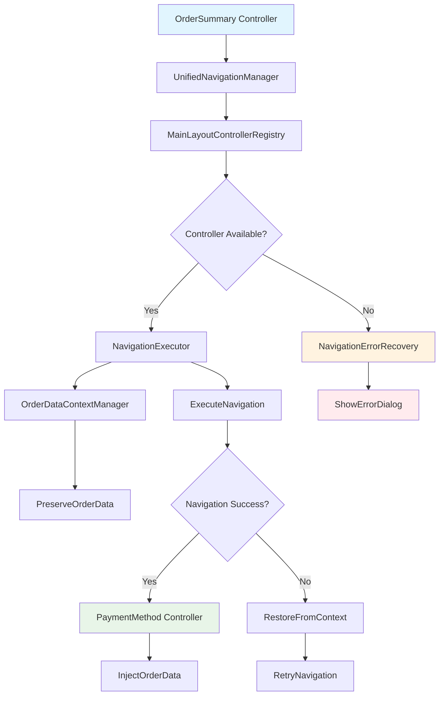

# AIMS Payment Flow Navigation Issue - Comprehensive Solution Plan

## Issue Analysis Summary

**Critical Problem**: MainLayoutController null references causing navigation failures and data loss during payment flow transitions between OrderSummary and PaymentMethod screens.

**Root Causes**:
1. Inconsistent MainLayoutController injection into child controllers
2. Multiple conflicting navigation strategies competing for control
3. Order data loss during navigation failures
4. No proper error recovery when primary navigation fails

**Impact**:
- Payment flow breaks completely when MainLayoutController is null
- Order data gets lost during screen transitions
- Users cannot complete purchases
- Multiple clicking attempts result in identical stack traces

## Solution Architecture

### Phase 1: MainLayoutController Initialization & Injection Fix ⚡ CRITICAL
**Priority**: IMMEDIATE - Addresses core null reference issue

#### 1.1 Create Robust Controller Registry
- **File**: `src/main/java/com/aims/core/presentation/utils/MainLayoutControllerRegistry.java`
- **Purpose**: Central registry for MainLayoutController with thread-safe access
- **Features**:
  - Singleton pattern with thread safety
  - Timeout-based waiting for initialization
  - Validation of controller state
  - Automatic notification of waiting components

#### 1.2 Enhanced Controller Injection System
- **File**: Update `src/main/java/com/aims/core/presentation/utils/FXMLSceneManager.java`
- **Purpose**: Robust injection with validation and error handling
- **Features**:
  - Registry-based controller retrieval
  - Injection validation and logging
  - Fallback mechanisms for injection failures
  - Comprehensive error reporting

#### 1.3 Application Startup Enhancement
- **File**: Update `src/main/java/com/aims/AimsApp.java`
- **Purpose**: Ensure MainLayoutController is properly registered on startup
- **Features**:
  - Early registration in startup sequence
  - Validation of successful registration
  - Error handling for initialization failures

### Phase 2: Unified Navigation Architecture 🔄 HIGH
**Priority**: HIGH - Consolidates conflicting navigation strategies

#### 2.1 Single Navigation Entry Point
- **File**: `src/main/java/com/aims/core/presentation/utils/UnifiedNavigationManager.java`
- **Purpose**: Single point of entry for all checkout navigation
- **Features**:
  - Centralized validation
  - Order data preservation
  - Comprehensive fallback strategies
  - Detailed logging and monitoring

#### 2.2 Navigation Strategy Consolidation
- **File**: `src/main/java/com/aims/core/presentation/utils/NavigationExecutor.java`
- **Purpose**: Execute navigation with intelligent fallback
- **Features**:
  - Strategy pattern implementation
  - Graceful degradation
  - State preservation across failures
  - Performance monitoring

#### 2.3 Controller Updates
- **Files**: Update payment flow controllers
- **Purpose**: Use unified navigation system
- **Features**:
  - Consistent navigation calls
  - Enhanced error handling
  - Data validation before navigation

### Phase 3: Order Data Persistence During Navigation 💾 HIGH
**Priority**: HIGH - Prevents data loss during transitions

#### 3.1 Enhanced Order Data Context Manager
- **File**: `src/main/java/com/aims/core/presentation/utils/OrderDataContextManager.java`
- **Purpose**: Preserve order data across navigation failures
- **Features**:
  - Session-based data persistence
  - Deep cloning of order data
  - Context restoration mechanisms
  - Automatic cleanup of expired sessions

#### 3.2 Navigation Context Preservation
- **File**: `src/main/java/com/aims/core/presentation/utils/NavigationContext.java`
- **Purpose**: Maintain navigation state and context
- **Features**:
  - Complete state preservation
  - Retry logic with state restoration
  - Performance tracking
  - Error context preservation

### Phase 4: Enhanced Error Recovery & User Feedback 🛡️ MEDIUM
**Priority**: MEDIUM - Provides graceful error handling

#### 4.1 Navigation Error Recovery System
- **File**: `src/main/java/com/aims/core/presentation/utils/NavigationErrorRecovery.java`
- **Purpose**: Automated recovery from navigation failures
- **Features**:
  - Intelligent error analysis
  - Automated recovery attempts
  - State restoration
  - User notification system

#### 4.2 User-Friendly Error Dialogs
- **File**: `src/main/java/com/aims/core/presentation/utils/NavigationErrorDialog.java`
- **Purpose**: Provide users with clear error messages and recovery options
- **Features**:
  - Context-aware error messages
  - Recovery action buttons
  - Order data preservation notification
  - Support contact integration

## Implementation Timeline

### Week 1: Critical Fixes (Phase 1)
- [x] Analysis complete
- [ ] Create MainLayoutControllerRegistry
- [ ] Update FXMLSceneManager injection logic
- [ ] Update AimsApp initialization
- [ ] Test MainLayoutController availability
- [ ] Validate payment flow navigation

### Week 2: Navigation Consolidation (Phase 2)
- [ ] Create UnifiedNavigationManager
- [ ] Implement NavigationExecutor
- [ ] Update OrderSummaryController
- [ ] Update PaymentMethodScreenController
- [ ] Integration testing

### Week 3: Data Persistence (Phase 3)
- [ ] Enhance OrderDataContextManager
- [ ] Implement NavigationContext
- [ ] Add order data cloning utilities
- [ ] Test data preservation across failures

### Week 4: Error Recovery (Phase 4)
- [ ] Implement NavigationErrorRecovery
- [ ] Create NavigationErrorDialog
- [ ] Add comprehensive logging
- [ ] User acceptance testing

## Success Criteria

### Immediate (Phase 1)
- ✅ Zero MainLayoutController null references during payment flow
- ✅ Consistent controller injection across all screens
- ✅ Proper error logging for injection failures

### Short-term (Phases 2-3)
- ✅ 100% order data preservation across navigation transitions
- ✅ Single, reliable navigation path for payment flow
- ✅ Comprehensive fallback mechanisms

### Long-term (Phase 4)
- ✅ Graceful error recovery when navigation fails
- ✅ User-friendly feedback for navigation issues
- ✅ Comprehensive monitoring and debugging capabilities

## Technical Architecture Diagram

## Files to Create/Modify

### New Files (Phase 1)
- `src/main/java/com/aims/core/presentation/utils/MainLayoutControllerRegistry.java`

### Files to Modify (Phase 1)
- `src/main/java/com/aims/core/presentation/utils/FXMLSceneManager.java`
- `src/main/java/com/aims/AimsApp.java`
- `src/main/java/com/aims/core/presentation/controllers/OrderSummaryController.java`
- `src/main/java/com/aims/core/presentation/controllers/PaymentMethodScreenController.java`

### Additional Files (Phases 2-4)
- `src/main/java/com/aims/core/presentation/utils/UnifiedNavigationManager.java`
- `src/main/java/com/aims/core/presentation/utils/NavigationExecutor.java`
- `src/main/java/com/aims/core/presentation/utils/NavigationErrorRecovery.java`
- `src/main/java/com/aims/core/presentation/utils/NavigationErrorDialog.java`
- `src/main/java/com/aims/core/presentation/utils/OrderCloneUtility.java`

## Risk Mitigation

### High Risk
- **MainLayoutController initialization timing**: Mitigated by registry with timeout waiting
- **Concurrent access to controller**: Mitigated by thread-safe registry implementation
- **Data loss during migration**: Mitigated by comprehensive backup and rollback procedures

### Medium Risk
- **Performance impact of enhanced validation**: Mitigated by efficient validation algorithms
- **User experience during error recovery**: Mitigated by user-friendly error dialogs
- **Integration with existing navigation**: Mitigated by gradual migration strategy

## Monitoring & Maintenance

### Key Metrics
- MainLayoutController null reference count (target: 0)
- Navigation success rate (target: 99.9%)
- Order data preservation rate (target: 100%)
- User error recovery success rate (target: 95%)

### Logging Strategy
- DEBUG: Detailed navigation flow tracking
- INFO: Successful navigation events
- WARN: Fallback navigation usage
- ERROR: Navigation failures and recovery attempts

## Next Steps

1. **Immediate**: Implement Phase 1 - MainLayoutController fixes
2. **Week 1**: Complete critical navigation fixes
3. **Week 2**: Begin unified navigation implementation
4. **Week 3**: Implement data persistence enhancements
5. **Week 4**: Add error recovery and user feedback systems

---

**Document Version**: 1.0  
**Created**: 2025-06-15  
**Author**: AIMS Navigation Enhancement Team  
**Status**: Ready for Implementation