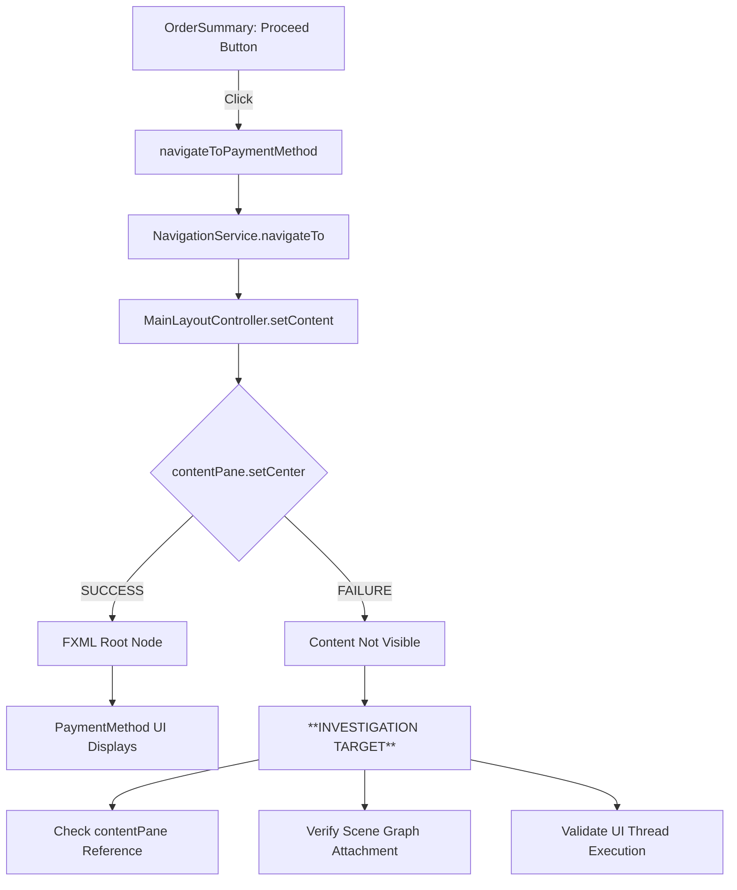

# PaymentMethod Screen UI State Investigation Plan

## Issue Summary
Users click "Proceed to Payment" from Order Summary screen. Backend logs show successful navigation:
- ✅ PaymentMethodScreenController initialization
- ✅ FXML loading completed  
- ✅ Service injection completed
- ✅ Order data injection successful
- ✅ Navigation result: SUCCESS

**Problem**: UI screen not displaying to user despite successful backend navigation.

## Root Cause Focus: UI State Verification

Based on code analysis, the most likely issue is in the content pane update mechanism where `MainLayoutController.setContent()` may not be properly updating the visible UI.

## Investigation Flow Diagram



## Detailed Investigation Strategy

### Phase 1: ContentPane Reference Validation
**Target**: [`MainLayoutController.setContent()`](src/main/java/com/aims/core/presentation/controllers/MainLayoutController.java:92-98)

**Investigation Points**:
1. **Verify contentPane is not null** (Line 94-97)
   - Add logging to confirm contentPane reference is valid
   - Check if contentPane is properly initialized from FXML

2. **Validate contentPane.setCenter() execution**
   - Trace if `contentPane.setCenter(content)` actually executes
   - Verify the content parameter is the correct PaymentMethod root node

3. **Check contentPane binding to visible UI**
   - Ensure contentPane from FXML matches what user sees
   - Verify no duplicate contentPane instances exist

### Phase 2: FXML Loading Chain Verification
**Target**: [`FXMLSceneManager.loadFXMLIntoPane()`](src/main/java/com/aims/core/presentation/utils/FXMLSceneManager.java:324-337)

**Investigation Points**:
1. **Verify loadFXMLIntoPane execution** (Line 328)
   - Confirm `containerPane.getChildren().setAll(loaded.parent)` executes
   - Check if loaded.parent contains the PaymentMethod UI content

2. **Validate container pane reference**
   - Ensure containerPane parameter matches MainLayoutController.contentPane
   - Check for reference corruption or stale objects

### Phase 3: Scene Graph Attachment Verification  
**Target**: Scene graph hierarchy integrity

**Investigation Points**:
1. **Verify root node attachment**
   - Check if PaymentMethod FXML root gets properly attached to scene
   - Validate scene graph parent-child relationships

2. **Check for content replacement issues**
   - Ensure previous content (OrderSummary) is properly replaced
   - Verify no content overlap or layering issues

### Phase 4: JavaFX Application Thread Validation
**Target**: Thread safety in UI updates

**Investigation Points**:
1. **Verify Platform.isFxApplicationThread()**
   - Ensure all UI updates occur on JavaFX Application Thread
   - Check if navigation calls happen from background threads

2. **Validate timing of UI updates**
   - Ensure content setting happens after FXML loading completes
   - Check for race conditions in navigation flow

## Implementation Plan

### Step 1: Add Diagnostic Logging
**Files to Modify**:
- [`MainLayoutController.java`](src/main/java/com/aims/core/presentation/controllers/MainLayoutController.java:92-98)
- [`FXMLSceneManager.java`](src/main/java/com/aims/core/presentation/utils/FXMLSceneManager.java:324-337)

**Logging Points**:
```java
// In MainLayoutController.setContent()
System.out.println("CONTENT_DEBUG: setContent called with content: " + 
    (content != null ? content.getClass().getSimpleName() : "null"));
System.out.println("CONTENT_DEBUG: contentPane reference: " + 
    (contentPane != null ? "valid" : "null"));
System.out.println("CONTENT_DEBUG: contentPane scene: " + 
    (contentPane != null && contentPane.getScene() != null ? "attached" : "detached"));
    
// After setCenter call
System.out.println("CONTENT_DEBUG: setCenter completed, children count: " + 
    contentPane.getChildren().size());
```

### Step 2: Create UI State Validation Utility
**New File**: `UIStateValidator.java`

**Purpose**: Validate scene graph integrity and content pane state

**Key Methods**:
- `validateContentPaneAttachment(BorderPane contentPane)`
- `validateSceneGraphIntegrity(Node rootNode)`  
- `logSceneHierarchy(Node node, int depth)`

### Step 3: Add Navigation Flow Tracing
**Files to Modify**:
- [`NavigationService.java`](src/main/java/com/aims/core/shared/NavigationService.java:62-83)
- [`PaymentMethodScreenController.java`](src/main/java/com/aims/core/presentation/controllers/PaymentMethodScreenController.java:145-162)

**Tracing Points**:
- Before and after `mainLayout.setContent(root)`
- Thread execution context
- Content pane state before/after navigation

### Step 4: Implement Fix Based on Findings

**Likely Fixes**:
1. **ContentPane Reference Issue**: 
   - Ensure contentPane is properly initialized from FXML
   - Add null checks and fallback mechanisms

2. **Scene Graph Detachment**:
   - Force scene refresh after content update
   - Ensure proper parent-child relationships

3. **Threading Issues**:
   - Wrap content updates in `Platform.runLater()`
   - Add synchronization where needed

## Success Criteria

1. **Diagnostic logging reveals exact failure point** in UI update chain
2. **PaymentMethod screen displays correctly** after fix implementation  
3. **Navigation flow is traceable** from OrderSummary → PaymentMethod
4. **UI state validation passes** for all navigation scenarios
5. **No regression** in other navigation paths

## Testing Strategy

1. **Reproduction Test**: Consistently reproduce the blank screen issue
2. **Logging Analysis**: Trace exact point where UI update fails
3. **Fix Validation**: Verify PaymentMethod screen displays properly
4. **Regression Testing**: Test all other navigation flows remain functional
5. **Edge Case Testing**: Test rapid navigation, concurrent requests

## Risk Assessment

**Low Risk**:
- Adding diagnostic logging
- Creating validation utilities

**Medium Risk**: 
- Modifying core navigation logic
- Changing content pane update mechanism

**Mitigation**:
- Comprehensive testing before deployment
- Ability to rollback changes quickly
- Preserving existing functionality

## Timeline Estimate

- **Phase 1-2**: Diagnostic logging implementation (2-4 hours)
- **Phase 3**: UI state validation utilities (2-3 hours)  
- **Phase 4**: Fix implementation based on findings (4-6 hours)
- **Testing & Validation**: (2-3 hours)

**Total Estimated Time**: 10-16 hours

## Dependencies

- Access to running application for testing
- Ability to modify core navigation files
- JavaFX development environment
- Logging framework configuration