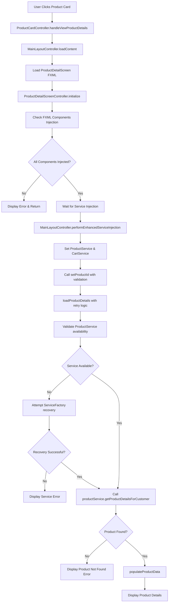

# AIMS Product Detail Navigation Issue - Analysis & Remediation Plan

## Problem Summary
When clicking on a product card, the application navigates to the product detail screen but displays blank/empty content. The navigation works (screen changes), but no product information is shown.

## Root Cause Analysis

Based on comprehensive code review, I've identified several potential failure points in the product detail loading flow:

### 1. Service Injection Timing Issue (Primary Suspect)
- **Issue**: The `ProductDetailScreenController.setProductId()` method is called immediately after loading the FXML, but service injection happens in `MainLayoutController.performEnhancedServiceInjection()` after `setProductId()` is called.
- **Location**: [`ProductCardController.java:326`](src/main/java/com/aims/core/presentation/controllers/ProductCardController.java:326) and [`MainLayoutController.java:544`](src/main/java/com/aims/core/presentation/controllers/MainLayoutController.java:544)
- **Impact**: When `loadProductDetails()` is called, `productService` might still be null, causing silent failure.

### 2. Service Initialization Failure
- **Risk**: If `ServiceFactory.getInstance().getProductService()` fails during fallback initialization in `validateAndInitializeServices()`, the service remains null.
- **Location**: [`ProductDetailScreenController.java:189-213`](src/main/java/com/aims/core/presentation/controllers/ProductDetailScreenController.java:189)

### 3. Database Connection Issues
- **Risk**: The `ProductDAOImpl.getById()` method might fail due to database connection issues or missing database file.
- **Location**: [`ProductDAOImpl.java:68-177`](src/main/java/com/aims/core/infrastructure/database/dao/ProductDAOImpl.java:68)

### 4. FXML Component Injection Failure
- **Risk**: If FXML components are not properly injected, `populateProductData()` will fail silently.
- **Location**: [`ProductDetailScreenController.java:289-357`](src/main/java/com/aims/core/presentation/controllers/ProductDetailScreenController.java:289)

## Architectural Issues Identified

1. **Race Condition**: Service injection happens after navigation and product ID setting
2. **Insufficient Error Handling**: Silent failures in service initialization and data loading
3. **Missing Validation**: No proper validation of FXML component injection
4. **Inconsistent Logging**: Debug information is present but may not be comprehensive enough for production debugging

## Proposed Solution Flow



## Implementation Plan

### Phase 1: Fix Service Injection Timing (High Priority)
1. **Modify navigation flow** to ensure service injection before `setProductId()`
2. **Add service validation** in `setProductId()` method
3. **Implement delayed loading** if services aren't ready

### Phase 2: Enhance Error Handling (High Priority)
1. **Add comprehensive error display** for each failure point
2. **Implement retry mechanisms** for service initialization
3. **Add user-friendly error messages** with actionable guidance

### Phase 3: Improve Diagnostics (Medium Priority)
1. **Add detailed logging** at each step of the loading process
2. **Implement health checks** for database connectivity
3. **Add component injection validation**

### Phase 4: Architectural Improvements (Medium Priority)
1. **Implement proper dependency injection lifecycle**
2. **Add service ready callbacks**
3. **Improve error recovery mechanisms**

## Specific Code Changes Required

### 1. Fix ProductCardController Navigation Timing
**File**: [`src/main/java/com/aims/core/presentation/controllers/ProductCardController.java`](src/main/java/com/aims/core/presentation/controllers/ProductCardController.java)

```java
// In ProductCardController.handleViewProductDetails()
// Change from immediate setProductId() to deferred loading
if (controller instanceof ProductDetailScreenController) {
    ProductDetailScreenController detailController = (ProductDetailScreenController) controller;
    
    // Ensure services are injected first, then set product ID
    Platform.runLater(() -> {
        if (detailController.areServicesReady()) {
            detailController.setProductId(product.getProductId());
        } else {
            // Retry with exponential backoff
            retrySetProductId(detailController, product.getProductId(), 3);
        }
    });
}
```

### 2. Enhanced Service Validation in ProductDetailScreenController
**File**: [`src/main/java/com/aims/core/presentation/controllers/ProductDetailScreenController.java`](src/main/java/com/aims/core/presentation/controllers/ProductDetailScreenController.java)

```java
// Add service readiness check
public boolean areServicesReady() {
    return productService != null && mainLayoutController != null;
}

// Add timeout-based waiting for services
private boolean waitForServicesWithTimeout(long timeoutMs) {
    long startTime = System.currentTimeMillis();
    while (!areServicesReady() && (System.currentTimeMillis() - startTime) < timeoutMs) {
        try {
            Thread.sleep(50);
        } catch (InterruptedException e) {
            Thread.currentThread().interrupt();
            return false;
        }
    }
    return areServicesReady();
}

// Enhanced setProductId() method
public void setProductId(String productId) {
    this.productIdToLoad = productId;
    
    // Validate services first
    if (!areServicesReady()) {
        if (!waitForServicesWithTimeout(5000)) {
            displayError("Services are not ready. Please try again.");
            return;
        }
    }
    
    if (productIdToLoad != null) {
        loadProductDetails();
    } else {
        displayError("Product ID not provided.");
    }
}
```

### 3. Add Component Validation in initialize()
```java
// Enhanced initialize() method
public void initialize() {
    boolean allComponentsInjected = validateFXMLComponents();
    if (!allComponentsInjected) {
        System.err.println("Critical FXML components not injected");
        return;
    }
    // ... rest of initialization
}

private boolean validateFXMLComponents() {
    List<String> missingComponents = new ArrayList<>();
    
    if (productTitleLabel == null) missingComponents.add("productTitleLabel");
    if (productImageView == null) missingComponents.add("productImageView");
    if (productPriceLabel == null) missingComponents.add("productPriceLabel");
    if (productDescriptionArea == null) missingComponents.add("productDescriptionArea");
    if (productSpecificsGrid == null) missingComponents.add("productSpecificsGrid");
    
    if (!missingComponents.isEmpty()) {
        System.err.println("Missing FXML components: " + String.join(", ", missingComponents));
        return false;
    }
    return true;
}
```

### 4. Enhanced Error Display with User Guidance
```java
private void displayError(String message) {
    System.err.println("ProductDetailScreenController Error: " + message);
    
    // Show error in title with visual indication
    if (productTitleLabel != null) {
        productTitleLabel.setText("Unable to Load Product Details");
        productTitleLabel.setStyle("-fx-text-fill: red;");
    }
    
    // Provide user-friendly error messages
    String userMessage = generateUserFriendlyErrorMessage(message);
    
    if (productDescriptionArea != null) {
        productDescriptionArea.setText(userMessage);
    }
    
    // Show error message in the error label
    setErrorMessage(message, true);
    
    // Disable controls
    if (quantitySpinner != null) quantitySpinner.setDisable(true);
    if (addToCartButton != null) addToCartButton.setDisable(true);
}

private String generateUserFriendlyErrorMessage(String technicalMessage) {
    if (technicalMessage.contains("Service")) {
        return "The product catalog service is temporarily unavailable.\n\n" +
               "Please try:\n" +
               "1. Refreshing the page\n" +
               "2. Going back and selecting the product again\n" +
               "3. Contacting support if the issue persists";
    } else if (technicalMessage.contains("not found")) {
        return "This product could not be found.\n\n" +
               "It may have been:\n" +
               "- Removed from our catalog\n" +
               "- Temporarily unavailable\n" +
               "- Moved to a different category\n\n" +
               "Please browse our catalog for similar products.";
    } else {
        return "An unexpected error occurred while loading product details.\n\n" +
               "Please try refreshing the page or contact support if the issue persists.\n\n" +
               "Error details: " + technicalMessage;
    }
}
```

## Testing Strategy

### 1. Unit Tests
- Test service injection timing and error handling
- Mock service failures and validate error responses
- Test component validation logic

### 2. Integration Tests
- Test complete navigation flow with various failure scenarios
- Test database connectivity issues
- Test service initialization failures

### 3. Manual Testing
- Test with different product types (Book, CD, DVD)
- Test with invalid product IDs
- Test with slow database connections

### 4. Error Simulation Tests
- Test with disconnected database
- Test with missing services
- Test with FXML component injection failures

## Success Criteria

- ✅ Product details load consistently for all product types
- ✅ Clear, user-friendly error messages for any failure scenarios
- ✅ Proper service initialization and validation
- ✅ Robust error recovery mechanisms
- ✅ Comprehensive logging for debugging
- ✅ No more blank screens on product detail navigation

## Risk Assessment

- **Low Risk**: FXML component injection issues (easily detectable and fixable)
- **Medium Risk**: Database connectivity problems (recoverable with proper error handling)
- **High Risk**: Service timing issues (subtle and intermittent, requires careful coordination)

## Recommended Next Steps

1. **Immediate Action**: Implement Phase 1 (Service Injection Timing Fix)
2. **Short Term**: Implement Phase 2 (Enhanced Error Handling)
3. **Medium Term**: Add comprehensive diagnostics and testing
4. **Long Term**: Architectural improvements for robust dependency injection

The primary focus should be on fixing the service injection timing issue, as this is most likely the root cause of the blank screen problem.