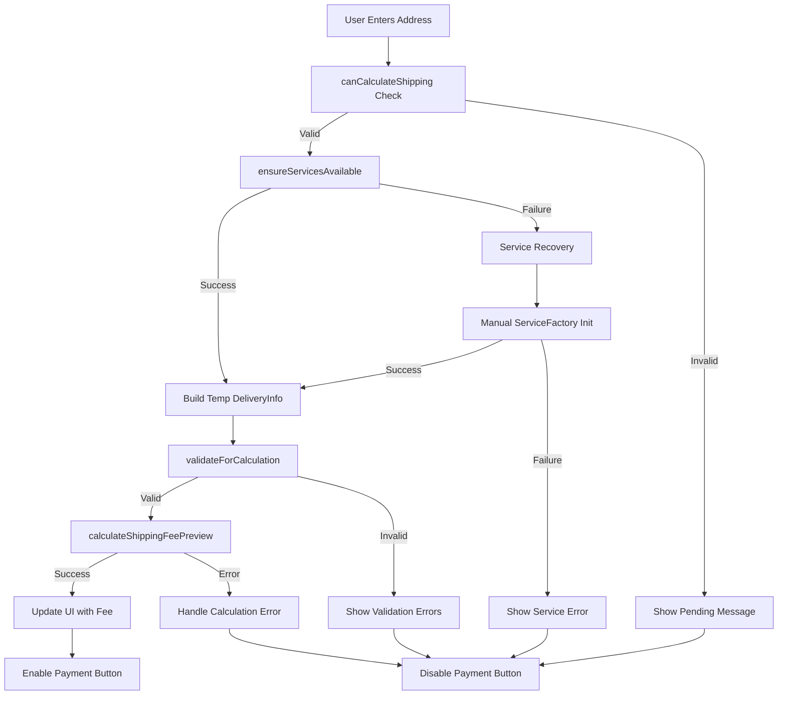

# AIMS Shipping Fee Calculation Failure - Root Cause Analysis & Solution Plan

## Issue Summary
**Problem**: Shipping fee calculation fails in the delivery info screen when users enter their address and the system should automatically calculate shipping fees.

**Impact**: Users cannot proceed with checkout, blocking the entire order completion flow.

## 1. Root Cause Analysis

### Primary Issue: Dependency Injection Chain Failure
The shipping fee calculation fails in the delivery info screen due to a **critical dependency injection problem**. Here's the failure chain:

1. **Service Injection Timing**: The [`DeliveryInfoScreenController`](src/main/java/com/aims/core/presentation/controllers/DeliveryInfoScreenController.java:94) expects both `orderService` and `deliveryService` to be injected via setter methods
2. **Manual Service Recovery**: The controller attempts automatic recovery when services are null (lines 314-332), but this creates **state corruption**
3. **Temporary State Pollution**: The controller temporarily modifies the order's delivery info for calculation (lines 310-332), which can cause **race conditions** and **data inconsistency**

### Critical Code Issues Identified

#### Issue 1: Unsafe Order State Manipulation
```java
// Lines 310-312 in DeliveryInfoScreenController.calculateAndUpdateShippingFee()
DeliveryInfo originalDeliveryInfo = currentOrder.getDeliveryInfo();
currentOrder.setDeliveryInfo(tempDeliveryInfo); // DANGEROUS: Temporary state change

try {
    float fee = orderService.calculateShippingFee(currentOrder.getOrderId(), tempDeliveryInfo, rushOrderCheckBox.isSelected());
    // ... success handling
} finally {
    // CRITICAL: Restore original state to avoid corrupting order
    currentOrder.setDeliveryInfo(originalDeliveryInfo);
}
```

**Problem**: This creates a race condition where the order object is temporarily in an inconsistent state.

#### Issue 2: Service Dependency Chain
```java
// OrderServiceImpl.calculateShippingFee() line 196
return deliveryCalculationService.calculateShippingFee(order, isRushOrder);

// But DeliveryCalculationServiceImpl.calculateShippingFee() line 45 validates:
if (order.getDeliveryInfo() == null) {
    throw new ValidationException("Delivery information is required for shipping calculation.");
}
```

**Problem**: The service expects the order to have delivery info set, but the controller is trying to calculate fees before officially setting delivery info.

#### Issue 3: Inconsistent Service Injection
The [`FXMLSceneManager`](src/main/java/com/aims/core/presentation/utils/FXMLSceneManager.java:353) and [`MainLayoutController`](src/main/java/com/aims/core/presentation/controllers/MainLayoutController.java:590) both attempt service injection, creating **potential race conditions**.

```java
// FXMLSceneManager.injectServices() - lines 352-354
deliveryController.setOrderService(serviceFactory.getOrderService());
deliveryController.setDeliveryService(serviceFactory.getDeliveryCalculationService());

// MainLayoutController.performEnhancedServiceInjection() - lines 589-590
deliveryController.setOrderService(serviceFactory.getOrderService());
deliveryController.setDeliveryService(serviceFactory.getDeliveryCalculationService());
```

**Problem**: Double injection and timing issues can cause services to be null when needed.

## 2. Proposed Solutions

### Solution 1: Add Preview Calculation Method

Add a new method to [`IOrderService`](src/main/java/com/aims/core/application/services/IOrderService.java) that doesn't require modifying order state:

```java
/**
 * Calculates shipping fee for preview without modifying order state.
 * Used for real-time calculation in delivery info screen.
 */
float calculateShippingFeePreview(List<OrderItem> items, DeliveryInfo deliveryInfo, boolean isRushOrder) 
    throws ValidationException;
```

**Implementation in OrderServiceImpl**:
```java
@Override
public float calculateShippingFeePreview(List<OrderItem> items, DeliveryInfo deliveryInfo, boolean isRushOrder) 
        throws ValidationException {
    // Create temporary order for calculation without persisting
    OrderEntity tempOrder = new OrderEntity();
    tempOrder.setOrderItems(items);
    tempOrder.setDeliveryInfo(deliveryInfo);
    
    return deliveryCalculationService.calculateShippingFee(tempOrder, isRushOrder);
}
```

### Solution 2: Enhanced DeliveryInfoScreenController

**Fixed calculation method**:
```java
private void calculateAndUpdateShippingFee() {
    if (!canCalculateShipping()) {
        displayShippingCalculationPending();
        return;
    }
    
    if (!ensureServicesAvailable()) {
        handleCalculationError("Services unavailable. Please try again.");
        return;
    }
    
    DeliveryInfo tempDeliveryInfo = buildDeliveryInfoFromForm(false);
    if (tempDeliveryInfo == null) {
        displayShippingCalculationPending();
        return;
    }

    try {
        // FIXED: Use preview method instead of modifying order state
        float fee = orderService.calculateShippingFeePreview(
            currentOrder.getOrderItems(), 
            tempDeliveryInfo, 
            rushOrderCheckBox.isSelected()
        );
        
        // Success - update UI
        shippingFeeLabel.setText(String.format("Shipping Fee: %,.0f VND", fee));
        float totalAmount = currentOrder.getTotalProductPriceInclVAT() + fee;
        totalAmountLabel.setText(String.format("TOTAL AMOUNT: %,.0f VND", totalAmount));
        proceedToPaymentButton.setDisable(false);
        setErrorMessage("", false);
        
    } catch (ValidationException e) {
        handleCalculationError("Could not calculate shipping fee: " + e.getMessage());
    }
}
```

### Solution 3: Service Injection Guard

**Enhanced service validation**:
```java
private boolean ensureServicesAvailable() {
    if (orderService == null || deliveryService == null) {
        try {
            ServiceFactory factory = ServiceFactory.getInstance();
            if (orderService == null) {
                this.orderService = factory.getOrderService();
                System.out.println("DeliveryInfoScreenController: OrderService recovered from ServiceFactory");
            }
            if (deliveryService == null) {
                this.deliveryService = factory.getDeliveryCalculationService();
                System.out.println("DeliveryInfoScreenController: DeliveryService recovered from ServiceFactory");
            }
            
            return orderService != null && deliveryService != null;
        } catch (Exception e) {
            System.err.println("Failed to initialize services: " + e.getMessage());
            return false;
        }
    }
    return true;
}
```

## 3. Example Delivery Form Data

| Field | Example Value | Purpose | Expected Result |
|-------|---------------|---------|-----------------|
| **Recipient Name** | Nguyen Van An | Primary contact for delivery | Required validation |
| **Email** | nguyen.van.an@example.com | Delivery notifications | Format validation |
| **Phone** | +84 912 345 678 | Delivery coordination | Format validation |
| **Province/City** | Hanoi | Determines shipping zone | Inner city detection |
| **Address** | 123 Hoan Kiem Street, Ba Dinh District | Location & rush eligibility | District parsing |
| **Product Weight** | 2.5kg (DVD collection) | Base calculation factor | Weight validation |
| **Product Dimensions** | 30x20x15 cm | Volumetric weight | Dimensional calculation |
| **Rush Delivery** | Yes | Additional surcharge | Eligibility check |
| **Expected Fee (Hanoi Inner)** | 22,000 VND | Standard rate ≤3kg | Base rate validation |
| **Expected Fee (Rush)** | 32,000 VND | Base + 10,000 surcharge | Rush calculation |
| **Free Shipping Threshold** | 100,000 VND order value | 25,000 VND discount | Discount application |

### Sample Test Scenarios

#### Scenario 1: Standard Delivery - Hanoi Inner City
- **Address**: "123 Ba Dinh District, Hanoi"
- **Weight**: 2.0kg
- **Expected Fee**: 22,000 VND
- **Calculation**: Base fee for ≤3kg in Hanoi/HCM

#### Scenario 2: Rush Delivery - Eligible
- **Address**: "456 Hoan Kiem District, Hanoi" 
- **Weight**: 1.5kg
- **Rush**: Yes
- **Expected Fee**: 32,000 VND (22,000 + 10,000 surcharge)

#### Scenario 3: Other Province
- **Address**: "789 Hai Chau District, Da Nang"
- **Weight**: 1.0kg  
- **Expected Fee**: 32,500 VND (30,000 + 2,500 for additional 0.5kg)

#### Scenario 4: Free Shipping Applied
- **Address**: "101 Dong Da District, Hanoi"
- **Weight**: 2.5kg
- **Order Value**: 150,000 VND
- **Expected Fee**: 0 VND (22,000 - 25,000 discount = 0)

## 4. Error Handling Improvements

### Enhanced Validation Chain

```java
public class DeliveryInfoValidator {
    public static ValidationResult validateForCalculation(DeliveryInfo info, List<OrderItem> items) {
        List<String> errors = new ArrayList<>();
        
        // Address validation
        if (isNullOrEmpty(info.getDeliveryProvinceCity())) {
            errors.add("Province/City is required for shipping calculation");
        }
        if (isNullOrEmpty(info.getDeliveryAddress())) {
            errors.add("Delivery address is required for shipping calculation");
        }
        
        // Product validation
        if (items == null || items.isEmpty()) {
            errors.add("Order must contain items for shipping calculation");
        } else {
            for (OrderItem item : items) {
                if (item.getProduct() == null) {
                    errors.add("Product information missing for order item");
                    continue;
                }
                if (item.getProduct().getWeightKg() <= 0) {
                    errors.add("Product weight information missing for: " + item.getProduct().getTitle());
                }
            }
        }
        
        return new ValidationResult(errors.isEmpty(), errors);
    }
    
    private static boolean isNullOrEmpty(String str) {
        return str == null || str.trim().isEmpty();
    }
}
```

### Graceful Error Recovery

```java
private void handleCalculationError(String message) {
    shippingFeeLabel.setText("Shipping Fee: Unable to calculate");
    totalAmountLabel.setText("TOTAL AMOUNT: Please complete address");
    proceedToPaymentButton.setDisable(true);
    setErrorMessage("⚠️ " + message + " Please check your address details.", true);
    
    // Log for debugging
    System.err.println("Shipping calculation error: " + message);
    System.err.println("Order ID: " + (currentOrder != null ? currentOrder.getOrderId() : "null"));
    System.err.println("OrderService available: " + (orderService != null));
    System.err.println("DeliveryService available: " + (deliveryService != null));
}
```

### Edge Cases Coverage

1. **Zero Weight Products**: 
   - Handle digital/virtual items with default minimum weight
   - Display appropriate warnings for missing weight data

2. **Address Parsing**:
   - Robust district detection for rush delivery eligibility
   - Fallback to province-level calculation if district parsing fails

3. **Service Unavailability**:
   - Graceful degradation when calculation service fails
   - Clear user messaging about temporary unavailability

4. **Rush Order Validation**:
   - Clear messaging for ineligible addresses
   - Automatic fallback to standard delivery

5. **Concurrent Modifications**:
   - Prevent race conditions during calculation
   - Thread-safe service access patterns

## 5. Implementation Plan

### Phase 1: Core Fixes
1. **Add preview calculation method** to [`IOrderService`](src/main/java/com/aims/core/application/services/IOrderService.java) and [`OrderServiceImpl`](src/main/java/com/aims/core/application/impl/OrderServiceImpl.java)
2. **Fix calculateAndUpdateShippingFee()** in [`DeliveryInfoScreenController`](src/main/java/com/aims/core/presentation/controllers/DeliveryInfoScreenController.java)
3. **Add service availability guards** and error handling

### Phase 2: Enhanced Validation
1. **Create DeliveryInfoValidator utility** class
2. **Implement robust input validation** before calculation attempts
3. **Add comprehensive error messaging**

### Phase 3: Testing & Monitoring
1. **Add logging** for calculation attempts and failures
2. **Create test scenarios** for edge cases
3. **Performance monitoring** for calculation response times

## 6. Architecture Flow Diagram



## 7. Success Criteria

- ✅ **Real-time fee calculation** works without state corruption
- ✅ **Graceful error handling** with clear user messaging  
- ✅ **Service injection reliability** with automatic recovery
- ✅ **Edge case coverage** for all address/product combinations
- ✅ **Performance optimization** with debounced calculations
- ✅ **Comprehensive logging** for debugging and monitoring

This solution addresses the root cause of unsafe state manipulation, improves service reliability, and provides a robust foundation for shipping fee calculations in the delivery info screen.