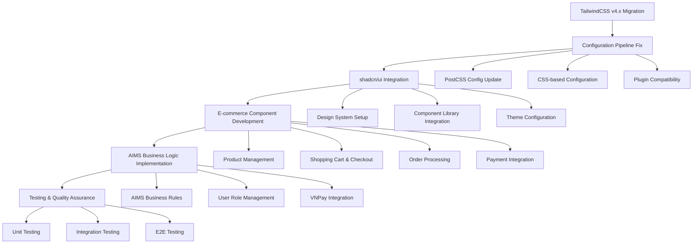

# TailwindCSS v4.x Migration & AIMS E-commerce Implementation Plan

## Executive Summary

**Critical Issue Identified:** TailwindCSS v4.1.10 with incompatible v3.x configuration syntax causing `px-4` utility class failures.

**Solution Scope:** Complete TailwindCSS v4.x migration with comprehensive AIMS e-commerce implementation including shadcn/ui integration, product catalog, shopping cart, checkout flow, payment processing, and admin management.

## Problem Analysis

### Root Cause Analysis
- **TailwindCSS Version Mismatch:** Using v4.1.10 with v3.x configuration format
- **PostCSS Configuration:** Incorrect setup for v4.x processing pipeline
- **Config File Format:** `tailwind.config.js` uses deprecated v3.x syntax
- **CSS Processing:** Utility classes not being generated due to config incompatibility

### Impact Assessment
- **Immediate:** All TailwindCSS utility classes (px-4, etc.) not working
- **Development:** Build process failing for styling
- **Business:** E-commerce UI components not rendering correctly
- **User Experience:** Broken layouts and styling across the application

## Implementation Architecture



## Detailed Implementation Plan

### Phase 1: TailwindCSS v4.x Migration (Priority 1)

#### 1.1 Configuration Pipeline Fix
**Objective:** Resolve immediate `px-4` utility class recognition issue

**Key Changes:**
- **File:** `tailwind.config.js`
  - Convert from JavaScript config to CSS-based v4.x format
  - Remove deprecated `content` array syntax
  - Update plugin configuration for v4.x compatibility

- **File:** `postcss.config.js`
  - Verify `@tailwindcss/postcss` import is correct
  - Update processing order for v4.x

- **File:** `src/index.css`
  - Add v4.x CSS configuration directives
  - Update @layer configurations for v4.x compatibility
  - Fix custom property definitions

**Expected Outcome:** All TailwindCSS utility classes working correctly

#### 1.2 Package Dependencies Update
**Dependencies to Review:**
- `@tailwindcss/line-clamp` → Check v4.x compatibility
- `prettier-plugin-tailwindcss` → Ensure v4.x support
- Verify all Tailwind-related packages are v4.x compatible

### Phase 2: shadcn/ui Integration Setup

#### 2.1 Component Library Installation
**Components to Install:**
```bash
npx shadcn-ui@latest init
npx shadcn-ui@latest add button card input label select
npx shadcn-ui@latest add table badge dialog alert-dialog
npx shadcn-ui@latest add dropdown-menu navigation-menu
npx shadcn-ui@latest add form checkbox radio-group
```

#### 2.2 Design System Configuration
- **Theme Setup:** Configure color palette for AIMS branding
- **Typography:** Set up consistent font scaling
- **Component Variants:** Create e-commerce specific variants
- **Accessibility:** Ensure WCAG AA compliance

#### 2.3 Component Architecture
```
src/components/
├── ui/                 # shadcn/ui base components
├── ecommerce/         # Business-specific components
│   ├── ProductCard.tsx
│   ├── ProductGrid.tsx
│   ├── ShoppingCart.tsx
│   ├── CheckoutForm.tsx
│   └── OrderSummary.tsx
├── forms/             # Form components
│   ├── ProductForm.tsx
│   ├── DeliveryForm.tsx
│   └── PaymentForm.tsx
└── admin/             # Admin-specific components
    ├── ProductManager.tsx
    ├── OrderManager.tsx
    └── UserManager.tsx
```

### Phase 3: AIMS E-commerce Implementation

#### 3.1 Product Management System
**Requirements per AIMS specifications:**

**Product Catalog Features:**
- Display 20 products per page with pagination
- Search functionality by product attributes
- Sort by price (ascending/descending)
- Category filtering (Books, CDs, LP records, DVDs)

**Product Types & Attributes:**
- **Books:** Authors, cover type, publisher, publication date, pages, language, genre
- **CDs:** Artists, record label, tracklist, genre, release date
- **LP Records:** Similar to CDs with additional vinyl-specific attributes
- **DVDs:** Disc type (Blu-ray, HD-DVD), director, runtime, studio, language, subtitles

**Product Management Rules:**
- Add/edit one product at a time
- Delete up to 10 products at once
- Maximum 30 product modifications per day (security constraint)
- Price updates: maximum twice daily, between 30%-150% of product value

#### 3.2 Shopping Cart & Checkout System

**Cart Functionality:**
- Add products from list or detail pages
- Update quantities with real-time inventory validation
- Remove products from cart
- Single cart per session (cleared after successful payment)
- Inventory insufficient notifications

**Checkout Flow:**
1. **Cart Review:** Display products, quantities, prices (excluding VAT)
2. **Inventory Check:** Validate stock availability before proceeding
3. **Delivery Information:** Customer details (name, email, phone, address)
4. **Delivery Options:** Regular delivery vs Rush delivery (Hanoi inner city only)
5. **Payment Processing:** VNPay credit card integration
6. **Order Confirmation:** Email notification with invoice and transaction details

#### 3.3 Delivery System Implementation

**Regular Delivery:**
- Hanoi/Ho Chi Minh City inner city: 22,000 VND for first 3kg
- Other Vietnam locations: 30,000 VND for first 0.5kg
- Additional: 2,500 VND per 0.5kg increment
- Free shipping: orders > 100,000 VND (max 25,000 VND discount)

**Rush Delivery (Hanoi inner city only):**
- 2-hour delivery window
- Additional 10,000 VND per rush item
- Separate delivery fee calculation
- Product eligibility validation

#### 3.4 Payment Integration (VNPay Sandbox)

**Integration Requirements:**
- VNPay Sandbox environment for development/testing
- Credit card payment processing
- Transaction ID generation and tracking
- Payment confirmation and receipt generation
- Refund processing for canceled orders

**API Endpoints to Implement:**
- Payment initialization
- Payment confirmation callback
- Transaction status checking
- Refund processing

### Phase 4: User Management & Admin Features

#### 4.1 User Role Implementation
**Customer Features:**
- Anonymous shopping (no login required)
- Order placement with delivery information
- Order tracking via email links
- Order cancellation before approval

**Product Manager Features:**
- Product CRUD operations (with daily limits)
- Price management (twice daily updates)
- Inventory management
- Order approval/rejection (30 orders per page)

**Administrator Features:**
- User account management (create, update, delete, password reset)
- User blocking/unblocking
- Role assignment and management
- Email notifications for administrative actions

#### 4.2 Order Management System

**Order States:**
- Pending (awaiting approval)
- Approved (ready for fulfillment)
- Rejected (with reason)
- Shipped (in transit)
- Delivered (completed)
- Canceled (refunded)

**Order Processing Flow:**
1. Customer places order → Pending state
2. Product manager reviews → Approve/Reject
3. Approved orders → Fulfillment process
4. Shipping updates → Customer notification
5. Delivery confirmation → Order completion

### Phase 5: Component Development Plan

#### 5.1 Core E-commerce Components

**ProductCard Component:**
```typescript
interface ProductCardProps {
  product: Product;
  onAddToCart: (productId: string, quantity: number) => void;
  onViewDetails: (productId: string) => void;
  showActions?: boolean;
}
```

**ShoppingCart Component:**
```typescript
interface ShoppingCartProps {
  items: CartItem[];
  onUpdateQuantity: (itemId: string, quantity: number) => void;
  onRemoveItem: (itemId: string) => void;
  onProceedToCheckout: () => void;
}
```

**CheckoutWizard Component:**
```typescript
interface CheckoutWizardProps {
  cartItems: CartItem[];
  onOrderComplete: (orderId: string) => void;
  onPaymentSuccess: (transactionId: string) => void;
}
```

#### 5.2 Form Components with Validation

**DeliveryInfoForm:**
- Customer information validation
- Address validation with Vietnam location data
- Real-time delivery fee calculation
- Rush delivery eligibility checking

**PaymentForm:**
- VNPay integration interface
- Payment method selection
- Transaction processing status
- Error handling and retry logic

### Phase 6: Testing & Quality Assurance

#### 6.1 Utility Class Testing
- Verify all TailwindCSS utilities render correctly
- Test responsive design across breakpoints
- Validate custom CSS layers and components
- Check for CSS conflicts and specificity issues

#### 6.2 E-commerce Flow Testing
- Complete product browsing to purchase flow
- Cart operations (add, update, remove)
- Checkout process with delivery options
- Payment integration with VNPay sandbox
- Order management and admin functions

#### 6.3 Business Rules Validation
- Product management constraints (daily limits)
- Price update restrictions (30%-150% range, twice daily)
- Delivery fee calculations (regular and rush)
- Inventory validation and stock management
- User role permissions and access control

## Technical Specifications

### CSS Architecture
```
src/styles/
├── index.css          # Main entry point with v4.x config
├── base.css           # Reset and base styles
├── components.css     # Custom component styles
├── utilities.css      # Custom utility classes
└── themes/
    ├── default.css    # Default theme variables
    └── ecommerce.css  # E-commerce specific styles
```

### Component Library Structure
```
src/components/
├── ui/                # shadcn/ui components
├── ecommerce/         # Business components
├── forms/            # Form components
├── layout/           # Layout components
├── admin/            # Admin components
└── common/           # Shared components
```

### State Management
- **Cart State:** Zustand store for shopping cart
- **User State:** Authentication and user preferences
- **Order State:** Order tracking and management
- **Product State:** Product catalog and search

## Risk Assessment & Mitigation

### High Risk Items
1. **TailwindCSS v4.x Breaking Changes**
   - **Risk:** Configuration migration may break existing styles
   - **Mitigation:** Gradual migration with component-by-component testing

2. **VNPay Integration Complexity**
   - **Risk:** Payment processing errors affecting orders
   - **Mitigation:** Comprehensive sandbox testing and error handling

3. **Performance Impact**
   - **Risk:** Large CSS bundle affecting load times
   - **Mitigation:** CSS optimization and unused class removal

### Medium Risk Items
1. **shadcn/ui Customization**
   - **Risk:** Component customization may conflict with updates
   - **Mitigation:** Use proper theming and variant systems

2. **Business Rules Complexity**
   - **Risk:** Complex validation logic affecting user experience
   - **Mitigation:** Clear error messages and user guidance

### Low Risk Items
1. **Existing Component Migration**
   - **Risk:** Minimal impact as most components can be preserved
   - **Mitigation:** Progressive enhancement approach

## Success Criteria

### Technical Success Metrics
- ✅ All TailwindCSS utility classes (including `px-4`) work correctly
- ✅ shadcn/ui components integrated and themed properly
- ✅ Build process completes without CSS-related errors
- ✅ CSS bundle size optimized (< 50KB compressed)
- ✅ Page load performance maintained or improved

### Business Success Metrics
- ✅ Complete product catalog with search and filtering
- ✅ Functional shopping cart with inventory validation
- ✅ End-to-end checkout process with delivery options
- ✅ VNPay payment integration working in sandbox
- ✅ Admin and product manager features operational
- ✅ All AIMS business rules implemented correctly

### Quality Assurance Metrics
- ✅ WCAG AA accessibility compliance maintained
- ✅ Responsive design across all device sizes
- ✅ Cross-browser compatibility (Chrome, Firefox, Safari, Edge)
- ✅ Performance benchmarks met (Lighthouse scores > 90)
- ✅ Security best practices implemented

## Implementation Timeline

### Week 1: Foundation
- Days 1-2: TailwindCSS v4.x migration and configuration fix
- Days 3-4: shadcn/ui integration and theme setup
- Day 5: Component architecture setup and testing

### Week 2: Core E-commerce
- Days 1-2: Product catalog and search implementation
- Days 3-4: Shopping cart and inventory management
- Day 5: Basic checkout flow development

### Week 3: Advanced Features
- Days 1-2: Delivery system and fee calculation
- Days 3-4: VNPay payment integration
- Day 5: Order management system

### Week 4: Admin & Polish
- Days 1-2: Admin features and user management
- Days 3-4: Testing and bug fixes
- Day 5: Performance optimization and deployment

## Deployment Considerations

### Environment Setup
- **Development:** Local with VNPay sandbox
- **Staging:** Full feature testing environment
- **Production:** Live deployment with production VNPay

### Monitoring & Analytics
- **Performance:** Web Vitals tracking
- **Errors:** Comprehensive error logging
- **Business Metrics:** Conversion tracking and analytics
- **User Experience:** A/B testing capabilities

---

## Conclusion

This comprehensive plan addresses both the immediate TailwindCSS configuration crisis and the complete AIMS e-commerce implementation requirements. The phased approach ensures we fix the root technical issues while delivering a production-ready online shop that meets all specified business requirements.

The migration to TailwindCSS v4.x combined with shadcn/ui integration will provide a modern, maintainable, and scalable foundation for the AIMS e-commerce platform.