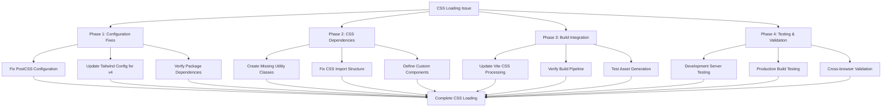

# AIMS Web UI CSS Fix Implementation Plan

## Problem Statement
The web UI displays completely unstyled pages with only default browser styles due to CSS loading failures caused by Tailwind CSS v4 configuration mismatches.

## Root Cause Analysis

### Primary Issues Identified:
1. **Tailwind CSS v4 Configuration Mismatch**
   - PostCSS config uses deprecated v3 syntax (`@tailwindcss/postcss`)
   - Tailwind v4 requires different plugin configuration
   - Missing compatibility updates for v4 API changes

2. **Missing Custom Utility Classes**
   - `index.css` references undefined custom classes (`btn-accessible`, `card-responsive`, etc.)
   - Custom accessibility utilities not properly defined
   - Form and navigation component classes missing

3. **CSS Import Dependencies**
   - All required CSS files exist but may have circular dependencies
   - Complex CSS layering structure needs validation

## Implementation Plan



## Phase 1: Configuration Fixes (Critical Priority)

### 1.1 Fix PostCSS Configuration
**File:** `web-ui/postcss.config.js`

**Current Issue:**
```javascript
plugins: {
  '@tailwindcss/postcss': {}, // ❌ Deprecated v3 syntax
  autoprefixer: {},
}
```

**Fix Required:**
```javascript
plugins: {
  tailwindcss: {}, // ✅ Correct v4 syntax
  autoprefixer: {},
}
```

### 1.2 Update Tailwind Configuration
**File:** `web-ui/tailwind.config.js`

**Actions:**
- Verify v4 compatibility of current configuration
- Update any deprecated v3 syntax
- Ensure plugin system works with v4
- Validate content paths and purging

### 1.3 Package Dependencies
**File:** `web-ui/package.json`

**Verify:**
- Tailwind CSS v4.1.10 compatibility
- PostCSS plugin versions
- Remove any conflicting v3 packages

## Phase 2: CSS Dependencies (High Priority)

### 2.1 Create Missing Utility Classes
**File:** `web-ui/src/index.css`

**Missing Classes to Define:**
```css
/* Component Classes */
.btn-accessible { /* Define button accessibility base */ }
.card-responsive { /* Define responsive card base */ }
.form-label-accessible { /* Define accessible form labels */ }
.form-error-accessible { /* Define accessible error states */ }
.form-help-accessible { /* Define accessible help text */ }
.nav-link-accessible { /* Define accessible navigation */ }

/* Status Classes */
.status-success-accessible { /* Define accessible success state */ }
.status-warning-accessible { /* Define accessible warning state */ }
.status-error-accessible { /* Define accessible error state */ }
.status-info-accessible { /* Define accessible info state */ }

/* Layout Classes */
.loading-accessible { /* Define accessible loading state */ }
.modal-overlay-accessible { /* Define accessible modal overlay */ }
.modal-content-accessible { /* Define accessible modal content */ }
.table-accessible { /* Define accessible table base */ }
.table-sort-accessible { /* Define accessible sortable tables */ }
```

### 2.2 Fix CSS Import Structure
**Actions:**
- Validate all `@import` statements in `index.css`
- Ensure no circular dependencies
- Verify import order for proper CSS cascade

### 2.3 CSS File Dependencies
**Verify Existing Files:**
- ✅ `web-ui/src/styles/responsive.css`
- ✅ `web-ui/src/styles/accessibility.css`
- ✅ `web-ui/src/styles/print.css`
- ✅ `web-ui/src/styles/checkout.css`

## Phase 3: Build Integration (Medium Priority)

### 3.1 Vite Configuration
**File:** `web-ui/vite.config.ts`

**Verify:**
- CSS processing pipeline
- PostCSS integration
- CSS code splitting configuration
- Asset handling for CSS files

### 3.2 Build Pipeline Testing
**Actions:**
- Test development server CSS hot reloading
- Verify production build CSS generation
- Check CSS file names and paths
- Validate CSS minification

## Phase 4: Testing & Validation (Medium Priority)

### 4.1 Development Testing
**Test Cases:**
- [ ] CSS loads on dev server start
- [ ] All Tailwind utility classes work
- [ ] Custom component classes apply
- [ ] Responsive breakpoints function
- [ ] Accessibility classes work
- [ ] CSS hot reloading works

### 4.2 Production Testing
**Test Cases:**
- [ ] CSS builds without errors
- [ ] All styles apply in production
- [ ] CSS files are properly minified
- [ ] Asset paths are correct
- [ ] Performance meets requirements

### 4.3 Cross-browser Validation
**Test Cases:**
- [ ] Chrome/Chromium compatibility
- [ ] Firefox compatibility
- [ ] Safari compatibility
- [ ] Mobile browser compatibility

## Implementation Steps

### Step 1: PostCSS Configuration Fix
```bash
# Update postcss.config.js to use correct v4 syntax
```

### Step 2: Define Missing CSS Classes
```bash
# Add all missing utility and component classes to index.css
```

### Step 3: Tailwind Configuration Update
```bash
# Ensure tailwind.config.js is v4 compatible
```

### Step 4: Build and Test
```bash
npm run dev     # Test development server
npm run build   # Test production build
npm run preview # Test production preview
```

## Success Criteria

### ✅ CSS Loading Success Indicators:
1. **Development Server:** CSS loads immediately on `npm run dev`
2. **Visual Confirmation:** All Tailwind classes apply correctly
3. **Custom Components:** All custom CSS classes render properly
4. **Responsive Design:** All breakpoints and responsive utilities work
5. **Build Success:** Production build generates CSS without errors
6. **Performance:** CSS loading doesn't block page rendering

### ✅ Expected Results:
- Web UI displays with full styling
- Tailwind utility classes function correctly
- Custom component styles apply
- Responsive design works across all breakpoints
- Accessibility features function properly
- Build pipeline processes CSS without errors

## Risk Mitigation

### Low Risk Items:
- PostCSS configuration changes (well-documented)
- Adding missing CSS classes (straightforward)

### Medium Risk Items:
- Tailwind v4 compatibility issues (fallback to v3 if needed)
- Complex CSS dependency resolution

### Contingency Plans:
1. **If Tailwind v4 issues persist:** Downgrade to v3 with proper configuration
2. **If CSS complexity is too high:** Simplify custom class structure
3. **If build issues occur:** Use simpler PostCSS configuration

## Timeline Estimate

- **Phase 1:** 2-3 hours (Configuration fixes)
- **Phase 2:** 2-4 hours (CSS dependencies)
- **Phase 3:** 1-2 hours (Build integration)
- **Phase 4:** 2-3 hours (Testing & validation)

**Total Estimated Time:** 7-12 hours

## Post-Implementation

### Documentation Updates:
1. Update development setup instructions
2. Document CSS architecture decisions
3. Create troubleshooting guide for future CSS issues

### Performance Optimization:
1. Optimize CSS bundle size
2. Remove unused CSS classes
3. Implement CSS loading best practices

---

*This plan addresses the complete CSS loading failure by systematically fixing configuration mismatches, defining missing classes, and ensuring proper build integration.*