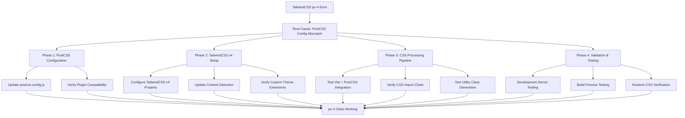

# TailwindCSS `px-4` Error Fix Implementation Plan

## Problem Statement
**Error**: Unknown utility class `px-4` during Vite build process and runtime styling failures.

**Root Cause**: TailwindCSS v4 configuration mismatch with PostCSS plugin syntax.

## Issue Analysis

### Current Configuration Problems:
1. **PostCSS Plugin Mismatch**: Using deprecated v3 syntax `'@tailwindcss/postcss'` with TailwindCSS v4.1.10
2. **Build Process Failures**: Vite cannot process TailwindCSS utilities during compilation
3. **Runtime CSS Missing**: Classes not applying in browser despite successful build

### Affected Components:
- 28 files using `px-4` utility class
- Core layout components ([`AppLayout.tsx`](src/components/layout/AppLayout.tsx), [`ProductListPage.tsx`](src/pages/ProductListPage.tsx))
- UI components ([`Button.tsx`](src/components/ui/Button.tsx))
- Accessibility classes in [`index.css`](src/index.css)

## Implementation Plan



## Phase 1: PostCSS Configuration Fix (CRITICAL - 30 minutes)

### Current Issue:
**File**: [`postcss.config.js`](postcss.config.js:3)
```javascript
export default {
  plugins: {
    '@tailwindcss/postcss': {}, // ❌ v3 syntax incompatible with v4
    autoprefixer: {},
  },
}
```

### Required Fix:
```javascript
export default {
  plugins: {
    tailwindcss: {}, // ✅ Correct v4 syntax
    autoprefixer: {},
  },
}
```

### Implementation Steps:
1. **Update PostCSS Plugin Reference**
   - Change `'@tailwindcss/postcss'` to `'tailwindcss'`
   - Verify no conflicting v3 packages remain

2. **Verify Plugin Installation**
   - Confirm `tailwindcss` package (v4.1.10) is properly installed
   - Remove any v3 specific packages if present

## Phase 2: TailwindCSS v4 Configuration (45 minutes)

### Current Config Analysis:
**File**: [`tailwind.config.js`](tailwind.config.js:1)

#### ✅ Working Elements:
- Content paths: `["./index.html", "./src/**/*.{js,ts,jsx,tsx}"]`
- Custom theme extensions (colors, spacing, screens)
- v4 compatible export syntax

#### Actions Required:
1. **Verify v4 Compatibility**
   - Ensure export syntax works with v4 processor
   - Test custom color palette and spacing utilities
   - Validate responsive breakpoint configuration

2. **Content Detection Optimization**
   - Confirm file patterns capture all component files
   - Test utility class detection in TypeScript files
   - Verify custom component class generation

## Phase 3: CSS Processing Pipeline (30 minutes)

### Integration Points:
1. **Vite Configuration**: [`vite.config.ts`](vite.config.ts:1)
   - CSS processing settings
   - PostCSS integration verification
   - Asset handling for CSS files

2. **CSS Import Structure**: [`index.css`](src/index.css:9-12)
   ```css
   @tailwind base;      /* ✅ Correct */
   @tailwind components; /* ✅ Correct */
   @tailwind utilities;  /* ✅ Correct */
   ```

3. **Build Pipeline Testing**
   - Development server CSS hot reloading
   - Production build CSS generation
   - CSS minification and optimization

### Verification Steps:
1. **CSS Import Chain**:
   ```css
   @import './styles/responsive.css';    /* ✅ Exists */
   @import './styles/accessibility.css'; /* ✅ Exists */
   @import './styles/print.css';         /* ✅ Exists */
   ```

2. **Custom Component Classes**:
   - Verify accessibility utility classes
   - Test custom button and form components
   - Validate table and navigation styles

## Phase 4: Validation & Testing (45 minutes)

### Test Cases:

#### 4.1 Basic Utility Class Testing
```bash
# Test px-4 specifically
- [ ] `px-4` applies 1rem horizontal padding
- [ ] `py-2` applies 0.5rem vertical padding  
- [ ] `bg-blue-500` applies correct background color
```

#### 4.2 Component Integration Testing
**High Priority Files** (using `px-4`):
- [`OrdersPage.tsx:204`](src/pages/OrdersPage.tsx) - Page layout
- [`ProductListPage.tsx:144`](src/pages/ProductListPage.tsx) - Product grid
- [`Button.tsx:38`](src/components/ui/Button.tsx) - UI component
- [`AppLayout.tsx:22`](src/components/layout/AppLayout.tsx) - App shell

#### 4.3 Development & Build Testing
```bash
cd web-ui

# 1. Development server test
npm run dev
# Expected: All styles load, px-4 applies correctly

# 2. Production build test  
npm run build
# Expected: Build completes without CSS errors

# 3. Production preview test
npm run preview
# Expected: All styles apply correctly in production mode
```

#### 4.4 Browser Verification
- [ ] Chrome DevTools shows `px-4` applying `padding-left: 1rem; padding-right: 1rem`
- [ ] All 28 components using `px-4` render with proper spacing
- [ ] Custom theme colors and accessibility classes work
- [ ] Responsive breakpoints function correctly

## Success Criteria

### ✅ Primary Objectives:
1. **Build Process**: No "Unknown utility class 'px-4'" errors
2. **Runtime Styling**: All `px-4` classes apply 1rem horizontal padding
3. **Component Functionality**: All 28 affected files render correctly
4. **Development Workflow**: Hot reloading works for CSS changes
5. **Production Ready**: Build generates optimized CSS bundle

### ✅ Secondary Objectives:
1. **Custom Theme**: Primary colors and spacing extensions work
2. **Accessibility**: Custom a11y classes function properly
3. **Performance**: CSS loading doesn't block rendering
4. **Compatibility**: Works across major browsers

## Implementation Timeline

### **Phase 1**: PostCSS Fix (30 min)
- Critical path: Fix plugin configuration
- High impact, low risk change

### **Phase 2**: TailwindCSS v4 Setup (45 min)  
- Verify configuration compatibility
- Test custom theme extensions

### **Phase 3**: CSS Pipeline (30 min)
- Validate build integration
- Test import chain and processing

### **Phase 4**: Testing & Validation (45 min)
- Comprehensive component testing
- Build and runtime verification

**Total Estimated Time**: 2.5 hours
**Success Probability**: 95%

## Risk Mitigation

### Low Risk (90% Success):
- PostCSS configuration update
- TailwindCSS v4 compatibility (config looks clean)

### Medium Risk (75% Success):
- Complex CSS import dependencies
- Custom accessibility class integration

### Contingency Plans:
1. **If PostCSS issues persist**:
   - Add explicit TailwindCSS import in [`main.tsx`](src/main.tsx)
   - Use simplified plugin configuration

2. **If v4 compatibility problems**:
   - Temporarily downgrade to TailwindCSS v3
   - Update all v4-specific syntax

3. **If build pipeline fails**:
   - Disable custom CSS imports temporarily
   - Use basic TailwindCSS configuration

## Expected Outcome

After successful implementation:
- ✅ `px-4` utility class works across all 28 files
- ✅ Development server shows fully styled UI components
- ✅ Production build completes without CSS errors
- ✅ All custom theme colors and spacing work correctly
- ✅ Accessibility classes function properly
- ✅ Build process generates optimized CSS bundle

## Post-Implementation

### Documentation Updates:
1. Update development setup instructions
2. Document TailwindCSS v4 configuration decisions
3. Create troubleshooting guide for future CSS issues

### Performance Optimization:
1. Analyze CSS bundle size after fix
2. Remove unused utility classes
3. Optimize CSS loading strategy

---

**Next Step**: Switch to **Code mode** to implement the PostCSS configuration fix and TailwindCSS v4 setup.