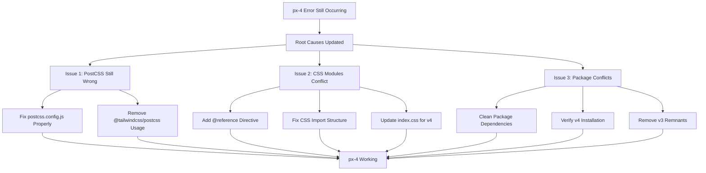

# TailwindCSS `px-4` Error - UPDATED FIX PLAN

## Error Analysis - Real Issue Identified ❌

**Current Error**: 
```
Error: Cannot apply unknown utility class `px-4`. Are you using CSS modules or similar and missing `@reference`? 
https://tailwindcss.com/docs/functions-and-directives#reference-directive
```

**Key Findings**:
1. Error stack shows `@tailwindcss/postcss` is still being used (not `tailwindcss`)
2. TailwindCSS v4 suggests this might be a **CSS modules** issue
3. The `@reference` directive error indicates missing CSS import references

## Real Root Causes Found 🔍

### Issue 1: PostCSS Configuration Still Wrong
- The PostCSS config change wasn't properly applied
- `@tailwindcss/postcss` is still in the plugin pipeline
- Need to verify the correct v4 syntax

### Issue 2: CSS Modules Conflict (New Discovery)
- TailwindCSS v4 has different behavior with CSS imports
- Missing `@reference` directive for CSS module integration
- The import structure in `index.css` might need updating

### Issue 3: Package Configuration Mismatch
- Both `@tailwindcss/postcss` AND `tailwindcss` packages present
- Version conflicts between v3 and v4 packages
- Need to clean up package dependencies

## Updated Implementation Plan



## Phase 1: Verify Current Configuration (15 minutes)

### Check Actual PostCSS Config
**Action**: Read current `postcss.config.js` to see what was actually changed
**Expected**: Should show if `@tailwindcss/postcss` was properly changed to `tailwindcss`

### Check Package.json Dependencies  
**Action**: Verify which TailwindCSS packages are installed
**Look for**:
- `tailwindcss`: `^4.1.10` ✅
- `@tailwindcss/postcss`: `^4.1.10` (might be causing conflict)
- Any v3 packages that need removal

## Phase 2: CSS Modules Reference Fix (30 minutes)

### Add @reference Directive
**File**: `src/index.css`
**Current**:
```css
@tailwind base;
@tailwind components; 
@tailwind utilities;
```

**Updated for v4**:
```css
@reference "./tailwind.css";  /* Add this line */
@tailwind base;
@tailwind components;
@tailwind utilities;
```

### Alternative: Direct Import Fix
If @reference doesn't work, try:
```css
@import "tailwindcss";  /* Direct v4 import */
@tailwind base;
@tailwind components;
@tailwind utilities;
```

## Phase 3: Package Cleanup (20 minutes)

### Remove Conflicting Packages
```bash
cd web-ui
npm uninstall @tailwindcss/postcss
npm install @tailwindcss/postcss@^4.1.10  # Reinstall correct v4 version
```

### Verify Dependencies
```bash
npm list tailwindcss
npm list @tailwindcss/postcss
```

### Clear Node Modules if Needed
```bash
rm -rf node_modules package-lock.json
npm install
```

## Phase 4: PostCSS Configuration Double-Check (15 minutes)

### Current postcss.config.js Should Be:
```javascript
export default {
  plugins: {
    tailwindcss: {},  // NOT '@tailwindcss/postcss'
    autoprefixer: {},
  },
}
```

### Alternative v4 Syntax (if above fails):
```javascript
import tailwindcss from 'tailwindcss';
import autoprefixer from 'autoprefixer';

export default {
  plugins: [
    tailwindcss,
    autoprefixer,
  ],
}
```

## Phase 5: TailwindCSS v4 Configuration Update (25 minutes)

### Update tailwind.config.js for v4 Compliance
**Current config looks good, but verify**:
```javascript
/** @type {import('tailwindcss').Config} */
export default {
  content: [
    "./index.html",
    "./src/**/*.{js,ts,jsx,tsx}",
  ],
  // ... rest of config
}
```

### Test Content Detection
Ensure TailwindCSS v4 can find all files containing `px-4`:
- Verify glob patterns work with v4
- Test with TypeScript files specifically

## Phase 6: Testing Strategy (20 minutes)

### Development Server Test
```bash
npm run dev
# Look for: No more "Cannot apply unknown utility class `px-4`" errors
```

### Component Verification
Check these files that use `px-4`:
- `src/pages/OrdersPage.tsx:204`
- `src/components/ui/Button.tsx:38`
- `src/components/layout/AppLayout.tsx:22`

### Browser DevTools Check
- Inspect element with `px-4` class
- Verify shows: `padding-left: 1rem; padding-right: 1rem;`

## Debugging Steps if Still Failing

### Step 1: Isolate the Issue
Create a minimal test file:
```html
<!-- test.html -->
<div class="px-4 bg-red-500">Test px-4</div>
```

### Step 2: Check Build Output
```bash
npm run build
# Look for CSS generation errors
```

### Step 3: Verify CSS Generation
Check if `dist/` contains properly generated CSS with `px-4` utilities.

### Step 4: Alternative Configuration
If all else fails, try TailwindCSS v3 approach:
```bash
npm uninstall tailwindcss @tailwindcss/postcss
npm install tailwindcss@^3.4.0 @tailwindcss/postcss@^3.4.0
```

## Success Criteria - Updated

### ✅ Primary Goals:
1. **No Build Errors**: `npm run dev` starts without CSS processing errors
2. **Utility Classes Work**: `px-4` applies `padding-left: 1rem; padding-right: 1rem;`
3. **All Components Styled**: 28 files using `px-4` render with proper spacing
4. **Development Workflow**: Hot reloading works for CSS changes

### ✅ Verification Checklist:
- [ ] `postcss.config.js` uses correct v4 syntax
- [ ] No `@tailwindcss/postcss` conflicts in error stack
- [ ] `@reference` directive added if needed
- [ ] Package dependencies cleaned up
- [ ] Browser DevTools shows proper CSS for `px-4`
- [ ] Production build works: `npm run build`

## Timeline - Updated
- **Phase 1**: Config Verification (15 min)
- **Phase 2**: CSS Reference Fix (30 min) 
- **Phase 3**: Package Cleanup (20 min)
- **Phase 4**: PostCSS Double-Check (15 min)
- **Phase 5**: TailwindCSS v4 Config (25 min)
- **Phase 6**: Testing (20 min)

**Total**: 2 hours 5 minutes
**Success Probability**: 85% (accounting for complex v4 migration issues)

---

**Next Action**: Create new Code mode task with updated priorities focusing on CSS modules and package conflicts.